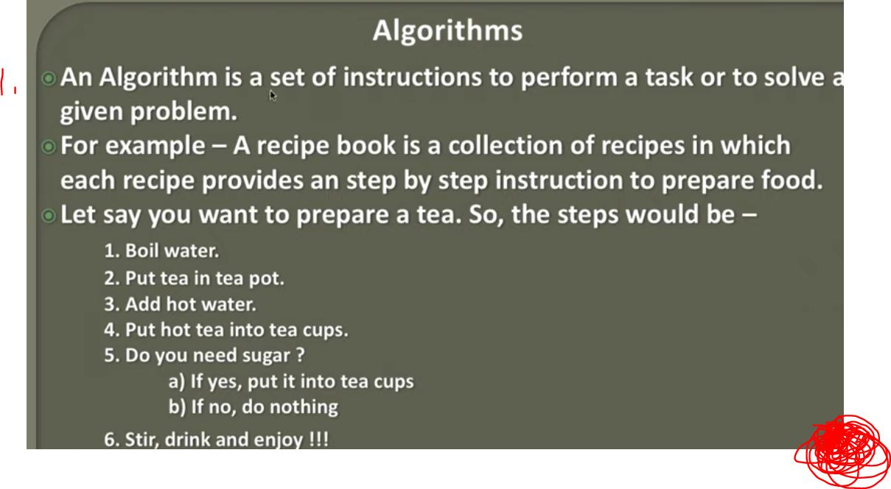
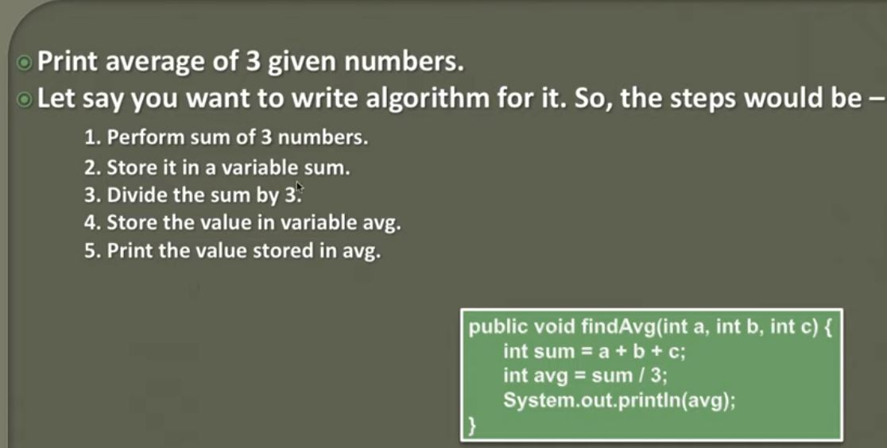

## 02 Introduction to Algorithms

- Steps for Algorithm



1. **Algorithm** is Set of steps to solve problem!




### Printing average of 3 numbers

```
public void final(int a, int b, int c) {
    int sum = a + b + c;
    int avg = sum / 3;
    System.out.println(avg);
}
```