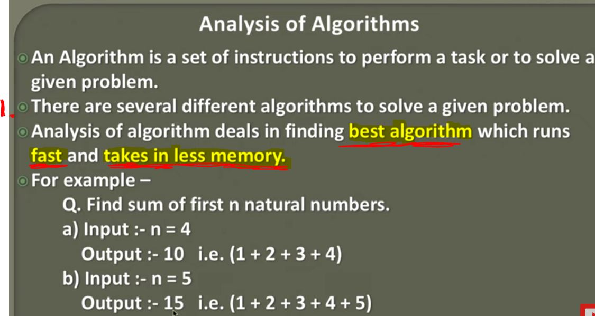
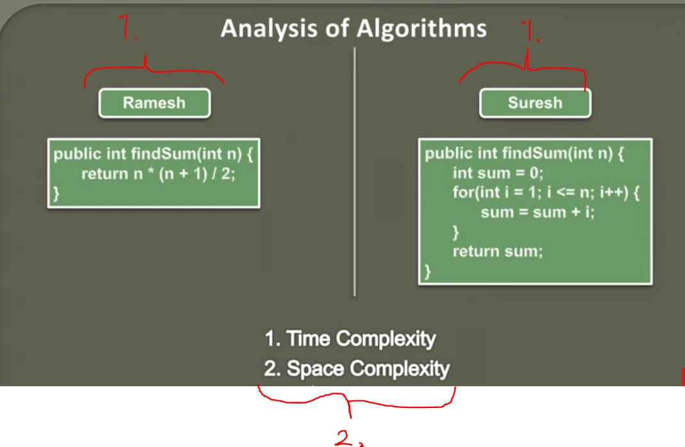

## Introduction to Algorithm Analysis

1. There is **several different algorithms** to solve problem.

1. Different algorithm for same problem

2. To ways to define which **Algorithm** is better.
    - **Time Complexity**. How much time this **Algorithm** takes.
    - **Space Complexity**. How much memory this **Algorithm** takes to complete.