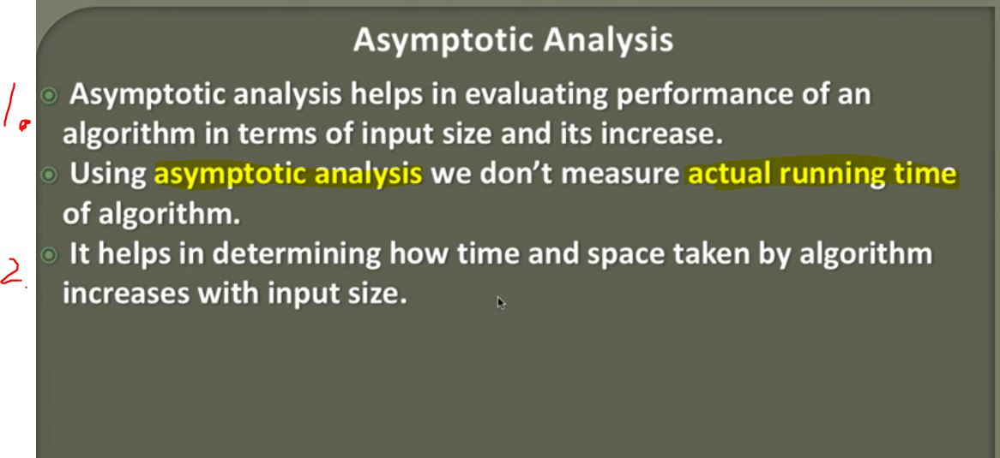

## Asymptotic Analysis of an Algorithm

- Usually we don't go with numbers from **Time Complexity** or **Space Complexity**.

- There is Mathematical Models for determining what **Time Complexity** and **Space Complexity** is needed for **algorithm**. Analysis which deals with these ones are  called **Asymptotic Analysis**.

1. We determine **algorithm performance** based on **input size** and its **increase**.

2. **Time** and **space** taken by algorithm increases with input.