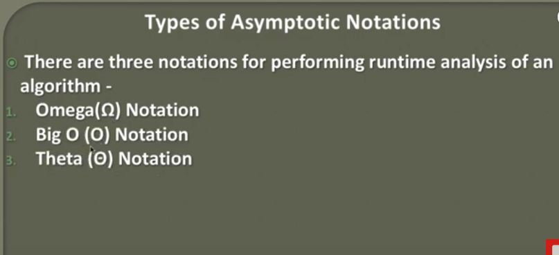
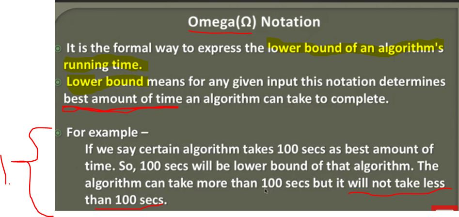
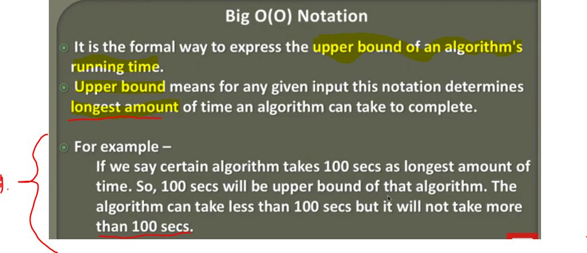
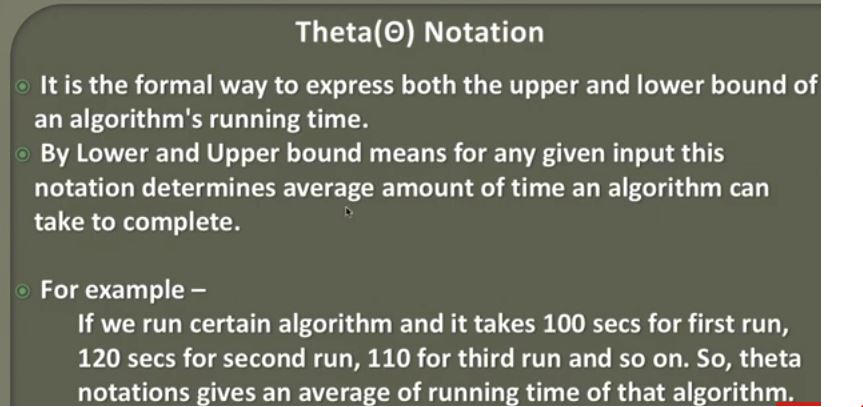

## Types of Asymptotic Notations

- Internal analysis, symbols:

1. **Omega** Notation.
2. **Big O** Notation.
3. **Theta** Notation.

- **Omega** Ω notation is the best amount of time of algorithm can take to complete. **Lower bound** - **Best case**

1. It won't take less than 100s in this case. It can make more than 100s.

- **Big O(O)** Notation is the longest amount of time an algorithm can take to complete. **Upper Bound** - **Worst Case**.

1. Algorithm will not take more than 100 secs.

- This is very useful notation!

1. We will determine **average case** with **Lower Case** and with **Upper Case**.

- Both are baked into this notation. **Theta Θ** Notation - **Average Case**.