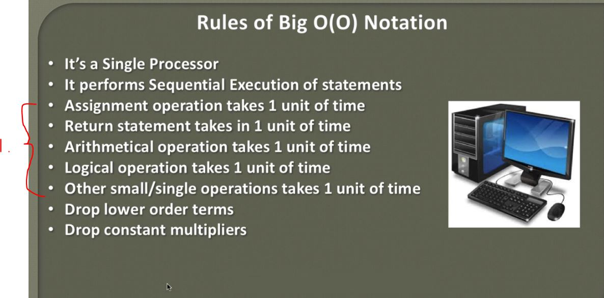

##  Calculating Time complexity of Constant Algorithm (Big O)

- Analysis of time Analysis **Big O**.  Longest amount of time what Algorithm can take.

1. It can take one unit of time. It can be anything(Second, Hour, Millisecond).

- We assume following takes one unit of time. Assignment operation. `int x = 5; -> 1 unit of time`.
- We assume following takes one unit of time. Return statement. `return x; -> 1 unit of time`.
- We assume following takes one unit of time. Arithmetical operation. `x + y; -> 1 unit of time`.
- We assume following takes one unit of time. Logical operation. `x&&y -> 1 unit of time`.
- Other small operations take 1 unit of time.