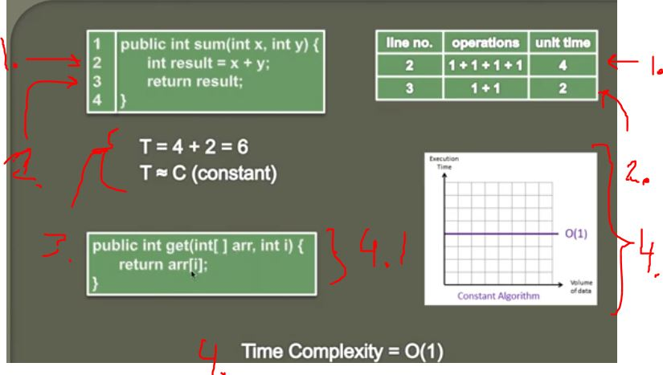

## Calculating Time complexity of Constant Algorithm (Big O)

- How to calculate **Big O** notation of **Algorithm**.

1. Line number 2 takes 4 units of time.
2. Line number 3 takes 2 units of time, **accessing** and **returning operations**, so two unit fo times.
3. Whatever value we pass in, it will always take same amount of time, hence **constant**.
4. We call this **Constant** = **O(1)**, because with what ever input we put in, it will take same amount of time.

- `4.1` This will take same amount of time. Even if the array is huge.