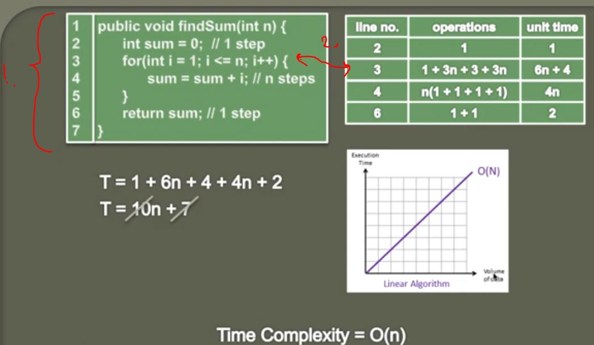
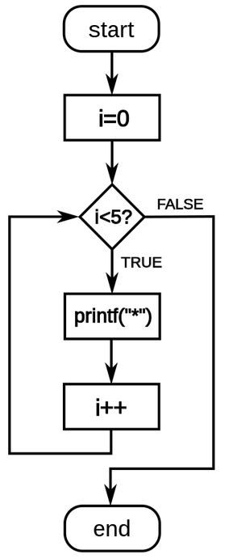

## Calculating Time complexity of a Linear Algorithm (Big O) 

1. We calculate Time Complexity of thi Algorithm. This one finds sum of natural numbers.

2. To calculate **For** loop time complexity, we do as following:

- To make assignment `int i = 1`. It will take **one operation**.

- To verify `i<=n` it always take **three operations**.

- For this part `i<=n` it will always take `3(n+1)` operations. Check the if diagram below.

- Reminder how for loop is taking place.

- To make operation `i++` it takes **three** operations. In whole **For** loop context it will take `3n` times.

- Totally **line 3** takes `6n + 4` operations.

- **Line 3** operations under here as table.

| Line number | The code       | Unit of time | Needed operations                                           |
|-------------|----------------|--------------|-------------------------------------------------------------|
| 2           | int sum = 0;   | 1            | Assigment operation                                         |
| 3           | int i = 1;     | 1            | Assigment operation                                         |
| 3           | i &lt;=n       | 3(n + 1)     | 2 Access operations, Comparing operation                    |
| 3           | i++            | 3n           | Access operation, Logical operation, Assigment operation    |
| 4           | sum = sum + 1; | 4n           | 2 Access operations, Logical operation, Assigment operation |
| 6           | return sum;    | 2            | Access operation, Return operation                          |

3. Rules says, ignore lower order term.
4. Rule says, ignore constant multiplier.
5. **T = n**, so Time Complexity = **O(n)**.
6. Linear Algorithm.