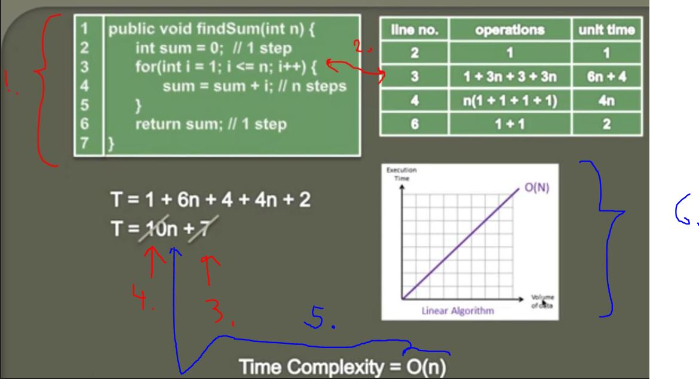

## Calculating Time complexity of a Linear Algorithm (Big O) 

1. We calculate Time Complexity of thi Algorithm. This one finds sum of natural numbers.

2. To calculate **For** loop time complexity, we do as following:
