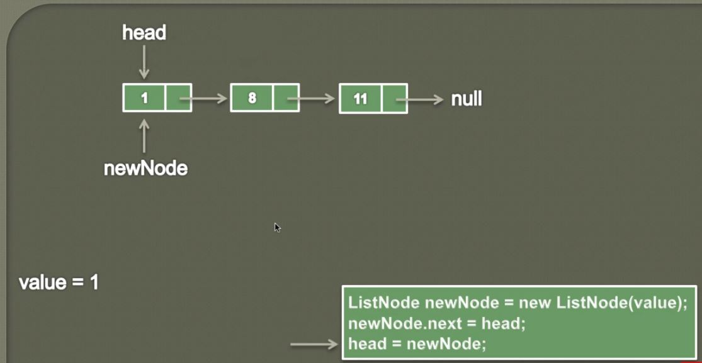

## Insert node at the beginning of a **Singly Linked List** in Java (Animation)

- When point to `null`, **Singly Linked List** is empty.

- **Head** will point into **first node**.

1. Inserting for node.

