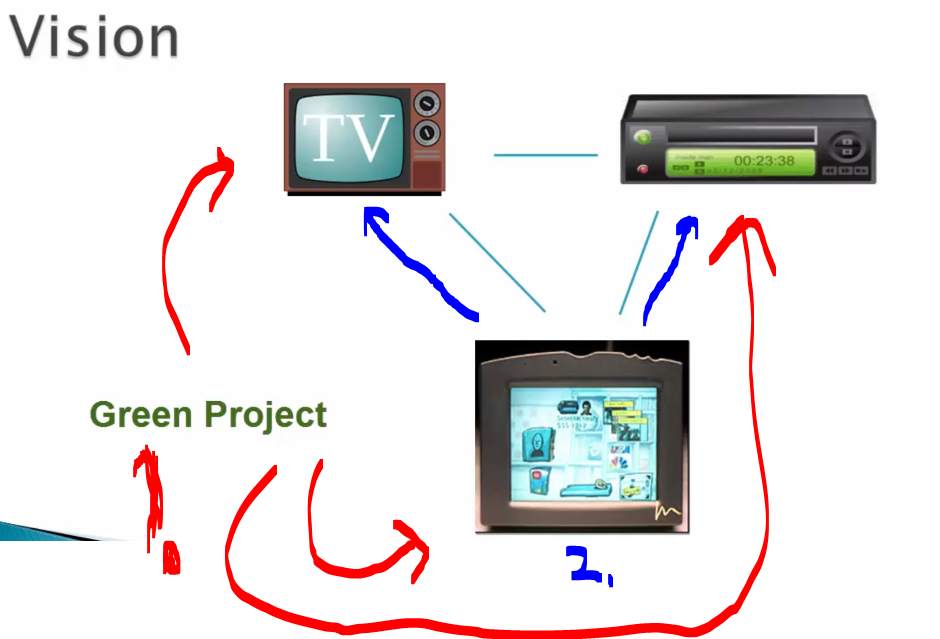
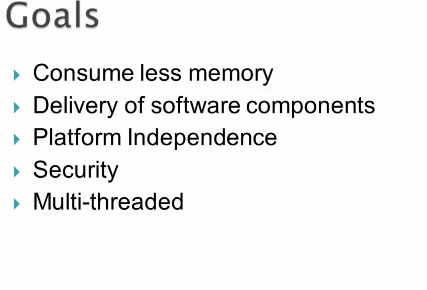

# Chapter 01 - Background ~ A High-level Overview on JVM.

Background ~ A High-level Overview on JVM.

# What I learned.

# Introduction ~ A Brief History of Java & JVM.

    

1. Java was designed for **heterogeneous** computing, for the handheld devices!
    - Team was called **Green team**!
2. This device was designed to send **commands** to **TV** and to **recorder**!

    

- Green team had the **following criteria** to fulfill:

1. Tech needed to be run with less memory!
2. Deploy the software to another devices in the network!
3. The programs should be run regardless of the **platform**!
4. Security was needed!
5. It needed to support multi-threaded processing.

- Even **c++** was thought to be used.

# Java Virtual Machine ~ A High-level Overview.

# UI Controls for Site Navigation & Copyright Details.