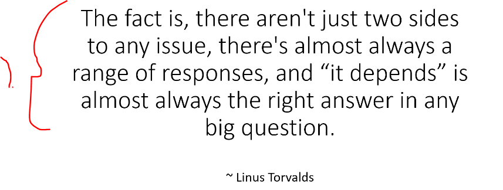

## Section 1 - Introduction.

Introduction.

# What I learned.

# Course Introduction and Updates by Tim Buchalka.

- [Check](https://www.udemy.com/course/data-structures-and-algorithms-deep-dive-using-java/learn/lecture/8435742#announcements).

# Data Structures and Algorithms: Course Overview.

1. We will be answering:
    - What is a data structure?
    - What is an algorithm?
    - **Big-O Notation**.   
        - **Objective** way to compare different **algorithm**, where the comparison does no get affected by **hardware**.

1. Where we will be focusing into **tree** data structures.

1. There will be many more, but these are some.

> [!IMPORTANT]  
> Most these data structures are coded by the **Java team**, so we won't be coding these ourselves!

1. These are **usually** implemented by the Java team! 

- These are needed to be watched in order!

# IntelliJ Ultimate Edition: 6-Month Free Trial Instructions.  

- The instructions for the installing the IntelliJ. ✅

# JDK 8 Installation Guide for Windows Users.  

- ✅.

# JDK 8 Installation Guide for macOS Users.  

- ✅.

# JDK 8 Installation Guide for Linux (Ubuntu). 

- ✅.

# IntelliJ IDEA Installation Guide for Windows.  

1. For this we will be using following settings.

- ✅.

# IntelliJ IDEA Installation Guide for macOS.

- ✅.

# IntelliJ IDEA Installation Guide for Linux (Ubuntu).

- ✅.

# Understanding Data Structures: An Introduction.

1. Organizes and stores data. Example **Array** is data structure.
2. Each on of them has **minuses** and **plusses**.
    - No, wonder there are many **data structures**!
        - Example, **arrays** are very good in **random access**, when you know the **index**!
            - When don't, we need to **iterate** over **arrays**!

1. **Linus Torvalds** quote. Why we need this? What data structures to use, **it depends**!
    - There is no **one** data structure to **fit then all**!
        - Its more which fits in this special occasion.

# Understanding Algorithms: An Introduction.

- The **Algorithms** is, set of steps to achieve the goal!

1. What steps you need to take to make **tea**. 

- **Algorithms** are not **implementation**!

1. There are **many algorithms** to achieve same task!
    - For example different **sort** algorithms, for same task!
2. We can **implement** algorithm in different ways, as long **it is following** the steps defined by the **algorithm**!
