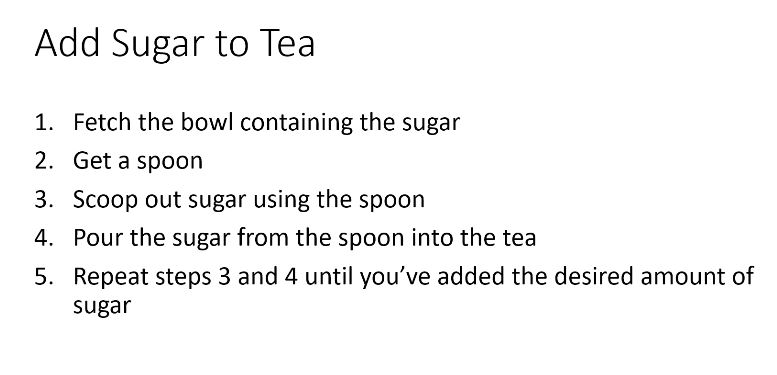
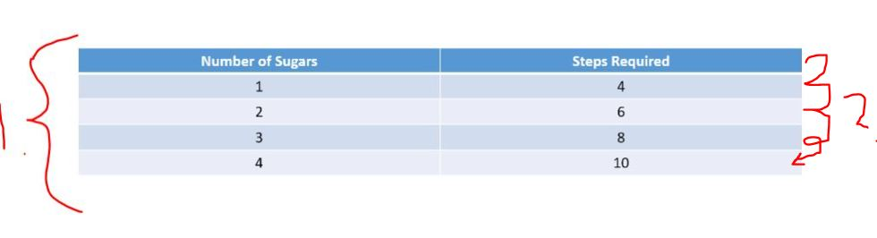
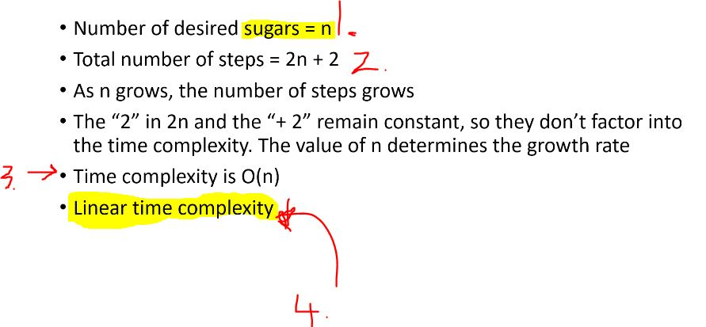
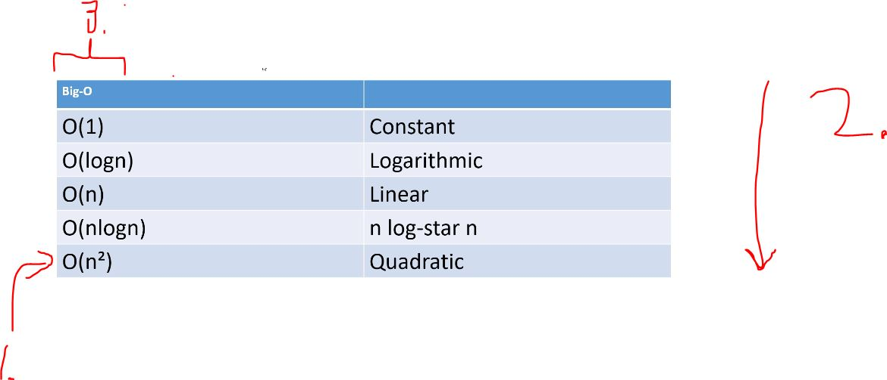
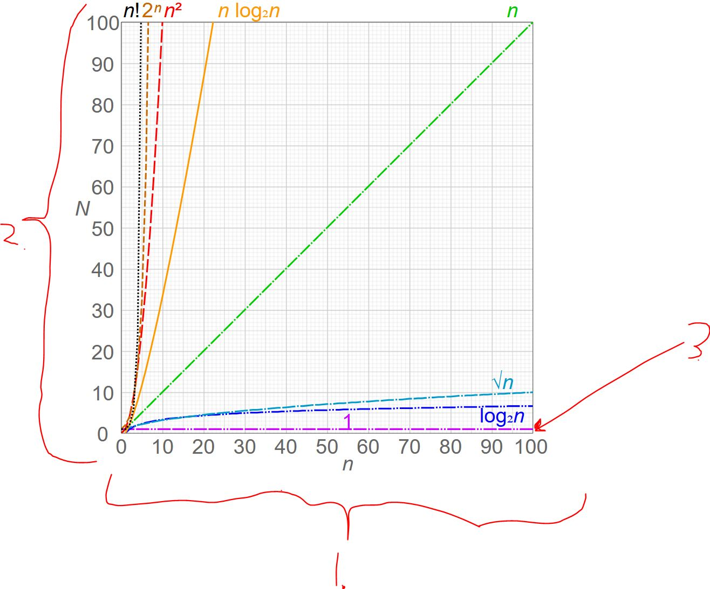
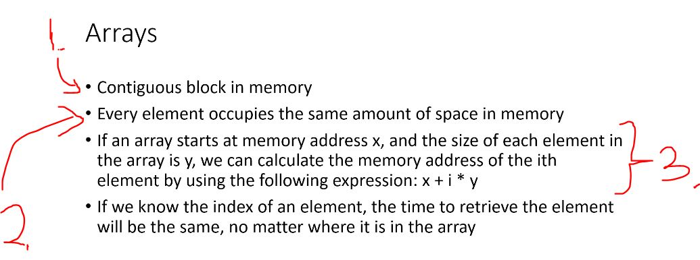

## Section 2 - Arrays and Big-O Notation.

Arrays and Big-O Notation.

# What I learned.

# Arrays: A Data Structure Introduction.

- Arrays is data structure, even if its basic **Java** type.

# Java Arrays: A Quick Review and Refresher.

- This course is using **Java 8** at least!
    - I used **Java 21**.

- **Arrays** are not dynamically resized. Once you have defined it, you cannot **increase** or **decrease** the size!
    - `int[] intArray = { 1, 2, 3, 4, 5, 6, 7, 8, 9, 10 };`

- Example of using the **Array**, for refreshment!

```
package academy.learnprogramming.arrays;

public class Main {
    public static void main(String[] args) {
        int[] intArray = {1, 2, 3, 4, 5, 6, 7, 8, 9, 10};

        for (int i = 0; i < intArray.length ; i++) {
            System.out.println(intArray[i]);
        }
    }
}
```

# Big-O Notation: Understanding Time Complexity.

- We will be looking sort **Algorithms**.

- We need to **compare two algorithms** together!
    - Comparing two algorithms, with the **run time**.
        - Is **not** good idea, since the **hardware** influences the **running time**!
            - Example. Comparing same **algorithm implementation** in two different computers.
                - One from, **20 years ago** and other one **Commandore 64**.
                    - We got different running time.
                        - We need more **objective** measure!

- What we will be looking is, number of **steps** that it takes **to execute algorithm**. This is called **Time Complexity**.
    - **Memory complexity** how much memory it takes to run algorithm. Nowadays, memory is **so cheap**, this is not so necessary anymore

- In **general,** it's **best** to compare the **worst case** scenarios of the algorithm.





1. Different variables in this algorithm if you want to have more sugar!
    - **Time Complexity** is describing how many steps need to take in when time number of **steps grows**!
2. Since these are **increasing** in fixed steps, this will be growing in **linear progression**! 

- In general, some algorithm will **scale** better than some other some not.



1. Sugar will be marked as, `sugar = n`.
2. The **algorithm** is here `2n + 2`.
3. **Time Complexity** of this **algorithm** is `O(n)`.
4. Since this **Time Complexity** increases **linear fashion**, we will call this **Linear Time Complexity**.



- Todo, paste these into here.

1. `O(n^2)` Quadratic **Time Complexity**, first **Sort** algorithms will be having such complexity.
2. These are ranked from, **best** to **worst**, where the `O(1)` is the best.
3. **Pronunciation** the **Big-O** will be:
    - "**O** of `what is in` brackets".
        - `O(1)` → "O of one".
        - `O(logn)` → "O of logarithmic n". This is usually **base 2 unless stated otherwise**.
        - `O(n)` → "O of n".
        - `O(nlogn)` → "O of n logarithmic n".
        - `O(n^2)` → "O of n power of 2".

- Values of **BIG-O** [The Time Complexity of Algorithm](https://en.wikipedia.org/wiki/Big_O_notation#/media/File:Comparison_computational_complexity.svg).



1. `n` number of elements in the **algorithm**, in the **X-axis**.
2. `N` number of steps the **algorithm** needs to execute, in the **Y-axis**.
3. The example `O(1)`, the **elements grow** and the **executed steps** stay the same! 
    - Best time is the **constant**!

> **Big-O notation** gives way to compare the **Time Complexity** of the **Algorithm** in the **hardware independent** manner!

# Arrays in Memory: Storage and Access.



1. All the arrays are **stored** in **continues block**!
    - Arrays are having **static** length!
2. `int[]` and `double[]` ... is having same in memory space, regardless of the type!
    - Object are stored in **references**.
3. Because the these are saved in continues memory, It's easy to access these.