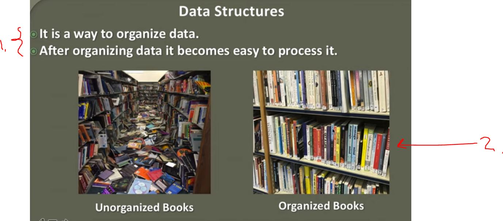
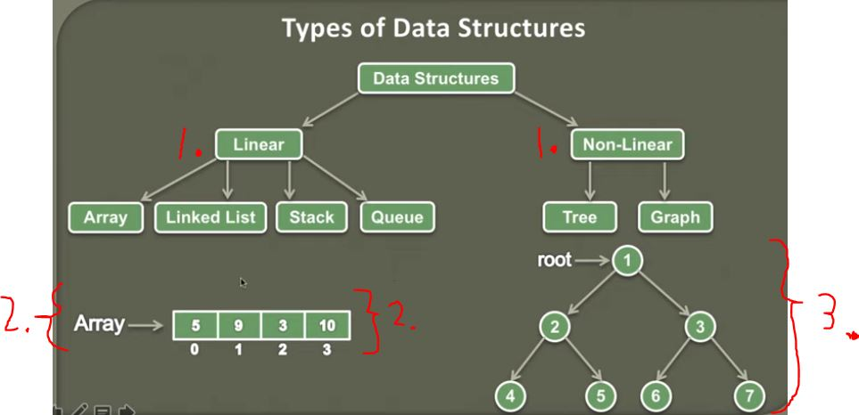

## Introduction to Data Structures

1. When we organize data, we can efficiently **process it**. Example using **Data Structures**.
2. Easier to find book when is organized, yes? :)

1. There is **two types** data structures:
    - **Linear**
        - Linear has data element arranged in sequenced manner and such way that each  are connected to  next or previous element. 
            - **Easy to traverse** these ones.
            - These are easy to implement since they are stored next to each other in memory.
            - These are usually single level.
    - **Non-Linear**
        - Stored in multi level.
        - **Not so easy to traverse**.
        - Not so easy to **implement**.

2. Data is **arranged in sequence** and in **single level**.

3. Non-Linear Data Structures are multi level.