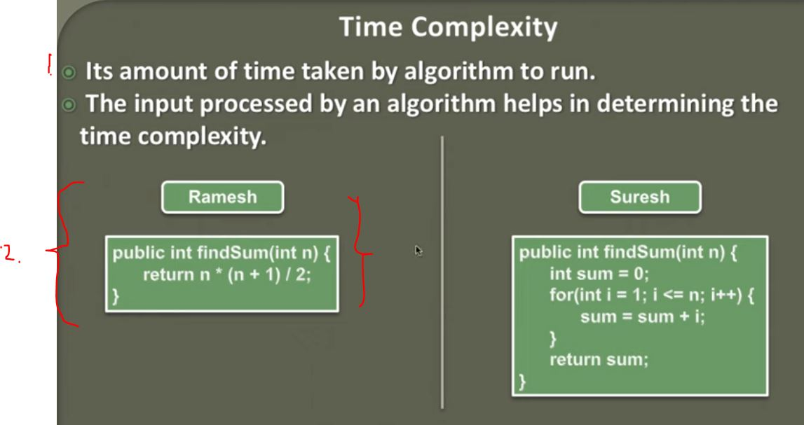

## Time Complexity of an Algorithm 



1. Its measure how much time have been consumed for running it.
2. This is more efficient fo processing, because of the  `for` loop.

```

public class TimeComplexityDemo {

	public static void main(String[] args) {
		double now = System.currentTimeMillis();
		
		TimeComplexityDemo demo = new TimeComplexityDemo();
		System.out.println(demo.findSum(9999999));
		
		System.out.println("Time taken - " + (System.currentTimeMillis() - now) + " millisecond.");
		
	}
	
	
	
	public int findSum(int n) {
		return n * (n + 1) / 2;
	}
	
	public int findSumMoreComplex(int n) {
		int sum = 0;
		for (int i = 1; i <= n; i++) {
			sum = sum +1;
		}
		return sum;
	}
	

}

```

- This will consume. **Ramesh** Algorithm.

```'
133223616
Time taken - 0.0 millisecond.
```

- While, **Suresh** Algorithm. 

```

public class TimeComplexityDemo {

	public static void main(String[] args) {
		double now = System.currentTimeMillis();
		
		TimeComplexityDemo demo = new TimeComplexityDemo();
		System.out.println(demo.findSumMoreComplex(9999999));
		
		System.out.println("Time taken - " + (System.currentTimeMillis() - now) + " millisecond.");
		
	}
	
	
	
	public int findSum(int n) {
		return n * (n + 1) / 2;
	}
	
	public int findSumMoreComplex(int n) {
		int sum = 0;
		for (int i = 1; i <= n; i++) {
			sum = sum +1;
		}
		return sum;
	}
	

}
```

- And this one will consume.

```
9999999
Time taken - 1.0 millisecond.

```

- As you can see **Algorithm** with **For** loop takes more time.

- This is just **rough estimation**.

- There is different mathematical tools for calculating **Time Complexity**.
