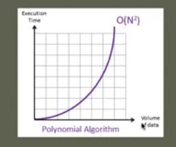

## Calculating Time complexity of a Polynomial Algorithm (Big O)


- In this example value `n=3`.

1. Polynomial Algorithm. 
2. Inner loop will get executed `n(1 + 3n + 3 + 3n)`, how many outer loop executed.
3. Time Complexity will be `O=(n2)`.

```
	static public void print(int n) {
		for (int i = 1; i <= n; i++) {
			for (int j = 1; j <= n; j++) {
				System.out.println("i = " + i + ",j = " + j);
			}
			System.out.println("End of inner loop");
		}
		System.out.println("End of outer loop");
	}
```



- As you can see, it is **REALLY** bad algorithm in term of execution times.
    - In general we avoid **nested** loops.