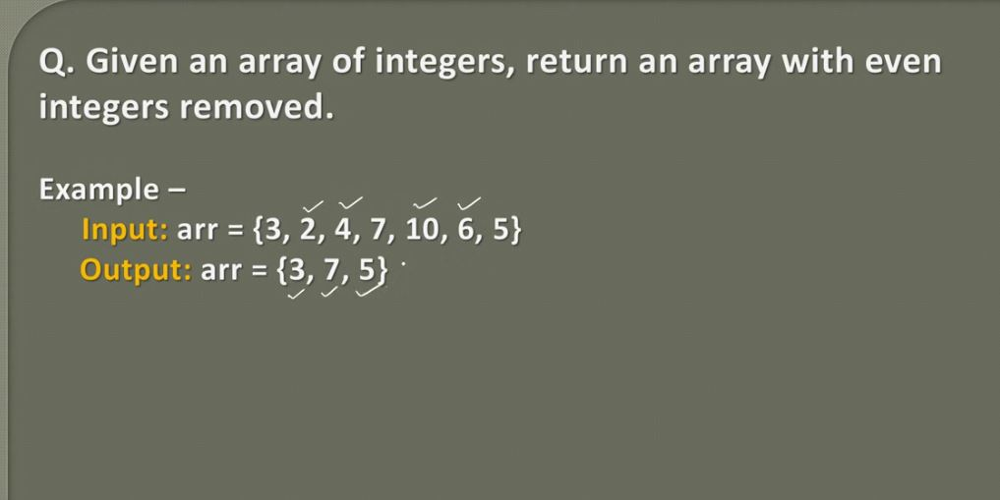
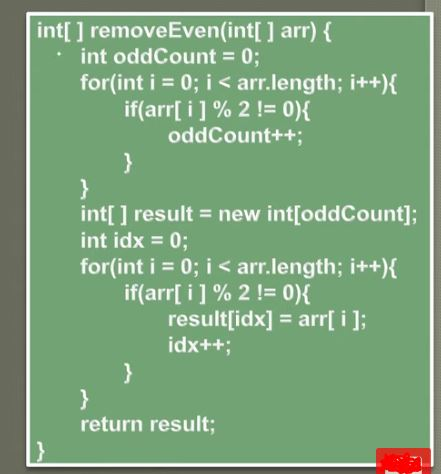

## Remove Even Integers from an Array | Animation | Coding Interview Question

- Common interview question, remove even integers.

 

- This is `O(2N)` -> ` O(N)`

- We are testing odd:ness with `%` operator. 