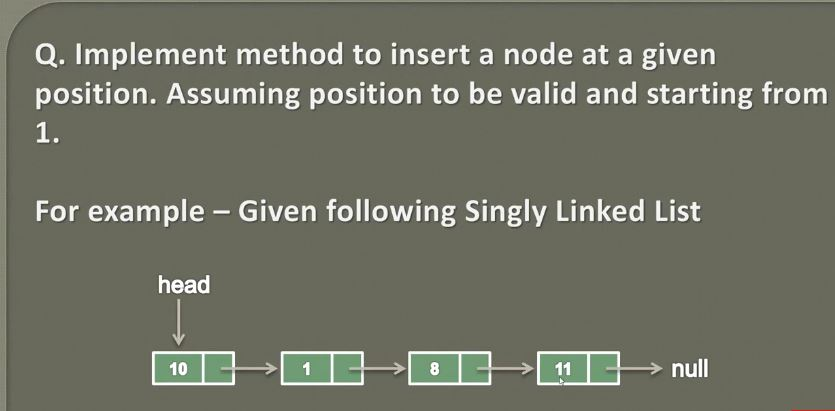
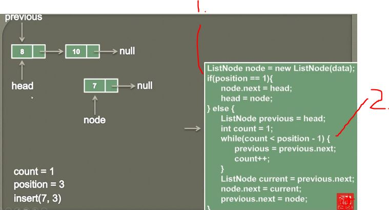

## Insert a node in a Singly Linked List at a given position (Animation)

 

1. If position is 1, we wan't shift head to **position 1**.
2. If we insert into middle, we want traverse while **Linked List** just before **-1**.