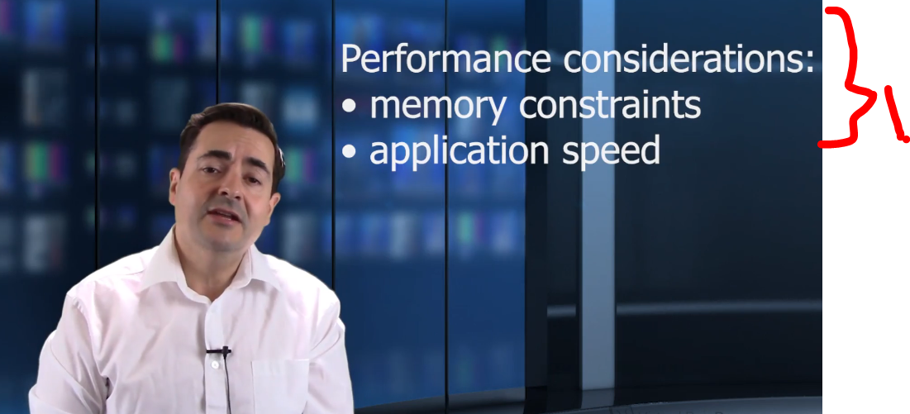
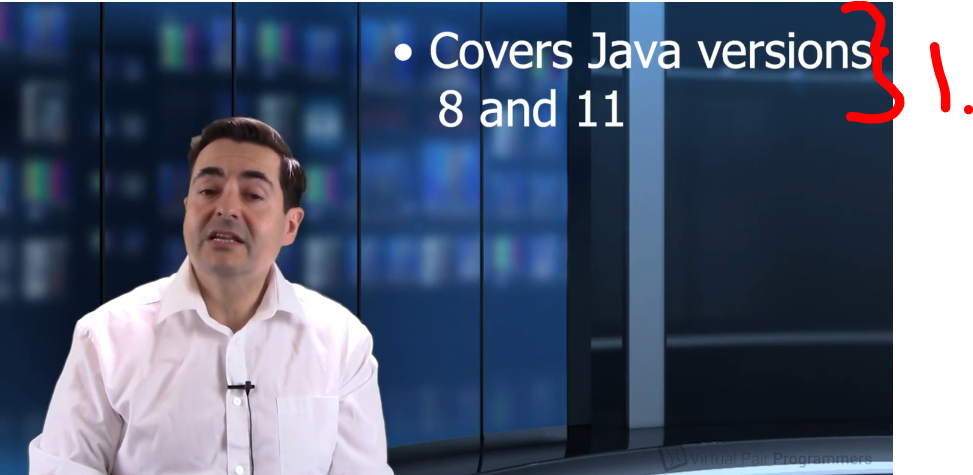

# Chapter 01 - Introduction.

Introduction.

# What I learned.

# What do we mean by performance, and what versions of Java does this course cover.

    

1. Hello there Sir!

    

1. How to run application in the constraints of:
    - Memory constraints, meaning in limited memory constraints.
    - Application speed, meaning as best speed as possible.

    

1. Designs choices and tuning the **JVM** or runtime aspects!

> [!NOTE]
> Java is two different things in this aspect:
>    - The **Java** language.
>        - This course will tackle 20% of **Java** itself.
>    - The **JVM** machine itself.
>        - This course will tackle 80% of **JVM** itself.

- **Note** this will be beneficial, if one is using *Groovy*, *Kotlin*, *Scala* or *Clojure*. These all are JVM languages!

    

1. This course will be covering **Java 8** and **Java 11**! 

# Example code provided with this course.

- The example codes:
    - If using **Java 8** use `java8` folder!
    - If using **Java 11 or later** `java11` folder!

# Using different JDK and JVM vendors.

    

1. We will be covering for these **JDK vendors**. We are using **HotSpot** versions.

> [!NOTE]
> Why is it called **HotSpot** in the *JDK*?
>
> **HotSpot** is the name of the JVM implementation used in the standard Oracle/OpenJDK distribution.
>
>It’s called **HotSpot** because it identifies the “*hot spots*” in your code — the parts that run most frequently — and optimizes them 😈**aggressively**😈 at runtime.

# The structure of this course.

- Todo annotate this. 

    

    

    

    

    

    

# How to get support while you're taking this course.

- Ask question online when one one feels so!