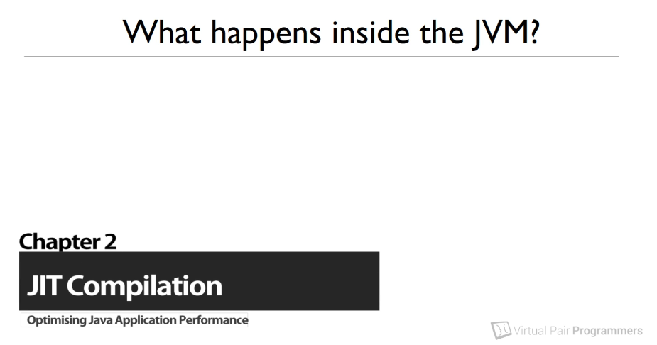
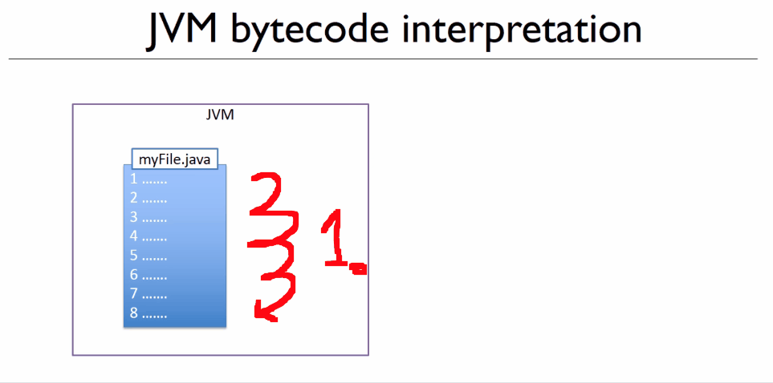
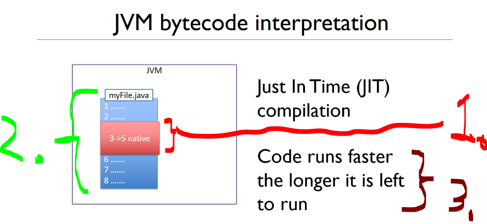
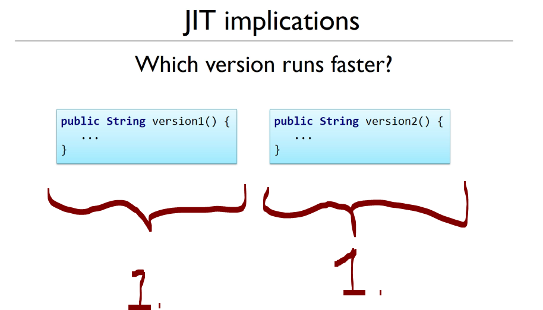
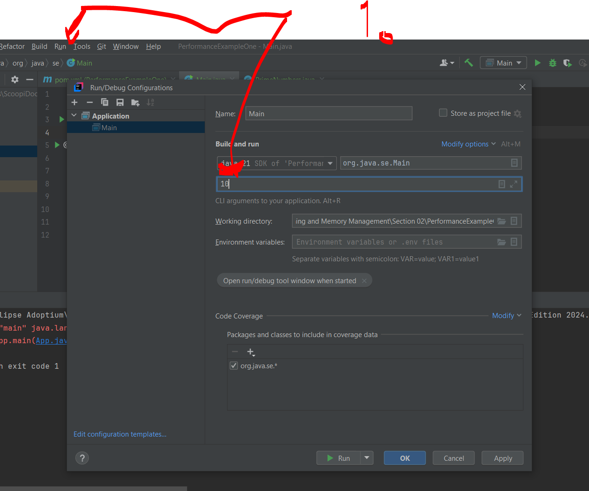
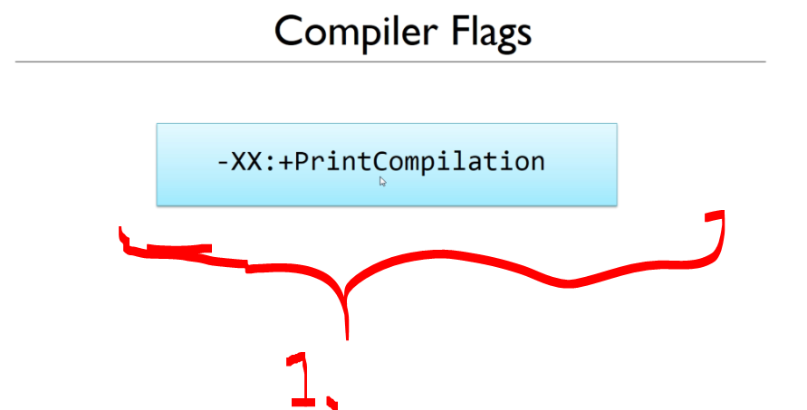

# Chapter 02: Just In Time Compilation and the Code Cache.

Just In Time Compilation and the Code Cache.

# What I learned.

# What is bytecode?

<div align="center">
    
</div>

1. We will be looking what happens, when **JVM** runs the code!

<div align="center">
    
</div>

1. `Main.java` gets compiled into `Main.class`.
2. **JVM** runs the **byte code**!
    - We are saying, that **JVM** is interpreting this **byte code** at runtime!

- This **byte code** can be run multiple platform where there is **JVM** installed!

- **JVM** is not simply interpreter!
    - **JVM** contains **features** and **algorithms** to enhance the speed of running the **byte code**!

<div align="center">
    
</div>

1. **PHP**, is not complied, but interpretented at runtime with the **Apache web server**!
    - Codes are looked at and executed as it is needed!

- **JVM** is asked to run **Java byte code**.
    - As result, any language which can be **compiled** into **JVM** compatible byte code, can be ran in **JVM**!
        - *Kotlin*.
        - *Scala*.
        - *Groovy*.
        - *Clojure*.
        - *JRuby*.
        - *Jython*.
    - They all compile to **JVM** bytecode.

> [!NOTE]
> We will be comparing different **byte code** from different languages!

# The concept of "Just In Time Compilation"

<div align="center">
    
</div>

1. Java would be run these codes as one at the time!
    - These would be interpreted as it would execute these line of the code!
        - This would be **slower** compared to the **compiled languages** like **C**! 

- For this reason, **Java** came up with the solution!
    - **JIT** (**J**ust **I**n **T**ime compilation)

<div align="center">
    
</div>

1. **JIT** compiler inside the **JVM** that would check which methods or loops, would be ran most often and compile those into **native system code**!
2. Notice, at this point here is **Java byte code** and **native system code**.
3. When something becomes a **hot spot**, the **JIT compiler** compiles it into optimized native machine code.
   - The **JIT compiler** runs in **separate background threads** inside the **JVM**.

- You could see, **slight downside** if **JIT compilation** taking place, when resources are limited!

<div align="center">
    
</div>

1. There are two **same methods**.
    - These are taking different time of execution when the application **starts** and application have been running short **period time**!
        - So point is, we need to look the performance before and after it's been compiled to native code!

- From perspective of programmer, we can compile any method or loop into **native machine code**!

# Introducing the first example project

> [!NOTE]
> There is **JVM flag** to inspect, which parts are going to be compiled to **machine code**!

- We are exploring the example, which we are running and checking which parts the **JIT** optimized into **system native code**! Implementation below:

````Java
package org.java.se;

public class Main {

	public static void main(String[] args) {
		PrimeNumbers primeNumbers = new PrimeNumbers();
		Integer max = Integer.parseInt(args[0]);
		primeNumbers.generateNumbers(max);
	}

}
````

````Java
package org.java.se;
import java.util.ArrayList;
import java.util.List;

public class PrimeNumbers {

	private List<Integer> primes;
	
	private Boolean isPrime(Integer testNumber) {
		for (int i = 2; i < testNumber; i++) {
			if (testNumber % i == 0) return false;
		}
		return true;
	}
	
	private Integer getNextPrimeAbove(Integer previous) {
		Integer testNumber = previous + 1;
		while (!isPrime(testNumber)) {
			testNumber++;
		}
		return testNumber;
	}
	
	public void generateNumbers (Integer max) {
		primes = new ArrayList<Integer>();
		primes.add(2);

		Integer next = 2;
		while (primes.size() <= max) {
			next = getNextPrimeAbove(next);
			primes.add(next);
		}
		System.out.println(primes);
	}

}
````

- We need to give runnable arguments, for this example!

<div align="center">
    
</div>

1. We will be giving runnable arguments! Here is example in **IntelliJ**!

- We can see the **JIT** compilation experiment running inside **IntelliJ**:

<div align="center">
    
</div>

1. We can see the logs, in regard to the argument which we have been provided!

- Example of the logs below:

````Bash
[2, 3, 5, 7, 11, 13, 17, 19, 23, 29, 31]
````


- add here the cmd running things todo


<details>
<summary id="Thread progress
" open="true"> <b>Performance Example one!</b> </summary>

## PrimeNumbers class.

````Java
package org.java.se;
import java.util.ArrayList;
import java.util.List;

public class PrimeNumbers {

	private List<Integer> primes;
	
	private Boolean isPrime(Integer testNumber) {
		for (int i = 2; i < testNumber; i++) {
			if (testNumber % i == 0) return false;
		}
		return true;
	}
	
	private Integer getNextPrimeAbove(Integer previous) {
		Integer testNumber = previous + 1;
		while (!isPrime(testNumber)) {
			testNumber++;
		}
		return testNumber;
	}
	
	public void generateNumbers (Integer max) {
		primes = new ArrayList<Integer>();
		primes.add(2);

		Integer next = 2;
		while (primes.size() <= max) {
			next = getNextPrimeAbove(next);
			primes.add(next);
		}
		System.out.println(primes);
	}

}
````

## Main class.

````Java
package org.java.se;

public class Main {

	public static void main(String[] args) {
		PrimeNumbers primeNumbers = new PrimeNumbers();
		Integer max = Integer.parseInt(args[0]);
		primeNumbers.generateNumbers(max);
	}
}

````
</details>

# Finding out which methods are being compiled in our applications

<div align="center">
    
</div>


# The C1 and C2 Compilers and logging the compilation activity

# Tuning the code cache size

# Remotely monitoring the code cache with
