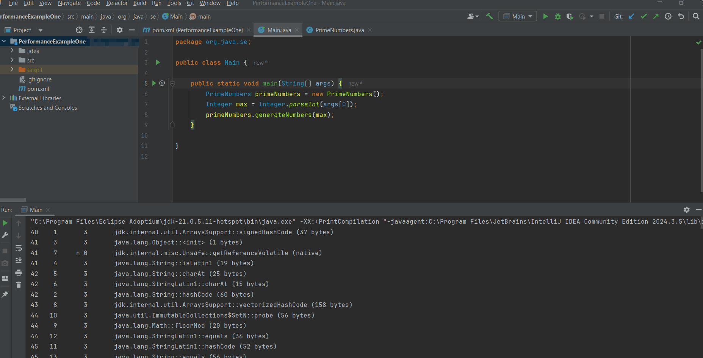
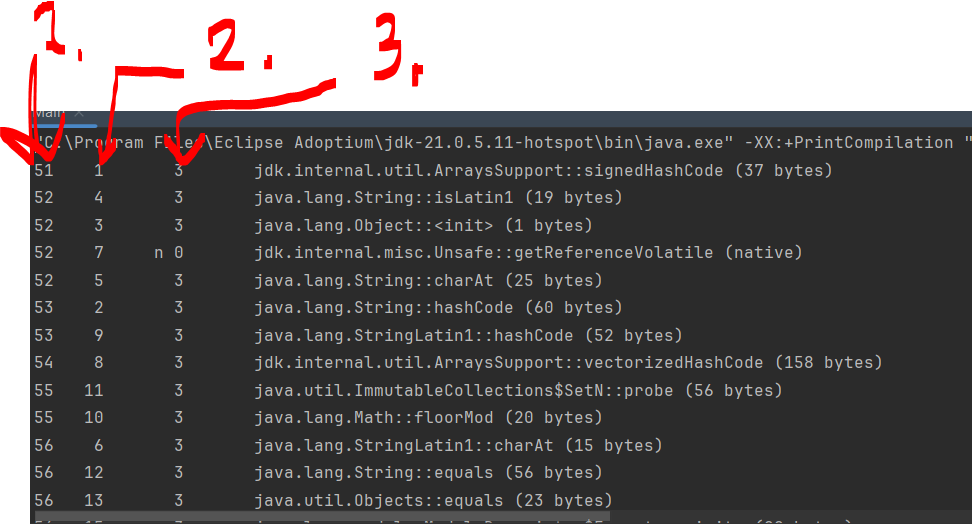
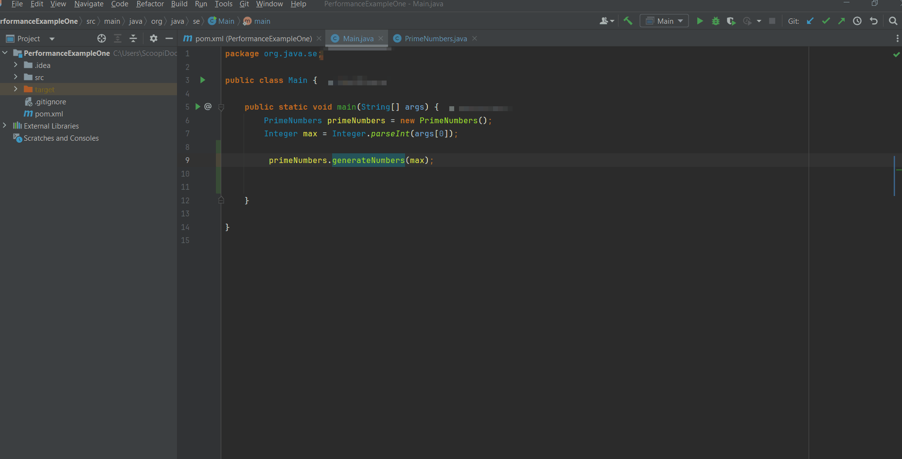
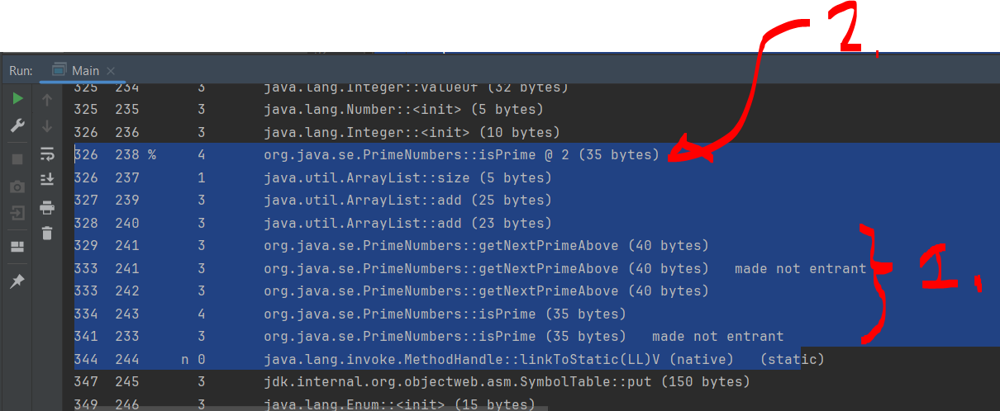
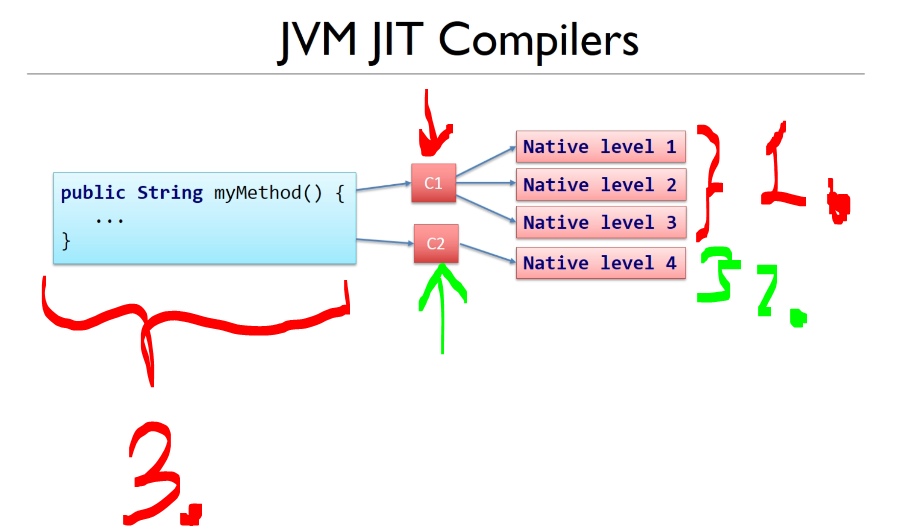
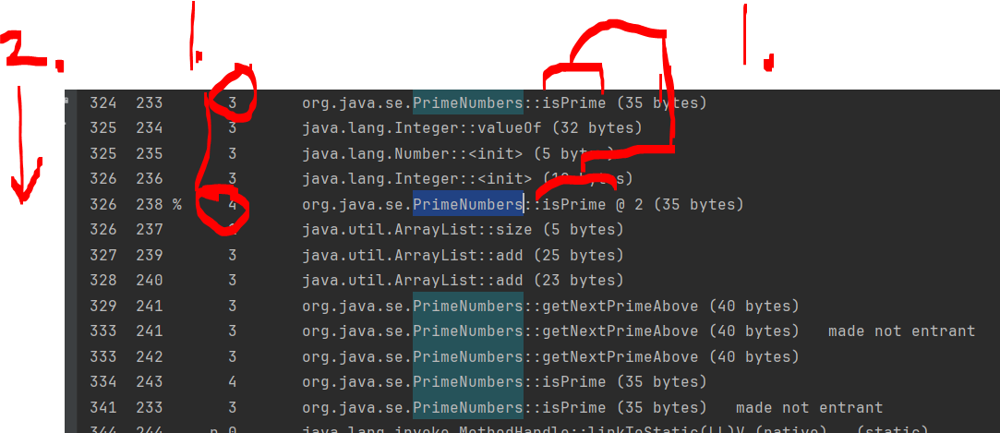
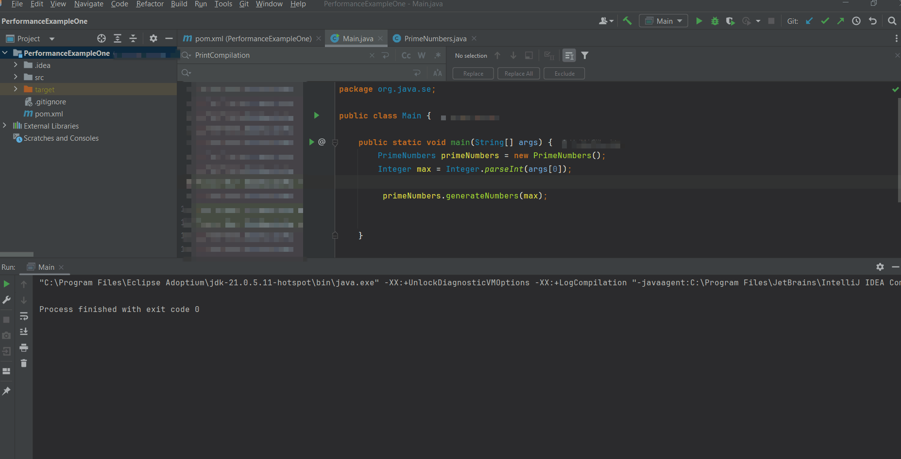
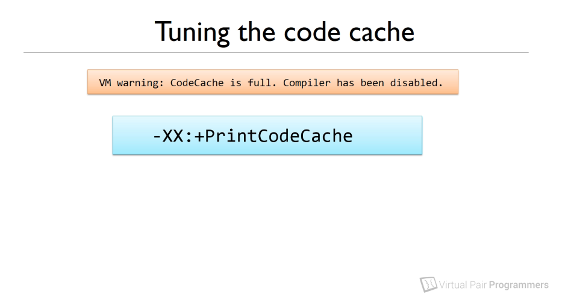

# Chapter 02: Just In Time Compilation and the Code Cache.

Just In Time Compilation and the Code Cache.

# What I learned.

# What is bytecode?

<div align="center">
    
</div>

1. We will be looking what happens, when **JVM** runs the code!

<div align="center">
    
</div>

1. `Main.java` gets compiled into `Main.class`.
2. **JVM** runs the **byte code**!
    - We are saying, that **JVM** is interpreting this **byte code** at runtime!

- This **byte code** can be run multiple platform where there is **JVM** installed!

- **JVM** is not simply interpreter!
    - **JVM** contains **features** and **algorithms** to enhance the speed of running the **byte code**!

<div align="center">
    
</div>

1. **PHP**, is not complied, but interpretented at runtime with the **Apache web server**!
    - Codes are looked at and executed as it is needed!

- **JVM** is asked to run **Java byte code**.
    - As result, any language which can be **compiled** into **JVM** compatible byte code, can be ran in **JVM**!
        - *Kotlin*.
        - *Scala*.
        - *Groovy*.
        - *Clojure*.
        - *JRuby*.
        - *Jython*.
    - They all compile to **JVM** bytecode.

> [!NOTE]
> We will be comparing different **byte code** from different languages!

# The concept of "Just In Time Compilation"

<div align="center">
    
</div>

1. Java would be run these codes as one at the time!
    - These would be interpreted as it would execute these line of the code!
        - This would be **slower** compared to the **compiled languages** like **C**! 

- For this reason, **Java** came up with the solution!
    - **JIT** (**J**ust **I**n **T**ime compilation)

<div align="center">
    
</div>

1. **JIT** compiler inside the **JVM** that would check which methods or loops, would be ran most often and compile those into **native system code**!
2. Notice, at this point here is **Java byte code** and **native system code**.
3. When something becomes a **hot spot**, the **JIT compiler** compiles it into optimized native machine code.
   - The **JIT compiler** runs in **separate background threads** inside the **JVM**.

- You could see, **slight downside** if **JIT compilation** taking place, when resources are limited!

<div align="center">
    
</div>

1. There are two **same methods**.
    - These are taking different time of execution when the application **starts** and application have been running short **period time**!
        - So point is, we need to look the performance before and after it's been compiled to native code!

- From perspective of programmer, we can compile any method or loop into **native machine code**!

# Introducing the first example project

> [!NOTE]
> There is **JVM flag** to inspect, which parts are going to be compiled to **machine code**!

- We are exploring the example, which we are running and checking which parts the **JIT** optimized into **system native code**! Implementation below:

````Java
package org.java.se;

public class Main {

	public static void main(String[] args) {
		PrimeNumbers primeNumbers = new PrimeNumbers();
		Integer max = Integer.parseInt(args[0]);
		primeNumbers.generateNumbers(max);
	}

}
````

````Java
package org.java.se;
import java.util.ArrayList;
import java.util.List;

public class PrimeNumbers {

	private List<Integer> primes;
	
	private Boolean isPrime(Integer testNumber) {
		for (int i = 2; i < testNumber; i++) {
			if (testNumber % i == 0) return false;
		}
		return true;
	}
	
	private Integer getNextPrimeAbove(Integer previous) {
		Integer testNumber = previous + 1;
		while (!isPrime(testNumber)) {
			testNumber++;
		}
		return testNumber;
	}
	
	public void generateNumbers (Integer max) {
		primes = new ArrayList<Integer>();
		primes.add(2);

		Integer next = 2;
		while (primes.size() <= max) {
			next = getNextPrimeAbove(next);
			primes.add(next);
		}
		System.out.println(primes);
	}

}
````

- We need to give runnable arguments, for this example!

<div align="center">
    
</div>

1. We will be giving runnable arguments! Here is example in **IntelliJ**!

- We can see the **JIT** compilation experiment running inside **IntelliJ**:

<div align="center">
    
</div>

1. We can see the logs, in regard to the argument which we have been provided!

- Example of the logs below:

````Bash
[2, 3, 5, 7, 11, 13, 17, 19, 23, 29, 31]
````


- add here the cmd running things todo


<details>
<summary id="JIT logs example one codes" open="true"> <b>Performance example one codes!</b> </summary>

## PrimeNumbers class.

````Java
package org.java.se;
import java.util.ArrayList;
import java.util.List;

public class PrimeNumbers {

	private List<Integer> primes;
	
	private Boolean isPrime(Integer testNumber) {
		for (int i = 2; i < testNumber; i++) {
			if (testNumber % i == 0) return false;
		}
		return true;
	}
	
	private Integer getNextPrimeAbove(Integer previous) {
		Integer testNumber = previous + 1;
		while (!isPrime(testNumber)) {
			testNumber++;
		}
		return testNumber;
	}
	
	public void generateNumbers (Integer max) {
		primes = new ArrayList<Integer>();
		primes.add(2);

		Integer next = 2;
		while (primes.size() <= max) {
			next = getNextPrimeAbove(next);
			primes.add(next);
		}
		System.out.println(primes);
	}
}
````

## Main class.

````Java
package org.java.se;

public class Main {

	public static void main(String[] args) {
		PrimeNumbers primeNumbers = new PrimeNumbers();
		Integer max = Integer.parseInt(args[0]);
		primeNumbers.generateNumbers(max);
	}
}

````
</details>

# Finding out which methods are being compiled in our applications

<div align="center">
    
</div>

1. We have the following flag for **JVM** `-XX:+PrintCompilation`.
	- `-XX` means **advanced** or **Hotspot-spesific** option.
	- `+` means turn **ON**
		- `-` means turn **OFF**
	- `PrintCompilation` means print information whenever the **JIT** compiler compiles a method!
	
- Notice these **flags** are case-sensitive!

> [!NOTE]
> This **flag** lets you see when methods are compiled, by **which compiler**, and at what **optimization level**!

- We can provide these **flags** to the **JVM** when starting the **Java** program!

- Todo this on command line.

- We can inspect `java -XX:+PrintCompilation Main 10`

<div align="center">
    
</div>

1. We can provide the **VM argument** to **JVM**.	
	- In **IntelliJ**, there is `Modify Options`, where one can see the `Add VMM options`!
2. We can provide **program arguments** to the Java program!

<div align="center">
    
</div>

1. You can see the program log: `[2, 3, 5, 7, 11, 13, 17, 19, 23, 29, 31]`.
2.  As output, we can get the output of the program and also we can see following logs there:
	- *Java HotSpot* **J***ust*-**I***n*-**T***ime* (**JIT**) *compiler* / *interpreter method profiling log*.

<details>
<summary id="profiling log
" open="true"> HUGE - <b>Interpreter method profiling log!</b> </summary>

````Bash
40    1       3       jdk.internal.util.ArraysSupport::signedHashCode (37 bytes)
41    3       3       java.lang.Object::<init> (1 bytes)
41    7     n 0       jdk.internal.misc.Unsafe::getReferenceVolatile (native)   
41    4       3       java.lang.String::isLatin1 (19 bytes)
42    5       3       java.lang.String::charAt (25 bytes)
42    6       3       java.lang.StringLatin1::charAt (15 bytes)
42    2       3       java.lang.String::hashCode (60 bytes)
43    8       3       jdk.internal.util.ArraysSupport::vectorizedHashCode (158 bytes)
44   10       3       java.util.ImmutableCollections$SetN::probe (56 bytes)
44    9       3       java.lang.Math::floorMod (20 bytes)
44   12       3       java.lang.StringLatin1::equals (36 bytes)
45   11       3       java.lang.StringLatin1::hashCode (52 bytes)
45   13       3       java.lang.String::equals (56 bytes)
46   14       3       java.util.Objects::equals (23 bytes)
46   17       3       java.lang.module.ModuleDescriptor::modsHashCode (43 bytes)
47   16       3       java.lang.module.ModuleDescriptor$Exports::<init> (20 bytes)
47   18       3       java.util.ImmutableCollections$SetN::iterator (9 bytes)
47   21       3       java.util.Set::of (4 bytes)
47   19       3       java.util.Objects::requireNonNull (14 bytes)
48   20       3       java.util.ImmutableCollections$AbstractImmutableCollection::<init> (5 bytes)
48   22       3       java.util.ImmutableCollections$AbstractImmutableSet::<init> (5 bytes)
48   24       3       java.util.Set::of (68 bytes)
49   25       3       java.lang.String::coder (15 bytes)
49   26       3       java.lang.String::length (11 bytes)
49   28     n 0       java.lang.System::arraycopy (native)   (static)
50   27       1       java.lang.module.ModuleDescriptor::name (5 bytes)
50   29       1       java.lang.module.ModuleReference::descriptor (5 bytes)
50   23       4       jdk.internal.util.ArraysSupport::signedHashCode (37 bytes)
50   30       3       java.net.URI::hash (33 bytes)
54   31       3       java.lang.String::isEmpty (14 bytes)
54   32       3       java.util.ImmutableCollections$SetN$SetNIterator::hasNext (13 bytes)
54   33     n 0       jdk.internal.misc.Unsafe::compareAndSetLong (native)   
54    1       3       jdk.internal.util.ArraysSupport::signedHashCode (37 bytes)   made not entrant
54   34     n 0       jdk.internal.misc.Unsafe::compareAndSetReference (native)   
55   35       3       java.util.concurrent.ConcurrentHashMap::tabAt (22 bytes)
55   15       4       java.lang.Object::<init> (1 bytes)
55   38       3       java.util.ImmutableCollections$SetN$SetNIterator::next (90 bytes)
55    3       3       java.lang.Object::<init> (1 bytes)   made not entrant
55   36       3       jdk.internal.misc.Unsafe::getReferenceAcquire (7 bytes)
56   37       3       java.util.concurrent.ConcurrentHashMap::addCount (280 bytes)
59   39     n 0       java.lang.invoke.MethodHandle::linkToStatic(L)L (native)   (static)
61   40       3       java.util.concurrent.ConcurrentHashMap::casTabAt (21 bytes)
61   41     n 0       java.lang.Object::hashCode (native)   
61   42       3       java.util.concurrent.ConcurrentHashMap::spread (10 bytes)
61   43     n 0       java.lang.Class::isPrimitive (native)   
62   44     n 0       java.lang.invoke.MethodHandle::linkToStatic(LLL)L (native)   (static)
62   45     n 0       java.lang.invoke.MethodHandle::linkToStatic(LLLL)L (native)   (static)
63   46     n 0       java.lang.invoke.MethodHandle::invokeBasic()L (native)   
63   47     n 0       java.lang.invoke.MethodHandle::linkToSpecial(LL)L (native)   (static)
66   48       1       jdk.internal.util.StrongReferenceKey::get (5 bytes)
66   49     n 0       java.lang.invoke.MethodHandle::invokeBasic(L)L (native)   
66   50     n 0       java.lang.invoke.MethodHandle::linkToSpecial(LLL)L (native)   (static)
66   51       1       java.lang.Enum::ordinal (5 bytes)
66   52     n 0       java.lang.Object::getClass (native)   
67   53     n 0       java.lang.invoke.MethodHandle::linkToStatic(LLLLLLL)L (native)   (static)
67   54     n 0       java.lang.invoke.MethodHandle::linkToStatic(LL)I (native)   (static)
68   55       1       java.lang.invoke.MethodType::returnType (5 bytes)
68   58     n 0       java.lang.invoke.MethodHandle::invokeBasic(LLLLLL)L (native)   
68   57       3       java.lang.ref.ReferenceQueue::headIsNull (13 bytes)
68   60     n 0       java.lang.invoke.MethodHandle::linkToSpecial(LLLLLLLL)L (native)   (static)
68   56       3       java.util.concurrent.ConcurrentHashMap::putIfAbsent (8 bytes)
68   61     n 0       java.lang.Class::isArray (native)   
68   59       3       jdk.internal.util.ReferencedKeyMap::removeStaleReferences (30 bytes)
69   62     n 0       java.lang.Object::clone (native)   
69   63     n 0       java.lang.invoke.MethodHandle::linkToSpecial(LL)V (native)   (static)
70   64       3       java.util.Objects::hashCode (13 bytes)
70   65       3       java.lang.Math::min (11 bytes)
71   66       3       java.util.concurrent.ConcurrentHashMap::get (162 bytes)
72   69     n 0       java.lang.invoke.MethodHandle::linkToStatic(LLL)I (native)   (static)
72   68       3       java.lang.invoke.MethodType::hashCode (53 bytes)
72   71     n 0       java.lang.invoke.MethodHandle::linkToSpecial(LLL)V (native)   (static)
72   67       3       java.lang.invoke.MethodTypeForm::canonicalize (74 bytes)
72   73     n 0       java.lang.invoke.MethodHandle::linkToVirtual(LL)L (native)   (static)
73   72   !   3       java.lang.ref.NativeReferenceQueue::poll (28 bytes)
73   70       1       java.lang.invoke.MemberName::getDeclaringClass (5 bytes)
73   74       3       java.lang.invoke.MemberName::isInvocable (8 bytes)
73   75       3       java.util.Objects::requireNonNull (15 bytes)
73   78     n 0       java.lang.invoke.MethodHandle::linkToInterface(LLL)I (native)   (static)
74   76       1       java.lang.invoke.MethodType::form (5 bytes)
74   77       1       java.lang.invoke.MethodType::ptypes (5 bytes)
74   79       3       java.lang.StringLatin1::indexOfChar (33 bytes)
74   80       3       java.lang.Class::getClassLoader (28 bytes)
74   82     n 0       java.lang.invoke.MethodHandle::linkToStatic(LL)L (native)   (static)
75   83       3       jdk.internal.util.ReferencedKeyMap::lookupKey (9 bytes)
75   84       3       jdk.internal.util.StrongReferenceKey::<init> (10 bytes)
75   85       3       jdk.internal.util.StrongReferenceKey::hashCode (8 bytes)
75   86     n 0       java.lang.invoke.MethodHandle::linkToSpecial(LL)I (native)   (static)
76   81       3       java.lang.String::getBytes (44 bytes)
76   87       1       java.lang.invoke.MethodHandle::type (5 bytes)
76   88       3       java.lang.Math::max (11 bytes)
77   89       3       java.util.HashMap::hash (20 bytes)
77   90       1       java.util.stream.FindOps$FindSink::cancellationRequested (5 bytes)
77   91       1       java.util.Spliterators$IteratorSpliterator::characteristics (5 bytes)
77   92       3       java.util.HashMap::putVal (300 bytes)
78   92       3       java.util.HashMap::putVal (300 bytes)   made not entrant
79   93       3       java.util.HashMap::newNode (13 bytes)
79  102       3       java.util.HashMap::putVal (300 bytes)
80  103       3       java.util.HashMap::getNode (150 bytes)
81  108       3       java.util.HashMap$HashIterator::nextNode (100 bytes)
81  107       3       java.util.HashMap$HashIterator::hasNext (13 bytes)
81  105       3       java.util.HashMap::get (19 bytes)
82   94       3       java.util.HashMap$Node::<init> (26 bytes)
82  115       4       java.lang.String::hashCode (60 bytes)
82   98       3       java.util.HashMap::afterNodeInsertion (1 bytes)
82  112       1       java.lang.module.ModuleDescriptor$Exports::source (5 bytes)
82  111       1       java.lang.module.ModuleDescriptor$Exports::targets (5 bytes)
82  110       1       java.util.ImmutableCollections$Set12::isEmpty (2 bytes)
83  113       3       java.lang.module.ModuleDescriptor$Exports::isQualified (18 bytes)
83  114       3       java.util.ImmutableCollections$SetN::isEmpty (13 bytes)
83   97       3       java.util.HashMap::put (13 bytes)
83  117       3       java.util.HashMap::putIfAbsent (13 bytes)
83    2       3       java.lang.String::hashCode (60 bytes)   made not entrant
83  118       4       java.util.HashMap::afterNodeInsertion (1 bytes)
84  116       3       java.util.ImmutableCollections$Set12::contains (28 bytes)
84   98       3       java.util.HashMap::afterNodeInsertion (1 bytes)   made not entrant
84  101       1       java.lang.module.ModuleDescriptor$Requires::name (5 bytes)
84  119       3       java.lang.Object::equals (11 bytes)
84  100       1       java.lang.module.ModuleDescriptor$Requires::modifiers (5 bytes)
84   95       3       java.util.ImmutableCollections$SetN$SetNIterator::<init> (36 bytes)
84  124       3       java.util.HashMap::resize (356 bytes)
85  125       4       java.util.ImmutableCollections$SetN$SetNIterator::hasNext (13 bytes)
85   32       3       java.util.ImmutableCollections$SetN$SetNIterator::hasNext (13 bytes)   made not entrant
85  126       4       java.util.ImmutableCollections$SetN$SetNIterator::next (90 bytes)
85  123       3       java.util.ImmutableCollections$SetN::contains (26 bytes)
86  104       1       java.lang.module.ModuleDescriptor::requires (5 bytes)
86   99       3       java.util.AbstractCollection::<init> (5 bytes)
86  109       3       jdk.internal.module.ModuleReferenceImpl::hashCode (56 bytes)
86  120       3       java.util.ImmutableCollections$Set12$1::hasNext (13 bytes)
87  106       1       java.lang.module.ModuleDescriptor::isAutomatic (5 bytes)
87  122       1       java.lang.module.ModuleDescriptor::exports (5 bytes)
87  129       3       java.util.HashMap::keySet (25 bytes)
87  130       3       java.util.HashMap$KeySet::iterator (12 bytes)
87   38       3       java.util.ImmutableCollections$SetN$SetNIterator::next (90 bytes)   made not entrant
87  127       4       java.lang.module.ModuleDescriptor$Exports::isQualified (18 bytes)
87  131       3       java.util.HashMap$KeyIterator::<init> (6 bytes)
88  132       3       java.util.HashSet::add (20 bytes)
88  137       3       java.util.HashMap$KeyIterator::next (8 bytes)
88  138       3       java.lang.module.ResolvedModule::hashCode (16 bytes)
88  121       1       java.lang.module.ModuleDescriptor::provides (5 bytes)
88  113       3       java.lang.module.ModuleDescriptor$Exports::isQualified (18 bytes)   made not entrant
88  141       4       java.lang.StringLatin1::equals (36 bytes)
89  142       3       java.util.concurrent.ConcurrentHashMap$Node::<init> (20 bytes)
89  143   !   3       java.util.concurrent.ConcurrentHashMap::putVal (432 bytes)
91  145       1       java.lang.module.ModuleDescriptor::packages (5 bytes)
91  139       1       java.util.KeyValueHolder::getKey (5 bytes)
91  140       1       java.util.KeyValueHolder::getValue (5 bytes)
91   96       1       jdk.internal.module.ModuleReferenceImpl::moduleResolution (5 bytes)
91  147       1       java.lang.AbstractStringBuilder::getValue (5 bytes)
91  151     n 0       java.lang.Module::addExports0 (native)   (static)
91  148       1       java.lang.AbstractStringBuilder::length (5 bytes)
92  152       3       java.util.AbstractSet::<init> (5 bytes)
92  154     n 0       java.lang.Module::addExportsToAll0 (native)   (static)
92  155       3       java.util.ImmutableCollections$Set12$1::next (95 bytes)
92   12       3       java.lang.StringLatin1::equals (36 bytes)   made not entrant
92  146       4       java.util.HashMap::putVal (300 bytes)
92  157       3       java.util.HashMap$HashIterator::<init> (79 bytes)
92  159     n 0       java.lang.Module::addReads0 (native)   (static)
92  153       3       java.util.AbstractMap::<init> (5 bytes)
93  156       3       java.util.ImmutableCollections$Set12::iterator (9 bytes)
93  150       1       java.lang.module.ResolvedModule::reference (5 bytes)
93  135       1       java.lang.module.ModuleDescriptor$Provides::service (5 bytes)
93  158       1       java.lang.module.ResolvedModule::configuration (5 bytes)
93  149       1       java.lang.module.ModuleDescriptor$Version::toString (5 bytes)
93  128       1       java.lang.module.ModuleDescriptor::uses (5 bytes)
93  134       1       java.util.HashMap$Node::getKey (5 bytes)
93  160       1       java.lang.module.ModuleDescriptor::isOpen (5 bytes)
93  136       1       java.util.HashMap$Node::getValue (5 bytes)
94  161       1       java.util.HashMap::size (5 bytes)
97  162       3       java.lang.invoke.MethodType::parameterCount (6 bytes)
98  163       3       java.lang.String::indexOf (37 bytes)
98  164       3       java.lang.StringLatin1::canEncode (13 bytes)
100  166       3       java.lang.AbstractStringBuilder::ensureCapacityInternal (39 bytes)
100  165       3       java.lang.AbstractStringBuilder::isLatin1 (19 bytes)
100  168       3       java.lang.StringBuilder::append (8 bytes)
101  169       3       java.lang.AbstractStringBuilder::append (77 bytes)
101  171       3       java.lang.String::<init> (15 bytes)
101  170       3       jdk.internal.util.Preconditions::checkFromToIndex (24 bytes)
102  167       3       java.lang.AbstractStringBuilder::putStringAt (19 bytes)
102  173       3       java.io.WinNTFileSystem::isSlash (18 bytes)
102  172       3       java.util.Arrays::copyOfRange (25 bytes)
103  174       3       java.lang.String::indexOf (7 bytes)
103  175       3       java.lang.StringLatin1::indexOf (37 bytes)
103  176       3       sun.nio.fs.WindowsPathParser::isSlash (18 bytes)
103  177       3       sun.nio.fs.WindowsPathParser::isInvalidPathChar (22 bytes)
104  178       3       java.lang.String::checkBoundsBeginEnd (11 bytes)
107  102       3       java.util.HashMap::putVal (300 bytes)   made not entrant
108  144       4       java.util.concurrent.ConcurrentHashMap::spread (10 bytes)
108   42       3       java.util.concurrent.ConcurrentHashMap::spread (10 bytes)   made not entrant
108  133       4       java.lang.String::equals (56 bytes)
109  179       3       java.util.zip.ZipUtils::SH (21 bytes)
110   13       3       java.lang.String::equals (56 bytes)   made not entrant
113  180       3       java.lang.String::substring (58 bytes)
113  181     n 0       java.lang.invoke.MethodHandle::linkToStatic(LLL)V (native)   (static)
113  182       3       java.lang.invoke.MemberName::allFlagsSet (16 bytes)
114  183       3       java.lang.invoke.MethodType::checkSlotCount (33 bytes)
114  184     n 0       java.lang.invoke.MethodHandle::invokeBasic(LL)V (native)   
114  185     n 0       java.lang.invoke.MethodHandle::linkToSpecial(LLLL)V (native)   (static)
115  187       3       java.lang.invoke.MethodType::<init> (15 bytes)
115  188       4       java.lang.String::charAt (25 bytes)
115  186       3       java.lang.invoke.MethodType::parameterType (7 bytes)
115  189       3       jdk.internal.util.ReferencedKeyMap::get (10 bytes)
115  191     n 0       java.lang.invoke.MethodHandle::invokeBasic(LL)L (native)   
116  192     n 0       java.lang.invoke.MethodHandle::linkToSpecial(LLLL)L (native)   (static)
116  190       3       jdk.internal.util.ReferencedKeyMap::getNoCheckStale (22 bytes)
116  193     n 0       java.lang.invoke.MethodHandle::linkToStatic(LLLLL)L (native)   (static)
116    5       3       java.lang.String::charAt (25 bytes)   made not entrant
117  194       3       java.lang.invoke.MemberName::initResolved (53 bytes)
117  195     n 0       java.lang.invoke.MethodHandle::invokeBasic(LLLL)L (native)   
117  196       3       jdk.internal.org.objectweb.asm.SymbolTable::get (13 bytes)
117  197       3       jdk.internal.org.objectweb.asm.ByteVector::putUTF8 (144 bytes)
118  198       3       jdk.internal.org.objectweb.asm.SymbolTable::hash (10 bytes)
118  199       3       jdk.internal.org.objectweb.asm.Symbol::<init> (38 bytes)
118  201     n 0       java.lang.invoke.MethodHandleNatives::resolve (native)   (static)
118  202     n 0       java.lang.invoke.MethodHandle::linkToStatic(LLLLLL)L (native)   (static)
118  200       1       jdk.internal.util.WeakReferenceKey::hashCode (5 bytes)
118  203     n 0       java.lang.Class::isInterface (native)   
119  204     n 0       java.lang.invoke.MethodHandle::invokeBasic(LLLLL)L (native)   
119  205       3       java.lang.invoke.MethodType::methodType (69 bytes)
119  206     n 0       java.lang.Class::isAssignableFrom (native)   
119  207       3       jdk.internal.org.objectweb.asm.SymbolTable$Entry::<init> (17 bytes)
120  208       3       jdk.internal.org.objectweb.asm.SymbolTable::addConstantUtf8 (98 bytes)
120  211     n 0       java.lang.invoke.MethodHandle::invokeBasic(LLL)L (native)   
120  209       3       jdk.internal.org.objectweb.asm.ByteVector::putByte (39 bytes)
120  212     n 0       java.lang.invoke.MethodHandle::linkToSpecial(LLLLL)L (native)   (static)
120  210       1       java.lang.invoke.MethodTypeForm::parameterSlotCount (5 bytes)
120  213       3       java.lang.StringBuilder::append (8 bytes)
120  214       3       java.lang.AbstractStringBuilder::append (45 bytes)
121  217     n 0       jdk.internal.misc.Unsafe::getLong (native)   
121  215       3       jdk.internal.org.objectweb.asm.ByteVector::putShort (52 bytes)
121  216       1       java.lang.invoke.MethodTypeForm::erasedType (5 bytes)
122  218       3       jdk.internal.misc.Unsafe::getLongUnaligned (173 bytes)
123  219       3       java.lang.StringUTF16::getChar (60 bytes)
123  188       4       java.lang.String::charAt (25 bytes)   made not entrant
124  220       3       java.lang.invoke.MethodType::checkPtypes (76 bytes)
125  222       3       java.lang.String::charAt (25 bytes)
125  221       3       java.lang.StringLatin1::newString (24 bytes)
[2, 3, 5, 7, 11, 13, 17, 19, 23, 29, 31]
126  223       1       java.lang.Integer::intValue (5 bytes)
127 2230 s 3 java.lang.StringBuffer::append
````
</details>

> [!TIP]
> Remember, every time we run our program, compilation is happening in the background!

- We will look at the logs, which the **JIT** interprentender method profiling tool has created for us:

<div align="center">
    
</div>

1. **First Column**: the timing after the **JVM** have been started, in **milliseconds**!
	- Example the **51 ms** have been passed since the **JVM** have been started.
		- `51    1       3       jdk.internal.util.ArraysSupport::signedHashCode (37 bytes)`.

2. **Second Column**: shows the in **which order** the **JVM** **compiled** the method or **observed**!
	- Example using previous, where the **1** is indicated. This means the method got compiled/order observed by **JVM**.
		-  `51    1       3       jdk.internal.util.ArraysSupport::signedHashCode (37 bytes)`.
	- ⚠️ Second column’s **order** isn’t always strictly sequential, since the threads and complexity of methods. ⚠️

3. **Third Column**: **compilation tier** or **profiling metric** — depends on **JVM** version: 
	- **JIT** compilation level *(1–4)* or **call depth** / number of calls seen from caller.
	- Example using previous, where the **3** is indicated. This means this would mean that it was compiled by **the C1 JIT compiler**, and **it was used full profiling data used to optimize it**!
		-  `51    1       3       jdk.internal.util.ArraysSupport::signedHashCode (37 bytes)`.
4. **Last part of the log**: The line of code, which is going to be compiled!
	- So far all the compilation has been done on the **Java library codes**, not in our own code!
<details>
<summary id="JIT compilation levels" open="true"> <b>👀 JIT compilation levels, with the types! 👀</b> </summary>

| Level | Compiler              | Optimization / Purpose                                       | When Used                             |
| ----- | --------------------- | ------------------------------------------------------------ | ------------------------------------- |
| 1     | C1 simple compilation | Quick, low-overhead compilation; minimal optimization        | Small methods, first-time hot methods |
| 2     | C1 limited profiling  | Adds some profiling data to guide optimizations              | Methods that run a few times          |
| 3     | C1 full profiling     | Full profiling information; better inlining and optimization | Hot methods detected by the JVM       |
| 4     | C2 fully optimized    | Aggressive optimization; best performance                    | Very hot methods and loops            |

	
</details>

<details>
<summary id="Thread progress
" open="true"> <b>🔎 How to interpret the JIT logs! 🔎</b> </summary>

````Java
public void test() {
    try {
        int x = 10 / 0;
    } catch (Exception e) {
        System.out.println("Error");
    }
}
````

- It will be showing as such in the **JIT** logs.
	- `120  45   !  3   MyClass::test (40 bytes)`
		- It just means this method contains **exception handling**.
</details>

<br>

- Here below most common and useful **JIT** flags:

| Letter | Meaning                    | Explanation                                                              |
| ------ | -------------------------- | ------------------------------------------------------------------------ |
| **n**  | Native method              | The method is **implemented in C/C++** inside the JVM (not Java bytecode).   |
| **s**  | Synchronized method        | The method has the `synchronized` modifier (uses monitor/locking).       |
| **%**  | OSR (On-Stack Replacement) | The method was compiled while already running (typically inside a loop). |
| **!**  | Exception handler present  | The method contains exception handling logic.                            |
| **b**  | Blocking method            | The method may block (less common in newer logs).                        |

- `n` **Native method**!
	- Written in **C/C++**.
	- Compiled when the JVM (HotSpot) was built.
	- Already machine code.
	- Not stored in Code Cache as JIT output.
		- Example of this would be: `142  167     n 0       java.lang.Module::addReads0 (native)   (static)`.

- `s` **Method have been synchronized**!
	- The method was already declared synchronized in the Java source (or bytecode).
		- Example of this could be: `s 3 java.lang.StringBuffer::append`.

- `!` **Exception handler present**!
	- `!` means the method has exception handling, such as:
		- `try`.
		- `catch`.
		- `finally`.
		- or exception throwing logic.
	- Example log: `136  145   !   3       java.util.concurrent.ConcurrentHashMap::putVal (432 bytes)`.

- `%` **Means OSR compilation** (On-Stack Replacement).
	- This method was compiled while it was already executing.
		- Example log `123  45  %  3  OSRExample::main @ 5 (35 bytes)`.

	- The method is hot (executed many times).
	- The **JVM** wants to **optimize** it without waiting for the method to finish.
	- **OSR** usually happens for loops, not the whole method.

<br>

- Next we will be **experiencing**, what are the logs when there is **complex calculation** going on. Implementation below:

````Java
package org.java.se;
import java.util.ArrayList;
import java.util.List;

public class PrimeNumbers {

	private List<Integer> primes;
	
	private Boolean isPrime(Integer testNumber) {
		for (int i = 2; i < testNumber; i++) {
			if (testNumber % i == 0) return false;
		}
		return true;
	}
	
	private Integer getNextPrimeAbove(Integer previous) {
		Integer testNumber = previous + 1;
		while (!isPrime(testNumber)) {
			testNumber++;
		}
		return testNumber;
	}

	synchronized public void  generateNumbers (Integer max) {
		primes = new ArrayList<Integer>();
		primes.add(2);

		Integer next = 2;
		while (primes.size() <= max) {
			next = getNextPrimeAbove(next);
			primes.add(next);
		}

		// We are supposed to ask 10 numbers:
		// System.out.println(primes);

		// We will be asking 5000 items
	}

}
````

````Java
package org.java.se;

public class Main {

	public static void main(String[] args) {
		PrimeNumbers primeNumbers = new PrimeNumbers();
		Integer max = Integer.parseInt(args[0]);

		 primeNumbers.generateNumbers(max);


	}

}
````

<div align="center">
    
</div>

1. This example was done with the **5000** results is with **prime numbers**.

<div align="center">
    
</div>

1. Now, we can see **our methods**, which exists in our code!
2. You can see the :`326  238 %  4  org.java.se.PrimeNumbers::isPrime @ 2 (35 bytes)`.
	- **Highest optimization tier** (*4*): The **JIT** used **C2**, so this version of the method is fully optimized, it means:
	- JVM compiles bytecode of `isPrime` into **x86_64** instructions (or ARM if on that CPU).
	- These instructions live in the **Code Cache**.
	- Future calls run at CPU speed, not interpreted bytecode speed!
	- You can also see the `%` flag there!


<details>
<summary id="JIT logs example second logs" open="true"> <b>Performance example second logs!</b> </summary>

````Bash
101    1       3       jdk.internal.util.ArraysSupport::signedHashCode (37 bytes)
102    3       3       java.lang.Object::<init> (1 bytes)
102    7     n 0       jdk.internal.misc.Unsafe::getReferenceVolatile (native)   
102    4       3       java.lang.String::isLatin1 (19 bytes)
103    5       3       java.lang.String::charAt (25 bytes)
104    6       3       java.lang.StringLatin1::charAt (15 bytes)
104    2       3       java.lang.String::hashCode (60 bytes)
105   11       3       java.util.ImmutableCollections$SetN::probe (56 bytes)
106   10       3       java.lang.Math::floorMod (20 bytes)
107    8       3       java.lang.StringLatin1::hashCode (52 bytes)
107    9       3       jdk.internal.util.ArraysSupport::vectorizedHashCode (158 bytes)
108   12       3       java.lang.StringLatin1::equals (36 bytes)
109   13       3       java.lang.String::equals (56 bytes)
110   14       3       java.util.Objects::equals (23 bytes)
110   16       3       java.lang.module.ModuleDescriptor$Exports::<init> (20 bytes)
111   17       3       java.util.Objects::requireNonNull (14 bytes)
111   20       3       java.util.Set::of (4 bytes)
112   18       3       java.util.AbstractCollection::<init> (5 bytes)
112   19       3       java.util.ImmutableCollections$AbstractImmutableCollection::<init> (5 bytes)
112   22       3       java.lang.module.ModuleDescriptor::modsHashCode (43 bytes)
113   23       3       java.util.Set::of (68 bytes)
114   24       3       java.lang.String::coder (15 bytes)
114   25       3       java.lang.String::length (11 bytes)
114   27     n 0       java.lang.System::arraycopy (native)   (static)
115   26       1       java.lang.module.ModuleDescriptor::name (5 bytes)
115   28       1       java.lang.module.ModuleReference::descriptor (5 bytes)
115   29       3       java.net.URI::hash (33 bytes)
116   21       4       jdk.internal.util.ArraysSupport::signedHashCode (37 bytes)
121   30       3       java.lang.String::isEmpty (14 bytes)
121   31       3       java.util.ImmutableCollections$SetN$SetNIterator::hasNext (13 bytes)
121   32     n 0       jdk.internal.misc.Unsafe::compareAndSetLong (native)   
121   33     n 0       jdk.internal.misc.Unsafe::compareAndSetReference (native)   
122   34       3       java.util.concurrent.ConcurrentHashMap::tabAt (22 bytes)
122   35       3       jdk.internal.misc.Unsafe::getReferenceAcquire (7 bytes)
122   36       3       java.util.concurrent.ConcurrentHashMap::addCount (280 bytes)
123    1       3       jdk.internal.util.ArraysSupport::signedHashCode (37 bytes)   made not entrant
124   15       4       java.lang.Object::<init> (1 bytes)
124    3       3       java.lang.Object::<init> (1 bytes)   made not entrant
125   37       3       java.util.ImmutableCollections$SetN$SetNIterator::next (90 bytes)
131   38     n 0       java.lang.invoke.MethodHandle::linkToStatic(L)L (native)   (static)
134   39       3       java.util.concurrent.ConcurrentHashMap::casTabAt (21 bytes)
135   40     n 0       java.lang.Object::hashCode (native)   
135   41       3       java.util.concurrent.ConcurrentHashMap::spread (10 bytes)
135   42     n 0       java.lang.Class::isPrimitive (native)   
136   43     n 0       java.lang.invoke.MethodHandle::linkToStatic(LLL)L (native)   (static)
137   44     n 0       java.lang.invoke.MethodHandle::linkToStatic(LLLL)L (native)   (static)
139   45     n 0       java.lang.invoke.MethodHandle::invokeBasic()L (native)   
139   46     n 0       java.lang.invoke.MethodHandle::linkToSpecial(LL)L (native)   (static)
144   47       1       jdk.internal.util.StrongReferenceKey::get (5 bytes)
144   48     n 0       java.lang.invoke.MethodHandle::invokeBasic(L)L (native)   
144   49     n 0       java.lang.invoke.MethodHandle::linkToSpecial(LLL)L (native)   (static)
144   50       1       java.lang.Enum::ordinal (5 bytes)
145   51     n 0       java.lang.Object::getClass (native)   
146   52     n 0       java.lang.invoke.MethodHandle::linkToStatic(LLLLLLL)L (native)   (static)
147   53     n 0       java.lang.invoke.MethodHandle::linkToStatic(LL)I (native)   (static)
147   54       1       java.lang.invoke.MethodType::returnType (5 bytes)
187   57     n 0       java.lang.invoke.MethodHandle::invokeBasic(LLLLLL)L (native)   
188   56       3       java.lang.ref.ReferenceQueue::headIsNull (13 bytes)
188   59     n 0       java.lang.invoke.MethodHandle::linkToSpecial(LLLLLLLL)L (native)   (static)
188   58       3       jdk.internal.util.ReferencedKeyMap::removeStaleReferences (30 bytes)
188   60     n 0       java.lang.Class::isArray (native)   
188   55       3       java.util.concurrent.ConcurrentHashMap::putIfAbsent (8 bytes)
189   61     n 0       java.lang.Object::clone (native)   
190   62     n 0       java.lang.invoke.MethodHandle::linkToSpecial(LL)V (native)   (static)
190   63       3       java.util.Objects::hashCode (13 bytes)
191   64       3       java.lang.Math::min (11 bytes)
193   65       3       java.util.concurrent.ConcurrentHashMap::get (162 bytes)
194   68     n 0       java.lang.invoke.MethodHandle::linkToStatic(LLL)I (native)   (static)
194   67       3       java.lang.invoke.MethodType::hashCode (53 bytes)
195   70     n 0       java.lang.invoke.MethodHandle::linkToSpecial(LLL)V (native)   (static)
195   66       3       java.lang.invoke.MethodTypeForm::canonicalize (74 bytes)
195   73     n 0       java.lang.invoke.MethodHandle::linkToVirtual(LL)L (native)   (static)
196   71       3       java.lang.invoke.MethodType::checkSlotCount (33 bytes)
196   69       1       java.lang.invoke.MemberName::getDeclaringClass (5 bytes)
197   72   !   3       java.lang.ref.NativeReferenceQueue::poll (28 bytes)
197   74       3       java.lang.invoke.MemberName::isInvocable (8 bytes)
197   75       3       java.lang.invoke.MemberName::anyFlagSet (15 bytes)
198   76       1       java.lang.invoke.MethodType::form (5 bytes)
198   77       3       java.lang.StringLatin1::canEncode (13 bytes)
199   78       1       java.lang.invoke.MethodType::ptypes (5 bytes)
199   79     n 0       java.lang.invoke.MethodHandle::linkToInterface(LLL)I (native)   (static)
199   80       3       jdk.internal.util.ReferencedKeyMap::get (10 bytes)
200   81       3       jdk.internal.util.ReferencedKeyMap::getNoCheckStale (22 bytes)
201   84     n 0       java.lang.invoke.MethodHandle::linkToStatic(LL)L (native)   (static)
201   82       3       java.lang.Class::getClassLoader (28 bytes)
202   85       3       jdk.internal.util.StrongReferenceKey::hashCode (8 bytes)
202   83       3       java.lang.String::getBytes (44 bytes)
203   86     n 0       java.lang.invoke.MethodHandle::linkToSpecial(LL)I (native)   (static)
203   87       1       java.lang.invoke.MethodHandle::type (5 bytes)
204   88       3       java.lang.Math::max (11 bytes)
205   89       3       java.util.ImmutableCollections$SetN::iterator (9 bytes)
205   90       3       java.util.ImmutableCollections$SetN$SetNIterator::<init> (36 bytes)
206   91       3       java.util.HashMap::hash (20 bytes)
206   92       1       java.util.stream.FindOps$FindSink::cancellationRequested (5 bytes)
207   93       1       java.util.Spliterators$IteratorSpliterator::characteristics (5 bytes)
207   94       3       java.util.HashMap::putVal (300 bytes)
209   95       3       java.util.HashMap::newNode (13 bytes)
210   96       3       java.util.HashMap$Node::<init> (26 bytes)
210   98       3       java.util.HashMap::afterNodeInsertion (1 bytes)
210   94       3       java.util.HashMap::putVal (300 bytes)   made not entrant
210   97       3       java.util.HashMap::put (13 bytes)
211  103       3       java.util.HashMap::putVal (300 bytes)
212  100       3       java.util.HashMap::getNode (150 bytes)
213  107       3       java.util.HashMap$HashIterator::nextNode (100 bytes)
214  106       3       java.util.HashMap::get (19 bytes)
215  104       3       java.util.HashMap$HashIterator::hasNext (13 bytes)
215  110       3       jdk.internal.module.ModuleReferenceImpl::hashCode (56 bytes)
216  105       3       java.lang.module.ModuleDescriptor::hashCode (170 bytes)
216  114       4       java.util.HashMap::afterNodeInsertion (1 bytes)
216   98       3       java.util.HashMap::afterNodeInsertion (1 bytes)   made not entrant
217  112       1       java.lang.module.ModuleDescriptor$Exports::targets (5 bytes)
217  111       1       java.util.ImmutableCollections$Set12::isEmpty (2 bytes)
217  113       1       java.lang.module.ModuleDescriptor$Exports::source (5 bytes)
218  102       1       java.lang.module.ModuleDescriptor$Requires::name (5 bytes)
218  101       1       java.lang.module.ModuleDescriptor$Requires::modifiers (5 bytes)
218   99       1       jdk.internal.module.ModuleReferenceImpl::moduleResolution (5 bytes)
219  108       1       java.lang.module.ModuleDescriptor::requires (5 bytes)
219  109       1       java.lang.module.ModuleDescriptor::isAutomatic (5 bytes)
219  115       3       java.util.ImmutableCollections$Set12::contains (28 bytes)
220  116       3       java.lang.module.ModuleDescriptor$Exports::isQualified (18 bytes)
220  118       3       java.util.ImmutableCollections$SetN::isEmpty (13 bytes)
220  119       3       java.util.HashMap::resize (356 bytes)
222  122       4       java.lang.String::hashCode (60 bytes)
222  120       3       java.util.HashMap::putIfAbsent (13 bytes)
223  117       3       java.lang.Object::equals (11 bytes)
223  121       3       java.util.ImmutableCollections$SetN::contains (26 bytes)
223  123       3       java.util.HashMap$KeyIterator::next (8 bytes)
224    2       3       java.lang.String::hashCode (60 bytes)   made not entrant
225  124       3       java.util.ImmutableCollections$Set12$1::hasNext (13 bytes)
225  126       3       java.util.HashSet::add (20 bytes)
226  127       3       java.lang.String::<init> (15 bytes)
226  129       3       java.util.ImmutableCollections$Set12$1::next (95 bytes)
226  130       4       java.util.ImmutableCollections$SetN$SetNIterator::hasNext (13 bytes)
227  128       1       java.lang.module.ModuleDescriptor::exports (5 bytes)
227  132       3       java.util.HashMap::containsKey (14 bytes)
227  125       1       java.lang.module.ModuleDescriptor::provides (5 bytes)
227   31       3       java.util.ImmutableCollections$SetN$SetNIterator::hasNext (13 bytes)   made not entrant
227  131       4       java.util.ImmutableCollections$SetN$SetNIterator::next (90 bytes)
228  133       3       java.lang.StringLatin1::lastIndexOf (125 bytes)
228  134       3       java.util.HashMap::<init> (11 bytes)
229  136       1       java.lang.module.ModuleDescriptor::uses (5 bytes)
229  137       3       java.util.Arrays::copyOfRange (25 bytes)
231  138       3       java.util.HashMap::keySet (25 bytes)
231   37       3       java.util.ImmutableCollections$SetN$SetNIterator::next (90 bytes)   made not entrant
231  135       4       java.lang.module.ModuleDescriptor$Exports::isQualified (18 bytes)
231  139       3       java.util.HashMap$KeySet::iterator (12 bytes)
231  140       3       java.util.HashMap$KeyIterator::<init> (6 bytes)
232  147       3       java.lang.module.ResolvedModule::hashCode (16 bytes)
232  141       3       java.util.HashSet::iterator (13 bytes)
232  151   !   3       java.util.concurrent.ConcurrentHashMap::putVal (432 bytes)
233  116       3       java.lang.module.ModuleDescriptor$Exports::isQualified (18 bytes)   made not entrant
233  150       4       java.lang.StringLatin1::equals (36 bytes)
237  152       3       java.util.concurrent.ConcurrentHashMap$Node::<init> (20 bytes)
237  148       1       java.util.KeyValueHolder::getKey (5 bytes)
237  149       1       java.util.KeyValueHolder::getValue (5 bytes)
238  154       1       java.lang.module.ModuleDescriptor::packages (5 bytes)
238  142       3       java.util.AbstractSet::<init> (5 bytes)
238  143       1       java.util.HashMap$Node::getKey (5 bytes)
238  145       1       java.lang.module.ModuleDescriptor$Provides::service (5 bytes)
238  146       1       java.util.HashMap$Node::getValue (5 bytes)
239  156       1       java.lang.AbstractStringBuilder::getValue (5 bytes)
239  157       1       java.lang.AbstractStringBuilder::length (5 bytes)
239  159       3       java.lang.AbstractStringBuilder::ensureCapacityInternal (39 bytes)
240  158       1       java.lang.module.ModuleDescriptor$Version::toString (5 bytes)
240  160       3       java.lang.module.ResolvedModule::name (11 bytes)
241  161       1       java.lang.module.ResolvedModule::reference (5 bytes)
241   12       3       java.lang.StringLatin1::equals (36 bytes)   made not entrant
241  155       4       java.util.HashMap::putVal (300 bytes)
241  162       3       java.util.HashSet::<init> (16 bytes)
243  163     n 0       java.lang.Module::addExports0 (native)   (static)
245  164     n 0       java.lang.Module::addExportsToAll0 (native)   (static)
245  165       3       java.util.ImmutableCollections$Set12::iterator (9 bytes)
245  167       3       java.util.HashMap$HashIterator::<init> (79 bytes)
246  169     n 0       java.lang.Module::addReads0 (native)   (static)
246  166       3       java.util.ImmutableCollections$Set12$1::<init> (32 bytes)
246  168       1       java.lang.module.ResolvedModule::configuration (5 bytes)
247  170       3       java.util.HashMap::isEmpty (13 bytes)
247  171       1       java.lang.module.ModuleDescriptor::isOpen (5 bytes)
247  172       1       java.util.HashMap::size (5 bytes)
259  173       3       java.lang.invoke.MethodType::parameterCount (6 bytes)
260  174       3       java.lang.StringLatin1::indexOfChar (33 bytes)
260  175       3       java.lang.String::indexOf (37 bytes)
264  176       3       java.lang.AbstractStringBuilder::isLatin1 (19 bytes)
265  177       3       java.lang.StringBuilder::append (8 bytes)
265  178       3       java.lang.AbstractStringBuilder::append (77 bytes)
267  179       3       jdk.internal.util.Preconditions::checkFromToIndex (24 bytes)
269  180       3       java.lang.StringBuilder::append (8 bytes)
269  181       3       java.lang.AbstractStringBuilder::append (45 bytes)
270  182       3       java.io.WinNTFileSystem::isSlash (18 bytes)
273  103       3       java.util.HashMap::putVal (300 bytes)   made not entrant
273  183       3       java.lang.String::indexOf (7 bytes)
274  144       4       java.lang.String::equals (56 bytes)
274  184       3       java.lang.StringLatin1::indexOf (37 bytes)
274  185       3       sun.nio.fs.WindowsPathParser::isSlash (18 bytes)
275  186       3       sun.nio.fs.WindowsPathParser::isInvalidPathChar (22 bytes)
276  187       3       java.lang.String::checkBoundsBeginEnd (11 bytes)
276   13       3       java.lang.String::equals (56 bytes)   made not entrant
276  153       4       java.util.concurrent.ConcurrentHashMap::spread (10 bytes)
277   41       3       java.util.concurrent.ConcurrentHashMap::spread (10 bytes)   made not entrant
285  188       3       java.util.zip.ZipUtils::SH (21 bytes)
288  189       3       java.util.Objects::requireNonNull (15 bytes)
292  190       3       java.lang.String::substring (58 bytes)
293  191     n 0       java.lang.invoke.MethodHandle::linkToStatic(LLL)V (native)   (static)
293  192       3       java.lang.invoke.MemberName::allFlagsSet (16 bytes)
295  193       3       jdk.internal.util.StrongReferenceKey::<init> (10 bytes)
295  194     n 0       java.lang.invoke.MethodHandle::invokeBasic(LL)V (native)   
295  195     n 0       java.lang.invoke.MethodHandle::linkToSpecial(LLLL)V (native)   (static)
295  196       3       java.lang.invoke.MethodType::parameterType (7 bytes)
296  197       3       java.lang.invoke.MethodType::<init> (15 bytes)
296  199       4       java.lang.String::charAt (25 bytes)
296  198       3       java.lang.invoke.MethodType::makeImpl (109 bytes)
297  200     n 0       java.lang.invoke.MethodHandle::invokeBasic(LL)L (native)   
297  201     n 0       java.lang.invoke.MethodHandle::linkToSpecial(LLLL)L (native)   (static)
298    5       3       java.lang.String::charAt (25 bytes)   made not entrant
298  202     n 0       java.lang.invoke.MethodHandle::linkToStatic(LLLLL)L (native)   (static)
299  203       3       java.lang.invoke.MemberName::initResolved (53 bytes)
299  204     n 0       java.lang.invoke.MethodHandle::invokeBasic(LLLL)L (native)   
299  205       3       jdk.internal.org.objectweb.asm.SymbolTable::get (13 bytes)
299  206       3       jdk.internal.org.objectweb.asm.ByteVector::putUTF8 (144 bytes)
302  207       3       jdk.internal.org.objectweb.asm.SymbolTable::hash (10 bytes)
302  210     n 0       java.lang.invoke.MethodHandleNatives::resolve (native)   (static)
302  211     n 0       java.lang.invoke.MethodHandle::linkToStatic(LLLLLL)L (native)   (static)
302  208       3       jdk.internal.org.objectweb.asm.Symbol::<init> (38 bytes)
302  212     n 0       java.lang.Class::isInterface (native)   
303  209       1       jdk.internal.util.WeakReferenceKey::hashCode (5 bytes)
303  213     n 0       java.lang.invoke.MethodHandle::invokeBasic(LLLLL)L (native)   
303  214       3       java.lang.invoke.MethodType::methodType (69 bytes)
304  215     n 0       java.lang.Class::isAssignableFrom (native)   
304  216       3       jdk.internal.org.objectweb.asm.SymbolTable$Entry::<init> (17 bytes)
305  217       3       jdk.internal.org.objectweb.asm.SymbolTable::addConstantUtf8 (98 bytes)
306  218       3       jdk.internal.org.objectweb.asm.ByteVector::putByte (39 bytes)
306  221     n 0       java.lang.invoke.MethodHandle::invokeBasic(LLL)L (native)   
307  219       1       java.lang.invoke.MethodTypeForm::parameterSlotCount (5 bytes)
307  222     n 0       java.lang.invoke.MethodHandle::linkToSpecial(LLLLL)L (native)   (static)
307  220       3       java.lang.invoke.LambdaForm$BasicType::basicType (8 bytes)
308  223       3       jdk.internal.org.objectweb.asm.ByteVector::putShort (52 bytes)
308  224       1       java.lang.invoke.MethodTypeForm::erasedType (5 bytes)
308  225     n 0       jdk.internal.misc.Unsafe::getLong (native)   
311  226       3       jdk.internal.misc.Unsafe::getLongUnaligned (173 bytes)
314  227       3       java.lang.StringUTF16::getChar (60 bytes)
315  199       4       java.lang.String::charAt (25 bytes)   made not entrant
318  228       3       java.lang.System::getSecurityManager (12 bytes)
319  229       3       java.lang.String::charAt (25 bytes)
320  230       3       java.lang.StringLatin1::newString (24 bytes)
323  231       1       java.lang.Integer::intValue (5 bytes)
324  232       1       java.lang.Boolean::booleanValue (5 bytes)
324  233       3       org.java.se.PrimeNumbers::isPrime (35 bytes)
325  234       3       java.lang.Integer::valueOf (32 bytes)
325  235       3       java.lang.Number::<init> (5 bytes)
326  236       3       java.lang.Integer::<init> (10 bytes)
326  238 %     4       org.java.se.PrimeNumbers::isPrime @ 2 (35 bytes)
326  237       1       java.util.ArrayList::size (5 bytes)
327  239       3       java.util.ArrayList::add (25 bytes)
328  240       3       java.util.ArrayList::add (23 bytes)
329  241       3       org.java.se.PrimeNumbers::getNextPrimeAbove (40 bytes)
333  241       3       org.java.se.PrimeNumbers::getNextPrimeAbove (40 bytes)   made not entrant
333  242       3       org.java.se.PrimeNumbers::getNextPrimeAbove (40 bytes)
334  243       4       org.java.se.PrimeNumbers::isPrime (35 bytes)
341  233       3       org.java.se.PrimeNumbers::isPrime (35 bytes)   made not entrant
344  244     n 0       java.lang.invoke.MethodHandle::linkToStatic(LL)V (native)   (static)
347  245       3       jdk.internal.org.objectweb.asm.SymbolTable::put (150 bytes)
349  246       3       java.lang.Enum::<init> (15 bytes)
359  247     n 0       java.lang.invoke.MethodHandle::linkToStatic(LLIL)I (native)   (static)
361  248       3       java.lang.ref.Reference::<init> (25 bytes)
361  249     n 0       java.lang.invoke.MethodHandle::linkToStatic(LLLLL)I (native)   (static)
498  250       4       org.java.se.PrimeNumbers::getNextPrimeAbove (40 bytes)
525  242       3       org.java.se.PrimeNumbers::getNextPrimeAbove (40 bytes)   made not entrant

Process finished with exit code 0
````
</details>


<details>
<summary id="JIT logs example second codes" open="true"> <b>Performance example second codes!</b> </summary>

## PrimeNumbers class.

````Java
package org.java.se;
import java.util.ArrayList;
import java.util.List;

public class PrimeNumbers {

	private List<Integer> primes;
	
	private Boolean isPrime(Integer testNumber) {
		for (int i = 2; i < testNumber; i++) {
			if (testNumber % i == 0) return false;
		}
		return true;
	}
	
	private Integer getNextPrimeAbove(Integer previous) {
		Integer testNumber = previous + 1;
		while (!isPrime(testNumber)) {
			testNumber++;
		}
		return testNumber;
	}

	synchronized public void  generateNumbers (Integer max) {
		primes = new ArrayList<Integer>();
		primes.add(2);

		Integer next = 2;
		while (primes.size() <= max) {
			next = getNextPrimeAbove(next);
			primes.add(next);
		}

		// We are supposed to ask 10 numbers:
		// System.out.println(primes);

		// We will be asking 5000 items
	}

}
````

## Main class.

````Java
package org.java.se;

public class Main {

	public static void main(String[] args) {
		PrimeNumbers primeNumbers = new PrimeNumbers();
		Integer max = Integer.parseInt(args[0]);
		primeNumbers.generateNumbers(max);
	}
}

````
</details>

# The C1 and C2 Compilers and logging the compilation activity

<div align="center">
    
</div>

- There are two **compilers** in the **JVM** called `c1` and `c2`.
	- **1.** `c1` is doing the level *1*-*3* **compilations**!
	- **2.** `c2` is doing the level *4* **compilation**!
3. **JVM** decides what kind of **compilation** is being done for the method. There are criteria for these:
	- This is based on the profiling, which have been done.

- From previous examples, we can see there are **two** compilations being done for the method `isPrime(...)`. They both have different code compilation level:
	- **First**: `324  233       3       org.java.se.PrimeNumbers::isPrime (35 bytes)`
	- **Second**: `326  238 %     4       org.java.se.PrimeNumbers::isPrime @ 2 (35 bytes)`
		- The **JVM** has decided that this method have been run, very much and **decided**, that it needs to be complied to the **fastest level** of execution as possible!
			- This was done with the **C2** compiler, since it was tier 4 compilation.

<div align="center">
    
</div>

1. We can see here the, two different level of compilations ran for the `PrimeNumber:isPrime(...)` method!
2. We can see that later the same method `PrimeNumber:isPrime(...)` got compiled again, because it was profiled to be so important!


> [!TIP]
> We can enable advanced *internal* **JVM** *diagnostic options*:
>	`java -XX:+UnlockDiagnosticVMOptions`.
> Produce a detailed **XML** *log file of all* **JIT** *compilation activity*:
>	`java -XX:+LogCompilation`.

<div align="center">
    
</div>

1. We can see that the logs are generated to the separate file! 

- One can see the on **log file** generate here [hotspot_pid11876.log](https://github.com/developersCradle/data-structures-algorithms-and-java-multithreading-concurrency-performance-optimization/blob/main/Java%20Application%20Performance%20Tuning%20and%20Memory%20Management/Section%2002/PerformanceExampleOne/hotspot_pid11876.log).

- We can see here from the file, of the process how is the `isPrime(...)` getting compiled, with the **C2** compiler! 

<br>

- **Firstly**, its being placed on the **queued**:

````xml
<task_queued compile_id='207' method='org.java.se.PrimeNumbers isPrime (Ljava/lang/Integer;)Ljava/lang/Boolean;' bytes='35' count='171' backedge_count='3072' iicount='171' level='3' stamp='0.238' comment='tiered' hot_count='171'/>
````

- **Secondly**, the method was successfully compiled and installed into the **code cache**:

````xml
<task_queued compile_id='207' method='org.java.se.PrimeNumbers isPrime (Ljava/lang/Integer;)Ljava/lang/Boolean;' bytes='35' count='171' backedge_count='3072' iicount='171' level='3' stamp='0.238' comment='tiered' hot_count='171'/>
````

- Todo tee loppuunn

# Tuning the code cache size

- There will be problem ahead, the **code cache** has its limitation in **size**!
	- In larger application, some **methods** can be removed from the **code cache**, for other to fit in!

<div align="center">
    
</div>


> [!WARNING]
> We can see the following error: VM warning: CodeCache is full. Compiler has been disabled.


# Remotely monitoring the code cache with

