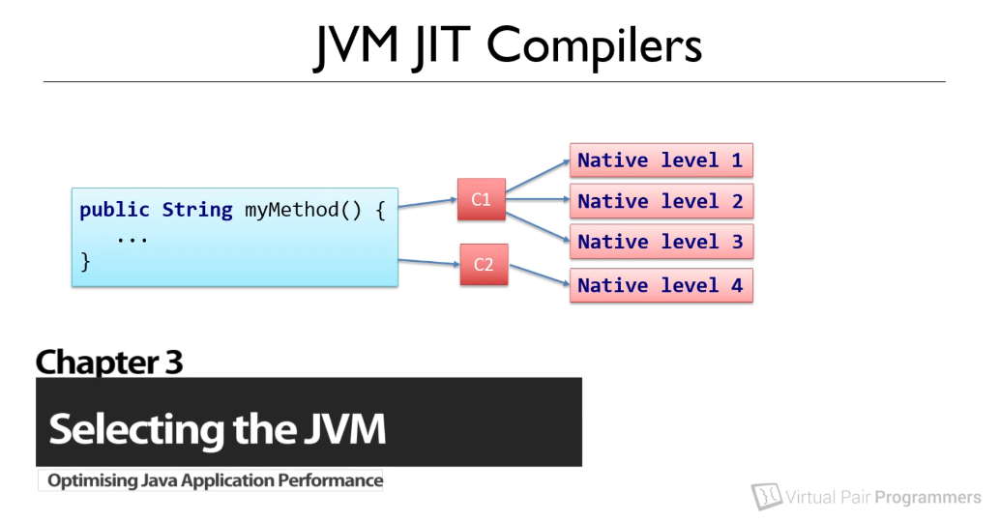
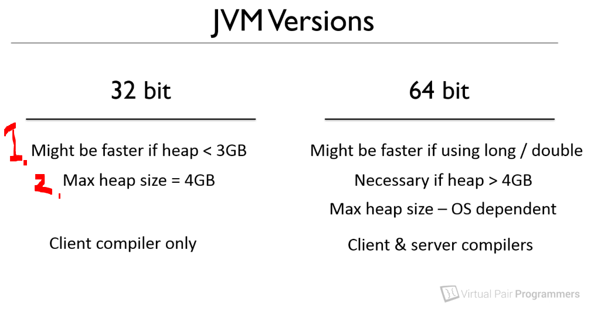

# Chapter 03: Selecting the JVM.

Selecting the JVM.

# What I learned.

# The differences between the 32 bit and 64 bit JVM.

    

- There is more than `c1` and `c2` compiler. This depends on the bit version of the **JVM**. Below we are going trough the process of choosing:

- check this in chatgbt.
- todo this.

    

1. If your heap size is **< 3GB**, It's generally faster to use 32bit of the **JVM** version.
    - This comes from the fact that the **pointers** in this environment, are much smaller than the in the **64 bit** versions.
2. The **32 bit** version of the **JVM**, the **max heap size** must not exceed of the **< 4GB**!
# Specifying which compiler to use at runtime.

# Turning off tiered compilation.

# Tuning native compilation within the Virtual Machine.
