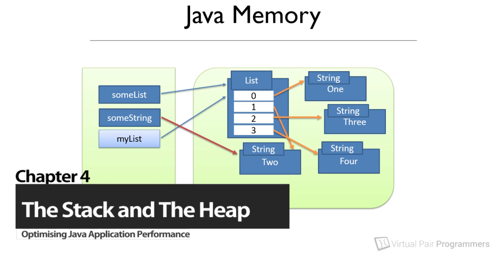
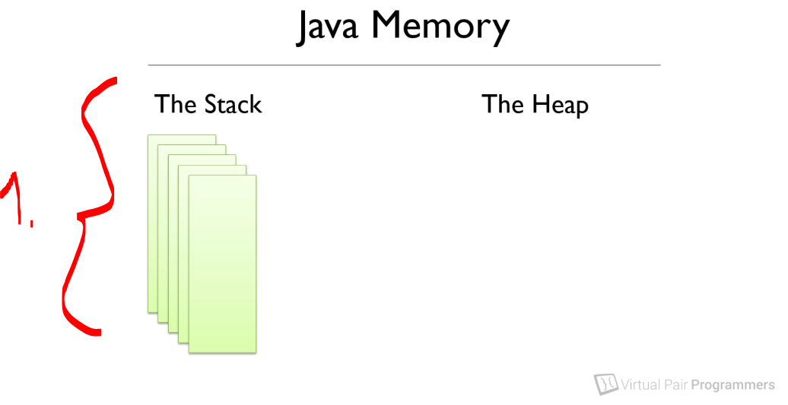
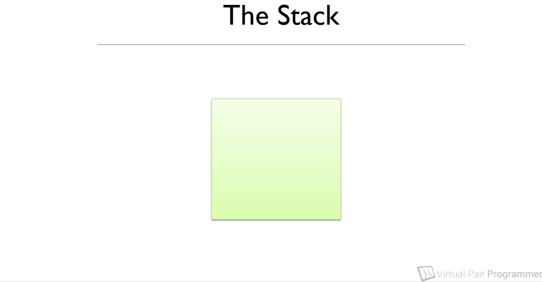
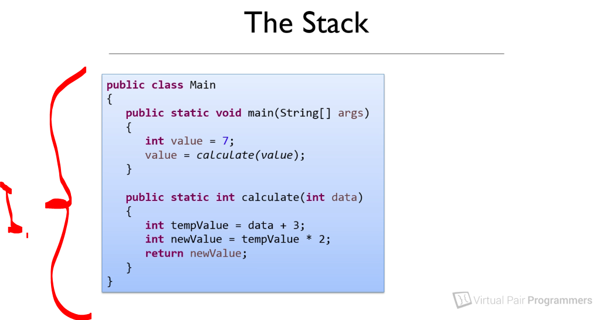

# Chapter 04: How memory works: the stack and the heap.

How memory works - the stack and the heap.

# What I learned.

# Introduction - the structure of Java's memory.

<div align="center">
    
</div>

- Knowing the **garbage collection** is important for performance!
    - Before that, we need to get good understanding of how **Java** memory works.

- We can make choices to **programmatically** to minimize need of garbage collection!

- This will be simplified image of **JVM** memory system. Its more complex!

# How the stack works.

<div align="center">
    
</div>

1. The Stack:
    -  This is very **every efficient** data structure!
    - Every thread has it own **stack**.
    - Stack is managed by **JVM**.
    - In general **JVM** knows when to get rid of data from the **Stack**.

# How the heap works.

<div align="center">
    
</div>

1. When ever data is pushed into the stack, It's pushed into the **top** of the stack!
2. New data is added, the older data is pushed down to the stack.
3. When data is retrieved, it retrieved from the **top** of the stack.

> [!TIP]
> This called **FILO**, **F**irst **I**n **F**irst **O**ut.

- Let's check how the **stack** works in example:

<div align="center">
    
</div>

1. We will be considering this case, only with **primitives**. Example the `int` not the `Integer`.

````Java
Add example here
````

<div align="center">
    
</div>

1. Application starts at the Main method. `args` is pushed firstly to stack!
2. Next the `value` is pushed to the **stack** and `args` is pushed down!

# The heap and the stack together - an example.