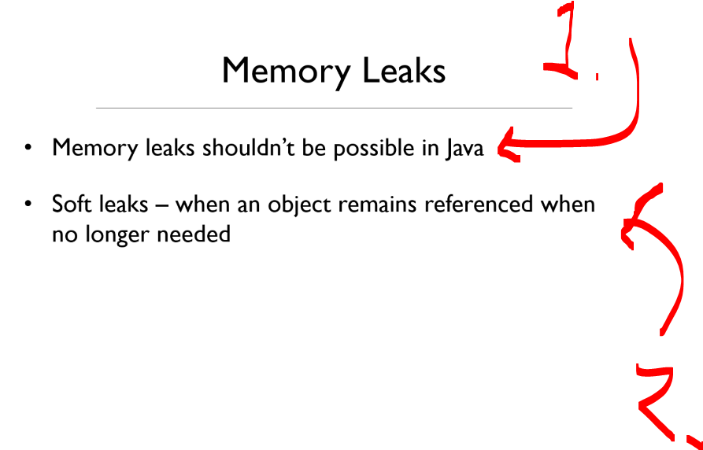
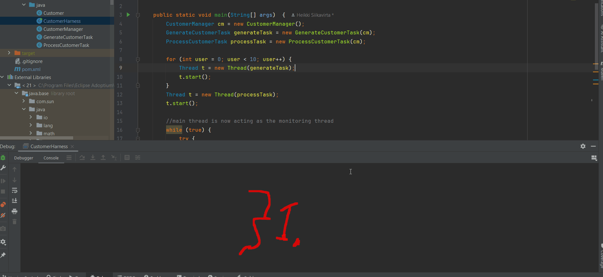
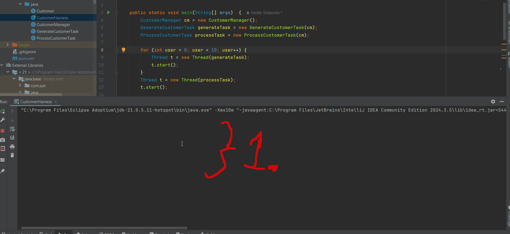
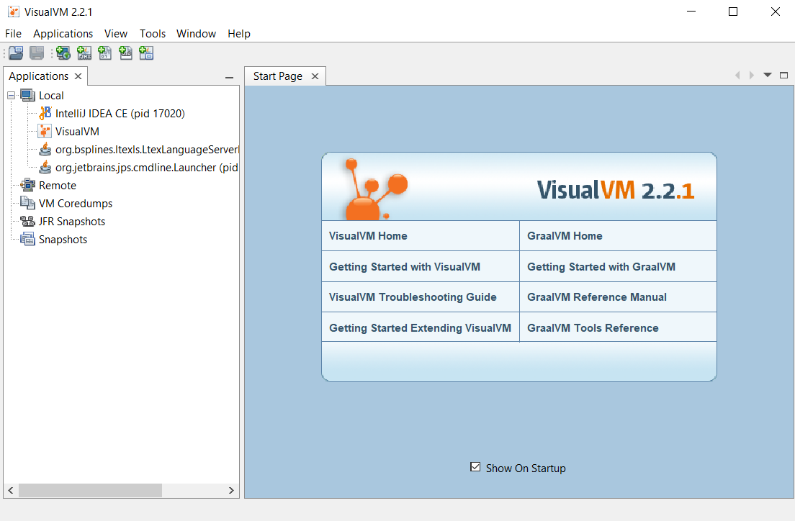

# Chapter 12 - Monitoring the Heap.

Monitoring the Heap.

# What I learned.

# What is a soft leak?

- We will be visualizing how the **JVM** is reserving the memory!

<div align="center">
    
</div>

1. The memory leaks should **not be** possible:
    - Java has **G**arbage **C**ollection (**GC**), which automatically removes objects from memory when they are no longer being used!

 2. **Soft leaks** – when an object remains referenced when no longer needed:
    - A soft leak (often just called a memory leak in Java) happens when objects are **still referenced somewhere**, even though your program **no longer needs them**.
        - This can be **problematic** in **long-running** applications!
            - Since the object is still referenced, it remains in the **Java Heap**, so the Garbage Collector cannot remove it and the memory stays reserved.


- We will be looking the following project where is the **leak happening**! Next we will explore the components.

- The `Customer.java` POJO:

````Java
public class Customer {

	private int id;
	private String name;
	
	public void setId(int id) {
		this.id = id;
	}
	
	public String toString() {
		return id + " : " + name;
	}
	
	public Customer(String name) {
		super();
		this.name = name;
	}
	
}
````

- The `CustomerManager.java`:
    - `CustomerManager.java` will be acting as **queue** for the customers. There will be **adding** and **removing**!
    - For adding the customer to the list `public  void addCustomer(Customer customer)`.
    - For getting the customer `public Optional<Customer> getNextCustomer()` and same time **removing** customer from the list.

````Java
import java.util.ArrayList;
import java.util.Date;
import java.util.List;
import java.util.Optional;


public class CustomerManager {

	private List<Customer> customers = new ArrayList<Customer>();
	private int nextAvalailbleId = 0;
	private int lastProcessedId = -1;

	public  void addCustomer(Customer customer) {
		synchronized (this) {
			customer.setId(nextAvalailbleId);
			synchronized(customers) {
				customers.add(customer);
			}
			nextAvalailbleId++;
		}
	}

	public Optional<Customer> getNextCustomer() {

				if (lastProcessedId + 1 > nextAvalailbleId) {
					lastProcessedId++;
					return Optional.of(customers.get(lastProcessedId));
				}
				return Optional.empty();
	}	

	public void howManyCustomers() {
		int size = 0;
		size = customers.size();
		System.out.println("" + new Date() + " Customers in queue : " + size + " of " + nextAvalailbleId);
	}

}
````

- The `GenerateCustomerTask.java`:
    - Since this is **multithreading** application The `GenerateCustomerTask.java` is making the as the `Runanble`. This is for **adding** the **customers** to the list:

````Java
import java.util.UUID;

public class GenerateCustomerTask implements Runnable {

	private CustomerManager cm;

	public GenerateCustomerTask(CustomerManager cm) {
		this.cm = cm;
	}

	@Override
	public void run() {
		while (true) 
		{
			try {
				//This is just to slow things down so we can see what's going on!
				Thread.sleep(2);
			} catch (InterruptedException e) {
			}
			String name = UUID.randomUUID().toString();
			Customer c = new Customer(name);
			cm.addCustomer(c);
		}
	}
}
````

- The `ProcessCustomerTask.java`:
    - Since this is **multithreading** application The `ProcessCustomerTask.java` is making the as the `Runanble`. This is for **removing** the **customers** to the list:

````Java
import java.util.Optional;
import java.util.UUID;

public class ProcessCustomerTask implements Runnable {
	
private CustomerManager cm;
	
	public ProcessCustomerTask(CustomerManager cm) {
		this.cm = cm;
	}
	
	@Override
	public void run() {
		while (true) {		

			Optional<Customer> customer = cm.getNextCustomer();
			if (customer.isEmpty()) {
				//no customers in queue so pause for half a second
				try {
					Thread.sleep((50));
				} catch (InterruptedException e) {
					e.printStackTrace();
				}
			}
			else {
				//Processing takes place here
			}
		}
	}
}
````

- The `CustomerHarness.java`:
    - We will be having the **main class** for executing **10** different **threads** `CustomerHarness.java`:

````Java
public class CustomerHarness {
	
	public static void main(String[] args)  {
		CustomerManager cm = new CustomerManager();
		GenerateCustomerTask generateTask = new GenerateCustomerTask(cm);
		ProcessCustomerTask processTask = new ProcessCustomerTask(cm);
		
		for (int user = 0; user < 10; user++) {
			Thread t = new Thread(generateTask);
			t.start();
		}
		Thread t = new Thread(processTask);
		t.start();
		
		//main thread is now acting as the monitoring thread
		while (true) {
			try {
				Thread.sleep(5000);
			} catch (InterruptedException e) {
				// TODO Auto-generated catch block
				e.printStackTrace();
			}
			cm.howManyCustomers();
			System.out.println("Available memory: " + Runtime.getRuntime().freeMemory() / 1024 + "k");
		}
	}
}
````

- Experimenting leaky **Java app**:

<div align="center">
    
</div>

1. One can see there is **ups** and **downs** in memory usage!

> [!TIP]
>`-Xmx10m` = *“Allow the Java program to use at most 10 MB of heap memory.”*

- Let's restrict the **memory usage** and try again:

<div align="center">
    
</div>

1. One can see the out of memory expection! The error below:

````Bash
Tue May 12 01:16:11 EEST 2026 Customers in queue : 16173 of 16353
Available memory: 5868k
Tue May 12 01:16:16 EEST 2026 Customers in queue : 33803 of 33805
Available memory: 3478k
Tue May 12 01:16:21 EEST 2026 Customers in queue : 51037 of 51040
Available memory: 2272k
Tue May 12 01:16:26 EEST 2026 Customers in queue : 67190 of 67197
Available memory: 826k
Exception: java.lang.OutOfMemoryError thrown from the UncaughtExceptionHandler in thread "Thread-2"
Exception: java.lang.OutOfMemoryError thrown from the UncaughtExceptionHandler in thread "Thread-5"
Exception: java.lang.OutOfMemoryError thrown from the UncaughtExceptionHandler in thread "Thread-8"
Exception: java.lang.OutOfMemoryError thrown from the UncaughtExceptionHandler in thread "Thread-9"
Exception: java.lang.OutOfMemoryError thrown from the UncaughtExceptionHandler in thread "Thread-4"
Exception: java.lang.OutOfMemoryError thrown from the UncaughtExceptionHandler in thread "Thread-7"
Exception: java.lang.OutOfMemoryError thrown from the UncaughtExceptionHandler in thread "Thread-3"
Exception: java.lang.OutOfMemoryError thrown from the UncaughtExceptionHandler in thread "Thread-6"
Exception: java.lang.OutOfMemoryError thrown from the UncaughtExceptionHandler in thread "Thread-0"
Exception: java.lang.OutOfMemoryError thrown from the UncaughtExceptionHandler in thread "Thread-1"
Exception: java.lang.OutOfMemoryError thrown from the UncaughtExceptionHandler in thread "main"
````

# Introducing (J)VisualVM.

- Let's find out, why this is out of memory!

- Official site to [download](https://visualvm.github.io/?utm_source=chatgpt.com)!
    - Example below of the **VisualVM**!
<div align="center">
    
</div>


# Monitoring the size of the heap over time.

# Fixing the problem and checking the heap size.