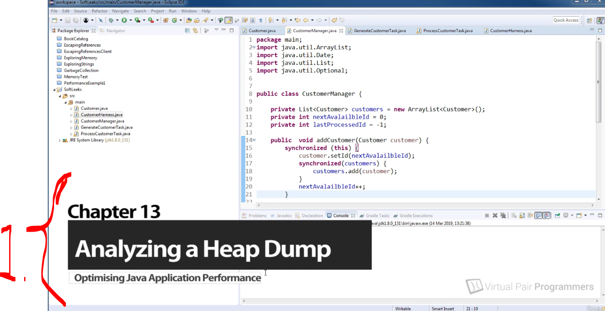
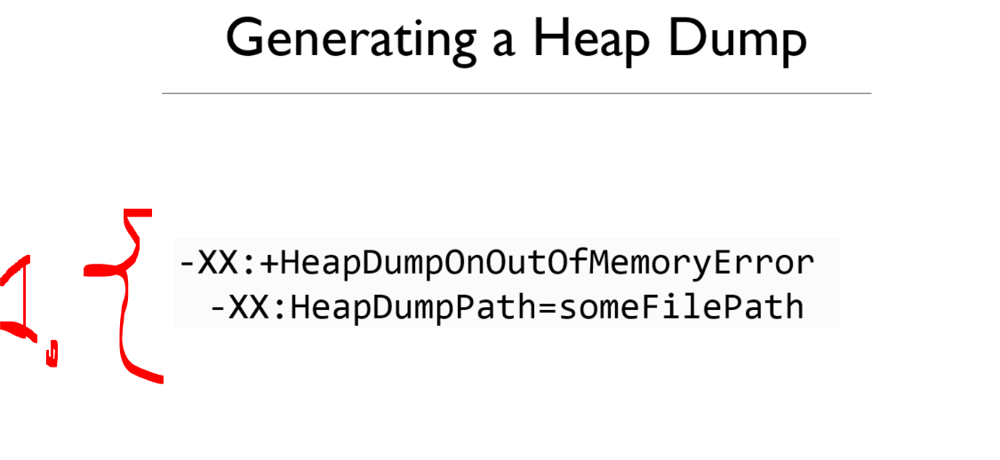
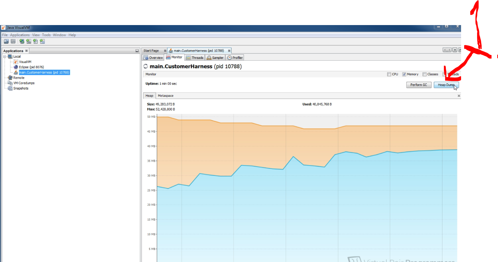
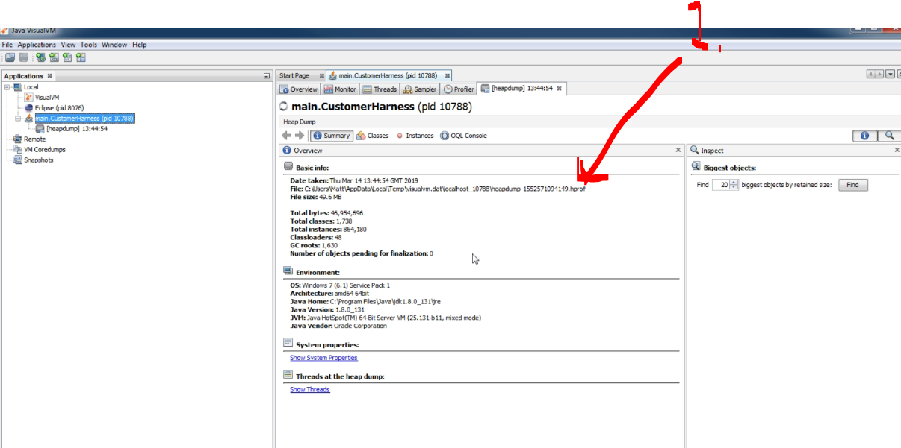
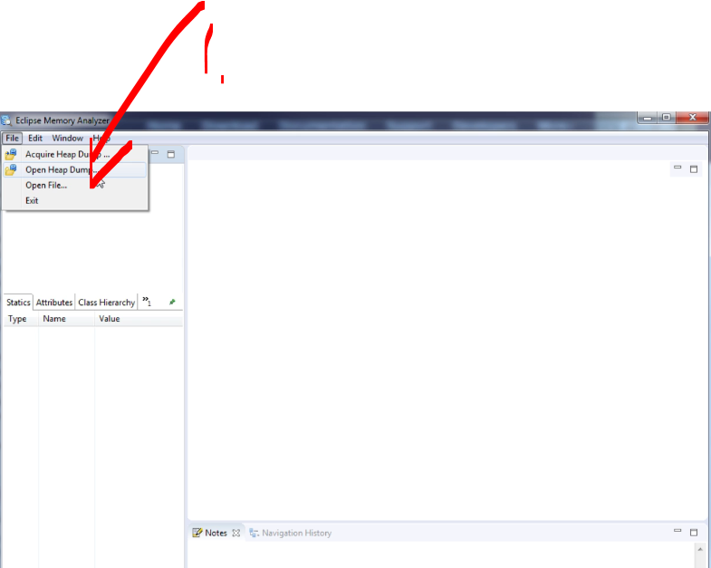
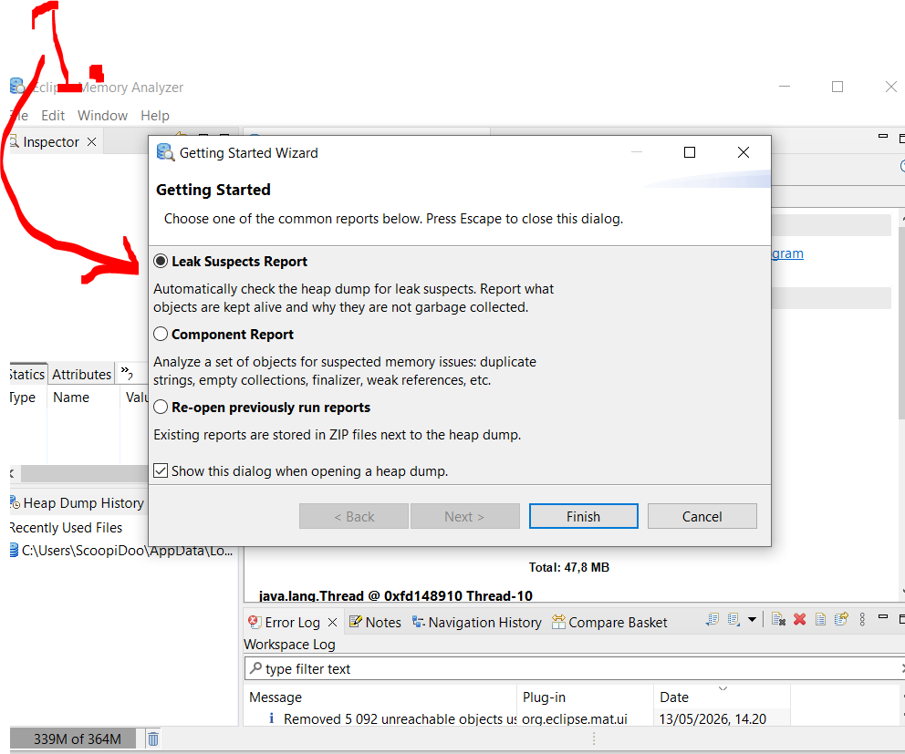
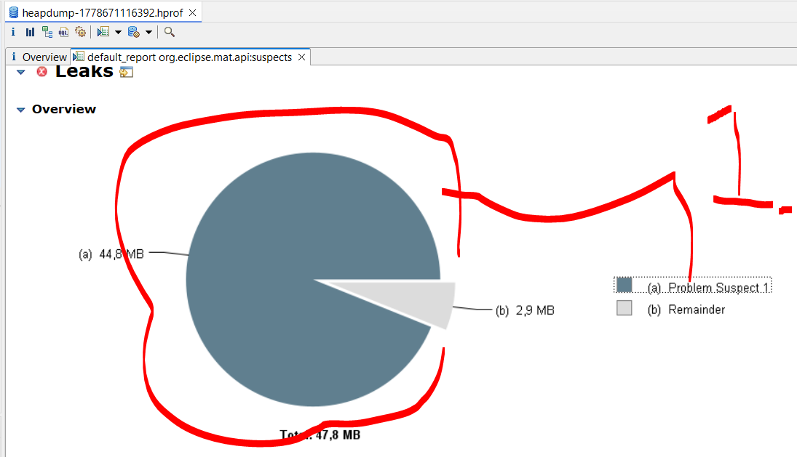
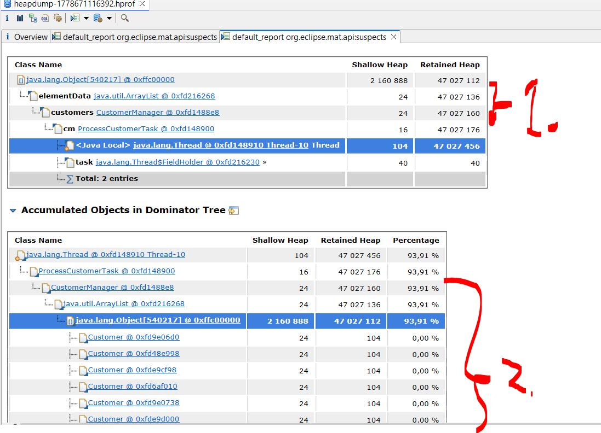

# Chapter 13 - Analyzing a heap dump.

Analyzing a heap dump.

# What I learned.

# Generating a heap dump.

<div align="center">
    
</div>

1. We will be analyzing the application with different tools!

- We can **extract** the **Heap Dump** either **VisualVM** or in production environment with following command:

<div align="center">
    
</div>

1. Startup headers:
	`-XX:+HeapDumpOnOutOfMemoryError`
	`-XX:HeapDumpPath=someFilePath`

- Next we will be making the memory overloading and then making the **Heap Dump**! 

<div align="center">
    
</div>

1. **Heap Dump** can be used for heap dumps.

<div align="center">
    
</div>

1. Location of the **Heap Dump**.

# Viewing a heap dump.

- We can analyze the **heap dump**, with the **MAT**.
    - [MAT homage](https://eclipse.dev/mat/).

<div align="center">
    
</div>

1. We can open the heap dump file, form the **MAT**!

<div align="center">
    
</div>

1. We are interested in **Leak Suspects**!

<div align="center">
    
</div>

1. We can see the **one** problem took **44 MB** of memory in JVM!

<div align="center">
    
</div>

1. We can see the `47 027 456` is reserved for the following structures:
    - There is `CustomerManager`, which is having `ArrayList`!
2. Another view:
    - `ArrayList` is having multiple `Customers`!

- So we can see that there are multiple **customers** in `ArryList`. 

<details>

<summary id="Memory_Leak_Not_Fixed" open="true"> <b>Memory leak not fixed. CustomerManager!</b> </summary>


````Java
import java.util.ArrayList;
import java.util.Date;
import java.util.List;
import java.util.Optional;


public class CustomerManager {

	private List<Customer> customers = new ArrayList<Customer>();
	private int nextAvalailbleId = 0;
	private int lastProcessedId = -1;
	
	public  void addCustomer(Customer customer) {
		synchronized (this) {
			customer.setId(nextAvalailbleId);
			synchronized(customers) {
				customers.add(customer);
			}
			nextAvalailbleId++;
		}
	}

	public Optional<Customer> getNextCustomer() {

		if (lastProcessedId + 1 > nextAvalailbleId) {
			lastProcessedId++;
			return Optional.of(customers.get(lastProcessedId));
		}
		return Optional.empty();
	}

	public void howManyCustomers() {
		int size = 0;
		size = customers.size();
		System.out.println("" + new Date() + " Customers in queue : " + size + " of " + nextAvalailbleId);
	}
}
````
</details>


