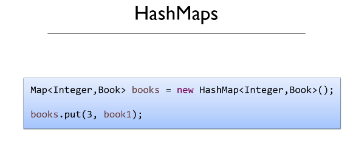

## Section 21: Chapter 21 - How Maps Work.

Section 21: Chapter 21 - How Maps Work

# What I learned.

# 109. The role of the Hashcode.

- **Hash Code**, will be connected to `HashCode`.

- `MAP` each **Key** is pointing to the **Value**.
    - These are **Unique**.

- In **HashMap** retrieving value with the **Key**, will be irrelevant regardless of the **Size** of the **HashMap**
    - Example of `retrieving value with the key`:
        - **HashMap** size of **10** items.
        - **HashMap** size of **10** items.
    - Will be the **SAME!**.

1. Will represents of the **Book**.
2. The `id` will be `key`. This could be any Object, not just **Integer**.
3. We will be having **16** books in the `HashMap`.
4. `Value` will be **Book** Object.

- When accessing the `HashMap` **Java** takes the **Key** and convert into the **Integer** value.
    - If we are using **Integer** for keys, that **fine**.
        - With **String** or **other type**, this needs to be **converted** to **Integer**. 
5. Java will do **Calculation** with the **Integer**. Calculation:
    - **Modulus** of the **key** number and with **size** of the **HashMap**.
        - This **example** will be `12`.
            - This means, this will be stored in **bucket** number `12`.

# 109. The role of the Hashcode.

- Every **Java Object** has the `hashCode()`.

1. Now the **Key** will be **String**.
    - In this case this we want to the **Integer** representation of the **String**. Now we can just call the **Strings** `hashCode()`.
2. Printing the `Objects` `hashCode`, with `System.out.println("Litle Woman".hashCode());`
3. `HashCode` of this Object is. In this case its **String**. 
4. Bucket number `4` is chosen for the `Little Women`.

# 110. How Hashmaps Work - part 2.

