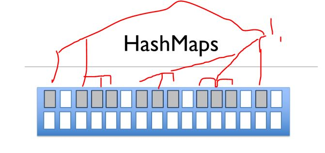
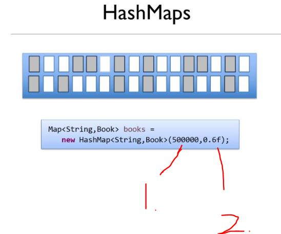
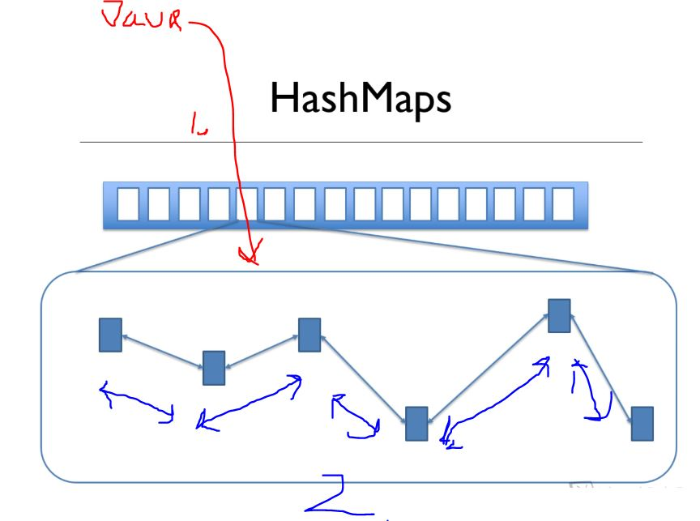

# Section 21: Chapter 21 - How Maps Work.

Section 21: Chapter 21 - How Maps Work.

# What I learned.

# How Hashmaps Work - part 1.

<div align="center">
	
</div>

- **HashMap**, will be working internally with `HashCode`.

- `MAP` each **Key** is pointing to the **Value**.
    - These are **Unique**.

- In **HashMap** retrieving value with the **Key**, will be irrelevant regardless of the **Size** of the **HashMap**
    - Example of `retrieving value with the key`:
        - **HashMap** size of **10** items.
        - **HashMap** size of **100** items.
    - Retrieving time will be the **SAME!**.

<div align="center">
	
</div>


1. Will represents of the **Book**.
2. The `id` will be `key`. This could be any Object, not just **Integer**.
3. We will be having **16** books in the `HashMap`.
4. `Value` will be **Book** Object.

- When accessing the `HashMap` **Java** takes the **Key** and convert into the **Integer** value.
    - If we are using **Integer** for keys, that **fine**.
        - With **String** or **other type**, this needs to be **converted** to **Integer**. 
5. Java will do **Calculation** with the **Integer**. Calculation:
    - **Modulus** of the **key** number and with **Size** of a **HashMap**.
        - ❌ Not the size of the **internal array** ❌.
        - This **example** will be `12`.
            - This means, this will be stored in **bucket** number `12`.

- Remember **HashMap** is having **Internal Array Size** and the **Bucket Size**.
    - This internal size of is handled by **Java** and the size of the **HashMap** can be accessed by `map.size()`.
    - [Some place to check the HashMap](https://en.wikipedia.org/wiki/Hash_table).

# The role of the Hashcode.

- Every **Java Object** has the `hashCode()`.

<div align="center">
	
</div>


1. Now the **Key** will be **String**.
    - In this case this we want to the **Integer** representation of the **String**. Now we can just call the **Strings** `hashCode()`.
2. Printing the `Objects` `hashCode`, with `System.out.println("Litle Woman".hashCode());`
3. `HashCode` of this Object is. In this case its **String**. 
4. Bucket number `4` is chosen for the `Little Women`.

# How Hashmaps Work - part 2.

<div align="center">
	
</div>

1. There is **chance** that all **Objects** will be stored inside bucket **4**. Even thought, the **hash codes** are different, the operation yield same **bucket**.
    - So there can be multiple **objects** inside one bucket!

<div align="center">
	
</div>

1. Bucket contains **Linked List** of objects (Not the Java **Linked List**, but similar).

- Hash has concept called **Load Factor**.
    - Default load factor is **75%** of the capacity.

- [Example of Load Factor](https://www.baeldung.com/java-hashmap-load-factor).
> The **Load factor** is the measure that decides when to increase the capacity of the Map. The default load factor is **75%** of the capacity.

<div align="center">
	
</div>

1. If the **HashMap** have occupied 75% of the size, it is reconsidered to be **full!**.

<div align="center">
	
</div>

1. This will **HashMap** will grow **double** its size.
    - For perspective **ArrayList** will grow **half of the column size**. 

2. When **HashMap** grows, the positions **need** to be **re-evaluated**.
    - This means, the **modulus** gives different answer, since `size` is now **double**.

# Specifying the initial size and factor of a HashMap.

<div align="center">
	
</div>

1. How big it is from begging.
    - **Size** of array is always power of **two**, so size of array will be `2^19 = 524288`. So array of is at least `500000`, in this case it will be `524288`!
2. Load Factor, how full it's should get, until it resizes.

<div align="center">
	
</div>

1. We can see the `load factor` in **debug** mode.

- In general, getting and setting stuff to `HashMap` pretty fast! 

> **HashMap** stores and retrieves entries in constant time **O(1)**.
- Test program for `1000 000` of items.

```
package hashMapExample;

import java.util.Date;
import java.util.HashMap;
import java.util.Map;

public class Main {


	    public static void main(String[] args) {

	        Date start = new Date();

	        Map<Integer, Book> books = new HashMap<Integer, Book>();
	        for (int i = 0; i < 1000000; i++) {
	            books.put(i, new Book(i, "Jane Eyre", "Charlotte Bronte", 14.99));
	        }


	        Date end = new Date();
	        System.out.println("Elapsed time was " + (end.getTime() - start.getTime()) + " ms.");
	    }
	}


```

- For me this took `Elapsed time was 707 ms.`

- We experiment the same with **initial size** with **500000**, this reduces need for **re-sizing**.
    - Example below:

```

package hashMapExample;

import java.util.Date;
import java.util.HashMap;
import java.util.Map;

public class Main {


	    public static void main(String[] args) {

	        Date start = new Date();

	        Map<Integer, Book> books = new HashMap<Integer, Book>(500000);
	        for (int i = 0; i < 1000000; i++) {
	            books.put(i, new Book(i, "Jane Eyre", "Charlotte Bronte", 14.99));
	        }


	        Date end = new Date();
	        System.out.println("Elapsed time was " + (end.getTime() - start.getTime()) + " ms.");
	    }
	}


```

- This time it took `Elapsed time was 515 ms.`.

- Let's try inputting **Load factor** to `0.9f`.
    - Example code below:

```
package hashMapExample;

import java.util.Date;
import java.util.HashMap;
import java.util.Map;

public class Main {


	    public static void main(String[] args) {

	        Date start = new Date();

	        Map<Integer, Book> books = new HashMap<Integer, Book>(500000, 0.9f);
	        for (int i = 0; i < 1000000; i++) {
	            books.put(i, new Book(i, "Jane Eyre", "Charlotte Bronte", 14.99));
	        }


	        Date end = new Date();
	        System.out.println("Elapsed time was " + (end.getTime() - start.getTime()) + " ms.");
	    }
	}


```

- This time it took `Elapsed time was 507 ms.`.

> [!IMPORTANT]
> To find the best portion for performance, one can experiment with **Initial Size** and the **Load Factor**.

- Don't put too big number for **HashMap**. It will take too much **memory** and, one would never use the full size of **HashMap**.

# HashMap Performance.

- **Case:** we want to `retrieve` Book from its `key`.

<div align="center">
	
</div>

1. **Java** wants to calculate `hashCode` for that **key**. Take **modulus** of that **key** with **size** of **underlying array**.
Find entry in the array, at that point.

2. Then its needs to **navigate** thought the **LinkedList** for the item with the **matching** key!

> [!TIP]
> 💡 Map small, Large **Linked List**?
> Map large, Small **Linked List**? 💡

- Big question is for the **performance**, should this be:
    - Map with **Small array**, and Large amount of items in **Linked List**.
    - Map with **Big array** with a less item in the **Linked List**. 


> [!CAUTION]
> TODO, return here when get clarify for size operation!

- Large is faster to navigate inside **array** or inside the **Linked List**.

- TODO do this later.

# The rules for Hashcodes.

- All this works fine, when the `Objects` or `Strings` has their own **hash codes**. 

<div align="center">
	
</div>


