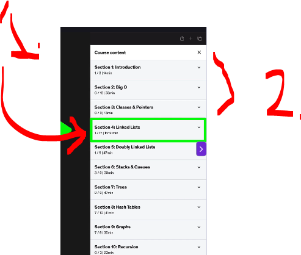
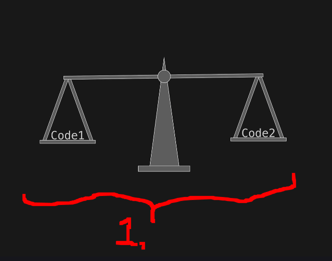
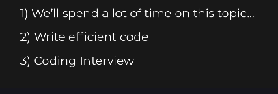
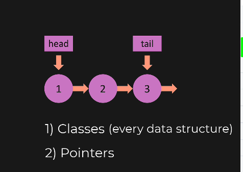

# Chapter 01 - Introduction.

Introduction.

# What I learned.

# Overview (Please Watch).

    

1. Overview. How to get best out this course!

    

1. You could start right to the coding!
2. One should do this before, very important!

    

1. We can use **Big O** to compare, which code is better?

- We can apply **Big O**, as following:
    - Should you store data in:
        - In **double linked list** or **single linked list**?

- Big O is language to specify speed of code!

- Other Reason:

    

- What are Classes and Pointers.

    

- Soon as one does the video, then **do** the exercise!

# Code Editor.

- Do the exercises!
