# Chapter 02: Big O.

Big O.

# What I learned.

# Big O: Intro.

<div align="center">
    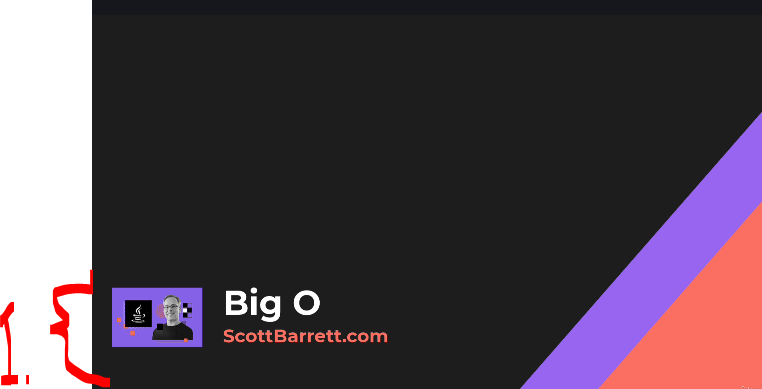
</div>

1. What is Big O? We will answer this question.

<div align="center">
    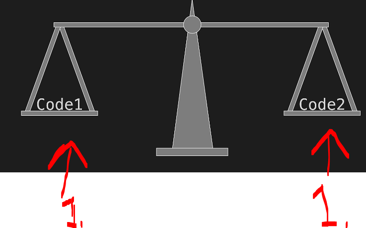
</div>

1. Both have the same **code**, but the implementation is different.
    - Which ones better?
        - **BIG O** comes to help this!

- **Big O** is how compare two codes mathematically!

<div align="center">
    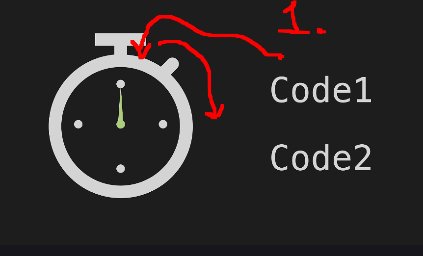
</div>

1. Code 1 runs 15 secs!
2. Code 2 runs 60 secs!

- This is **Time Complexity**.
    - This is not measured in time!
        - If there is some **CPU** better, code will run faster!
    - That's why, it's measured in time per operation!

- **Space Complexity** is how much memory it consumes, here example of those **two** algorithms. The first here:

<div align="center">
    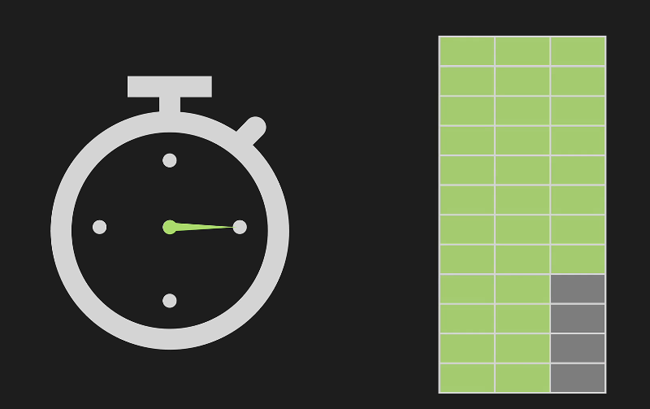
</div>

- The second:

<div align="center">
    
</div>

# Big O: Worst Case.

<div align="center">
    
</div>

1.  We will be coming thought the **Time Complexity** for this project!
2. We usually illustrate this, with the three letters:
    - **Omega**.
    - **Theta**.
    - **Omegran** or **O**.

<div align="center">
    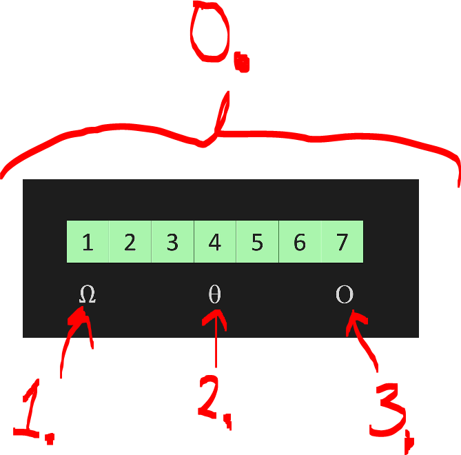
</div>

0. Represents **array**, which we are looking when we are looping in for loop!
1. Best-case! **Omega** Ω.
2. Average-case! θ.
3. Worst-case! **Big O**.
    - Technically big **O** is the worst case!

# Big O: O(n).

<div align="center">
    
</div>

1. `O(n)` it might be the easiest to get head around!

- Code that we are going to analyze:

````Java
public static void printItems(int n) {
    for (int i = 0; i < n; i++) {
        System.out.println(i);
    }
}
````

- Running the code:

````Java
import datastructures.hashtable.HashTable;
import misc.big_o.BigO;

public class Main {

    public static void main(String[] args) {
        BigO.printItems(10);
    }
}
````

- We are running the code:

<div align="center">
    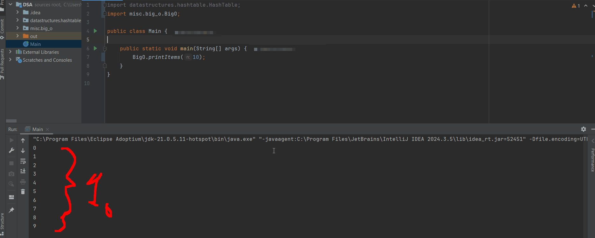
</div>

1. We get 10 **items** from **n** times.

- Analysis of the code, as in below:

<div align="center">
    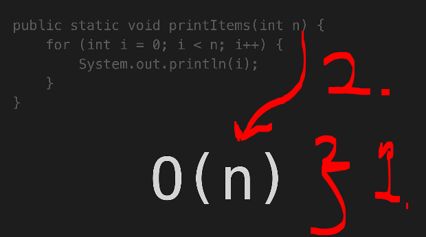
</div>

1. This code is `O(n)`. It is `O(n)` since we passed **n=10** and it printed **10 times**!  
2. The number of times it will be **iterated** from the **argument**!

<div align="center">
    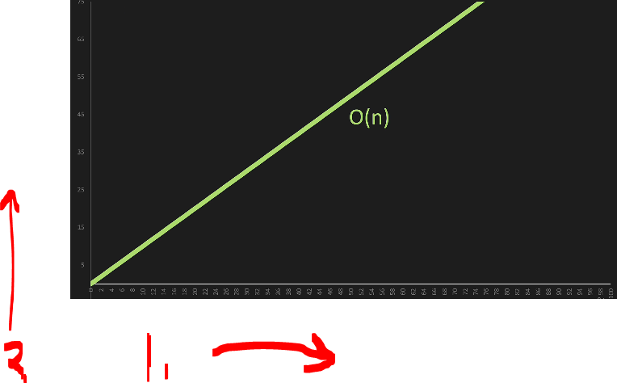
</div>

1. `n` passed to function!
2. Number of operations!

- As you can see this is proportional!

> [!IMPORTANT]  
> we can see that this is `O(n)` **Linear Time**

# Coding Exercise 01 ↔ Big O: O(n).

<details>
<summary id="coding_exercise_01_big" open="true"> <b>Coding Exercise 01: Big O: O(n)!</b> </summary>

<div align="center">
    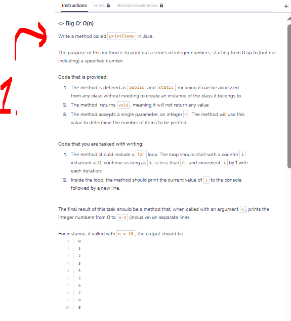
</div>
 
````Java
public class Main {
    public static void printItems(int n) {
        // WRITE THE FOR LOOP TO COMPLETE PRINTITEMS HERE //
        //                                                //
        //                                                //
        ////////////////////////////////////////////////////
    }
    // DO NOT CHANGE THE MAIN METHOD BELOW
    public static void main(String[] args) {
        printItems(10);
    }
}
````

1. **Task 01:** Write a method called `printItems` in Java.
	- **Answer:** Below:

````Java
public class Main {
    public static void printItems(int n) {
        for (int i = 0; i < n; i++) {
            System.out.println(i);
        }
    }
    // DO NOT CHANGE THE MAIN METHOD BELOW
    public static void main(String[] args) {
        printItems(10);
    }
}
````
</details>

# Big O: Drop Constants.

<div align="center">
    
</div>

1. We are experimenting of dropping the **constants**!

- Code that we are going to analyze:

````Java
public static void printItems(int n) {
    for (int i = 0; i < n; i++) {
        System.out.println(i);
    }

    for (int j = 0; j < n; j++) {
        System.out.println(j);
    }
}
````

- Running the code:

````Java
import misc.big_o.BigO_Second;

public class Main {
    public static void main(String[] args) {
        BigO_Second.printItems(10);
    }
}
````

- We are running the code:

<div align="center">
    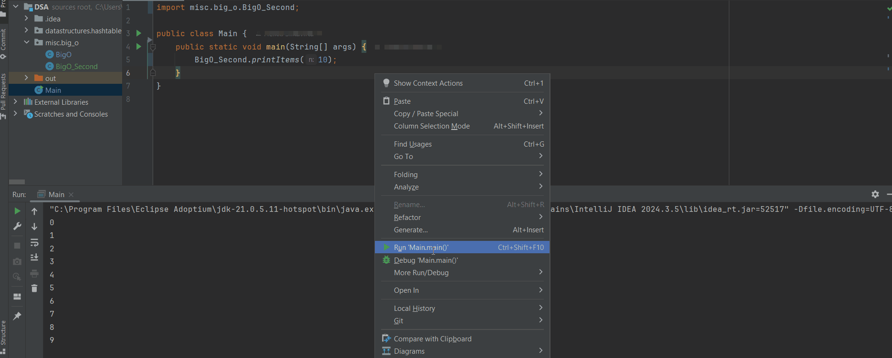
</div>

1. We can see that **10** items have replayed **two times**! That's like `n+n`!

<div align="center">
    
</div>

1. We had `n + n` operations. We passed **10** + **10** items we got **20** times.
2. It becomes `2n`, **two** times `n`.  
3. We could think of this `O(2n)`.
4. We **simplify** this `O(n)`. 

> [!NOTE]
> **Rule of simplification**: We always **drop** the **constants**!

# Big O: O(n^2).

<div align="center">
    
</div>

1. We will be exploring the `O(n^2)`.

- Code that we are going to analyze:
    - Here is the two for loops inside each other.

````Java
public static void printItems(int n) {
    for (int i = 0; i < n; i++) {
        for (int j = 0; j < n; j++) {
            System.out.println(i + " " + j);
        }
    }
}
````

- Notice, the **difference** there is **two** `for` loops inside.

- Running the code:

````Java
import misc.big_o.BigO_Second;
import misc.big_o.BigO_Third;

public class Main {
    public static void main(String[] args) {
        BigO_Third.printItems(10);
    }
}
````

- We are running the code:

<div align="center">
    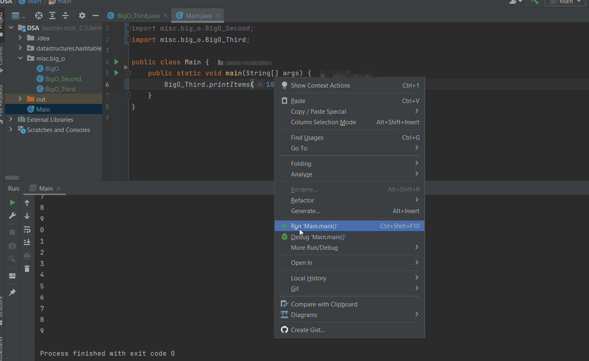
</div>

1. It goes to **99**.

<div align="center">
    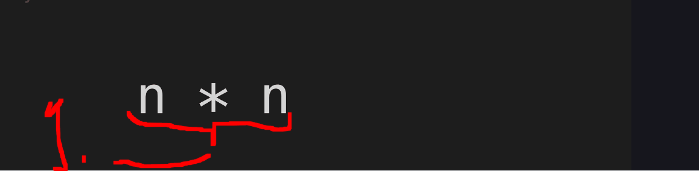
</div>

1. This was run `n * n`.
2. This can be simplified `n^2`.
3. This is `O(n^2)`.

> [!IMPORTANT]  
>  We are calling this as `O(n^2)` **Quadratic Time**!

<div align="center">
    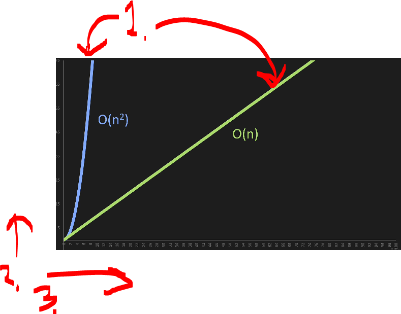
</div>

1. `O(n^2)` is more heavy operation compared to `O(n)`.
    - If there is to write the code to `O(n)`, it is **huge plus**!
2. Number of operations!
3. `n` passed to function!

# Big O: Drop Non-Dominants.

<div align="center">
    
</div>

1. Here we are exploring non-dominant terms!

- Code that we are going to analyze:
    - Here is the two `for` loops inside each other and another `for` next to it.

````Java
public static void printItems(int n) {
    for (int i = 0; i < n; i++) {
        for (int j = 0; j < n; j++) {
            System.out.println(i + " " + j);
        }
    }

    for (int k = 0; k < n; k++) {
        System.out.println(k);
    }
}
````

- We can see this running:

<div align="center">
    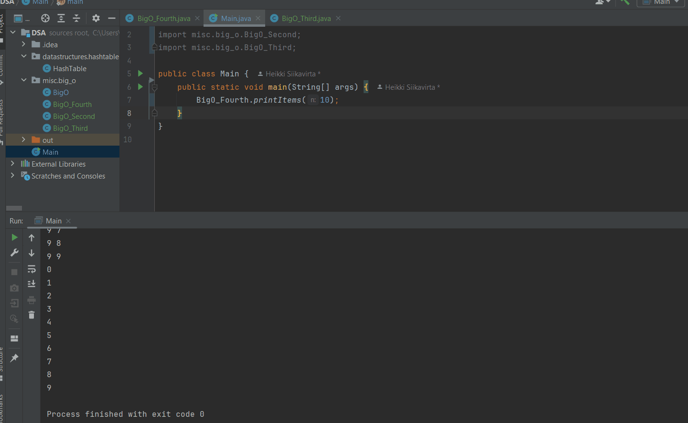
</div>

1. One can see the output!

<div align="center">
    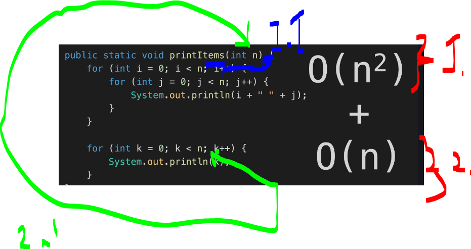
</div>

1. This first part is `O(n^2)`.
    - `1.1` is `n` times since it was **quadratic time**!
2. This second part is `O(n)`.
    - `2.1` is `n` times since it was **linear time**!

<div align="center">
    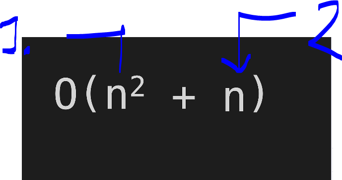
</div>

1. The **worst** case is the `n^2`.
    - This will be chosen for the **worst** case!
2. The **less bad** case is the `n`.

<div align="center">
    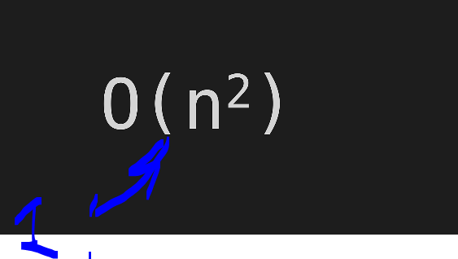
</div>

1. We just drop the `n` and the `O(...)` case will be `n^2`!

> [!NOTE]  
> `O` was the worst case!

# Big O: O(1).

<div align="center">
    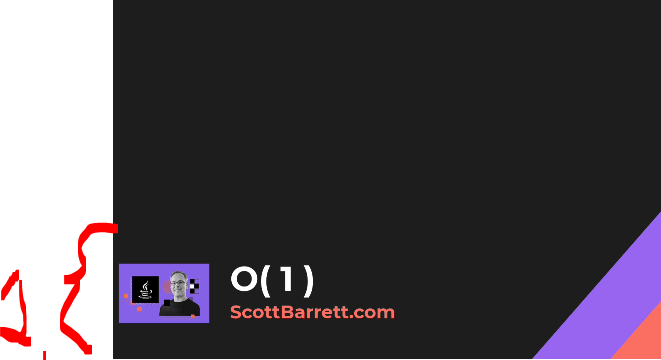
</div>

1. We will be going thought, the **most efficient** 

<div align="center">
    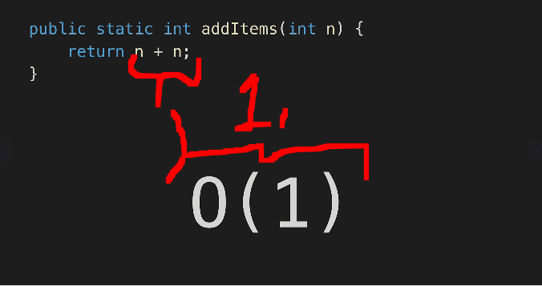
</div>

1. In this example if the `n` **grows** the **operations** execution time status stays at the `O(1)`, since there is one `+` operation!
2. Now if we add **new** `+` **operation** we could say this `O(2)`.
3. We will be simplifying this into the `O(1)`. This is called **Constant Time**
    - If the `n` grows, the number of operation **does not** grow! 

<div align="center">
    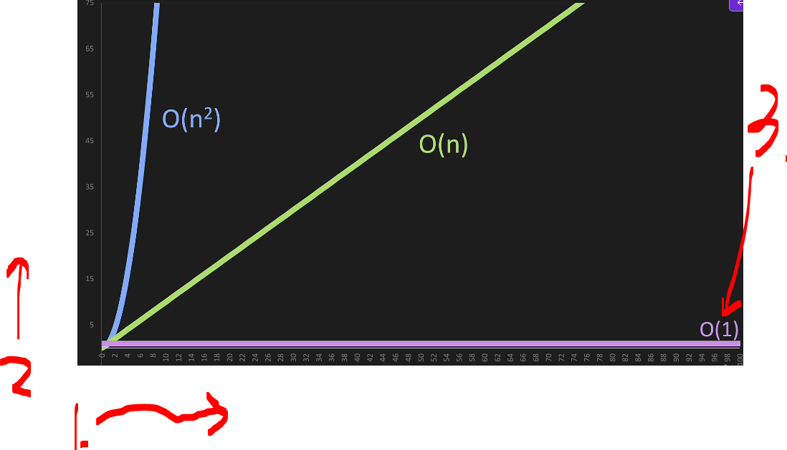
</div>

1. `n` passed to the function! 
2. Number of operation.
3. `O(1)` is most **efficient**!

> [!IMPORTANT]  
>  We are calling this as `O(1)` **Constant Time**!

# Big O: O(log n).

> [!IMPORTANT]  
> In **Logarithmic Form**, we can tell how many times you divide something by `2`!

<div align="center">
    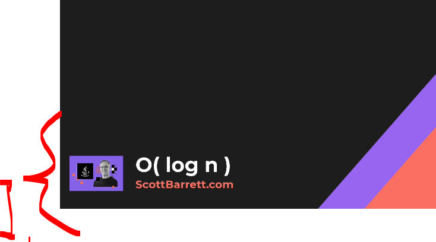
</div>

<div align="center">
    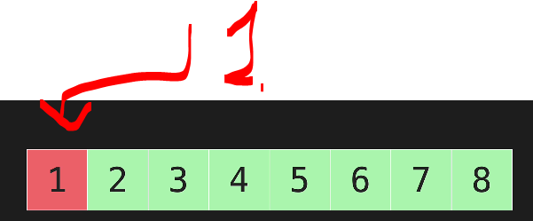
</div>

1. We will be looking at the `O(log n)`. In this example this is **sorted array**!
2. Our task is to find this **number** from this array, what is the **fastest way** to find this?

<div align="center">
    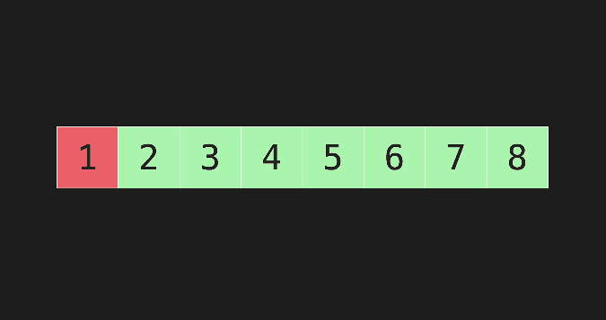
</div>

1. Quickest way is to narrow array and get to `1`? It is, **Cut the array to half**!
2. Then, in which part the `1` is not. Not this one!
3. We do this again!
4. We do this again!

<div align="center">
    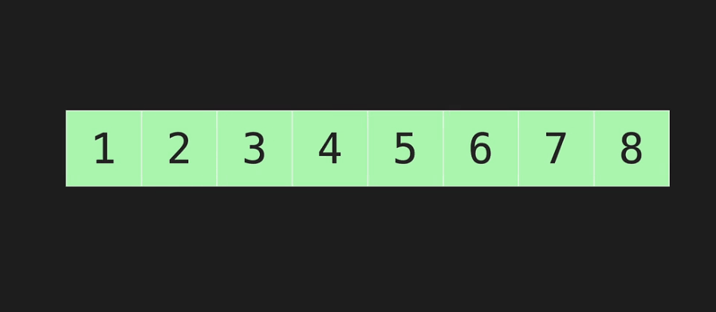
</div>

- We can see that, it takes **3** division to take place to have the number `1`.

- We will be turning this to **Exponential Form**:

<div align="center">
    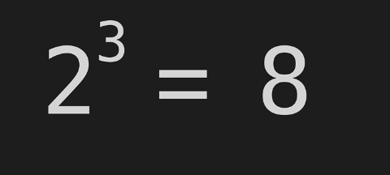
</div>

- We will transfer this to **Logarithmic Format**:

<div align="center">
    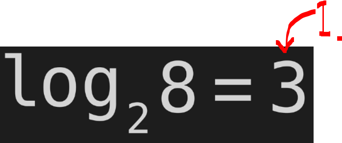
</div>

1. *How many times do we multiply by a number to reach a certain value?*
    - This is **3** times!

<div align="center">
    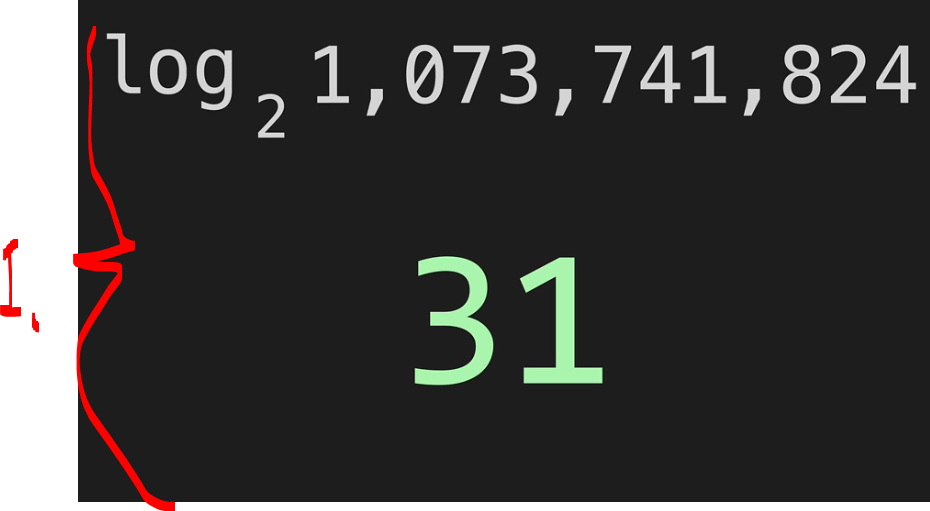
</div>

1. This comes **super useful**, when there is huge number. For this case it is **31**!

<div align="center">
    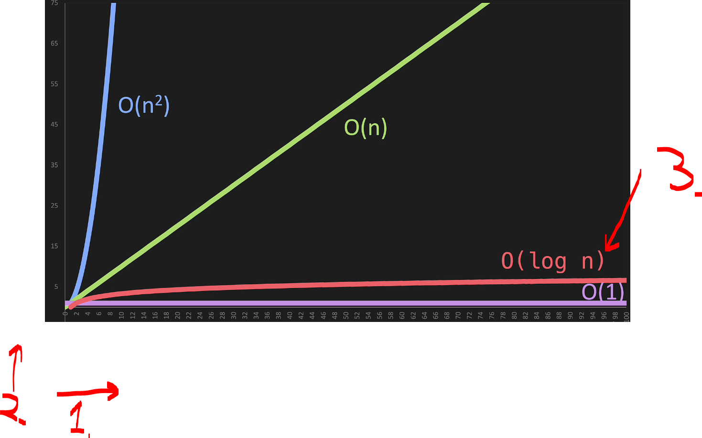
</div>

1. `n` passed to the function!
2. Number of operation.
3. Very flat `O(log n)`, not the best. `O(1)` is still the best!

> [!IMPORTANT]  
>  We are calling this as`O(log n)`**Logarithmic Time**! 

<div align="center">
    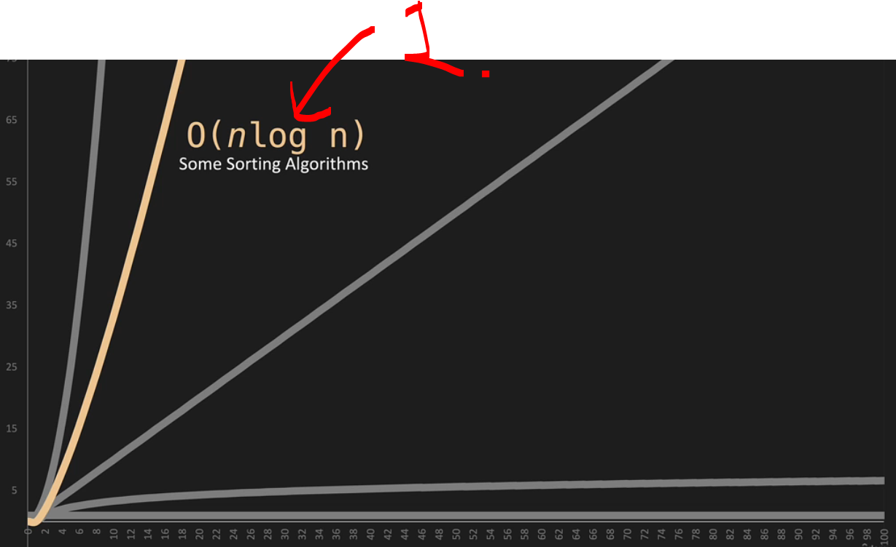
</div>

1. We are using `O(n log n)` usually for the **Sorting**, example **Merge Sort** or example **Heap Sort**!

> [!IMPORTANT]  
>  We are calling this as`O(n log n)` — **Linearithmic Time**! 

# Big O: Different Terms for Input.

> [!IMPORTANT]  
>  This is very common **interview** question! 

<div align="center">
    
</div>

1. We are exploring when we are inputting different **terms**.

- Example code, we will be analyzing!

````Java
package misc.big_o;

public class BigO_Sixth {
        public static void printItems(int a, int b) {
            for (int i = 0; i < a; i++) {
                System.out.println(i);
            }

            for (int j = 0; j < b; j++) {
                System.out.println(j);
            }
        }
}
````

- Analyzing:

<div align="center">
    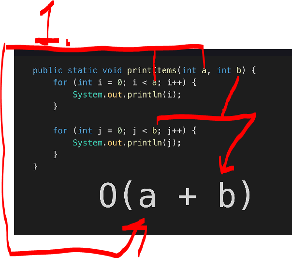
</div>

1. This needs to have separate **algebra variables**, since they are **different parameters**! We need to use different terms for inputs!

- This is the simplest solution as we can go!
    - Now we need to understand **both loops** to analyze this deeper!

- Next example code, we will be analyzing!

````Java
public static void printItems(int a, int b) {
    for (int i = 0; i < a; i++) {
        for (int j = 0; j < b; j++) {
            System.out.println(i + " " + j);
        }
    }
}
````

- Analyzing:

<div align="center">
    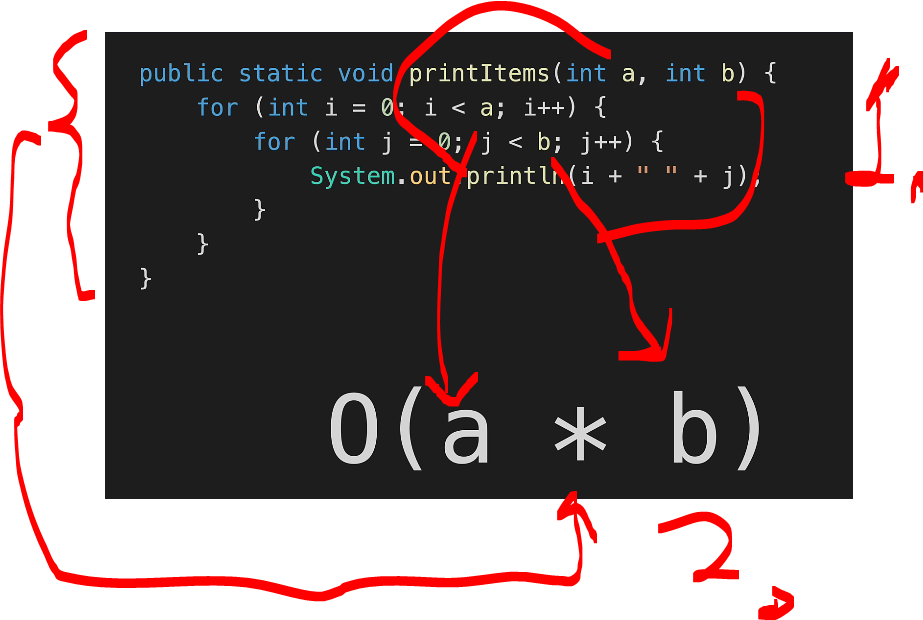
</div>

1. This is the same case, but the **loop's** inside each other.
2. We just use `*` for this case.

# Big O: Array Lists.

<div align="center">
    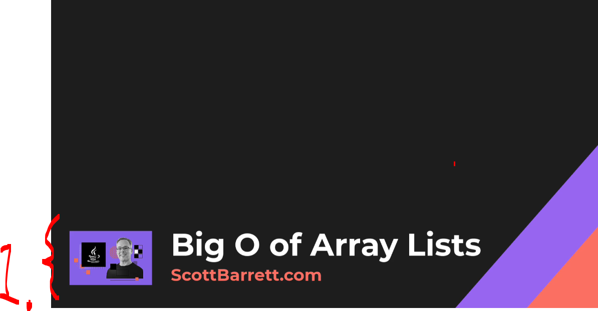
</div>

1. Big O of **Array List**!

<div align="center">
    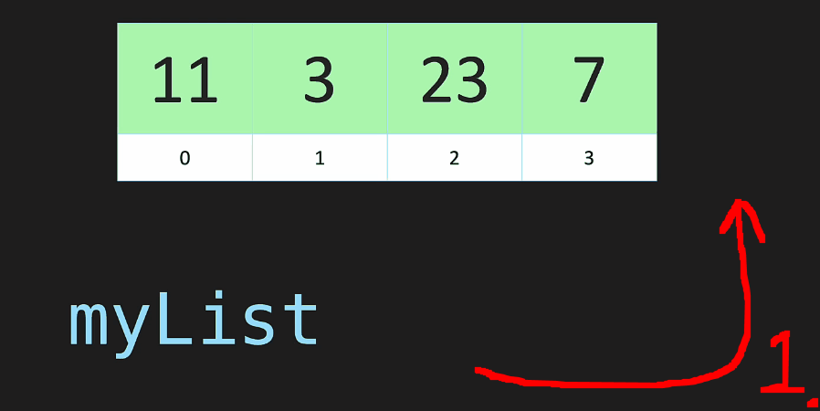
</div>

1. When `.add(17)` to this side of list, it is **simple** operation!
2. There is no need for **re-indexing**!
3. When `.remove(4)` to this side of list, it is also **simple** operation!
4. There is no need for **re-indexing**!
5. These operations for this side of **array list**, is `O(1)`!

- Now we will be looking, if we are doing the operations to the **other end**!

<div align="center">
    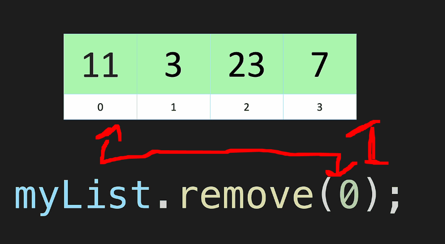
</div>

1. Removing `.remove(...)` from this side is simple, **BUT**.
2. This makes the list need to be **re-indexed**, the now order needs to start form index of `0`, and we need to touch **every item** in array!
3. These same steps need to be done, when we are `.add(...)`
4. Operations on this side of the array will be `O(1)`.

<div align="center">
    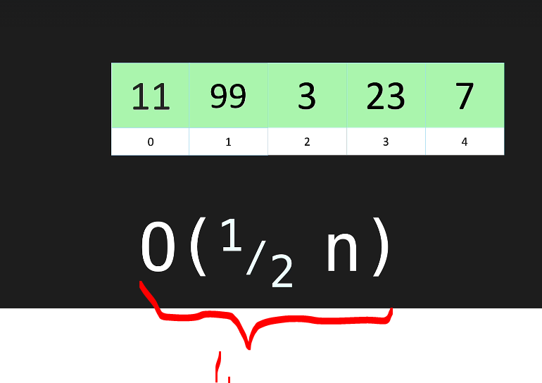
</div>

1. One would think, since one **average** insert time is `O(1/2 n)`, but need pay attention to:
    - Big O measures worst case!
    - We drop constants!

- Removing is `0(n)`.

<div align="center">
    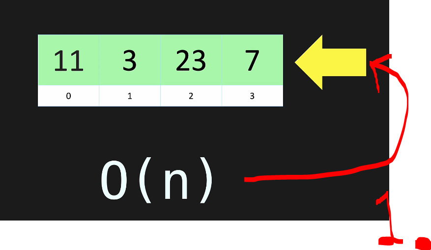
</div>

1. **Search** by content, is `0(n)` in **Array List**.
    - We need to loop every element!

<div align="center">
    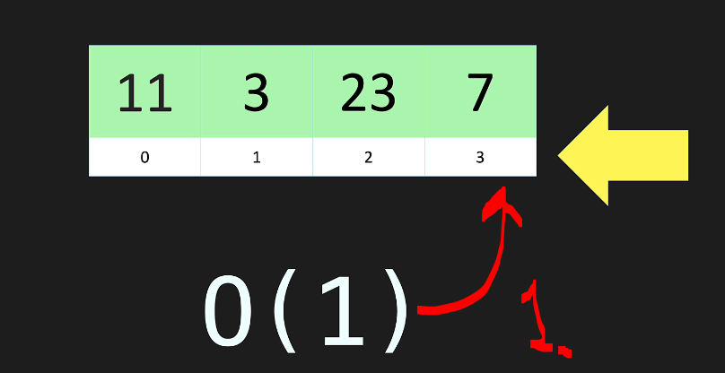
</div>

1. **Get** by index, is `0(1)` in **Array List**.

# Big O: Wrap Up.

<div align="center">
    
</div>

1. Wrapping Up, **Big O**! 

- Let's look when `N = 100`.

<div align="center">
    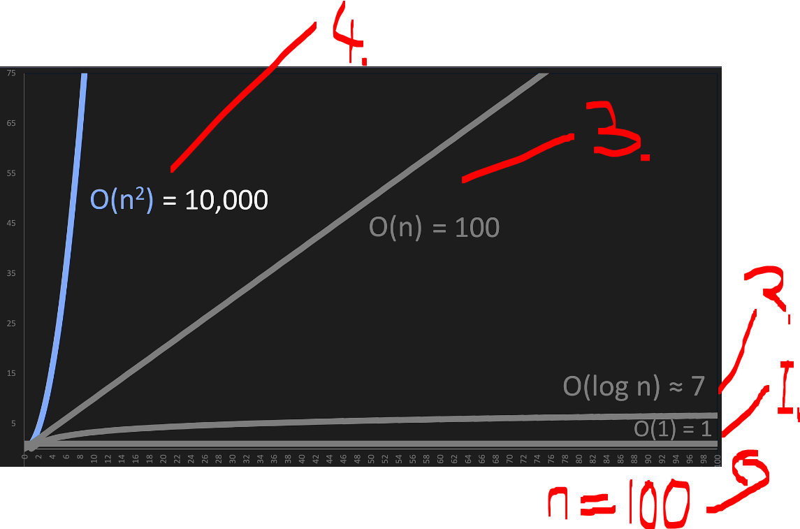
</div>

1. `O(1) = 1`.
2. `O(log n) ~ 7`.
3. `O(n) = 100`.
4. `O(n^2) = 10,000`, where **spread** comes even more apparent, when `O(^2)` grows!

- Now, let's look when `N = 1000`.

<div align="center">
    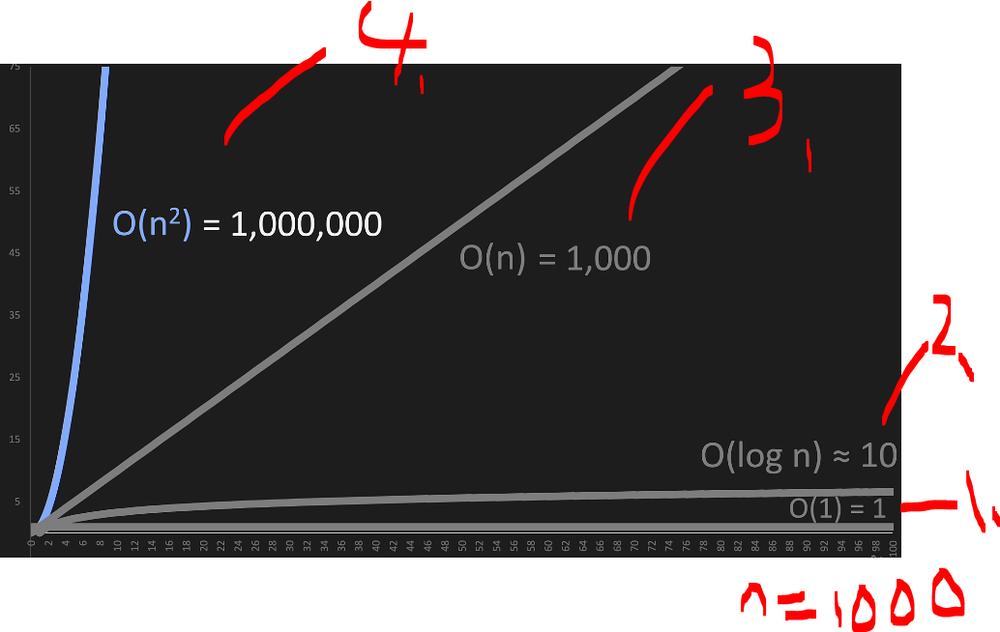
</div>

1. `O(1) = 1`.
2. `O(log n) ~ 10`. This went from `7` → `10`
3. `O(n) = 1,000`.
4. `O(n^2) = 1, 000,000`, where **spread** comes even more apparent, when `O(^2)` grows! This grew **very fast**!

> [!IMPORTANT]  
> If one can write function from `O(n^2)` to `O(n)`, it is big gain!

<div align="center">
    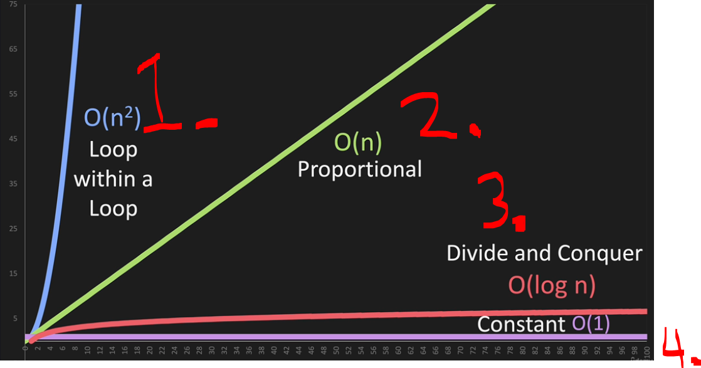
</div>

1. Is called **Loop within a Loop**.
````Java
          for (int i = 0; i < n; i++) {
            for (int j = 0; j < n; j++) {
                System.out.println(i + ", " + j);
            }
        }
````
2. Is called **Proportional**.
````Java
    for (int i = 0; i < n; i++) {
            System.out.println(i);
        }
````
3. Is called **Divide and Conquer**.
````Java
public class LogarithmicExample {
    public static int binarySearch(int[] arr, int target) {
        int left = 0, right = arr.length - 1;

        while (left <= right) {
            int mid = (left + right) / 2;

            if (arr[mid] == target)
                return mid;
            else if (arr[mid] < target)
                left = mid + 1;
            else
                right = mid - 1;
        }
        return -1;
    }

    public static void main(String[] args) {
        int[] arr = {1, 3, 5, 7, 9, 11};
        System.out.println(binarySearch(arr, 7));
    }
}
````
4. Is called **Constant**.

````Java
    public static void main(String[] args) {
        int[] arr = {10, 20, 30};

        System.out.println(arr[1]); // Always one step
    }
````

<div align="center">
    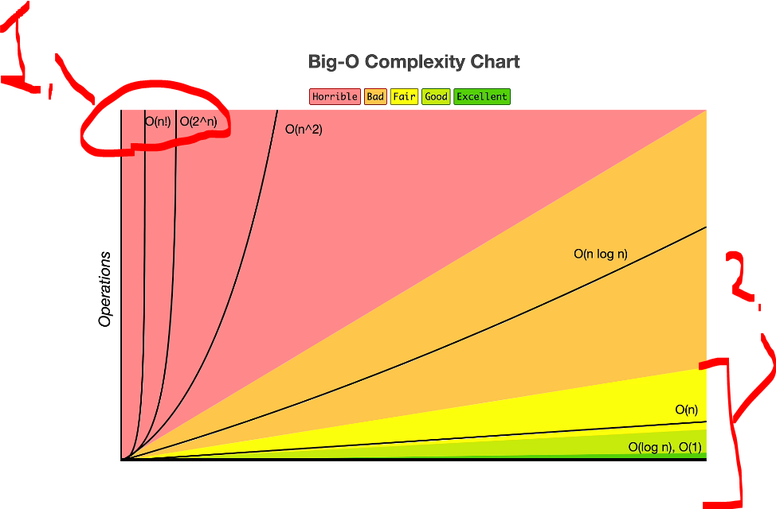
</div>

1. We will never see these and don't want to see these!
    - Check the [link](https://www.bigocheatsheet.com/)!
2. Want see these **mostly**!

# Quiz 01: Big O.

<details>

<summary id="Q1" open="true"> <b>Question 01.</b> </summary>

````yaml
Question 01:
What is the Big O time complexity when you have a loop within a loop (assuming each loop runs n times)?
````

- My answer:

<div align="center">
    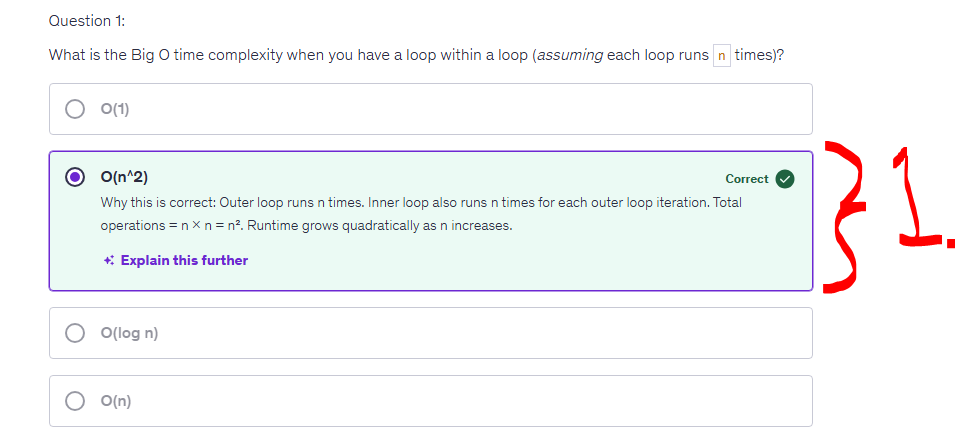
</div>

1. `n x n = n^2`, since two loops!

</details>

<details>

<summary id="Q2" open="true"> <b>Question 02.</b> </summary>

````yaml
Question 02:
How would the following be written:  O(100n^2)?
````

- My answer:

<div align="center">
    
</div>

1. Drop the constants!

</details>

<details>

<summary id="Q3"  open="true"> <b>Question 03.</b> </summary>

````yaml
Question 03:
What Big O is associated with Divide and Conquer?
````

- My answer:

<div align="center">
    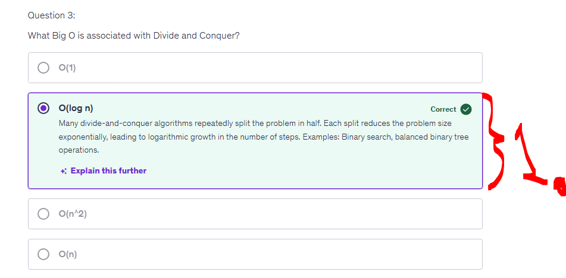
</div>

1. Example **Binary Search**!

</details>


<details>

<summary id="Q4" open="true"> <b>Question 04.</b> </summary>

````yaml
Question 04:
What is the correct way to write:  O(n^2 + n) ?
````

- My answer:

<div align="center">
    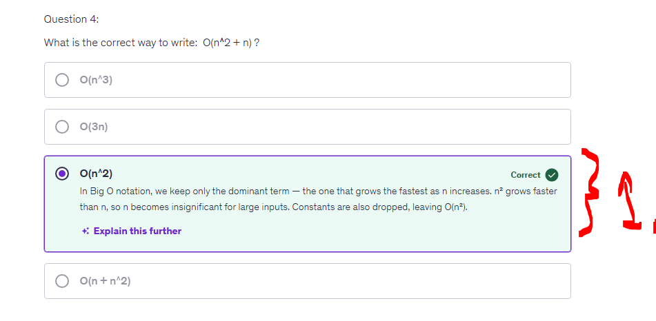
</div>

1. Example **Binary Search**!

</details>


<details>

<summary id="Q5" open="true"> <b>Question 05.</b> </summary>

````yaml
Question 05:
The most efficient Big O is:
````

- My answer:

<div align="center">
    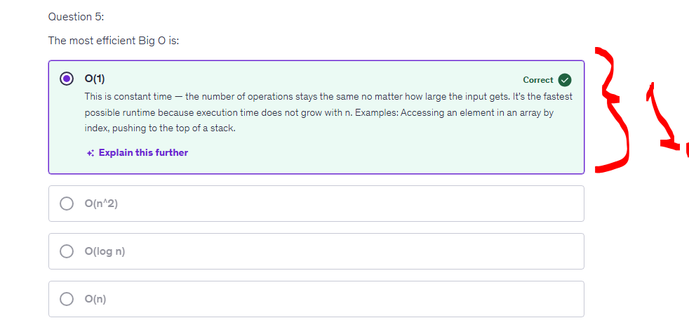
</div>

1. **Constant Time**!

</details>