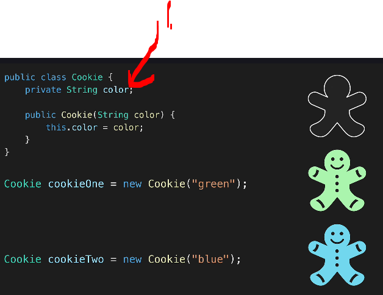
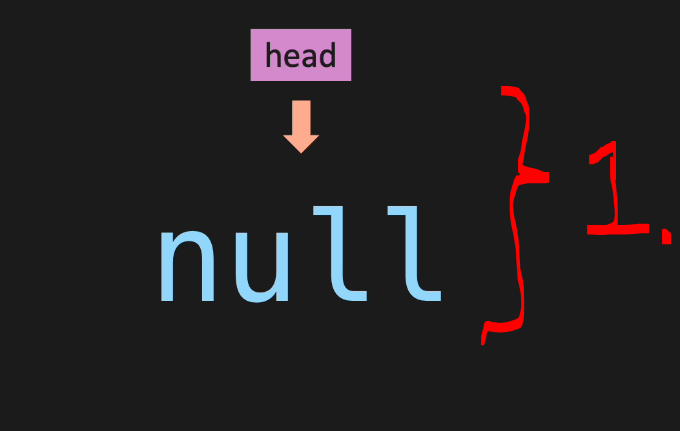

# Section 03 - Classes & References.

Classes & References.

# What I learned.

# Classes.

    

1. We are talking about classes. We need to understand these concepts, when we are build **data structures**!

    

1. **Class variables** should be **private**.

- todo these are pretty simple

# References.

- todo these are pretty simple

    

1. In **Data Structures** it's very important to know the difference, when `Node` is `null`. It means it is not **pointing** to anything! It is **not empty value**, it is just pointing to `null` value!

> [!IMPORTANT]
> ⚠️ These kinds of classes are holding references! ⚠️