# Chapter 04: Linked Lists.

Linked Lists.

# What I learned.

# Linked List: Intro.

<div align="center">
    
</div>

1. Linked List!

<div align="center">
    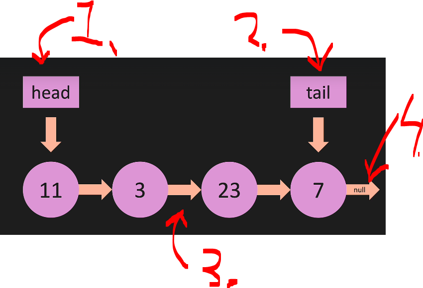
</div>

1. `head` points to first **Node**.
2. `tail` points to last **Node**.
3. Each node points to the next **Node**.
4. Last **Node** has pointer, that does **not point anywhere**, just to `null`.

<div align="center">
    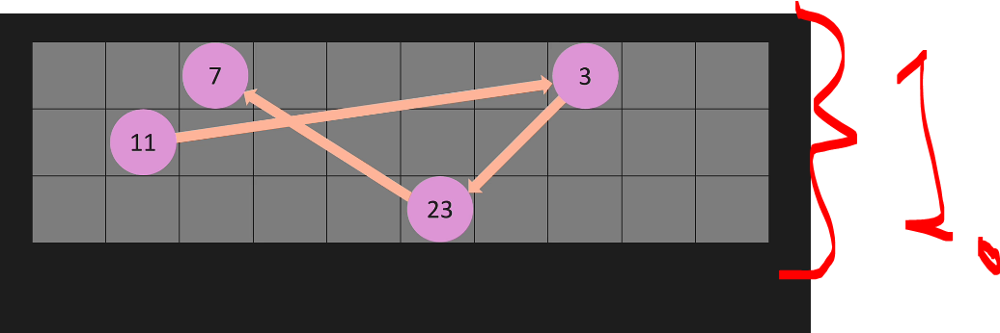
</div>

1. **Linked List** in memory is all over the place!

<div align="center">
    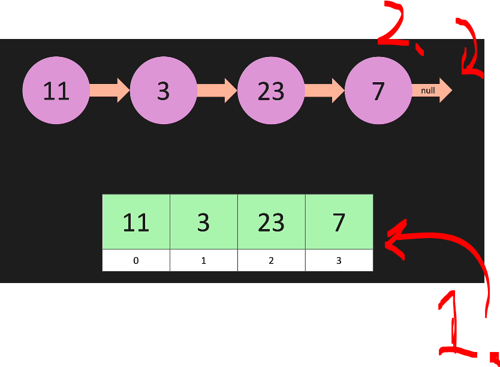
</div>

1. **ArrayList**!
    - An **ArrayList** has a dynamic size, but it is backed by an array with fixed capacity!
2. **Linked List**!
    - It does not require **contiguous memory**!

# LL: Big O.

<div align="center">
    
</div>

1. **Linked List** Big O.

- We are exploring **adding element** to the **end**, meaning **appending**!

<div align="center">
    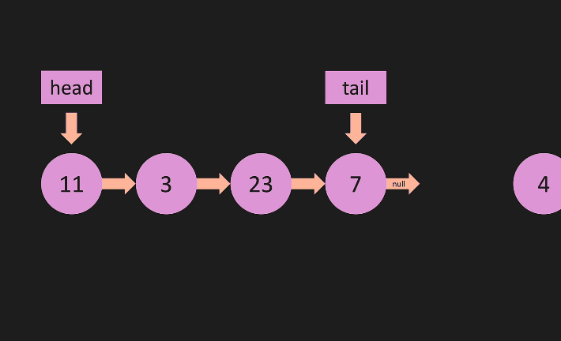
</div>

1. Adding **Node** to the end will be `O(1)`, regardless of the **Linked List** size `n`.

- Next we will be looking **removing** from **end** of the **Linked List**, meaning **remove Last**!

<div align="center">
    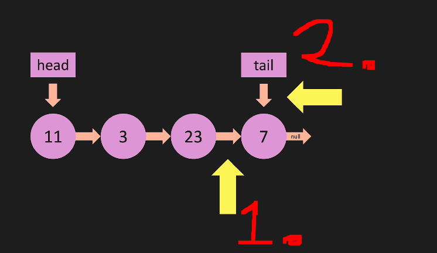
</div>

1. This **pointer** is pointing from the previous **Node**!
2. We need `tail` to be setted to the previous **Node**!
    - We need to go in **direction**, in which they are going!
3. Furthermore, we would need to **iterate** from the `head` to the most previous **Node**!
    - Then set the `tail` equal to the **pointer**!
4. Since, we need to iterate over all list, **removing** from the **end** of the **list** is `O(n)`. 

- In this case, the **ArrayList** would be better **Linked List**, when **remove end**. As in point `1`!
    <div align="center">
        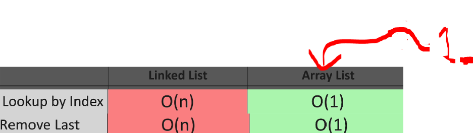
    </div>

<br>

- Next, we are exploring **adding element** to the **beginning**, meaning **prepend**!

<div align="center">
    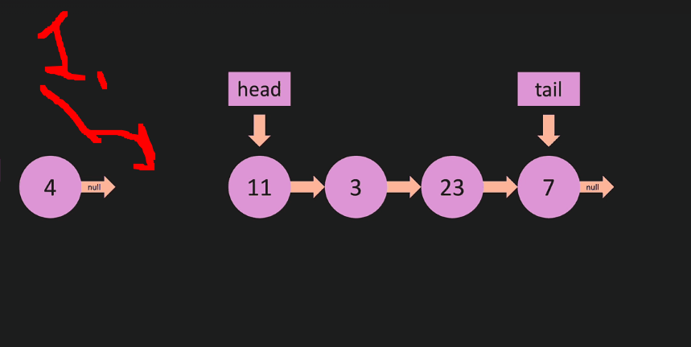
</div>

1. We will just **add node** to the beginning of the list and make the `head` pointing to the next!
2. This is `O(1)`.
    - In this case the **Lined List** is performing better than the **ArrayList**, when **removing the first**. As in is seen from `1.`!
    <div align="center">
        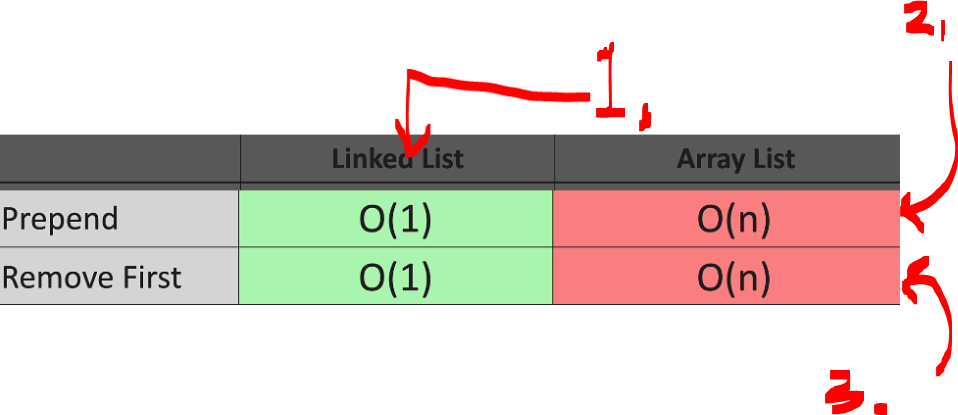
    </div>
    
    - With **Array List**, there is need to **re-index** everything, so its `O(n)`, this is seen in `2.`! 
<br>


- Next we will be looking **removing** from **beginning** of the **Linked List**, meaning **remove first**!

<div align="center">
    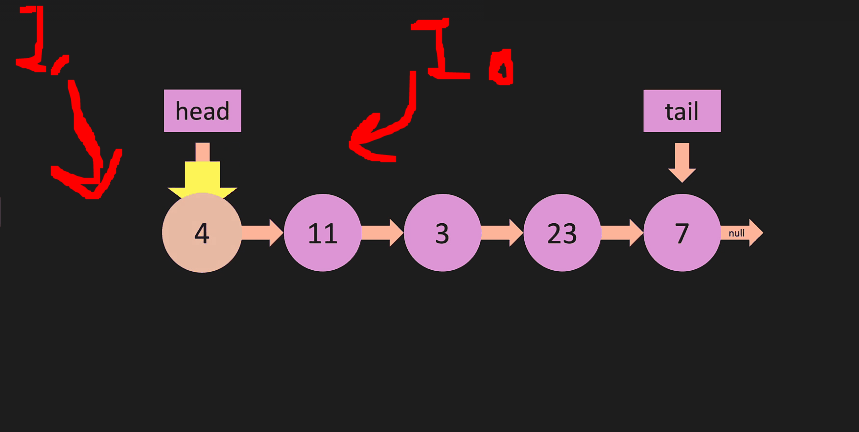
</div>

1. We need to move the `head` to the next **Node** and then remove the first **Node**!
2. This is `O(1)`.
    - In this case the **Lined List** is performing better than the **ArrayList**, when **removing the first**. As in is seen form `1`!
    <div align="center">
        
    </div>

    - With **Array List**, there is need to **re-index** everything, so its `O(n)`, this is seen in `3.`! 

<br>

- Next we will be looking **adding** by **index**, meaning **insert**.

<div align="center">
    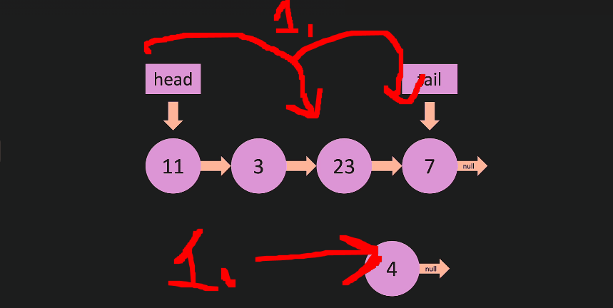
</div>

1. We want insert to this **third index**, we need to iterate there!
    - Then we need to change the **pointers** to next nodes!
2. Inserting to node is `O(n)`!


- Next we will be **searching by value**, with **value**, meaning **lookup by value** and also **lookup by index**, with **index** meaning **lookup by index**. 

<div align="center">
    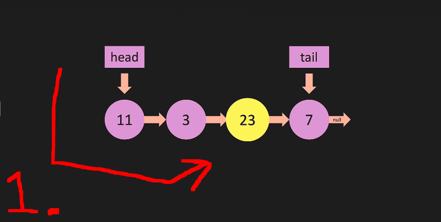
</div>

1. Looking up with the **value** and **looking up** with **index**, needs to start from the `head`.
2. This is `O(n)`. 
    - In this case **ArrayList** would be better **Linked List**, when **Lookup By Index**. As in `1.`!
    <div align="center">
        
    </div>

<br>

- General table and explanation in below:

<div align="center">
    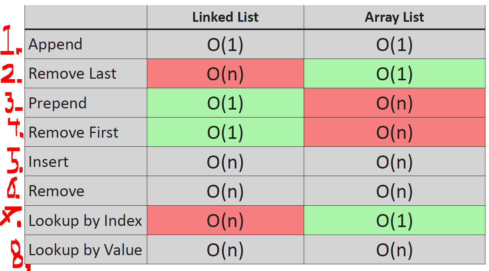
</div>

1. Append.
    - **Meaning:** Add an element to the **end**.
    - **Example:** `[1, 2, 3] → append(4) → [1, 2, 3, 4]`.

> [!NOTE]
> *“append”* almost always means *“**add** to the **end**.”*

2. Remove Last.
    - **Meaning:** Remove the **last element**.
    - **Example:** `[1, 2, 3] → remove last → [1, 2]`.

> [!NOTE]
> *“Remove Last”* is generally understood to mean **removing** the **last** element!

3. Prepend.
    - **Meaning:** Add an element to the **beginning**.
    - **Example:** `[1, 2, 3] → prepend(0) → [0, 1, 2, 3]`.

> [!NOTE]
> *“Prepend”* generally means **adding** an element to the **beginning** of a data structure, such as an array, list, or linked list.

4. Remove First.
    - **Meaning:** Remove the **first element**.
    - **Example:** `[1, 2, 3] → remove first → [2, 3]`.

> [!NOTE]
> “Remove First” generally means **removing** the **first** element of a data structure.

5. Insert.
    - **Meaning:** Add an element at a **specific position (index)**.
    - **Example:** `[1, 2, 4] → insert(2, 3) → [1, 2, 3, 4]`.

> [!NOTE]
> “Insert” generally means **adding** an element at a **specific position** (index) in a data structure.

6. Remove.
    - **Meaning:** Remove an element by **index or value**
    - **Examples:**
        - By index: remove index 1 → `[1, 3]`.
        - By value: remove 2 → `[1, 3]`.

> [!NOTE]
> “Remove” generally means **removing** an element **by index** or value from a data structure.

7. Lookup by Index.
    - **Meaning:** Access an element using its **position**.
    - **Example:** `arr[2]` → gets the 3rd element.

> [!NOTE]
> “Lookup by Index” generally means **accessing** an element using **its position** in a data structure.

8. Lookup by Value.
    - **Meaning:** Search for a **specific value**.
    - **Example:** find `3` in `[1, 2, 3]`.

> [!NOTE]
> “Lookup by Value” generally means **searching** for a **specific value** in a data structure.

# LL: Under the Hood.

<div align="center">
    
</div>

1. Linked List under the hood! 

<div align="center">
    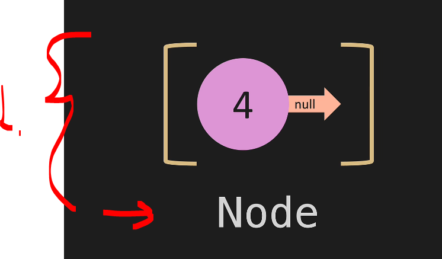
</div>

1. This whole thing is called **Node**, it will be consisting of following:
    - **Value**.
    - **Pointer**.

<div align="center">
    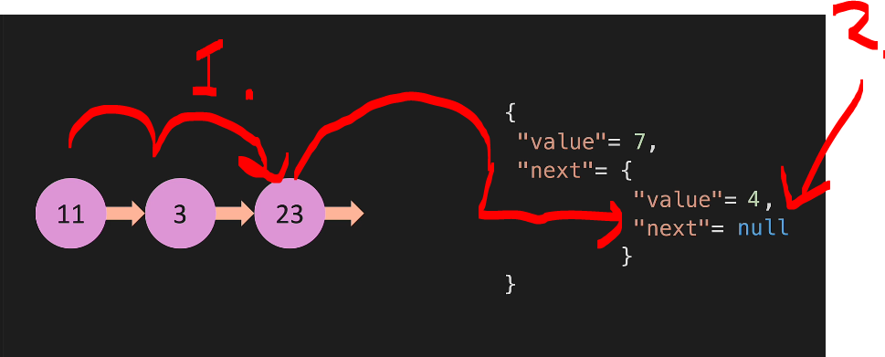
</div>

1. One can think, that these can connect to each other, with the `next` value!
2. The last will be having the `null` value!

<div align="center">
    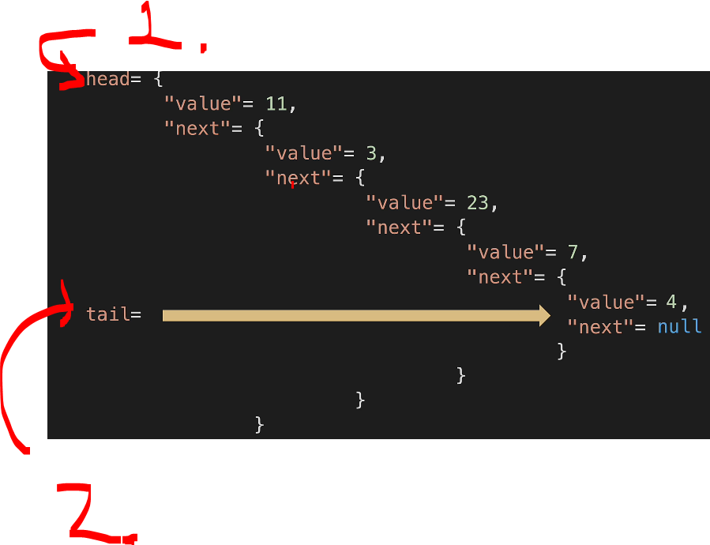
</div>

1. `head` will be pointing to the **first** element of the **Linked List**
2. `tail` will be pointing to the **last** element of the **Linked List**

<div align="center">
    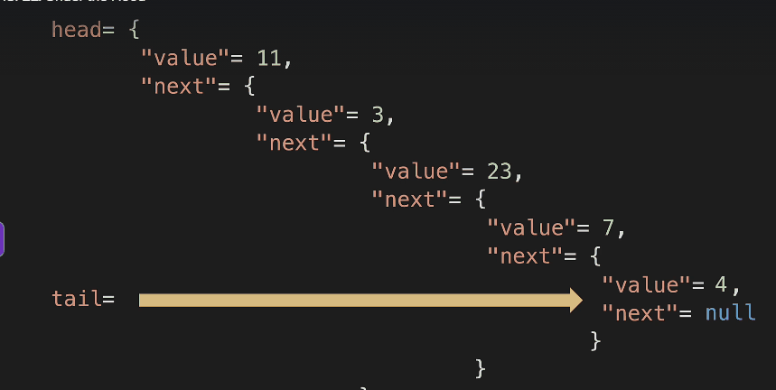
</div>

1. **Notice**, this is more representation picture, of the **text** representation!
    - We usually happen to handle the **text** format of the **Linked List**!

# LL: Constructor.

<div align="center">
    
</div>

1. We will be making our **Linked List**, we start form the **constructor**!

- We will be implementing our own **Linked List**, with following methods first!

<div align="center">
    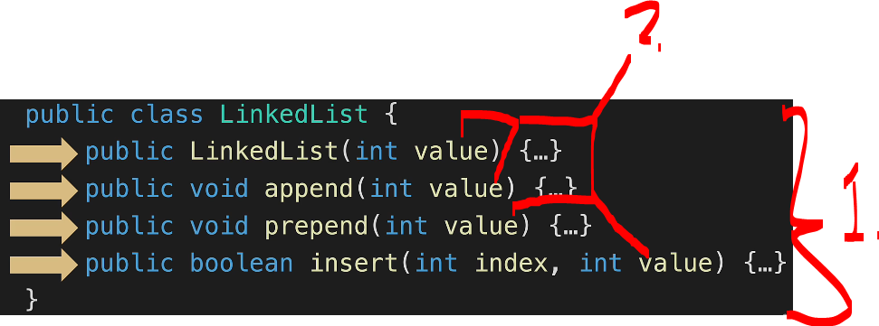
</div>

1. These methods are creating **Node**!
2. These gets passed `value`! 

- Our `Node`, will have following:

<div align="center">
    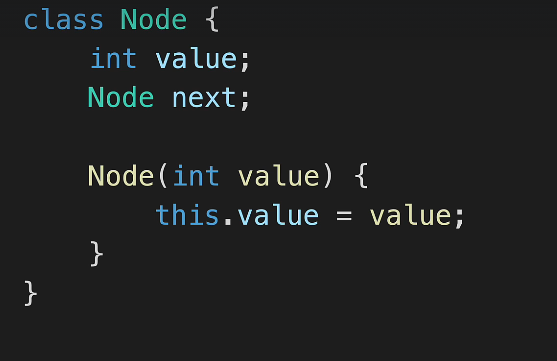
</div>

- Todo this if one see meaning full! Pretty simple.

# Coding Exercises (Important).

<div align="center">
    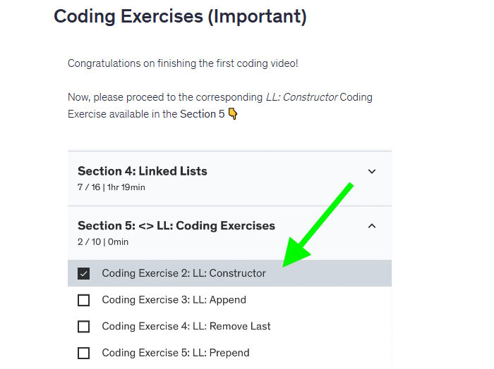
</div>

# LL: Print List.

<div align="center">
    
</div>

1. We will be making printing of the **list**.

<div align="center">
    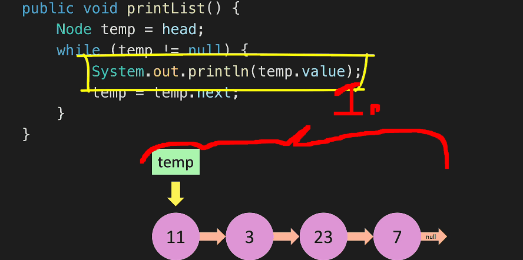
</div>

1. We will be printing our **Node** values!

- The printing:

````Java
    public void printList() {
        Node temp = head;
        while (temp != null) {
            System.out.println(temp.value);
            temp = temp.next;
        }
    }
````
- The getting the information:

````Java
    public Node getHead() {
        return head;
    }

    public Node getTail() {
        return tail;
    }

    public int getLength() {
        return length;
    }
````

- And the function for printing:

````Java
public void printList() {
        Node temp = head;
        while (temp != null) {
            System.out.println(temp.value);
            temp = temp.next;
        }
    }

    public void printAll() {
        if (length == 0) {
            System.out.println("Head: null");
            System.out.println("Tail: null");
        } else {
            System.out.println("Head: " + head.value);
            System.out.println("Tail: " + tail.value);
        }
        System.out.println("Length:" + length);
        System.out.println("\nLinked List:");
        if (length == 0) {
            System.out.println("empty");
        } else {
            printList();
        }
    }
````

- We will be printing the `printList()`.

````Java
import datastructures.linkedlist.LinkedList;

public class Main {
    public static void main(String[] args) {
        LinkedList myList = new LinkedList(4);

        myList.printAll();
        myList.printList();
    }
}
````

- Example of printing:

<div align="center">
    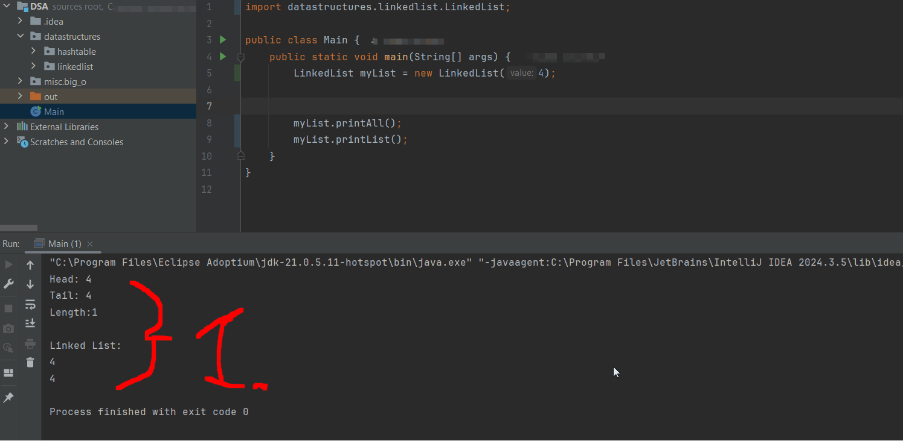
</div>

1. One can see the `head` and the `tail` being `4`.

# LL: Append.

<div align="center">
    
</div>

1. We will be making `.append(...)` for our **Linked List**.
    - This will be adding element to the **end of the list**!

- There are **two** scenarios:
    - `1.` When Linked List **is empty**, hence `null`.
<div align="center">
        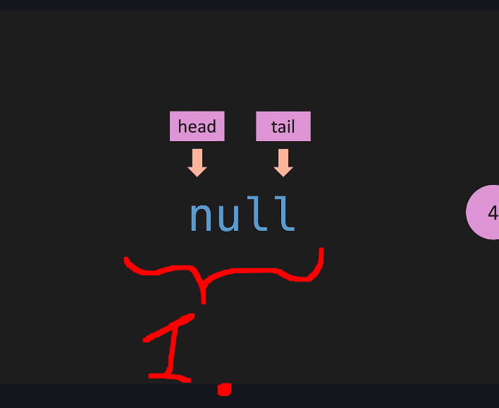
</div>

1. **Scenario**, when there is `null`, no elements, we need to initialize it!
    - `2.` When we **add** to **end** of the Linked List.
<div align="center">
        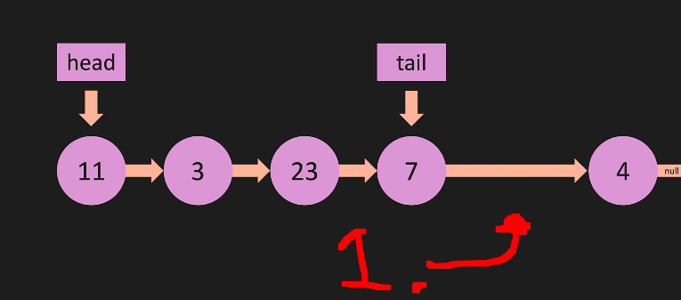
</div>

1. **Scenario**, we need to add to the end of the **Linked List** and then change the `tail` to the last **Node**.


# LL: Remove Last (Intro).

# LL: Remove Last (Code).

# LL: Prepend.

# LL: Remove First.

# LL: Get.

# LL: Set.

# LL: Insert.

# LL: Remove.

# LL: Reverse.

