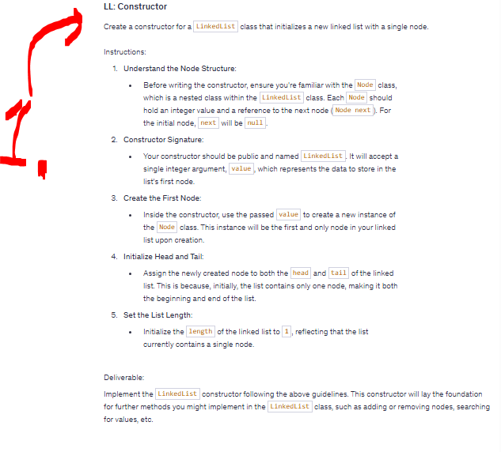
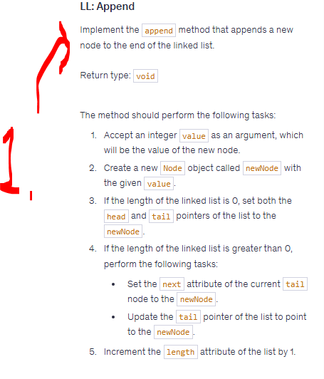
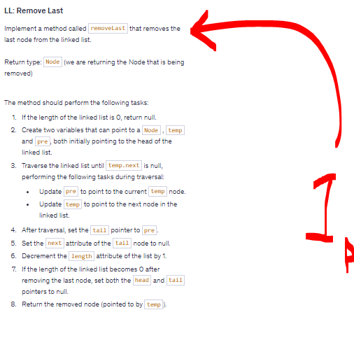
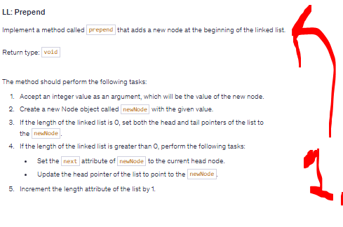
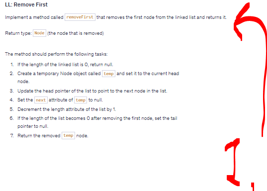
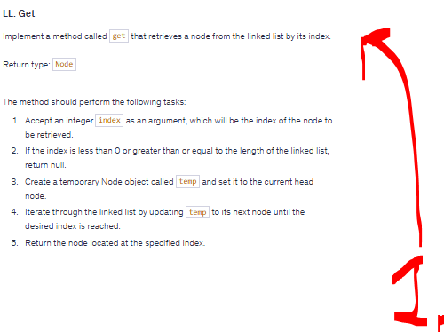
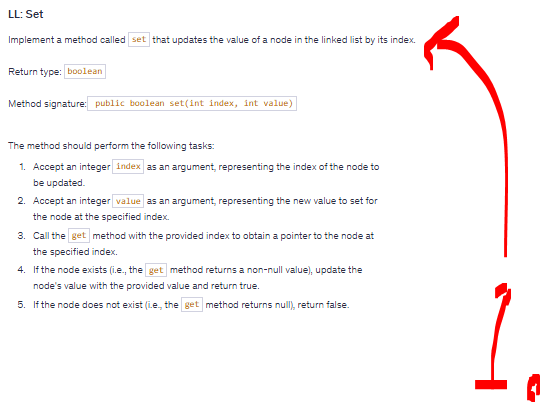
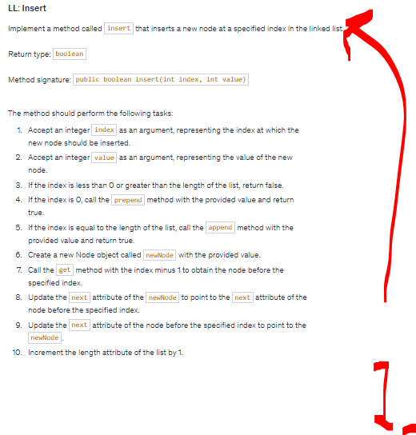
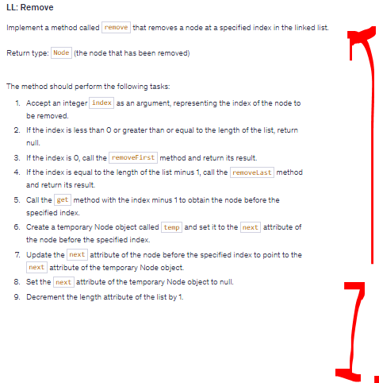
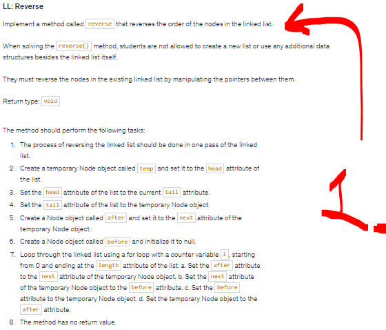

# Section 05: LL: Coding Exercises.

 LL: Coding Exercises.

# What I learned.

# Coding Exercise 02: LL: Constructor.

<details>
<summary id="coding_exercise_02_ll_constructor" open="true"> <b>Coding Exercise 02: LL Constructor Exercise!</b> </summary>

<div align="center">
    
</div>

````Java
public class LinkedList {
    
    private Node head;
    private Node tail;
    private int length;
     
    class Node {
        int value;
        Node next;
     
        Node(int value) {
            this.value = value;
        }
    }


    //   +===================================================+
    //   |                  WRITE YOUR CODE HERE             |
    //   | Description:                                      |
    //   | - Constructor for the LinkedList class.           |
    //   | - Initializes the linked list with a single node. |
    //   |                                                   |
    //   | Parameters:                                       |
    //   | - value: The integer value of the first node in   |
    //   |   the newly created linked list.                  |
    //   |                                                   |
    //   | Behavior:                                         |
    //   | - A new Node is created with the given value.     |
    //   | - This node is set as both the head and tail of   |
    //   |   the list, indicating it is the only node in the |
    //   |   list at creation.                               |
    //   | - The length of the list is initialized to 1.     |
    //   +===================================================+


    public Node getHead() {
        return head;
    }

    public Node getTail() {
        return tail;
    }

    public int getLength() {
        return length;
    }
    
    public void printList() {
        Node temp = head;
        while (temp != null) {
            System.out.println(temp.value);
            temp = temp.next;
        }
    }
    
    public void printAll() {
        if (length == 0) {
            System.out.println("Head: null");
            System.out.println("Tail: null");
        } else {
            System.out.println("Head: " + head.value);
            System.out.println("Tail: " + tail.value);
        }
        System.out.println("Length:" + length);
        System.out.println("\nLinked List:");
        if (length == 0) {
            System.out.println("empty");
        } else {
            printList();
        }
    }

}
````

- **Task 02:** Create a constructor for a `LinkedList` class that initializes a new `Linked List` with a single node.
    - **Answer**: Below:

````Java
public class LinkedList {
    
    private Node head;
    private Node tail;
    private int length;
     
    class Node {
        int value;
        Node next;
     
        Node(int value) {
            this.value = value;
        }
    }


    public LinkedList(int value) {
        Node newNode = new Node(value);
        head = newNode;
        tail = newNode;
        length = 1;
    }

    public Node getHead() {
        return head;
    }

    public Node getTail() {
        return tail;
    }

    public int getLength() {
        return length;
    }
    
    public void printList() {
        Node temp = head;
        while (temp != null) {
            System.out.println(temp.value);
            temp = temp.next;
        }
    }
    
    public void printAll() {
        if (length == 0) {
            System.out.println("Head: null");
            System.out.println("Tail: null");
        } else {
            System.out.println("Head: " + head.value);
            System.out.println("Tail: " + tail.value);
        }
        System.out.println("Length:" + length);
        System.out.println("\nLinked List:");
        if (length == 0) {
            System.out.println("empty");
        } else {
            printList();
        }
    }
}
````

</details>

# Coding Exercise 03: LL: Append.

<details>
<summary id="coding_exercise_03_ll_append" open="true"> <b>Coding Exercise 03!</b> </summary>

<div align="center">
    
</div>

````Java
    public class LinkedList {

    private Node head;
    private Node tail;
    private int length;

    class Node {
        int value;
        Node next;

        Node(int value) {
            this.value = value;
        }
    }

    public LinkedList(int value) {
        Node newNode = new Node(value);
        head = newNode;
        tail = newNode;
        length = 1;
    }

    public Node getHead() {
        return head;
    }

    public Node getTail() {
        return tail;
    }

    public int getLength() {
        return length;
    }

    public void printList() {
        Node temp = head;
        while (temp != null) {
            System.out.println(temp.value);
            temp = temp.next;
        }
    }

    public void printAll() {
        if (length == 0) {
            System.out.println("Head: null");
            System.out.println("Tail: null");
        } else {
            System.out.println("Head: " + head.value);
            System.out.println("Tail: " + tail.value);
        }
        System.out.println("Length:" + length);
        System.out.println("\nLinked List:");
        if (length == 0) {
            System.out.println("empty");
        } else {
            printList();
        }
    }
    
    public void makeEmpty() {
        head = null;
        tail = null;
        length = 0;
    }

	// WRITE APPEND METHOD HERE //
	//                          //
	//                          //
	//                          //
	//                          //
	//////////////////////////////

}
````

- **Task 03:** Add here things
    - **Answer**: Below:

````Java
    Add here code:
````

</details>

# Coding Exercise 04: LL: Remove Last.

<details>
<summary id="coding_exercise_04_remove_last" open="true"> <b>Coding Exercise 04!</b> </summary>

<div align="center">
    
</div>

````Java
    Add here code:
````

- **Task 04:** Add here things
    - **Answer**: Below:

````Java
    Add here code:
````

</details>

# Coding Exercise 05: LL: Prepend.

<details>
<summary id="coding_exercise_05_prepend" open="true"> <b>Coding Exercise 05!</b> </summary>

<div align="center">
    
</div>

````Java
    Add here code:
````

- **Task 05:** Add here things
    - **Answer**: Below:

````Java
    Add here code:
````

</details>

# Coding Exercise 06: LL: Remove First.

<details>
<summary id="coding_exercise_06_" open="true"> <b>Coding Exercise 06!</b> </summary>

<div align="center">
    
</div>

````Java
    Add here code:
````

- **Task 06:** Add here things
    - **Answer**: Below:

````Java
    Add here code:
````

</details>

# Coding Exercise 07: LL: Get.

<details>
<summary id="coding_exercise_07_" open="true"> <b>Coding Exercise 07!</b> </summary>

<div align="center">
    
</div>

````Java
    Add here code:
````

- **Task 07:** Add here things
    - **Answer**: Below:

````Java
    Add here code:
````

</details>

# Coding Exercise 08: LL: Set.

<details>
<summary id="coding_exercise_08_" open="true"> <b>Coding Exercise 08!</b> </summary>

<div align="center">
    
</div>

````Java
    Add here code:
````

- **Task 08:** Add here things
    - **Answer**: Below:

````Java
    Add here code:
````

</details>

# Coding Exercise 09: LL: Insert.

<details>
<summary id="coding_exercise_09_" open="true"> <b>Coding Exercise 09!</b> </summary>

<div align="center">
    
</div>

````Java
    Add here code:
````

- **Task 09:** Add here things
    - **Answer**: Below:

````Java
    Add here code:
````

</details>

# Coding Exercise 10: LL: Remove.

<details>
<summary id="coding_exercise_010_" open="true"> <b>Coding Exercise 10!</b> </summary>

<div align="center">
    
</div>

````Java
    Add here code:
````

- **Task 10:** Add here things
    - **Answer**: Below:

````Java
    Add here code:
````

</details>

# Coding Exercise 11: LL: Reverse.


<details>
<summary id="coding_exercise_11_" open="true"> <b>Coding Exercise 11!</b> </summary>

<div align="center">
    
</div>

````Java
    Add here code:
````

- **Task 11:** Add here things
    - **Answer**: Below:

````Java
    Add here code:
````

</details>