# Section 16: Hash Tables.

Hash Tables.

# What I learned.

# Hash Table: Intro.

<div align="center">
    
</div>

1. We are checking **Hash Tables**!

<div align="center">
    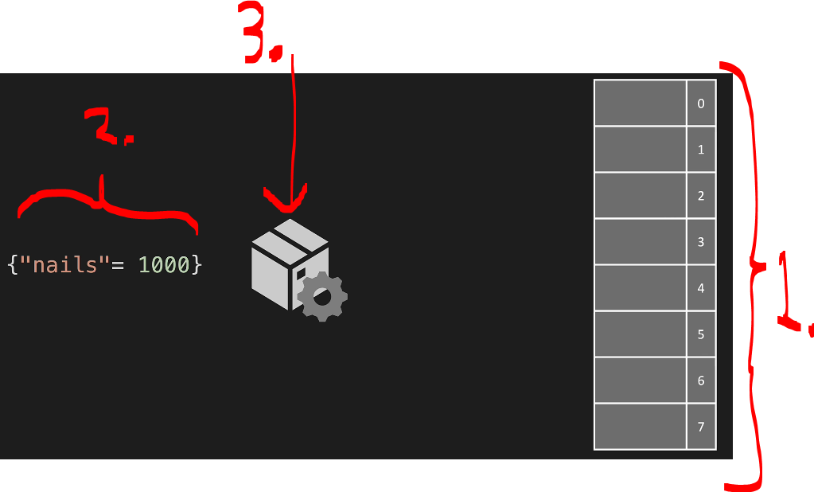
</div>

1. We have address space!
    - This will hold **key-value** pairs.
2. This is **key-value** pair!
3. This represented **hash method**!

<div align="center">
    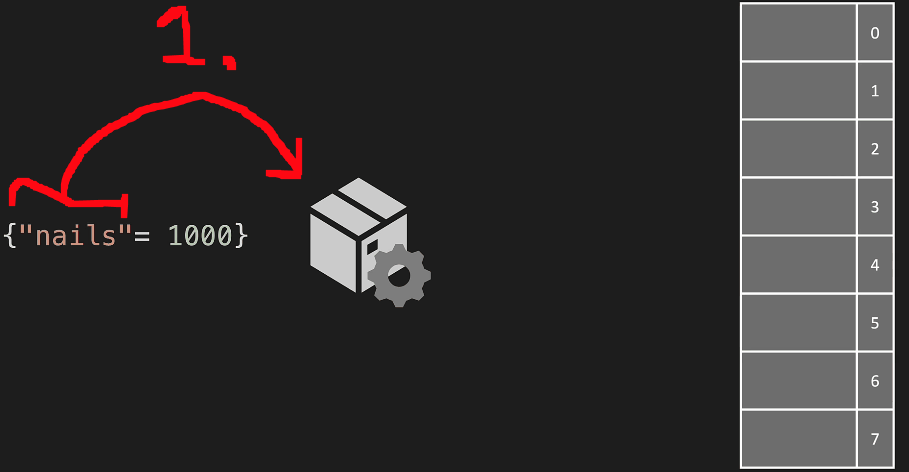
</div>

1. Key-value pair, the **key**, the **hash function** is run on the **key**, not the value.
    - Hence, its ran against the `"nails"`.
2. It will give the **address** based on the **key**. In this case its `2`. The **value** is going to be stored there! 

<div align="center">
    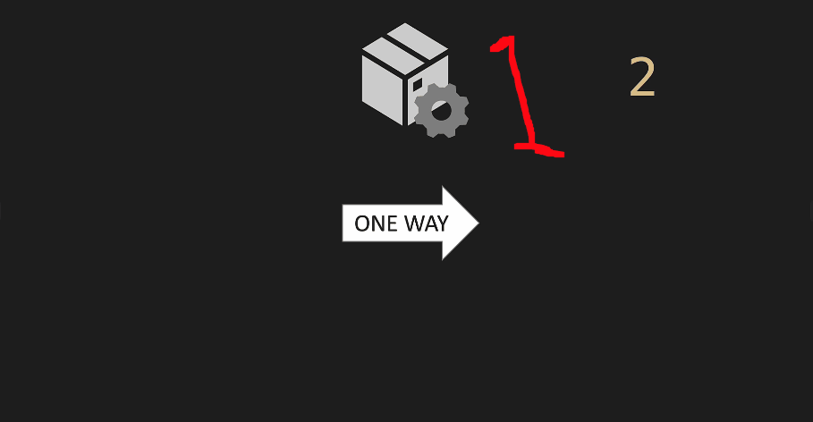
</div>

1. The **hash table** is only **one way**!
    - One can only go in one way!

<div align="center">
    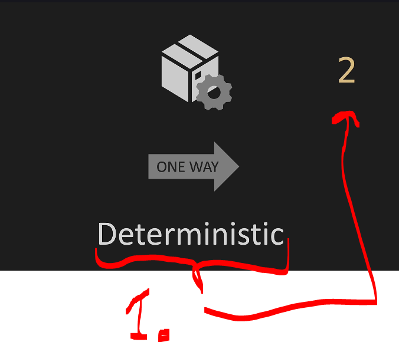
</div>

1. This is **deterministic**, meaning the outcome for same input is **always** the sane!

- So, **hash tables**:
    - Deterministic!
    - One way!

<div align="center">
    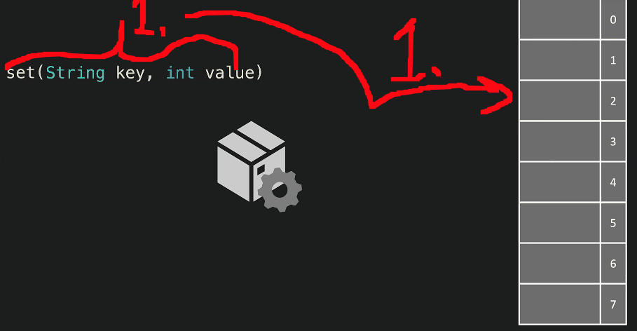
</div>

1. We are **set**:ing values with our own `set(String key, int value)` implementation!
2. We get **collision**, when there are **two values** is being inserted in same **key**!
    - There are multiple ways to store values with same **key**!

<div align="center">
    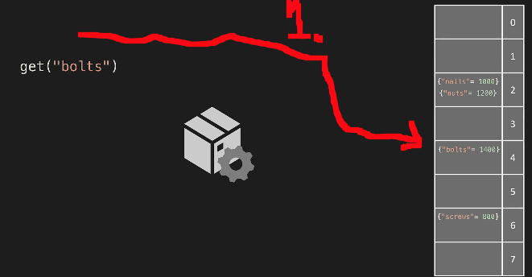
</div>

1. We can implement **get** data. If there are multiple values in one **storage**, we need iterate over the **key values**!

# HT: Collisions.

<div align="center">
    
</div>

1. How we are dealing with the **collisions**.

<div align="center">
    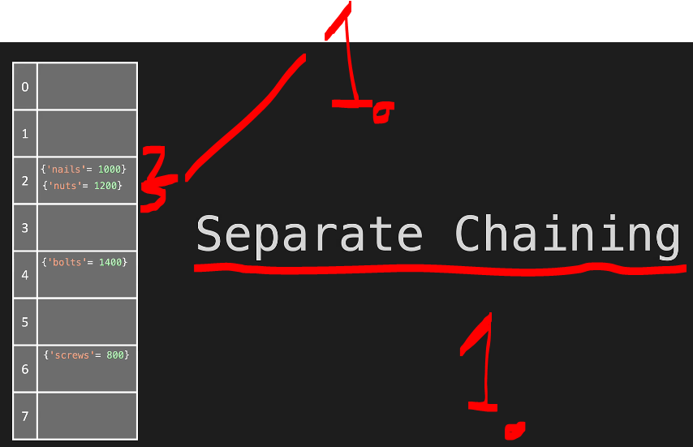
</div>

1. One way to deal, with **multiple values** being in one **storage box**, this is called **Separate Chaining**!
    - Even if there is value already there!

<div align="center">
    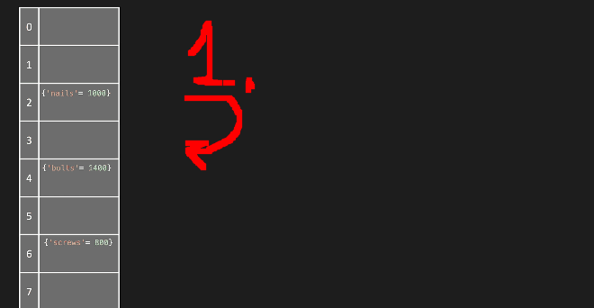
</div>

1. One another way, is if it does not fit one **storage box**, it will go into **next** one.
    - This is called **Linear Probing**, which is one of the types **Open Addressing**.

- These **two** are the **most popular** ones, when dealing with **collisions**:
    - **Linear Probing** and the **Separate Chaining**.

<div align="center">
    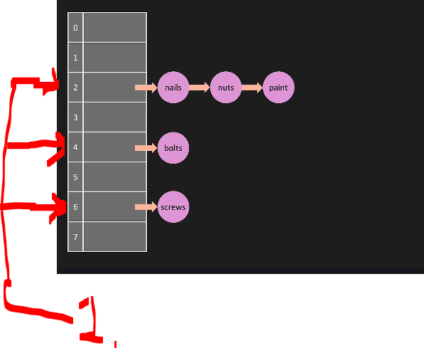
</div>

1. We are using **Linked List** dealing with separate chaining, to fit multiple **key-value** into one **storage box**.

# HT: Constructor.

<div align="center">
    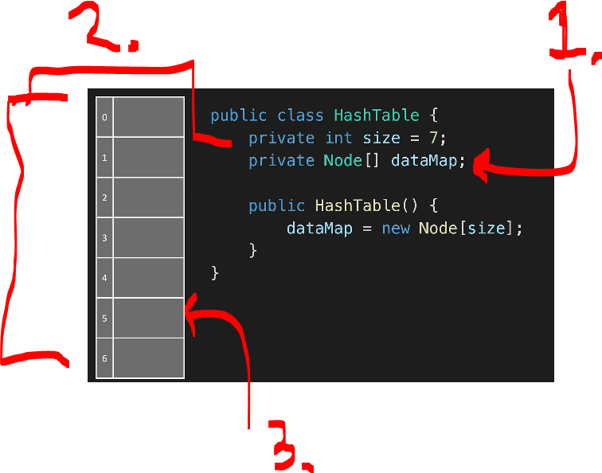
</div>

1. Notice that these are **array** of **references** to the **Node**'s!
2. This is size `7`.
3. These **Nodes** are similar to Hash Map.

<div align="center">
    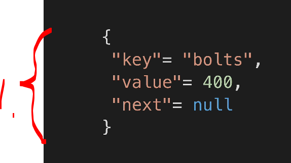
</div>

1. It would like this:
    - **Key** = **value**.
    - **Value** = **integer**.
    - **Next** = **points to the node**.

- This **Node** concept as code:

<div align="center">
    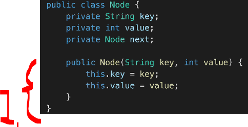
</div>

1. In this case the **Node** is accepting `key` and `value`.

<div align="center">
    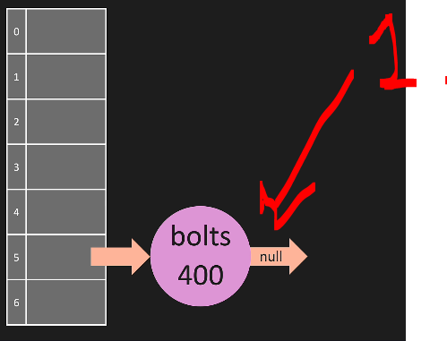
</div>

1. Now, we can initialize the addresses, with following **Nodes**'s.

- The `HashTable` implementation in code:
    - The `printTable(...)` for printing what is inside the `Hashtable`.

````Java
public class HashTable {
    private int size = 7;
    private Node[] dataMap;

    class Node {
        String key;
        int value;
        Node next;

        Node(String key, int value) {
            this.key = key;
            this.value = value;
        }
    }

    public void printTable() {
        for (int i = 0; i < dataMap.length; i++) {
            System.out.println(i + ":");
            Node temp = dataMap[i];
            while (temp != null) {
                System.out.println("   {" + temp.key + "= " + temp.value + "}");
                temp = temp.next;
            }
        }
    }
}
````

- We are inspecting that our **HashTable** is working!

````Java
package datastructures.hashtable;

public class Main {

    public static void main(String[] args) {

        HashTable myHashTable = new HashTable();
        myHashTable.printTable();
    }
}
````

- This seems to be working:

<div align="center">
    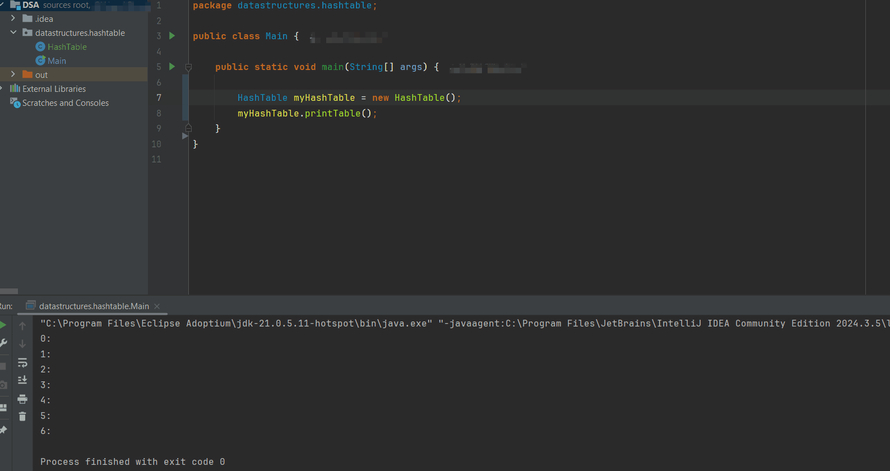
</div>

1. We can see there are **6** addresses on **empty** Hash Table!

<details>
<summary id="hashTable first" open="true"> <b>HashTable implementation, after this chapter.</b> </summary>

### HashTable.java

````Java
package datastructures.hashtable;

import java.util.ArrayList;

public class HashTable {
    private int size = 7;
    private Node[] dataMap;

    class Node {
        String key;
        int value;
        Node next;

        Node(String key, int value) {
            this.key = key;
            this.value = value;
        }
    }
    
    public HashTable()
    {
        dataMap = new Node[size];
    }

    /**
     * For printing the Node.
     */
    public void printTable() {
        for (int i = 0; i < dataMap.length; i++) {
            System.out.println(i + ":");
            Node temp = dataMap[i];
            while (temp != null) {
                System.out.println("   {" + temp.key + "= " + temp.value + "}");
                temp = temp.next;
            }
        }
    }
}
````
### Main.java

````Java
package datastructures.hashtable;

public class Main {

    public static void main(String[] args) {

        HashTable myHashTable = new HashTable();
        myHashTable.printTable();
    }
}
````
</details>

# HT: Hash Method.

<div align="center">
    
</div>

1. We will be making our own, **hash** method.

<div align="center">
    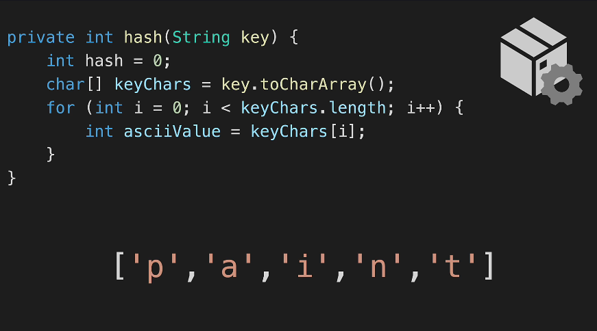
</div>

- The `key.toCharArray()` will work as in following:

<div align="center">
    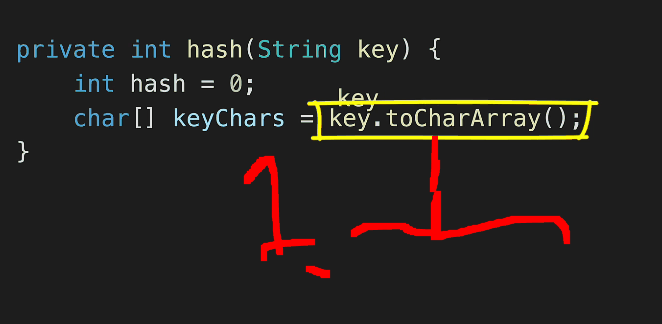
</div>

1. String `"paint"` will be.
2. Chars `'p'`, `'a'`, `'i'`, `'n'`, `'t'` and we will loop thought this with *ASCII* extraction.

<div align="center">
    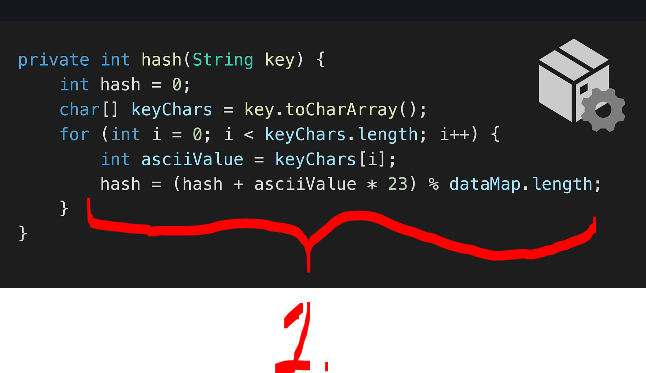
</div>

1. `23` is prime number! It can be any prime numbers!
    - It makes this more random!

<details>
<summary id="hashTable second" open="true"> <b>HashTable implementation, after this chapter.</b> </summary>

### HashTable.java

````Java
package datastructures.hashtable;

import java.util.ArrayList;

public class HashTable {
    private int size = 7;
    private Node[] dataMap;

    class Node {
        String key;
        int value;
        Node next;

        Node(String key, int value) {
            this.key = key;
            this.value = value;
        }
    }

    public HashTable()
    {
        dataMap = new Node[size];
    }

    /**
     * For printing the Node.
     */
    public void printTable() {
        for (int i = 0; i < dataMap.length; i++) {
            System.out.println(i + ":");
            Node temp = dataMap[i];
            while (temp != null) {
                System.out.println("   {" + temp.key + "= " + temp.value + "}");
                temp = temp.next;
            }
        }
    }

    private int hash(String key) {
        int hash = 0;
        char[] keyChars = key.toCharArray();
        for (int i = 0; i < keyChars.length; i++) {
            int asciiValue = keyChars[i];
            hash = (hash + asciiValue * 23) % dataMap.length;
        }
        return hash;
    }
}
````
### Main.java

````Java
package datastructures.hashtable;

public class Main {

    public static void main(String[] args) {

        HashTable myHashTable = new HashTable();
        myHashTable.printTable();
    }
}
````
</details>


# HT: Set.

# HT: Get.

# HT: Keys.

# HT: Big O.

# HT: Interview Question.

# Quiz 5: Hash Table Big O.


