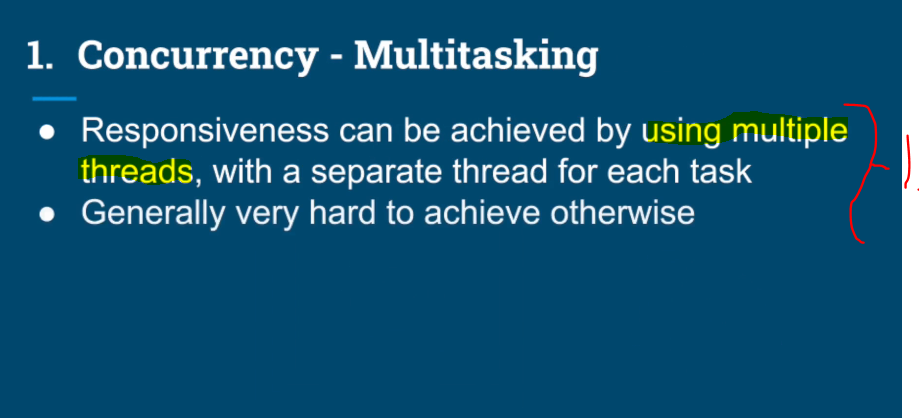
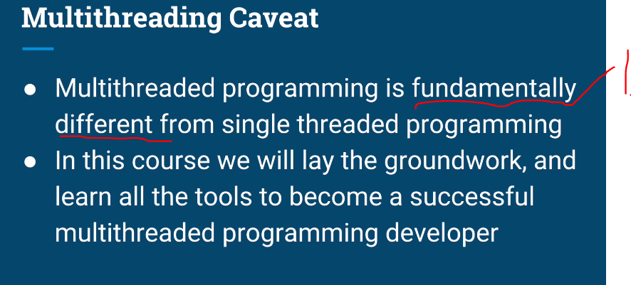
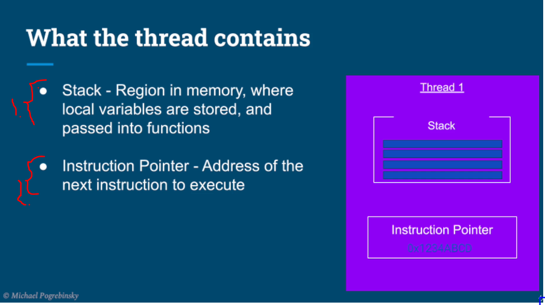
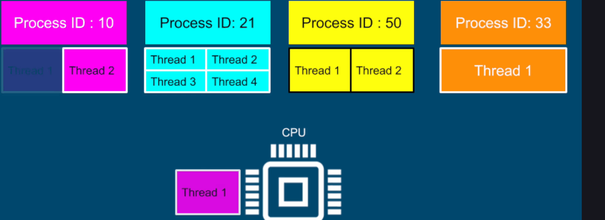
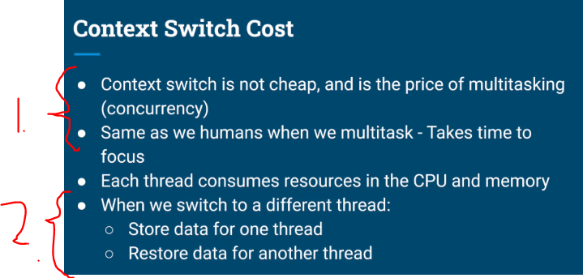
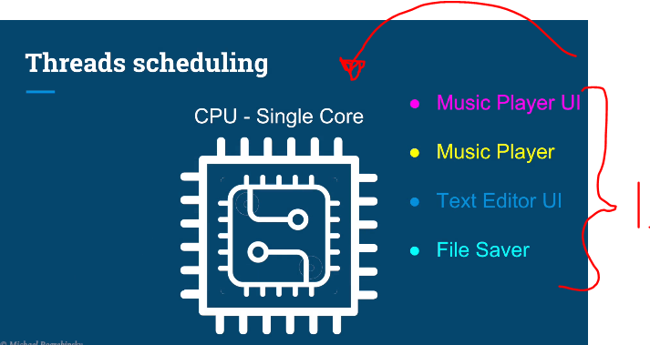

# Chapter 01 - Introduction.

Introduction.

# What I learned.

    

    

    

1. Let's explain **Responsiveness**.

    

1. Something does not respond soon. These are signs of poor **responsiveness**.

    

1. If there is one user, with **HUGE** order, which makes the database query long, the second user `2.` needs to wait for the answer!

    

1. We can achieve multiple units working, in their **own** thread.

    

1. Once the **click** is happened, we would want to have action on the screen!
    - This can be achieved by using the **Multiple threads**.

    

1. We can achieve this by using the **multiple threads**

    

1. We achieve this making task run next to each other.

    

1. Furthermore, we can **achieve** this even using with **one core**.

    

1. The performance is improved, with **multiple cores**!
2. We can achieve this **parallelism**, with multiple cores.

    

    

    

1. **Multithreaded** programming is different than the **single threading**.

    

    

1. Os is loaded from the hard disk to memory on the startup.

    

1. The **OS** will take the program from the disk and makes instance to the memory. 

    

1. The instance of the program, which is loaded from the **Hard Drive** is called **Process** or the **Context of the application**.
2. **Thread** contains the **Stack** and the **Instruction Pointer**.

    

1. Region in memory, where **local variables** are stored, and passed into functions.
2. Address of the **next instruction** to **execute**.

    

# Operating Systems Fundamentals - Part 2.

    

    

- We need to clarify, when to use:
    - **Process**.
    - **Threads**.

    

- There will be multiple **Threads** in different processes.
    - **CPU** will have to stop thread and resume to the different processes in **consecutive** times!

    

- Act of:
    - `Stop thread 1`. **Stopping one thread**.
    - `Schedule thread 1 out`. **Scheduling one thread out**.
    - `Schedule thread 2 in`. **Scheduling one thread in**.
    - `Start Thread 2`. **Starting one tread**.
        - This is **Context Switching**.

    

1. **Context Switch** is not cheap!
2. Every **Context Switch**, we need to **load** or **store** data of one tread and restore the another!

    

1. **Thrashing**, when time is spent more on the **switching the context** rather than actual work in the CPU!
2. **Threads** consumes less resources than the **Process**
    - **Context Switching** is cheaper in general if the switch is happening inside **same** process.

    

- In this example:

    

1. There **two** threads in **Music Player**.
2. There **two** threads in **Text Editor**.

    

1. There will be **4** different threads from the **Music Player** and **Text Editor** app, in which **One CPU**, needs to prioritize with the **executing**.

- [Fair Scheduler](https://developer.ibm.com/tutorials/l-completely-fair-scheduler/)

- [Tread State](https://docs.oracle.com/javase/8/docs/api/java/lang/Thread.State.html)
