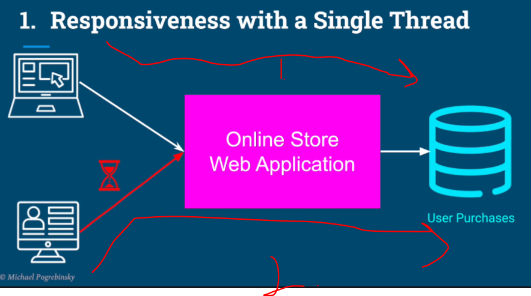
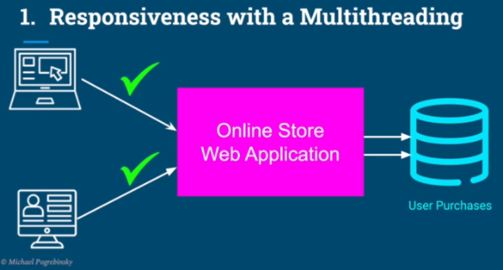

# Chapter 01 - Introduction.

Introduction.

# What I learned.

    

    

    

1. Let's explain **Responsiveness**.

    

1. Something does not respond soon. These are signs of poor **responsiveness**.

    

1. If there is one user, with **HUGE** order, which makes the database query long, the second user `2.` needs to wait for the answer!

    

1. We can achieve multiple working, in their **own** thread.