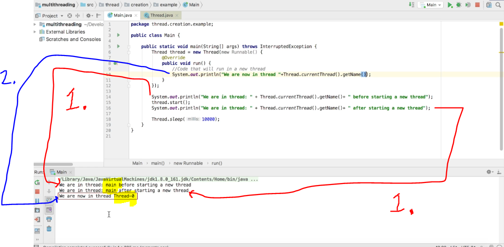
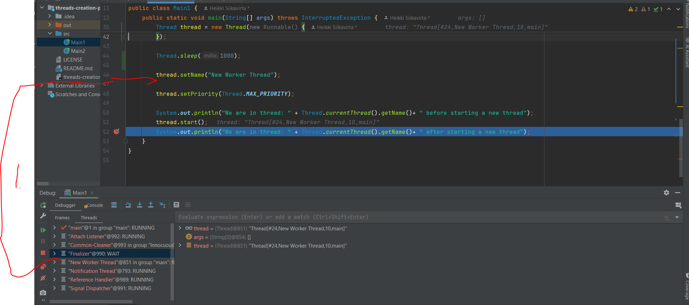
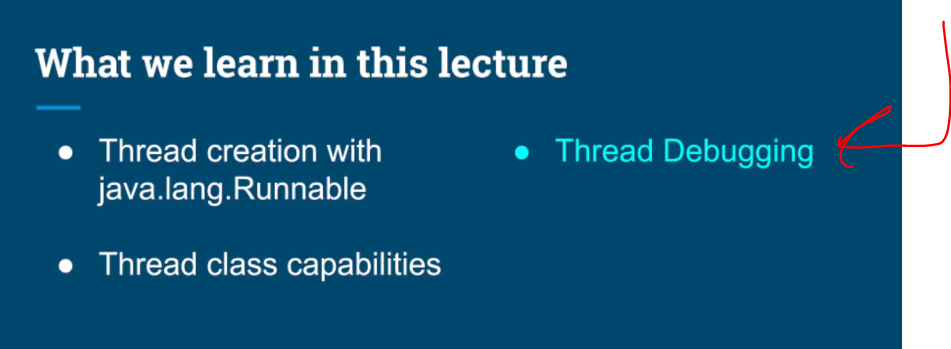

# Chapter 02 - Threading Fundamentals - Thread Creation.

Threading Fundamentals - Thread Creation.

# What I learned.

# Tips about Coding Lectures and Debugging Instructions.

- ✅.

# Threads Creation - Part 1, Thread Capabilities & Debugging.

- First we will be looking at the *"hello world"* of the **Threads**. 

<div align="center">
    
</div>

- We can create `Thread`, where we input the `Runnable`.

````
 // First version of the Threads.
        Thread thread = new Thread(new Runnable() {
            @Override
            public void run() {
                // Code that will run in  a new thread
                System.out.println("we are now in thread "+Thread.currentThread().getName());
            }
        });

        System.out.println("We are in thread: " + Thread.currentThread().getName()+ " before starting a new thread");
        thread.start();
        System.out.println("We are in thread: " + Thread.currentThread().getName()+ " after starting a new thread");

        Thread.sleep(1000);

````

- We need to start the **Thread**, with `thread.start();`.
    - Lets the **JVM** create the **Thread** and pass it to the **OS**.

- `Thread.currentThread()` get the **current** thread object!

- `Thread.sleep(1000);` instructs **OS not** to **schedule** time for this **Thread** will give time!   
    -  This always affects the **Thread** that calls it — the current thread.

<div align="center">
    
</div>

1. Notice when we call the `thread.start()` the new thread have not been scheduled yet.
    - We will get `1.` messages **first**! You can see the `main`, since it was started from the main **Thread**.
2. **OS scheduler** decides when it actually starts running.
    - It just happened to be run as last (**not always!**).
        - Also notice the different name rather than `main` it will be `Thread-0`, because its from other **Thread**.
 
- This **First** version of the **Threads**, where we explored **Thread** itself:

````
/*
 * Copyright (c) 2019-2023. Michael Pogrebinsky - Top Developer Academy
 * https://topdeveloperacademy.com
 * All rights reserved
 */

/**
 *  Threads Creation - Part 1, Thread Capabilities & Debugging
 * https://www.udemy.com/java-multithreading-concurrency-performance-optimization
 */
public class Main1 {

    public static void main(String[] args) throws InterruptedException {
        Thread thread = new Thread(new Runnable() {
            @Override
            public void run() {
                //Code that will run in  a new thread
                System.out.println("we are now in thread "+Thread.currentThread().getName());
                System.out.println("Current thread priority is " + Thread.currentThread().getPriority());
            }
        });

        Thread.sleep(1000);

        thread.setName("New Worker Thread");

        thread.setPriority(Thread.MAX_PRIORITY);

        System.out.println("We are in thread: " + Thread.currentThread().getName()+ " before starting a new thread");
        thread.start();
        System.out.println("We are in thread: " + Thread.currentThread().getName()+ " after starting a new thread");
    }
}
````

- The logging after this:

````
We are in thread: main before starting a new thread
We are in thread: main after starting a new thread
we are now in thread Thread-0
````

- The **second** topic the which **capabilities** the **Thread** will bring us.

<div align="center">
    
</div>

- We can give the **Thread** a name:
    - With the following: `thread.setName("New Worker Thread");`

<div align="center">
    
</div>

1. We can set the **Static Priority**. 
    - The **prioritization** affects the **scheduling decision**!
        - With the following: `thread.setPriority(Thread.MAX_PRIORITY);`
<div align="center">
    
</div>

1. You can see the named **Thread** in the **Debugger** window.

- Also, you can see the **Threads** in the **IntelliJ** window:
    - These are created by the **JVM**:

`````
"main"
"Attach Listener"
"Common-Cleaner"
"Finalizer"
"Reference Handler"
"Signal Dispatcher"
"Notification Thread"
`````

- This **Second** version of the **Threads**, where we explored **Thread debugging**:

````
        /*
        Thread thread = new Thread(new Runnable() {
            @Override
            public void run() {
                //Code that will run in  a new thread
                System.out.println("we are now in thread " + Thread.currentThread().getName());
                System.out.println("Current thread priority is " + Thread.currentThread().getPriority());
            }
        });

        Thread.sleep(1000);

        thread.setName("New Worker Thread");

        thread.setPriority(Thread.MAX_PRIORITY);

        System.out.println("We are in thread: " + Thread.currentThread().getName()+ " before starting a new thread");
        thread.start();
        System.out.println("We are in thread: " + Thread.currentThread().getName()+ " after starting a new thread");
````

- The logging after this:

````
We are in thread: main before starting a new thread
We are in thread: main after starting a new thread
we are now in thread New Worker Thread
Current thread priority is 10
````

<div align="center">
    
</div>

- This **Third** version of the **Threads**, where we explored `.setUncaughtExceptionHandler()`:

````
       // Third version of Thread.
        Thread thread = new Thread(new Runnable() {
            @Override
            public void run() {
                // Code that will run in  a new thread.
                throw new RuntimeException("Internal Exception");
            }
        });

        thread.setUncaughtExceptionHandler(new Thread.UncaughtExceptionHandler() {
            @Override
            public void uncaughtException(Thread t, Throwable e) {
                System.out.println("A critical error handler in tread " + t.getName()
                + " the error is " + e.getMessage());
            }
        });

        thread.start();
````

- The logging after this:

````
A critical error handler in tread Thread-0 the error is Internal Exception
````

# Threads Creation - Part 2, Thread Inheritance.

- 

<div align="center">
    
</di


# Coding Exercise 1: Thread Creation - MultiExecutor.

# Thread Creation - MultiExecutor Solution.
