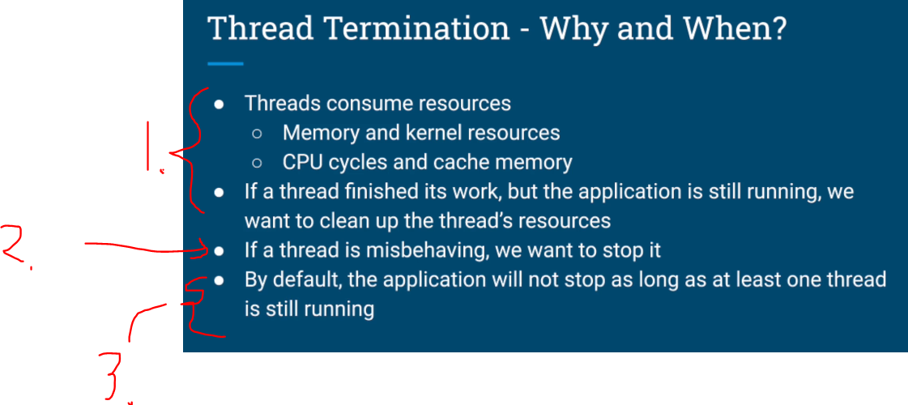

# Chapter 03 - Threading Fundamentals - Thread Coordination.

Threading Fundamentals - Thread Coordination.

# What I learned.

# Thread Termination & Daemon Threads

    

1. Why need to **start** and **stop** the **thread**.

    

1. Thread consumer **resources**, such as:
    - Memory and kernel resources.
    - CPU cycles and cache memory.
- Also, if the **Thread** has finished its job, we would want to **clean up** its resources. 
2. One reason to **terminate** **thread** is if its:
    - It's not **responding**!
    - The query is **running too long**!
3. We cannot **end** the **Application** if there is threads running.

    

1. `Thread.interupt()`.

    

1. We can send interrupt from the **Thread A** to **Thread B** using `Thread.interrupt()`!

    

1. If the **Thread** which we are trying to **interrupt** is running method that has throws `InterruptedException`. [InterruptedException](https://docs.oracle.com/javase/8/docs/api/java/lang/InterruptedException.html)
2. If this handled **explicitly**.

# Quiz 3: Thread Termination & Daemon Threads

# Joining Threads

# Coding Exercise 2: Multithreaded Calculation

# Multithreaded Calculation - Solution
