# Chapter 03 - Threading Fundamentals - Thread Coordination.

Threading Fundamentals - Thread Coordination.

# What I learned.

# Thread Termination & Daemon Threads.

<div align="center">
    
</div>

1. We will start from this chapter.
    - This will be about the **starting** and **stopping** the **thread**!

<div align="center">
    
</div>

- Why we would need to **terminate** a **thread**.
    - `1.` **Threads** consumes **resources**, such as:
        - Memory and kernel resources.
        - CPU cycles and cache memory.
    - `1.` There is case, if the **thread** has **finished its job**, we would want to **clean up** its **resources**. 
    - `2.` One reason to **terminate** **thread** is if its:
        - It's not **responding**!
        - The query is **running too long**!
    - `3.` We cannot **end** the **application** if there is threads running.

<div align="center">
    
</div>

1. Next we will be dealing with `Thread.interupt()`.

<div align="center">
    
</div>

1. We can send interrupt from the **Thread A** to **Thread B** using `Thread.interrupt()`!

<div align="center">
    
</div>

1. If the **thread** which we are trying to **interrupt** is running method that has throws `InterruptedException`. [InterruptedException](https://docs.oracle.com/javase/8/docs/api/java/lang/InterruptedException.html).
2. If this handled **explicitly**.

- When using the following `Thread.sleep(500000);`.
    - We are waiting for the **thread** to **finish**!

- Example `.GIF` below of the **blocking task**:

<div align="center">
    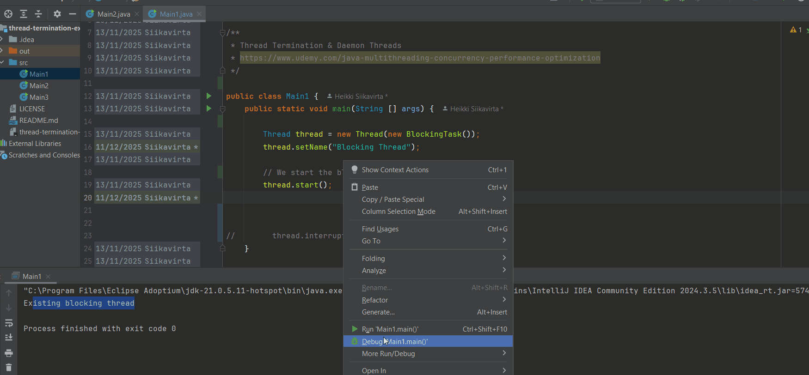
</div>

- Also, you can see what happens when you have running thread `SLEEPING`.

<div align="center">
    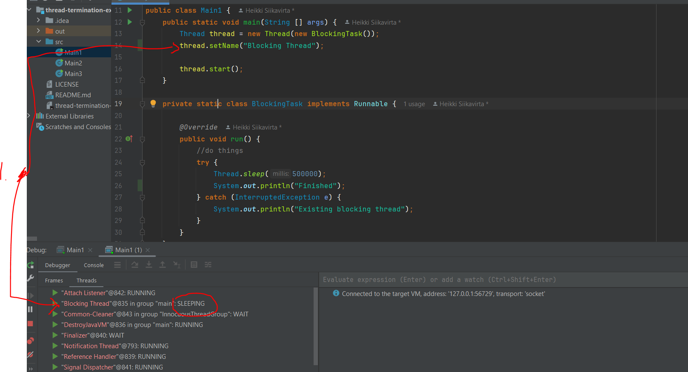
</div>

1. One can see the `SLEEPING` status at the **Thread** debugger tab. 

- We can see that there are no logs until the waiting time is over: 

````

- No logs here man! No patient to wait!

````

<details>

<summary id="Thread progress
" open="true"> <b>The thread code, which will be waiting!</b> </summary>

````
/*
 * Copyright (c) 2019-2023. Michael Pogrebinsky - Top Developer Academy
 * https://topdeveloperacademy.com
 * All rights reserved
 */

/**
 * Thread Termination & Daemon Threads
 * https://www.udemy.com/java-multithreading-concurrency-performance-optimization
 */
public class Main1 {
    public static void main(String [] args) {
        Thread thread = new Thread(new BlockingTask());
        thread.setName("Blocking Thread");

        thread.start();

        //thread.interrupt();
    }

    private static class BlockingTask implements Runnable {

        @Override
        public void run() {
            //do things
            try {
                Thread.sleep(500000);
                System.out.println("Finished");
            } catch (InterruptedException e) {
                System.out.println("Existing blocking thread");
            }
        }
    }
}
````
</details>

> [!TIP]
> We can **solve** this by throwing the `InterruptedException` with the usage of the `thread.interrupt();`⭐

- We can raise the **interrupt**, with following: `thread.interrupt();`.
    - The **main thread** interrupts the **blocked thread**.

- Example `.GIF` below of the **interrupted task**:

<div align="center">
    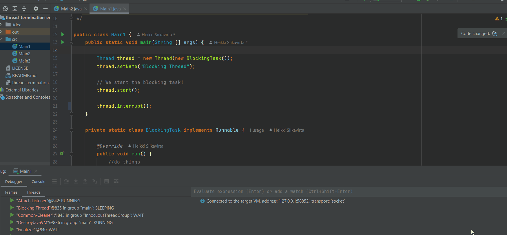
</div>

- We will be getting followings logs: 
    - See the: `Existing blocking thread` in the logs.

````
Connected to the target VM, address: '127.0.0.1:63604', transport: 'socket'
Existing blocking thread
Disconnected from the target VM, address: '127.0.0.1:63604', transport: 'socket'

Process finished with exit code 0
````

<details>

<summary id="Thread progress
" open="true"> <b>The thread code, that will throw interrupted task!</b> </summary>

````
/*
 * Copyright (c) 2019-2023. Michael Pogrebinsky - Top Developer Academy
 * https://topdeveloperacademy.com
 * All rights reserved
 */

/**
 * Thread Termination & Daemon Threads
 * https://www.udemy.com/java-multithreading-concurrency-performance-optimization
 */

public class Main1 {
    public static void main(String [] args) {

        Thread thread = new Thread(new BlockingTask());
        thread.setName("Blocking Thread");

        // We start the blocking task!
        thread.start();

        thread.interrupt();
    }

    private static class BlockingTask implements Runnable {

        @Override
        public void run() {
            //do things
            try {
                Thread.sleep(500000);
                System.out.println("Finished");
            } catch (InterruptedException e) {
                System.out.println("Existing blocking thread");
            }
        }
    }
}
````
</details>

- Next we will be using following formula for the **thread**:

$$
\text{result} = \text{base}^{\text{power}}
$$

<details>
<summary id="Thread progress
" open="true"> <b>The thread that takes lot of time when computing!</b> </summary>

````
/*
 * Copyright (c) 2019-2023. Michael Pogrebinsky - Top Developer Academy
 * https://topdeveloperacademy.com
 * All rights reserved
 */

import java.math.BigInteger;

/**
 * Thread Termination & Daemon Threads
 * https://www.udemy.com/java-multithreading-concurrency-performance-optimization
 */
public class Main2 {

    public static void main(String[] args) {
        Thread thread = new Thread(new LongComputationTask(new BigInteger("200000"), new BigInteger("100000000")));

        thread.start();
        thread.interrupt();
    }

    private static class LongComputationTask implements Runnable {
        private BigInteger base;
        private BigInteger power;

        public LongComputationTask(BigInteger base, BigInteger power) {
            this.base = base;
            this.power = power;
        }

        @Override
        public void run() {
            System.out.println(base + "^" + power + " = " + pow(base, power));
        }

        private BigInteger pow(BigInteger base, BigInteger power) {
            BigInteger result = BigInteger.ONE;

            for (BigInteger i = BigInteger.ZERO; i.compareTo(power) != 0; i = i.add(BigInteger.ONE)) {
                result = result.multiply(base);
            }

            return result;
        }
    }
}
````
</details>

- The long calculation taking place below:

<div align="center">
    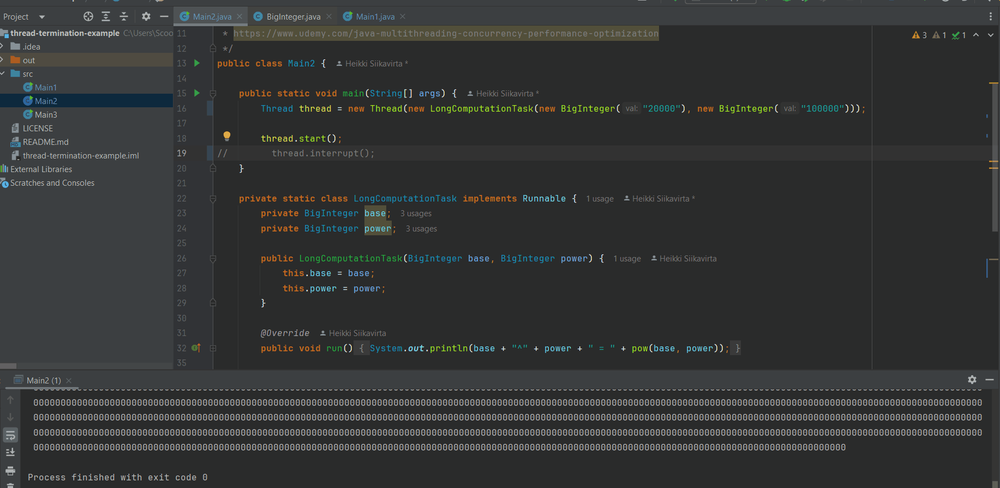
</div>

- Even with the **interrupt**, the thread will not be stopped.

<div align="center">
    
</div>

- We cannot **throw** `InterruptedException` since its thrown automatically when a thread is **interrupted**.
    - It is thrown only by specific **blocking methods**, such as:
        - `Thread.sleep(...)`.

- To check **current thread** if it was **interrupted**, we can use `Thread.currentThread().isInterrupted()`.

- We need to find sweet stop to make the **interrupted** check!

<div align="center">
    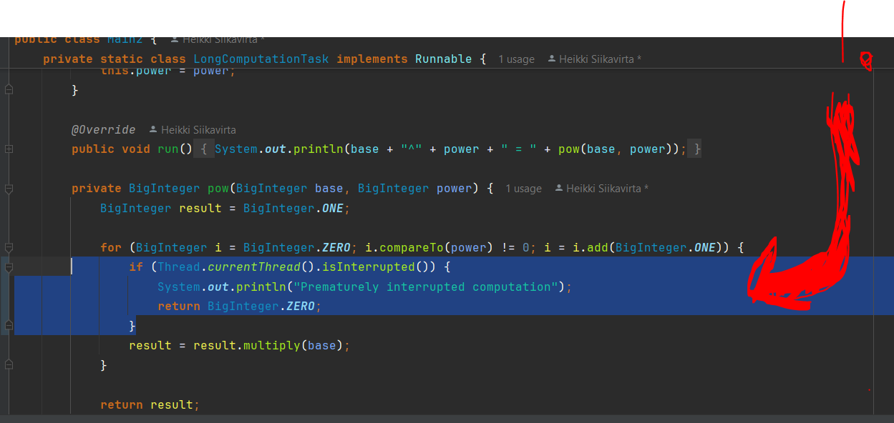
</div>

1. Here is the **sweet spot** to add the check!

<details>
<summary id="Thread progress
" open="true"> <b>The thread that takes lot of time when computing and with the interrupt!</b> </summary>

````
/*
 * Copyright (c) 2019-2023. Michael Pogrebinsky - Top Developer Academy
 * https://topdeveloperacademy.com
 * All rights reserved
 */

import java.math.BigInteger;

/**
 * Thread Termination & Daemon Threads
 * https://www.udemy.com/java-multithreading-concurrency-performance-optimization
 */
public class Main2 {

    public static void main(String[] args) {
        Thread thread = new Thread(new LongComputationTask(new BigInteger("200000"), new BigInteger("1000000")));

        thread.start();
        thread.interrupt();
    }

    private static class LongComputationTask implements Runnable {
        private BigInteger base;
        private BigInteger power;

        public LongComputationTask(BigInteger base, BigInteger power) {
            this.base = base;
            this.power = power;
        }

        @Override
        public void run() {
            System.out.println(base + "^" + power + " = " + pow(base, power));
        }

        private BigInteger pow(BigInteger base, BigInteger power) {
            BigInteger result = BigInteger.ONE;

            for (BigInteger i = BigInteger.ZERO; i.compareTo(power) != 0; i = i.add(BigInteger.ONE)) {

                result = result.multiply(base);
            }

            return result;
        }
    }
}
````
</details>

<div align="center">
    
</div>

1. Next we will be dealing with **Deamon thread**.

<div align="center">
    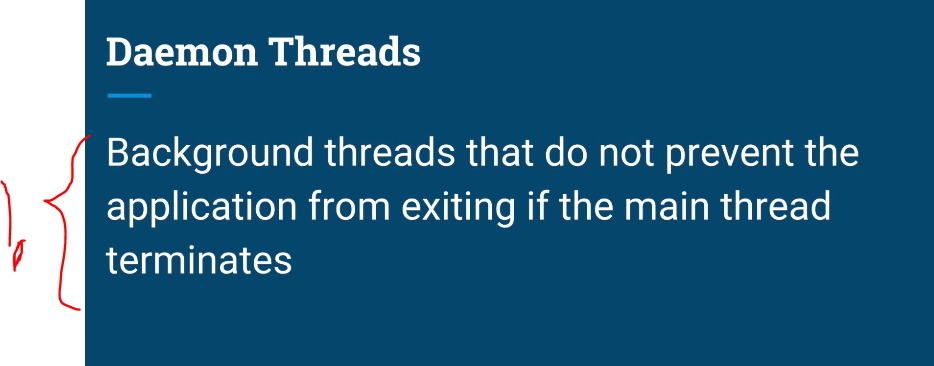
</div>

1. **Deamon Threads** run in background. 
    - They are ideal for are background helpers. 

- **Normal** threads prevent the **JVM** from exiting.

<div align="center">
    
</div>

<div align="center">
    
</div>

- We can even set `thread.setDaemon(true);` to old **tread**, which takes time. This thread will **end gracefully**!

<div align="center">
    
</div>

<details>
<summary id="Thread progress
" open="true"> <b>The thread that takes lot of time, exiting grasefully with .setDaemon(true)!</b> </summary>

````
/*
 * Copyright (c) 2019-2023. Michael Pogrebinsky - Top Developer Academy
 * https://topdeveloperacademy.com
 * All rights reserved
 */

import java.math.BigInteger;

/**
 * Thread Termination & Daemon Threads
 * https://www.udemy.com/java-multithreading-concurrency-performance-optimization
 */
public class Main2 {

    public static void main(String[] args) {
        Thread thread = new Thread(new LongComputationTask(new BigInteger("200000"), new BigInteger("1000000")));

        thread.setDaemon(true);
        thread.start();
        thread.interrupt();
    }

    private static class LongComputationTask implements Runnable {
        private BigInteger base;
        private BigInteger power;

        public LongComputationTask(BigInteger base, BigInteger power) {
            this.base = base;
            this.power = power;
        }

        @Override
        public void run() {
            System.out.println(base + "^" + power + " = " + pow(base, power));
        }

        private BigInteger pow(BigInteger base, BigInteger power) {
            BigInteger result = BigInteger.ONE;

            for (BigInteger i = BigInteger.ZERO; i.compareTo(power) != 0; i = i.add(BigInteger.ONE)) {
                if (Thread.currentThread().isInterrupted()) {
                    System.out.println("Prematurely interrupted computation");
                    return BigInteger.ZERO;
                }
                result = result.multiply(base);
            }

            return result;
        }
    }
}
````
</details>

<div align="center">
    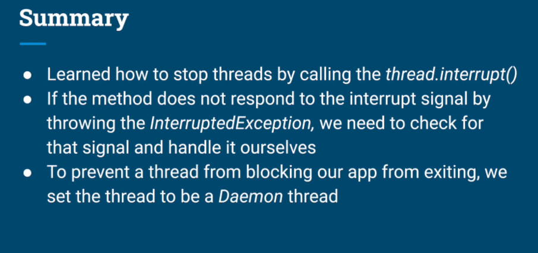
</div>

# Joining Threads.

<div align="center">
    
</div>

1. We need to know that when the **thread** has **completed**, and we need to know when we can **expect it** to be finish!
    - We can take advantage of the **threads** when they are run in **parallel** and **aggregate** result at the end.

> **Aggregate** mean to combine the results in one point. **Wait** → then **combine** (manually).

<div align="center">
    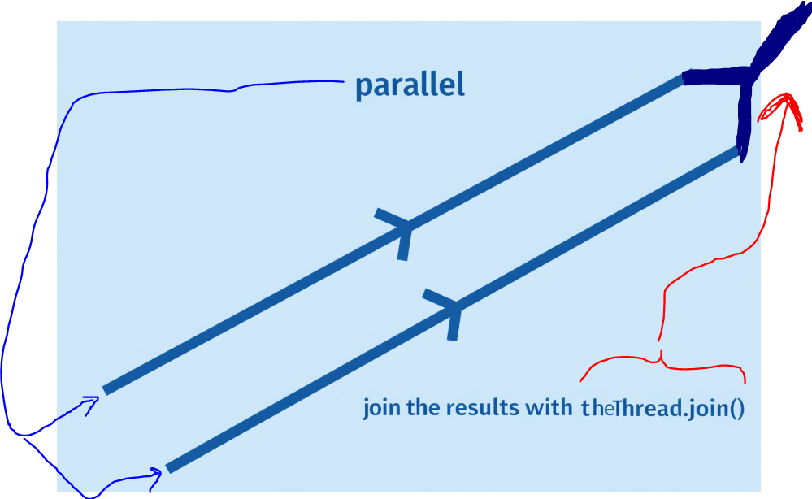
</div>
 
<div align="center">
    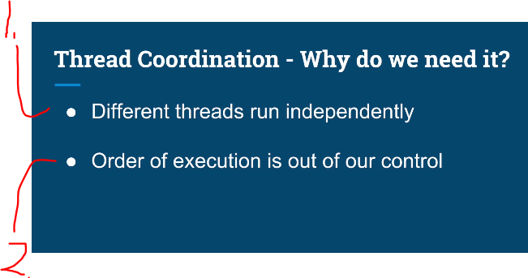
</div>

1. Remember, **threads** runs independently of each others!
2. Like we saw, the order is out of our control! See the [example]()!

- TODO Add this to link: `thread_finishing_when_they_are_ready`.

- Different scenarios of the **thread** execution order:

<div align="center">
    
</div>

1. The scenario **Thread A** finishes before the **Thread B**. `2.`.

<div align="center">
    
</div>

1. The scenario **Thread B** finishes before the **Thread A**. `2.`.

<div align="center">
    
</div>

1. **Concurrency** is when the tasks are run **after each other**!

<div align="center">
    
</div>

1. We may have them be run **concurrently**!

<div align="center">
    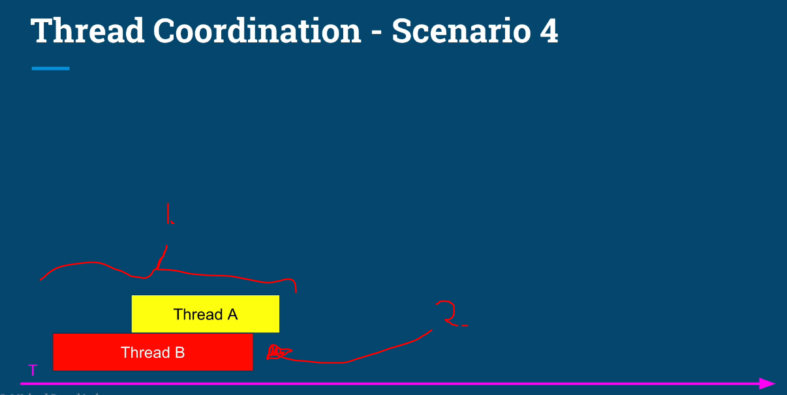
</div>

1. We may have them be run **parallel**.
2. Furthermore, we will have no idea, if **Thread A** or **Thread B** finishes first!

<div align="center">
    
</div>

1. If there **Thread A** depends on the **Thread B**. Example if **Thread A** is having calculation result, which are needed in **Thread B**.

<div align="center">
    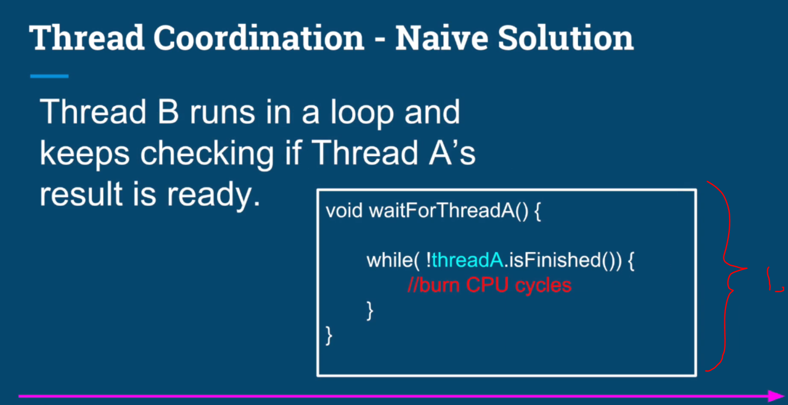
</div>

1. Here the **Thread B** will be checking following **checking loop**. This is called `busy waiting` or `spin-waiting`.

<div align="center">
    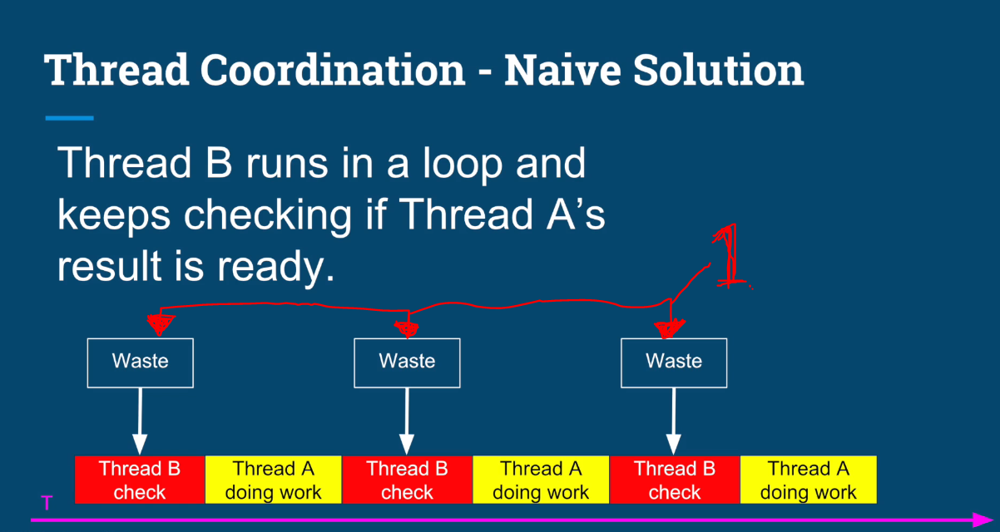
</div>

1. While **Thread A** is doing the work, the **Thread B** needs to **waste** CPU time for checking if the **A** has finished.

<div align="center">
    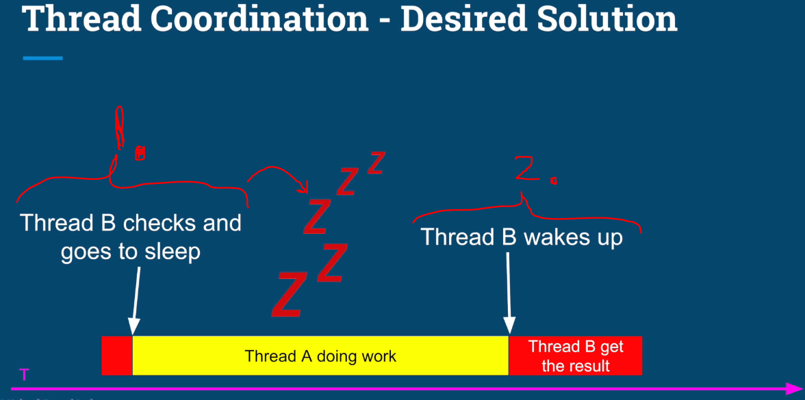
</div>

1. What we would want to **Thread B** to go sleep, when **Thread A** does the work.

2. **Thread B** wakes up when **Thread A** is finished.

<div align="center">
    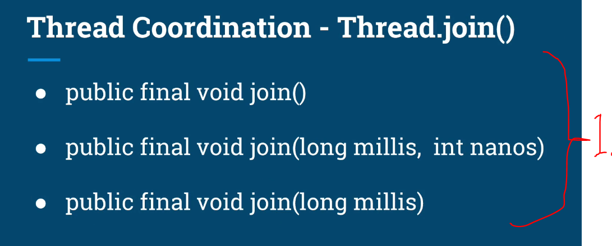
</div>

1. Signatures below:
``` 
public final void join()
public final void join(long millis, int nanos)
public final void join(long millis)
```


> **Factorial** - *“In how many different ways can things be arranged or ordered?”*

$$
n! = \prod_{i=1}^{n} i
$$

<details>
<summary id="The factorial formula" open="true"> <b>Factorial diagram!</b> </summary>

<div align="center">
    
</div>
</details>

<br>

- We will have **Factorial Calculation** and since this is **CPU heavy operation**.
    - We would want to have its in own **thread**.

<br>

- Furthermore, we have the following factorials: `List<Long> inputNumbers = Arrays.asList(100000000L, 3435L, 35435L, 2324L, 4656L, 23L, 5556L);`.

- Calculating **thread** for given **factorial** number: 

````
        public BigInteger factorial(long n) {
            BigInteger tempResult = BigInteger.ONE;

            for (long i = n; i > 0; i--) {
                tempResult = tempResult.multiply(new BigInteger((Long.toString(i))));
            }
            return tempResult;
        }
````

- We will be holding the **value** in `BigInteger` since the **factorial** number can be long! 
    - `isFinished` is used to check if the calculation has **finished**!

````
public static class FactorialThread extends Thread {
        private long inputNumber;
        private BigInteger result = BigInteger.ZERO;
        private boolean isFinished = false;

        public FactorialThread(long inputNumber) {
            this.inputNumber = inputNumber;
        }

        @Override
        public void run() {
            this.result = factorial(inputNumber);
            this.isFinished = true;
        }

     ... code here ...

        public BigInteger getResult() {
            return result;
        }

        public boolean isFinished() {
            return isFinished;
        }
    }
````

- We will be executing this **thread** as following:
    - They will be running **concurrently**. This will be inside `main`.

````
List<FactorialThread> threads = new ArrayList<>();

        for (long inputNumber : inputNumbers) {
            threads.add(new FactorialThread(inputNumber));
        }

        for (Thread thread : threads) {
            thread.start();
        }
````

- Next, we will be checking if the **thread** or **threads** have been finished:

````
for (int i = 0; i < inputNumbers.size(); i++) {
            FactorialThread factorialThread = threads.get(i);
            if (factorialThread.isFinished()) {
                System.out.println("Factorial of " + inputNumbers.get(i) + " is " + factorialThread.getResult());
            } else {
                System.out.println("The calculation for " + inputNumbers.get(i) + " is still in progress");
            }
        }
    }
````

- When we will be executing following code, we will have **one** problem. It will be when the `main` thread has finished checking the **FactorialThread**'s. The **FactorialThread**'s might have **not be** finished its calculations, hence we call this **Race Conditioning**!

````
    public static void main(String[] args) throws InterruptedException {
        List<Long> inputNumbers = Arrays.asList(100000000L, 3435L, 35435L, 2324L, 4656L, 23L, 5556L);

        List<FactorialThread> threads = new ArrayList<>();

        for (long inputNumber : inputNumbers) {
            threads.add(new FactorialThread(inputNumber));
        }

        for (Thread thread : threads) {
            thread.start();
        }

        for (int i = 0; i < inputNumbers.size(); i++) {
            FactorialThread factorialThread = threads.get(i);
            if (factorialThread.isFinished()) {
                System.out.println("Factorial of " + inputNumbers.get(i) + " is " + factorialThread.getResult());
            } else {
                System.out.println("The calculation for " + inputNumbers.get(i) + " is still in progress");
            }
        }
    }
````

- Illustration of the **race condition** below:

<div align="center">
    
</div>

1. Only one `FactorialThread` thread have been finished, by the time when the `main` **thread** has been finished.

> [!IMPORTANT]
> We are having **Race Condition**.

<div align="center">
    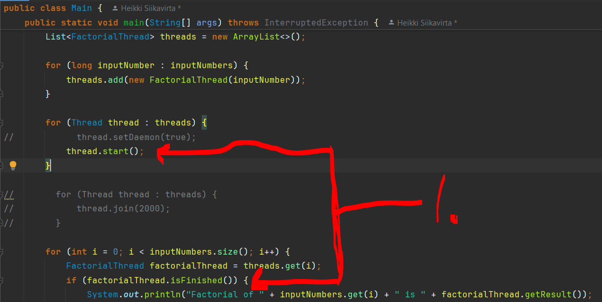
</div>

1. These two line `thread.start()` and `if (factorialThread.isFinished()) {` will have **race condition**!

- These will be racing towards their goals **independently**.
    - We will not know the state of the **thread**, when the `main` **thread** is checking the results!

<div align="center">
    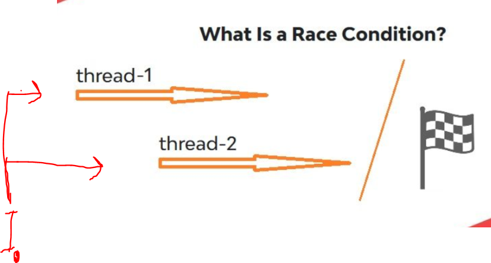
</div>

1. Both **threads** will be racing towards their goals **independently**!

- We will `.join` the **threads** to make them **wait**.s
    - At the end, `join()` makes the calling thread wait!
    - Execution only continues after all threads have finished.

````
        for (Thread thread : threads) {
            thread.join();
        }
````

- Only the **restriction** is that the **threads** are needed to be waited until all are ready!
    - If there is long number like, which is needed to be waited like: `100000L`!

<div align="center">
    
</div>

- We can give max seconds to the `.join()` to be waited. 

````
        for (Thread thread : threads) {
            thread.join(2000); // This makes the thread wait for the two second, if its not finished it will exclude it out!
        }
````

<div align="center">
    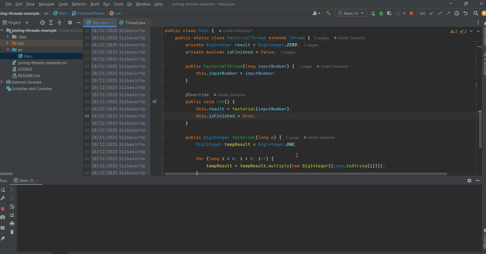
</div>


- You can see the **two** seconds being waited by the `.join`. There will be still one **thread** `The calculation for 100000 is still in progress`.

<details>
<summary id="The factorial thread" open="true"> <b>Factorial Thread Full Java code!</b> </summary>

````
    /*
 * Copyright (c) 2019-2023. Michael Pogrebinsky - Top Developer Academy
 * https://topdeveloperacademy.com
 * All rights reserved
 */

import java.math.BigInteger;
import java.util.ArrayList;
import java.util.Arrays;
import java.util.List;

/**
 * Joining Threads
 * https://www.udemy.com/java-multithreading-concurrency-performance-optimization
 */
public class Main {
    public static void main(String[] args) throws InterruptedException {
        List<Long> inputNumbers = Arrays.asList(100000000L, 3435L, 35435L, 2324L, 4656L, 23L, 5556L);

        List<FactorialThread> threads = new ArrayList<>();

        for (long inputNumber : inputNumbers) {
            threads.add(new FactorialThread(inputNumber));
        }

        for (Thread thread : threads) {
            thread.setDaemon(true);
            thread.start();
        }

        for (Thread thread : threads) {
            thread.join(2000);
        }

        for (int i = 0; i < inputNumbers.size(); i++) {
            FactorialThread factorialThread = threads.get(i);
            if (factorialThread.isFinished()) {
                System.out.println("Factorial of " + inputNumbers.get(i) + " is " + factorialThread.getResult());
            } else {
                System.out.println("The calculation for " + inputNumbers.get(i) + " is still in progress");
            }
        }
    }

    public static class FactorialThread extends Thread {
        private long inputNumber;
        private BigInteger result = BigInteger.ZERO;
        private boolean isFinished = false;

        public FactorialThread(long inputNumber) {
            this.inputNumber = inputNumber;
        }

        @Override
        public void run() {
            this.result = factorial(inputNumber);
            this.isFinished = true;
        }

        public BigInteger factorial(long n) {
            BigInteger tempResult = BigInteger.ONE;

            for (long i = n; i > 0; i--) {
                tempResult = tempResult.multiply(new BigInteger((Long.toString(i))));
            }
            return tempResult;
        }

        public BigInteger getResult() {
            return result;
        }

        public boolean isFinished() {
            return isFinished;
        }
    }
}
````
</details>

# Coding Exercise 2: Multithreaded Calculation.

# Multithreaded Calculation - Solution.
