# Chapter 01 - Introduction.

Introduction.

# What I learned.

# Motivation & Operating Systems fundamentals - Part 01.

<div align="center">
    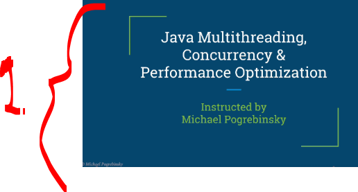
</div>

1. First lecture.

<div align="center">
    
</div>

1. We need **threads** for **responsiveness** and for **performance**!
2. Let's go thought, why we need multiple threads! We start from **responsiveness**!

<div align="center">
    
</div>

1. Let's start from explain the **Responsiveness**.

<div align="center">
    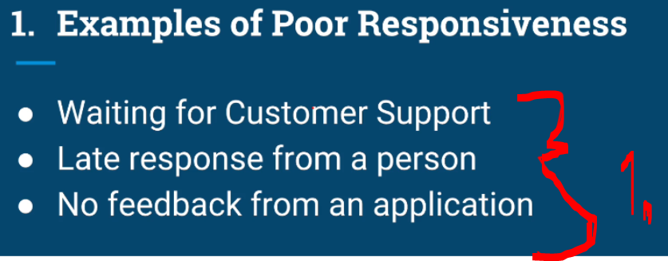
</div>

1. Something does not respond soon. These are signs of poor **responsiveness**.

<div align="center">
    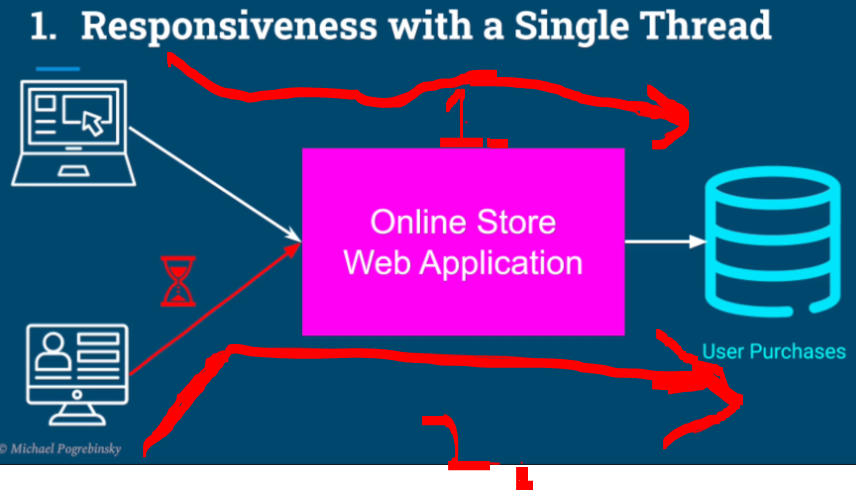
</div>

1. If there is one user, with **HUGE** order, which makes the database query long, the second user `2.` needs to wait for the answer!

<div align="center">
    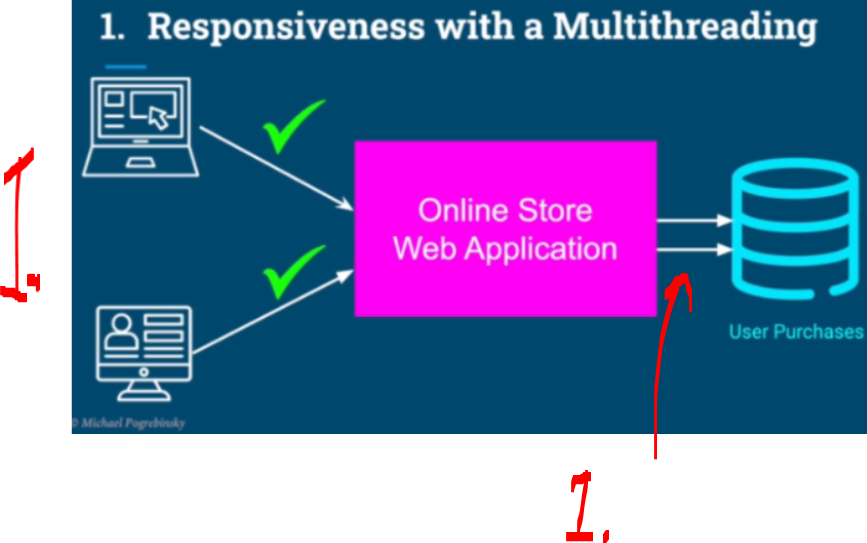
</div>

1. We can achieve multiple units working, in their **own** thread.

<div align="center">
    
</div>

1. Responsiveness is important in **UX**, example: Once the **click** is happened, we would want to **have action** on the screen!
    - This can be achieved by using the **Multiple threads**!

<div align="center">
    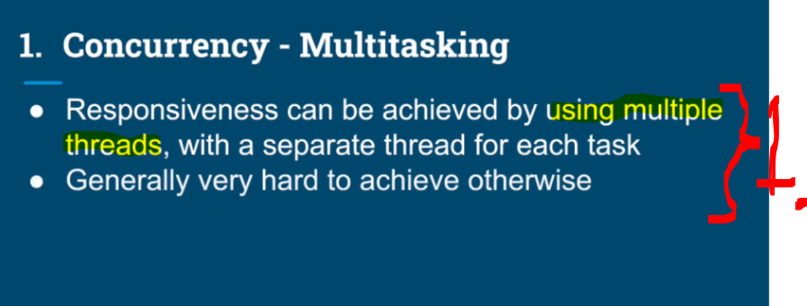
</div>

1. We can achieve this **responsiveness** by using the **multiple threads**

<div align="center">
    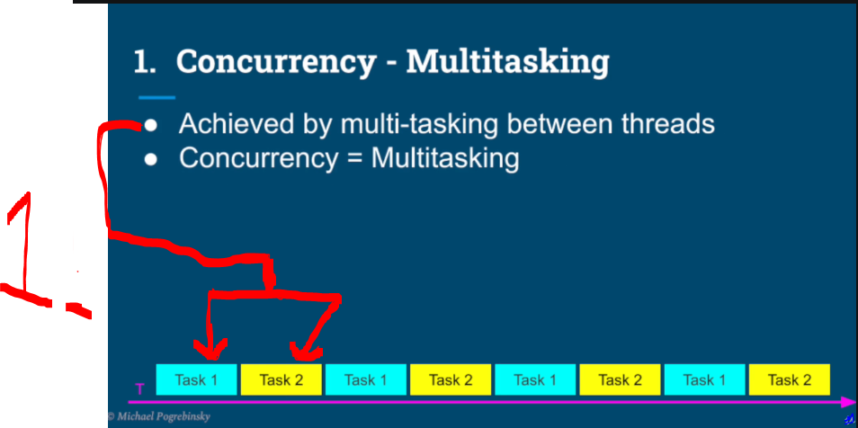
</div>

1. We achieve illusion of **concurrency** making task run next to each other. Makes it so that they **appear** to be run in **same time**!
    - Even with **one core**!

<div align="center">
    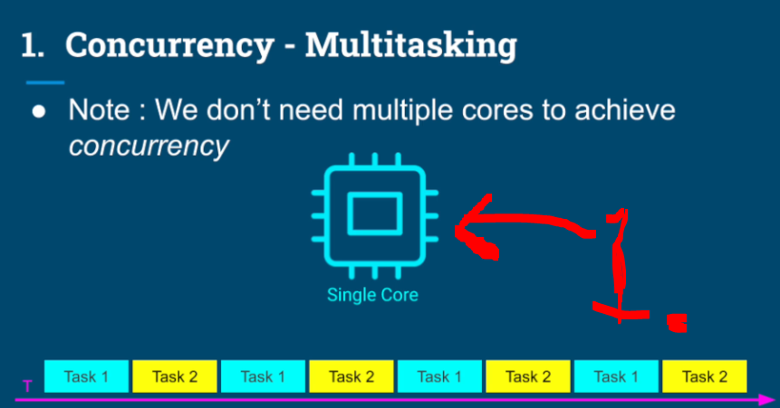
</div>

1. Furthermore, we can **achieve** this even using with **one core**.

<div align="center">
    
</div>

1. Second reason, why we need **threads** is **performance**!

<div align="center">
    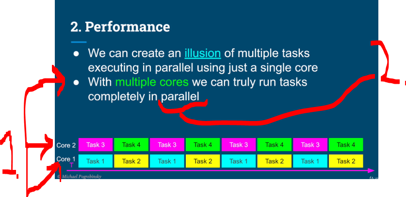
</div>

1. The performance is improved, with **multiple cores**!
2. We can achieve this **parallelism**, with multiple cores.

<div align="center">
    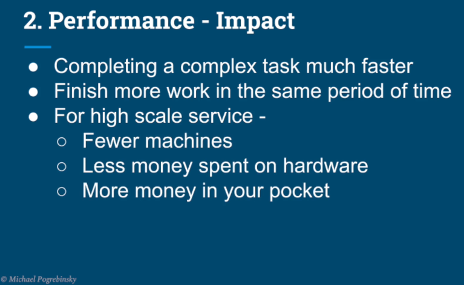
</div>

<div align="center">
    
</div>

<div align="center">
    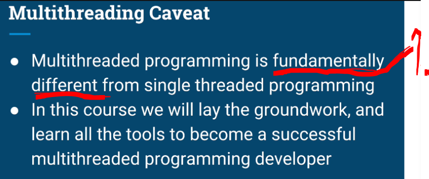
</div>

1. **Multithreaded** programming is different from the **single threading**.

<div align="center">
    
</div>

<div align="center">
    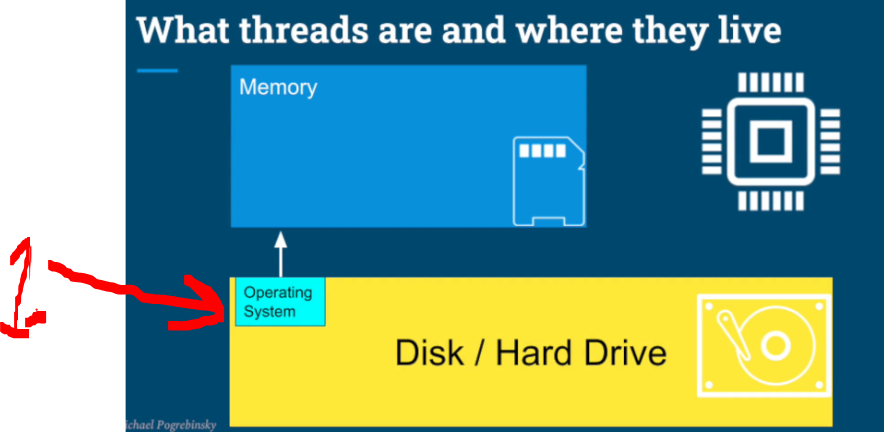
</div>

1. **OS** is loaded from the hard disk to memory on the **startup**!

<div align="center">
    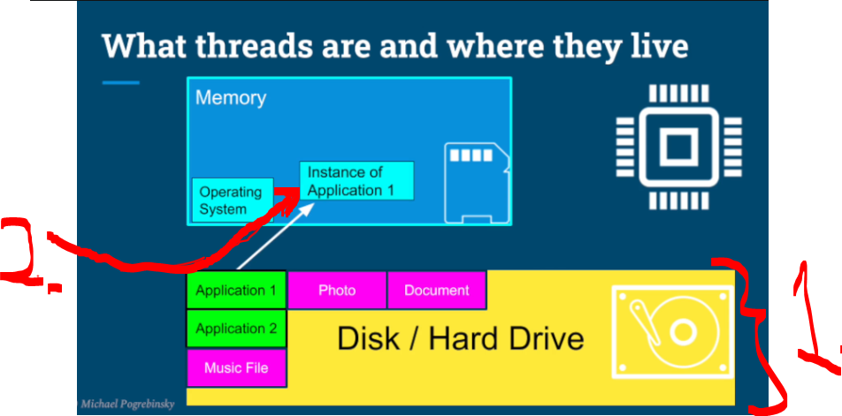
</div>

1. Applications are residing in **hard drive**!
2. The **OS** will take the program from the **disk** and makes instance to the **memory**. 

<div align="center">
    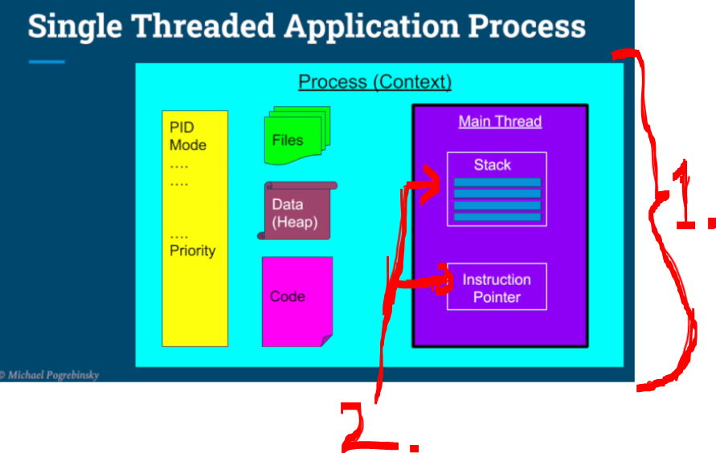
</div>

1. Instance of application in the memory is created! The instance of the program, which is loaded from the **Hard Drive** is called **Process** or the **Context of the application**.
2. **Thread** contains the **Stack** and the **Instruction Pointer**.

<div align="center">
    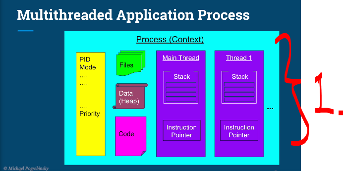
</div>

1. In Multithreaded application, they have their **own stack** and **instruction pointers**!

<div align="center">
    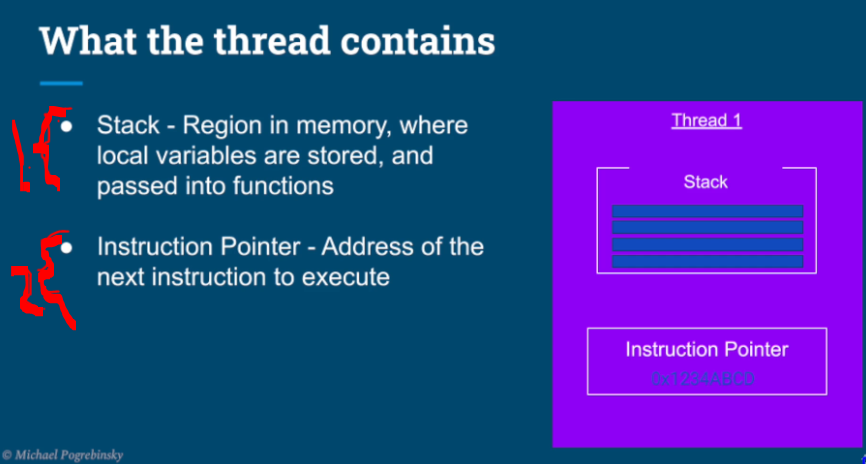
</div>

1. **Stack**: Region in memory, where **local variables** are stored, and passed into functions.
2. **Instruction Pointer**: Address of the **next instruction** to be **executed**.

<div align="center">
    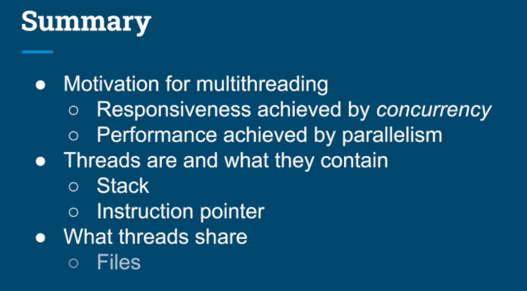
</div>

# Operating Systems Fundamentals - Part 02.

<div align="center">
    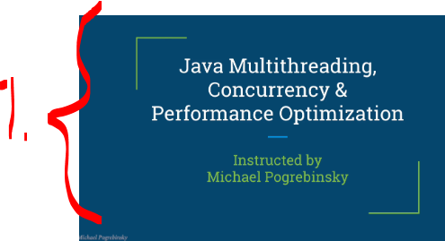
</div>

1. We will be finishing the chapters in the threads!

<div align="center">
    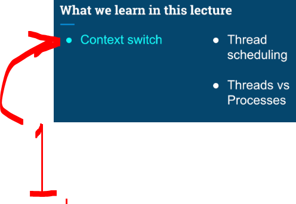
</div>


1. What is the **Context Switches**!

- In the end, we need to clarify, when to use:
    - **Process**.
    - **Threads**.

<div align="center">
    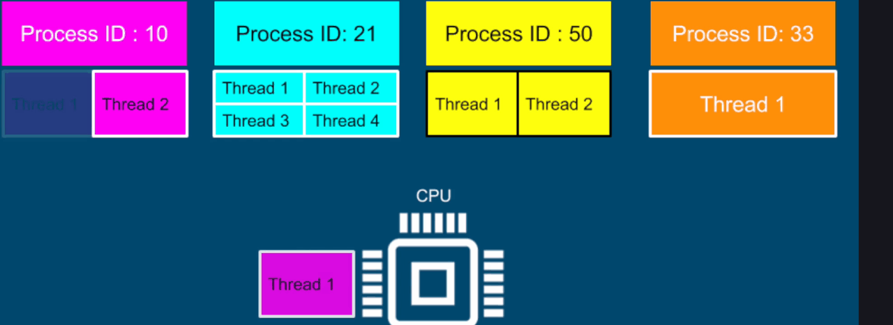
</div>

- There will be multiple **Threads** than the cores to be processed!
    - **CPU** will have to run **one thread** and then **stop thread** and resume the other one!

<div align="center">
    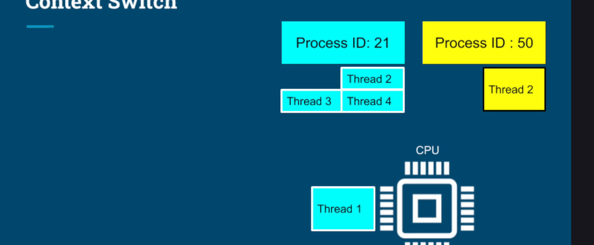
</div>

- Act of:
    - `Stop thread 1`. **Stopping one thread**.
    - `Schedule thread 1 out`. **Scheduling one thread out**.
    - `Schedule thread 2 in`. **Scheduling one thread in**.
    - `Start Thread 2`. **Starting one tread**.
        - This is called **Context Switching**.

<div align="center">
    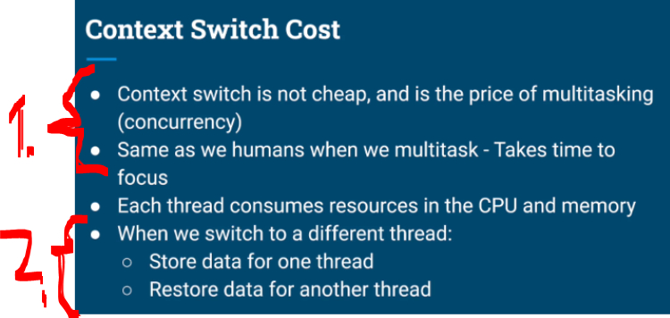
</div>

1. **Context Switch** is **not cheap**, when dealing with many threads!
2. Every **Context Switch**, we need to **load** or **store** data of one tread and restore the another!

<div align="center">
    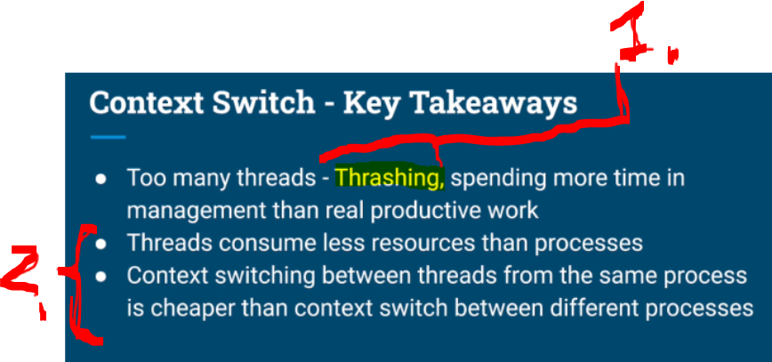
</div>

1. **Thrashing**, when time is spent more on the **switching the context** rather than actual work in the **CPU**!
2. In general **Threads** consumes less resources than the **Process**
    - **Context Switching** is cheaper in general, if the switch is happening inside **same process**.

<div align="center">
    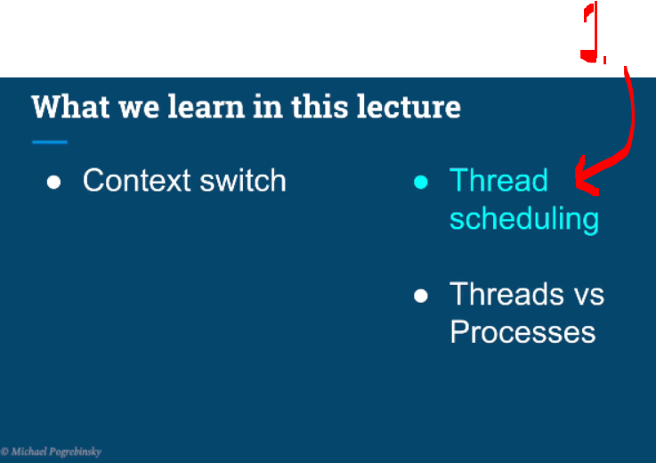
</div>

1. Next we will be looking when **OS** will switch **thread** and when then the **context switch** is performed!

- In this example:

<div align="center">
    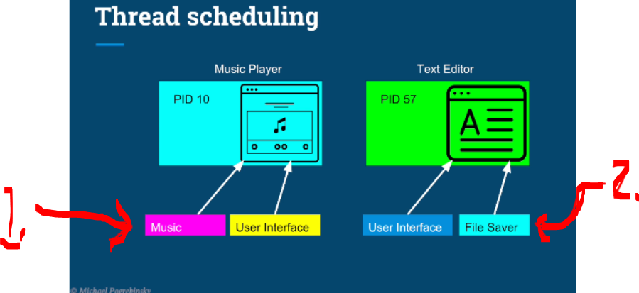
</div>

1. There **two** threads for the **Music Player**.
    - One for **Music Logic** and another for the **UI**!
2. There **two** threads for the **Text Editor**.
    - One for UI and another for **File Saver**.

<div align="center">
    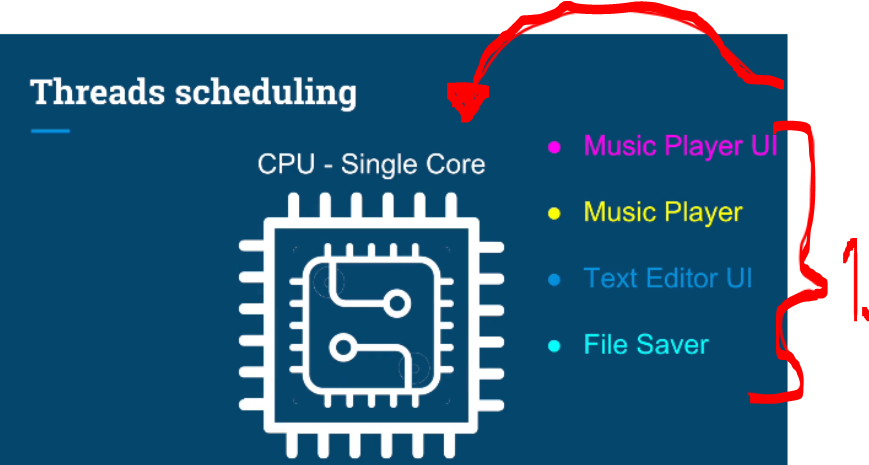
</div>

1. There will be **4** different threads from the **Music Player** and **Text Editor** app, in which **One CPU**, needs to prioritize with the **executing**.

<div align="center">
    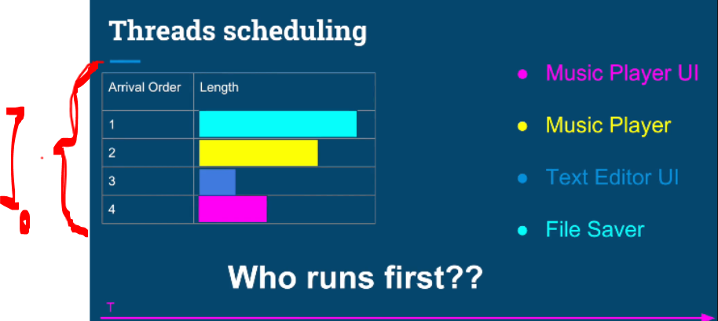
</div>

1. Which gets time to run first in **CPU**?

- If we decide the **First Cone First Serve** strategy, below is the example: 

<div align="center">
    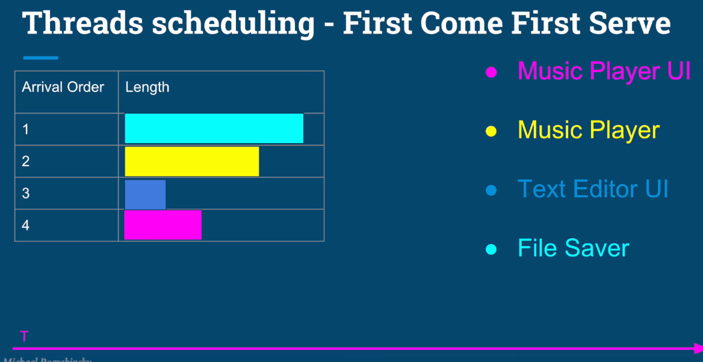
</div>

- We can use **First Come, First Served**.

<div align="center">
    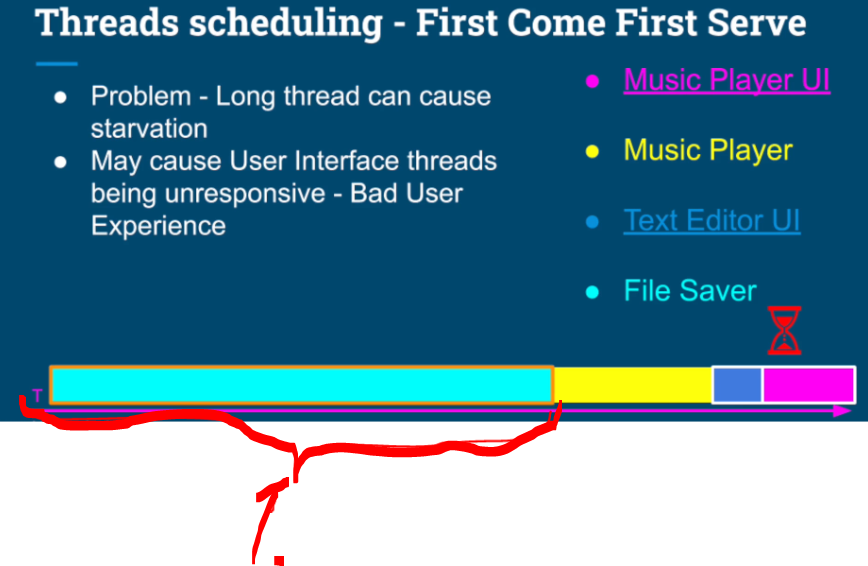
</div>

1. If there is **Thread** that takes much of time, this will cause **starvation** for other **Threads**.
    - **UI threads** can have big problem, with this if they get jammed!

<div align="center">
    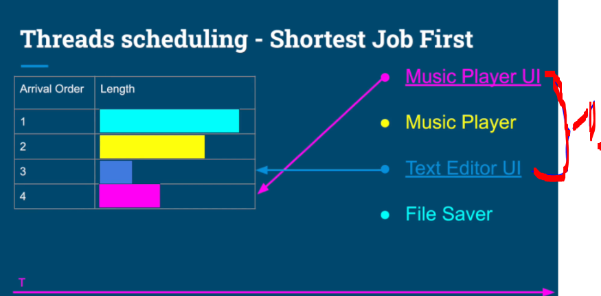
</div>

1. **UI** threads **usually** have **shorter**.
    - They usually respond to the input of the user and update the screen!

- We will see problem, with prioritizing **shorter treads**!

<div align="center">
    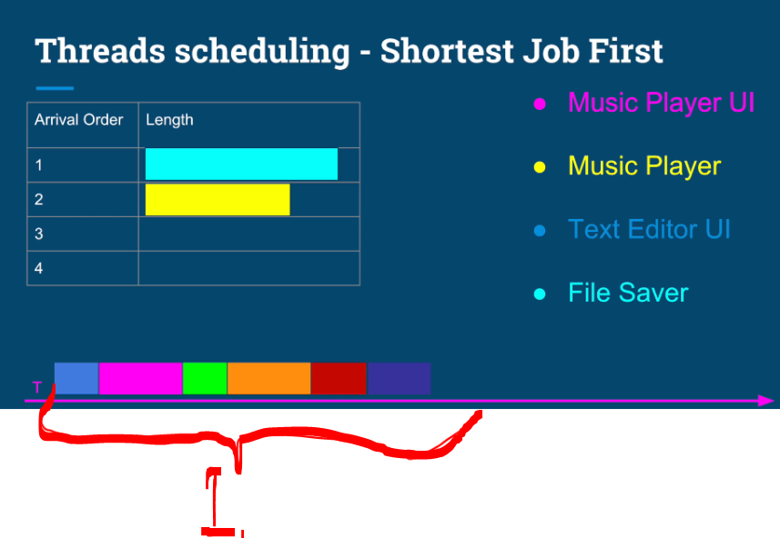
</div>

1. If the **shorter jobs** get into the **scheduling** all the time, other **Threads** will never be executed.

<div align="center">
    
</div>

- **OS scheduler** organizes time **slices** into **epochs** for fairness. 

> An is **epoch** is full round during which every runnable thread (or process) gets a fair share of CPU time.

<div align="center">
    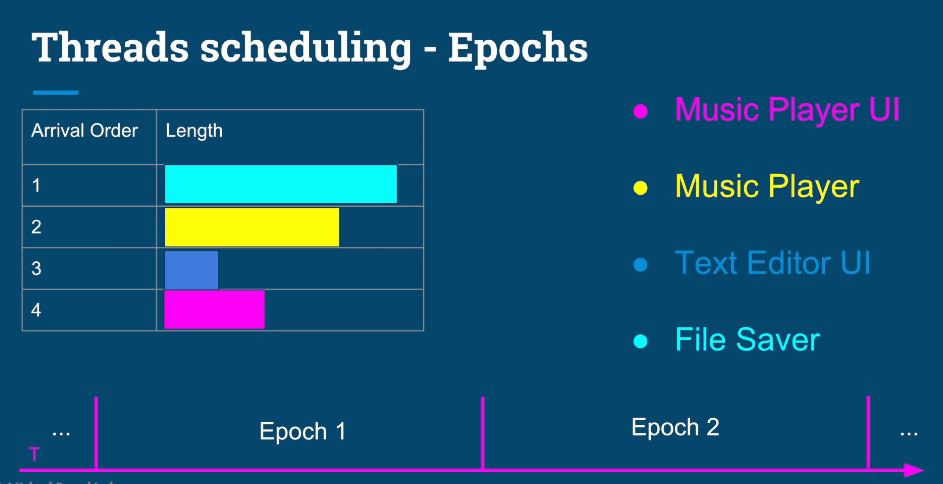
</div>

- We will try to fit processing time into **Epochs**.

<div align="center">
    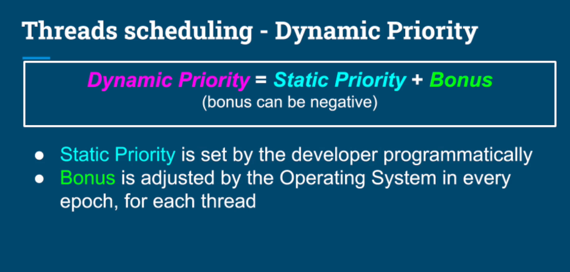
</div>

- `Dynamic Priority` = `Static Priority` + `Bonus`.
    - **Static Priority** is set by the **developer** programmatically.
    - **Bonus** is adjusted by the **Operating System** in every epoch, for each thread.

<div align="center">
    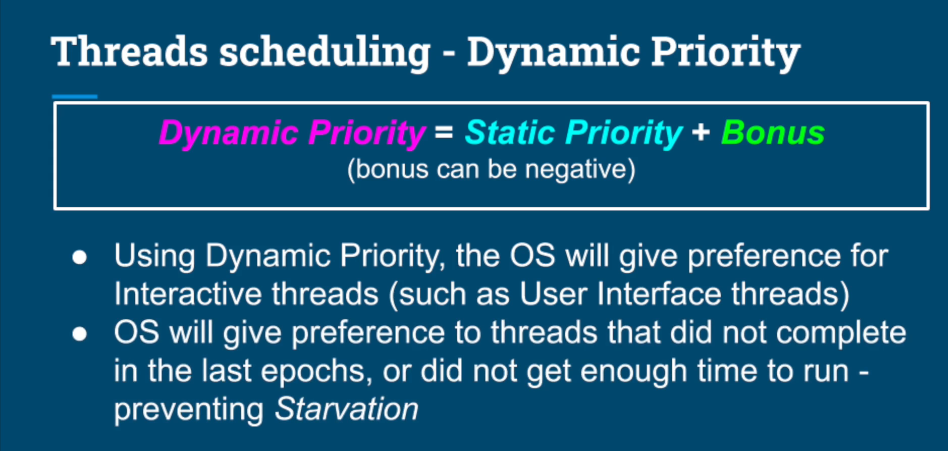
</div>

<div align="center">
    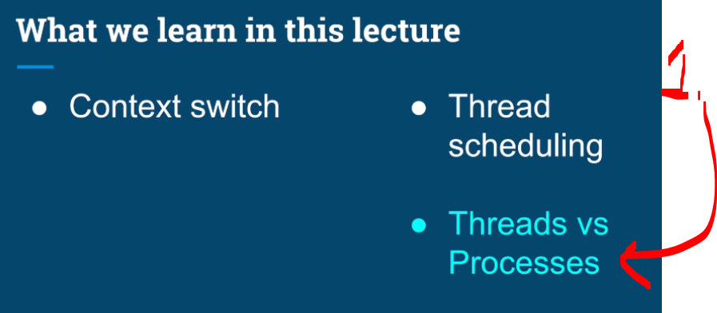
</div>

1. When to use **Threads** or **Process**!

<div align="center">
    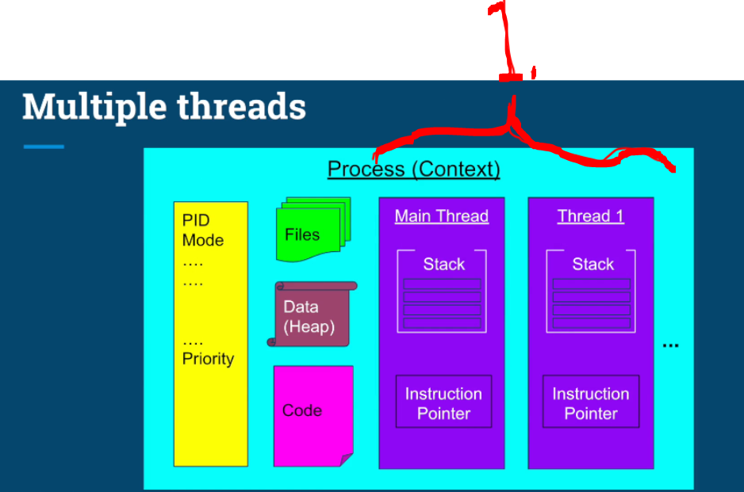
</div>

1. Should we have **Multiple Threads** approach!

<div align="center">
    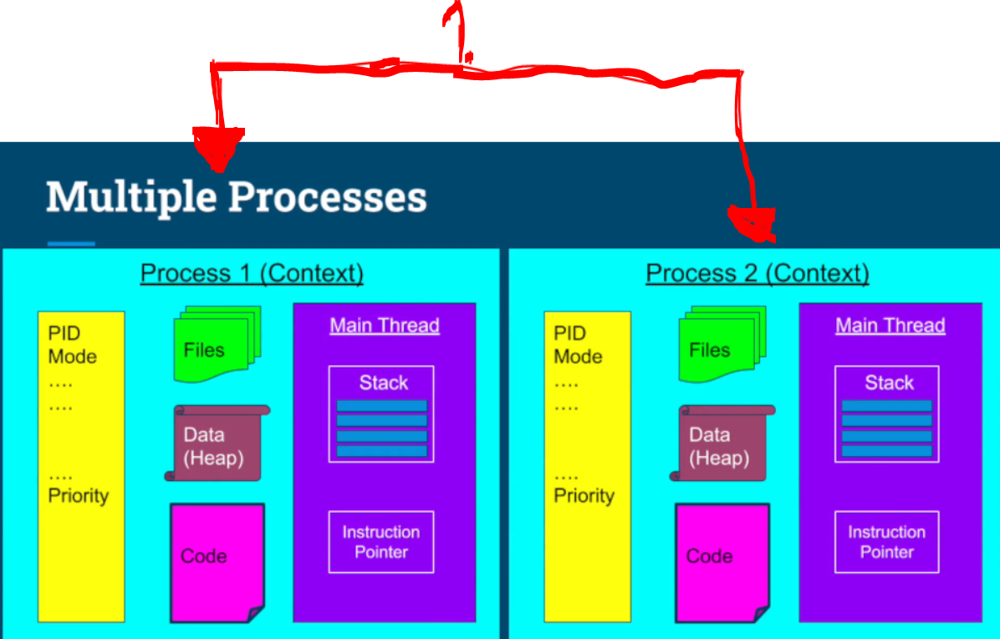
</div>

1. Should we have **Multiple Processes** approach!

<div align="center">
    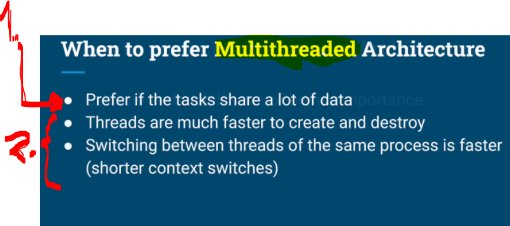
</div>

1. If there are **tasks** that **share** lot of data, then its preferred to use **Multithreaded architecture** approach!
2. Threads are much faster to **create** and **destroy**. Also, **switching** between threads of the same process is faster (shorter context switches), than switching between **processes**.

<div align="center">
    
</div>

1. If the tasks **are unrelated**, its better use **different process**!

<div align="center">
    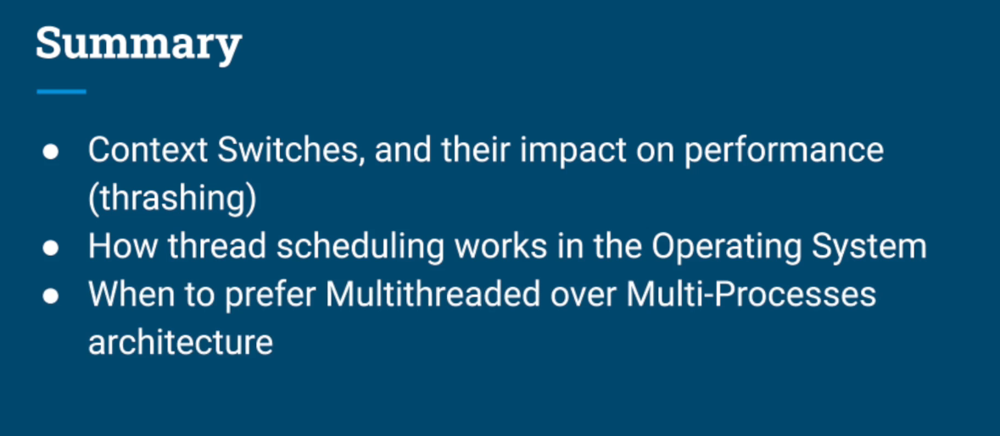
</div>

- Some additional links:
    - [Fair Scheduler](https://developer.ibm.com/tutorials/l-completely-fair-scheduler/).
    - [Tread State](https://docs.oracle.com/javase/8/docs/api/java/lang/Thread.State.html).

# Quiz 01: Threading and Operating Systems Fundamentals Quiz.

<details>

<summary id="Thread progress
" open="true"> <b>Question 01.</b> </summary>

````yaml
Question 01:
Why do we want to use multiple threads in an application?
````

- My answer:

<div align="center">
    
</div>

1. By using **multiple threads** allows an application to handle several tasks at once, enhancing responsiveness and potentially increasing performance through concurrent execution.

</details>

<details>

<summary id="Thread progress
" open="true"> <b>Question 02.</b> </summary>

````yaml
Question 02:
Multiple threads in a single process share
````

- My answer:

<div align="center">
    
</div>

1. The Code `2.` means as following, we can execute threads using the same code:

````Java
thread1 -> add(1, 2)
thread2 -> add(5, 6)
````
- The `add(...)` is being re-used!

</details>

<details>

<summary id="Thread progress
" open="true"> <b>Question 03.</b> </summary>

````yaml
Question 03:
How does the Operating System decide what thread to schedule?
````

- My answer:

<div align="center">
    
</div>

1. The **O**perating **S**ystem decides which thread to run next using the scheduler, based on **scheduling algorithms** and **system state**.

</details>


