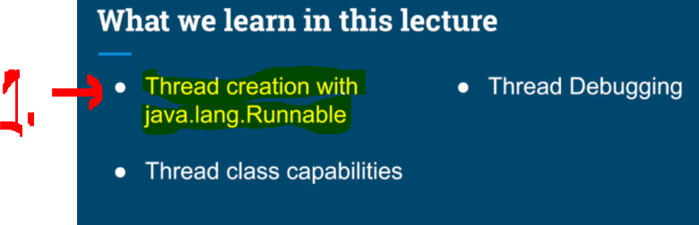
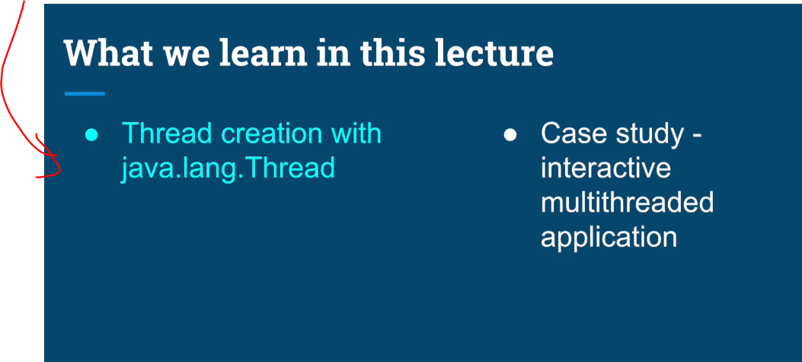
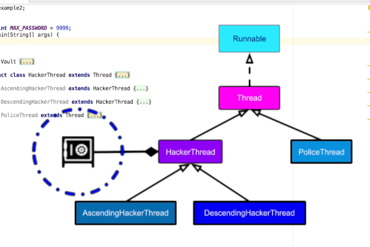
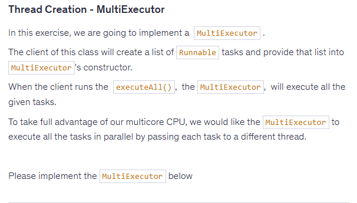

# Chapter 02 - Threading Fundamentals - Thread Creation.

Threading Fundamentals - Thread Creation.

# What I learned.

# Tips about Coding Lectures and Debugging Instructions.

- ✅.

# Threads Creation - Part 1, Thread Capabilities & Debugging.

<div align="center">
    
</div>

1. First we will be looking at the *"hello world"* of the **Threads**. 

- We can create `Thread`, where we input the `Runnable` interface.

````Java
 // First version of the Threads.
        Thread thread = new Thread(new Runnable() {
            @Override
            public void run() {
                // Code that will run in  a new thread
                System.out.println("we are now in thread "+Thread.currentThread().getName());
            }
        });

        System.out.println("We are in thread: " + Thread.currentThread().getName()+ " before starting a new thread");
        thread.start();
        System.out.println("We are in thread: " + Thread.currentThread().getName()+ " after starting a new thread");

        Thread.sleep(1000);
````

- We need to start the **Thread**, with `thread.start();`.
    - Lets the **JVM** create the new **Thread**.
        - **JVM** then requests the **OS** to create **OS thread**!
            - **Scheduler** decides the actual execution time!

- `Thread.currentThread()` get the **current** thread object!

- `Thread.sleep(1000);` instructs **JVM/OS** scheduler that the current thread is temporarily inactive.
    -  This always affects the **Thread** that calls it — the current thread.

<div align="center">
    
</div>

1. Notice when we call the `thread.start()`, the new thread has not been scheduled yet.
    - We will get `1.` messages **first**! You can see the `main`, since it was started from the main **Thread**.
2. **OS scheduler** decides when it actually starts running.
    - It just happened to be run as last (**not always!**).
        - Also notice the different name rather than `main` it will be `Thread-0`, because its from other **Thread**.
 
- This **First** version of the **Threads**, where we explored **Thread** itself:

````Java
/*
 * Copyright (c) 2019-2023. Michael Pogrebinsky - Top Developer Academy
 * https://topdeveloperacademy.com
 * All rights reserved
 */

/**
 *  Threads Creation - Part 1, Thread Capabilities & Debugging
 * https://www.udemy.com/java-multithreading-concurrency-performance-optimization
 */
public class Main1 {

    public static void main(String[] args) throws InterruptedException {
        Thread thread = new Thread(new Runnable() {
            @Override
            public void run() {
                //Code that will run in  a new thread
                System.out.println("we are now in thread "+Thread.currentThread().getName());
                System.out.println("Current thread priority is " + Thread.currentThread().getPriority());
            }
        });

        Thread.sleep(1000);

        thread.setName("New Worker Thread");

        thread.setPriority(Thread.MAX_PRIORITY);

        System.out.println("We are in thread: " + Thread.currentThread().getName()+ " before starting a new thread");
        thread.start();
        System.out.println("We are in thread: " + Thread.currentThread().getName()+ " after starting a new thread");
    }
}
````

- The logging after this:

````
We are in thread: main before starting a new thread
We are in thread: main after starting a new thread
we are now in thread Thread-0
````

- The **second** topic the which **capabilities** the **Thread** will bring us.

<div align="center">
    
</div>

- We can give the **Thread** a name:
    - With the following: `thread.setName("New Worker Thread");`

<div align="center">
    
</div>

1. We can set the **Static Priority**. 
    - The **prioritization** affects the **scheduling decision**!
        - With the following: `thread.setPriority(Thread.MAX_PRIORITY);`
<div align="center">
    
</div>

1. You can see the named **Thread** in the **Debugger** window.

- Also, you can see the **Threads** in the **IntelliJ** window:
    - These are created by the **JVM**:

`````Java
"main"
"Attach Listener"
"Common-Cleaner"
"Finalizer"
"Reference Handler"
"Signal Dispatcher"
"Notification Thread"
`````

- This **Second** version of the **Threads**, where we explored **Thread debugging**:

````Java
        /*
        Thread thread = new Thread(new Runnable() {
            @Override
            public void run() {
                //Code that will run in  a new thread.
                System.out.println("we are now in thread " + Thread.currentThread().getName());
                System.out.println("Current thread priority is " + Thread.currentThread().getPriority());
            }
        });

        Thread.sleep(1000);

        thread.setName("New Worker Thread");

        thread.setPriority(Thread.MAX_PRIORITY);

        System.out.println("We are in thread: " + Thread.currentThread().getName()+ " before starting a new thread");
        thread.start();
        System.out.println("We are in thread: " + Thread.currentThread().getName()+ " after starting a new thread");
````

- The logging after this:

````
We are in thread: main before starting a new thread
We are in thread: main after starting a new thread
we are now in thread New Worker Thread
Current thread priority is 10
````

<div align="center">
    
</div>

- This **Third** version of the **Threads**, where we explored `.setUncaughtExceptionHandler()`:

````Java
       // Third version of Thread.
        Thread thread = new Thread(new Runnable() {
            @Override
            public void run() {
                // Code that will run in  a new thread.
                throw new RuntimeException("Internal Exception");
            }
        });

        thread.setUncaughtExceptionHandler(new Thread.UncaughtExceptionHandler() {
            @Override
            public void uncaughtException(Thread t, Throwable e) {
                System.out.println("A critical error handler in tread " + t.getName()
                + " the error is " + e.getMessage());
            }
        });

        thread.start();
````

- The logging after this:

````
A critical error handler in tread Thread-0 the error is Internal Exception
````

# Threads Creation - Part 2, Thread Inheritance.

<div align="center">
    
</div>

- The other way to create **Thread** is to extend the **class**.

````Java
import java.util.ArrayList;
import java.util.List;
import java.util.Random;

public class Main {

    public static void main(String[] args) {

        Thread thread = new NewThread();
        thread.start();

    }

    private static class NewThread extends Thread {

        @Override
        public void run() {
            // Code that will run in  a new thread.
            System.out.println("Hello from " + Thread.currentThread().getName());
            super.run();
        }
    }

}
````

<div align="center">
    
</div>

<div align="center">
    
</div>

1. We will have case study where there will be **security vault**.
2. These are **Hacker Threads**, and they will be trying to hack the vault in the `.1`.
3. This will be **police Thread**, and it will be trying to catch the hacker in **10 secs**. 

<div align="center">
    
</div>

- We will be implementing the **UML** classes, with following implementations:

````Java
/*
 * Copyright (c) 2019-2023. Michael Pogrebinsky - Top Developer Academy
 * https://topdeveloperacademy.com
 * All rights reserved
 */

/**
 * Threads Creation - Part 2. Thread Inheritance
 * https://www.udemy.com/java-multithreading-concurrency-performance-optimization
 */
import java.util.ArrayList;
import java.util.List;
import java.util.Random;

public class Main {

    public static final int MAX_PASSWORD = 9999;

    public static void main(String[] args) {

        Random random = new Random();
        Vault vault = new Vault(random.nextInt(MAX_PASSWORD));

        List<Thread> threads = new ArrayList<>();

        threads.add(new AscendingHackerThread(vault));
        threads.add(new DescendingHackerThread(vault));
        threads.add(new PoliceThread());

        for (Thread thread : threads) {
            thread.start();
        }
    }

    private static class Vault {
        private int password;

        public Vault(int password) {
            this.password = password;
        }

        public boolean isCorrectPassword(int guess) {
            try {
                Thread.sleep(5);
            } catch (InterruptedException e) {
            }
            return this.password == guess;
        }
    }

    private static abstract class HackerThread extends Thread {
        protected Vault vault;

        public HackerThread(Vault vault) {
            this.vault = vault;
            this.setName(this.getClass().getSimpleName());
            this.setPriority(Thread.MAX_PRIORITY);
        }

        @Override
        public void start() {
            System.out.println("Starting thread " + this.getName());
            super.start();
        }
    }

    private static class AscendingHackerThread extends HackerThread {

        public AscendingHackerThread(Vault vault) {
            super(vault);
        }

        @Override
        public void run() {
            for (int guess = 0; guess < MAX_PASSWORD; guess++) {
                if (vault.isCorrectPassword(guess)) {
                    System.out.println(this.getName() + " guessed the password " + guess);
                    System.exit(0);
                }
            }
        }
    }

    private static class DescendingHackerThread extends HackerThread {

        public DescendingHackerThread(Vault vault) {
            super(vault);
        }

        @Override
        public void run() {
            for (int guess = MAX_PASSWORD; guess >= 0; guess--) {
                if (vault.isCorrectPassword(guess)) {
                    System.out.println(this.getName() + " guessed the password " + guess);
                    System.exit(0);
                }
            }
        }
    }

    private static class PoliceThread extends Thread {
        @Override
        public void run() {
            for (int i = 10; i > 0; i--) {
                try {
                    Thread.sleep(1000);
                } catch (InterruptedException e) {
                }
                System.out.println(i);
            }

            System.out.println("Game over for you hackers");
            System.exit(0);
        }
    }
}

````

- Police wins!

<div align="center">
    
</div>

- Hacker win!

<div align="center">
    
</div>

# Quiz 02: Thread Creation.

<details>

<summary id="Thread progress
" open="true"> <b>Question 01.</b> </summary>

````yaml
Question 01:
How does the Operating System decide what thread to schedule?
````

- My answer:

<div align="center">
    
</div>

1. The Operating System decides which thread to run next using the scheduler, based on scheduling algorithms and system state.

</details>

<details>

<summary id="Thread progress
" open="true"> <b>Question 02.</b> </summary>

````yaml
Question 02:
How does the Operating System decide what thread to schedule?
````

- My answer:

<div align="center">
    
</div>


1. The Operating System decides which thread to run next using the scheduler, based on scheduling algorithms and system state.

</details>

# Coding Exercise 01: Thread Creation - MultiExecutor.

<div align="center">
    
</div>

```
The Question: 
Thread Creation - MultiExecutor
In this exercise, we are going to implement a  MultiExecutor .

The client of this class will create a list of Runnable tasks and provide that list into MultiExecutor's constructor.

When the client runs the  executeAll(),  the MultiExecutor,  will execute all the given tasks.

To take full advantage of our multicore CPU, we would like the MultiExecutor to execute all the tasks in parallel by passing each task to a different thread.

Please implement the MultiExecutor below:
```

- **Question 1:** Please implement the `MultiExecutor`.
    - **Answer:** Below:

````Java
import java.util.List;
/*
The task:
Thread Creation - MultiExecutor
In this exercise, we are going to implement a  MultiExecutor .

The client of this class will create a list of Runnable tasks and provide that list into MultiExecutor's constructor.
When the client runs the  executeAll(),  the MultiExecutor,  will execute all the given tasks.
To take full advantage of our multicore CPU, we would like the MultiExecutor to execute all the tasks in parallel by passing each task to a different thread.


Please implement the MultiExecutor below
*/


public class MultiExecutor {

    // Add any necessary member variables here

    List<Thread> listOfThreadsToExecute;
    /*
     * @param tasks to executed concurrently
     */
    public MultiExecutor(List<Runnable> tasks) {

        tasks.forEach((runnableTask) -> {
            listOfThreadsToExecute.add(new Thread(runnableTask));
        });
    }

    /**
     * Starts and executes all the tasks concurrently
     */
    public void executeAll() {
        for (Thread t : listOfThreadsToExecute) {
            t.start();
        }
    }
}
````

# Thread Creation - MultiExecutor Solution.


````Java
import java.util.ArrayList;
import java.util.List;
 
public class MultiExecutor {
    
    private final List<Runnable> tasks;
 
    /*
     * @param tasks to executed concurrently
     */
    public MultiExecutor(List<Runnable> tasks) {
        this.tasks = tasks;
    }
 
    /**
     * Executes all the tasks concurrently
     */
    public void executeAll() {
        List<Thread> threads = new ArrayList<>(tasks.size());
        
        for (Runnable task : tasks) {
            Thread thread = new Thread(task);
            threads.add(thread);
        }
        
        for(Thread thread : threads) {
            thread.start();
        }
    }
}
````