# Chapter 04 - Performance Optimization.

Performance Optimization.

# What I learned.

# Introduction to Performance & Optimizing for Latency - Part 1.

<div align="center">
    
</div>

1. Defining **Performance** criteria.

<div align="center">
    
</div>

1. **Metric of performance** in this particular case is the **Latency** in units of time!
    - Faster the transportation is the faster the **performance** is.

<div align="center">
    
</div>

1. If the **Application** will provide **1000** frames per second and the **player** plays it as **20** per second `2.`. There are a lot of **waste frames**, this is not valid **metric** for the performance.
3. The right metric would be in this place, **precision** and **accuracy** of the **frame rate**!

<div align="center">
    
</div>

1. The **performance metric** here is the **throughput**, better the recommended data, better it at performing! 

<div align="center">
    
</div>

1. Performance in the Multithreaded applications.

<div align="center">
    
</div>

1. **Latency**. The time to completion of **single** a **task**. Measured in time units.
    - If a ping shows `40` ms, that means:
        - `~20` ms to go.
        - `~20` ms to come back.
    - That `40` ms is **latency**, measured by **ping**.

2. **Throughput**. The amount of tasks completed in a given period. Measured in tasks per time unit.

<div align="center">
    
</div>

1. Next will be checking **Latency**.

<div align="center">
    
</div>

- If we have single **Task**, which we can finish it in *Time* = **T**.
    - We can break, that **Task** in to **multiple tasks**.

<div align="center">
    
</div>

1. We can say that &nbsp;&nbsp;&nbsp;&nbsp;&nbsp;&nbsp;&nbsp;&nbsp;&nbsp; $\text{Latency} = \frac{T}{N}$
    - What is the level to which **gradual level** the tasks needs to be broken down, to be effect as possible?

<div align="center">
    
</div>

1. We are trying to achieve a **theoretical reduction**, we need to answer following questions?
    1. **First** question is:
        - `N = ?`.
            - How many **subtasks**/**threads** should the original task be broken into?
                - What is the granularity level.
    2. **Second** question is:
        - Does **breaking** the original task and **aggregating results** come for free?
    3. **Third** question is:
        - Can we break any task into subtasks?

<div align="center">
    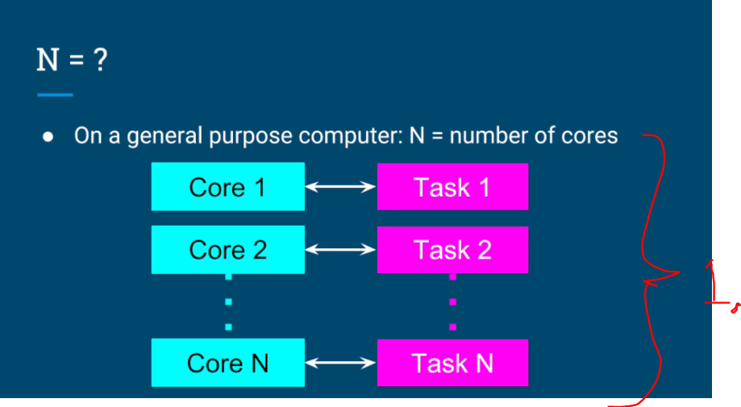
</div>

1. In **general**, the computer tries to assign the **one** task per **core** for optimal efficiently.
    - We are trying to reduce the **latency**, by having the **one** task per **core**.

$$
\text{Number of tasks running in parallel} = \text{Number of cores } (N)
$$

<div align="center">
    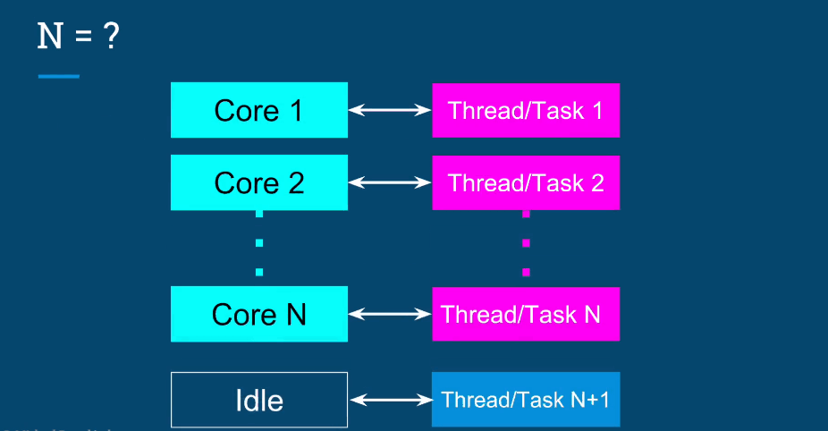
</div>

- Just adding **one** extra **thread**, can be counterproductive.
    - **Extra thread** will be **pushing** the threads out of the **Cores**, which in regards will be affecting:
        - *Context switches*.
        - *Extra memory consumptions*.
        - *Bad cache performance*.

<div align="center">
    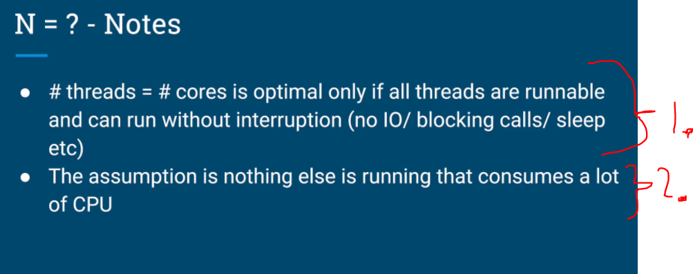
</div>

1. The **rule** where, *CPU cores* = *number tasks*, only apply when all the **threads** are **runnable** and can run **without interruption**.
    - It means the threads are from **start** to **finish**, in runnable state!

$$
\text{In reality it will be never the case, but we can be close to that}
$$

2. This also **assumes** the **CPU**, is not having **big consuming** tasks on hand!

<div align="center">
    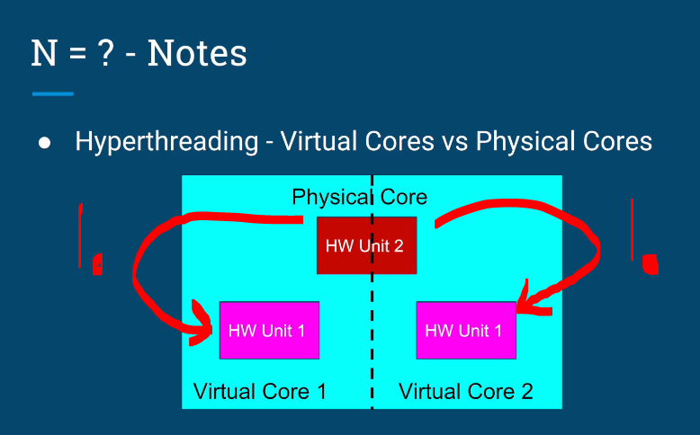
</div>

1. **Hyperthreading** brakes down the **one** physical core into two **virtual** cores. 
    - In **practice,** we cannot run *100%* in parallel with **one core**, even thought there are **two virtual cores**!
        - **2 hyperthreads** ≠ **2 cores**.

| Setup                     | Can execute simultaneously? | Share execution units? | Typical scaling |
|---------------------------|-----------------------------|------------------------|-----------------|
| 1 core, no HT             | ❌ No                       | N/A                    | 1×              |
| 1 core, HT (2 threads)    | ⚠️ Partially                | Yes                    | ~1.1–1.3×       |
| 2 physical cores          | ✅ Yes                      | No                     | ~2× (ideal)     |

<div align="center">
    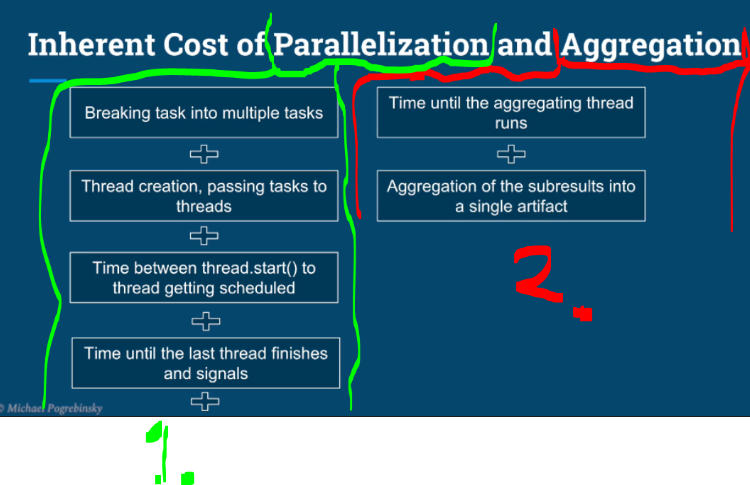
</div>

1. Parallelization costs:
    - Breaking task into **multiple tasks** or into **smaller segments**.
    - Thread **creation**, **passing tasks** to threads and **starting them**.
    - Time between `thread.start()` and the **thread getting scheduled**.
    - Time until the last thread **finishes** and **signals** the **aggregating thread** that **it's done**.

2. Aggregation costs:
    - Time until the aggregating thread **runs**.
    - Aggregation of the subresults into a **single artifact**.

<div align="center">
    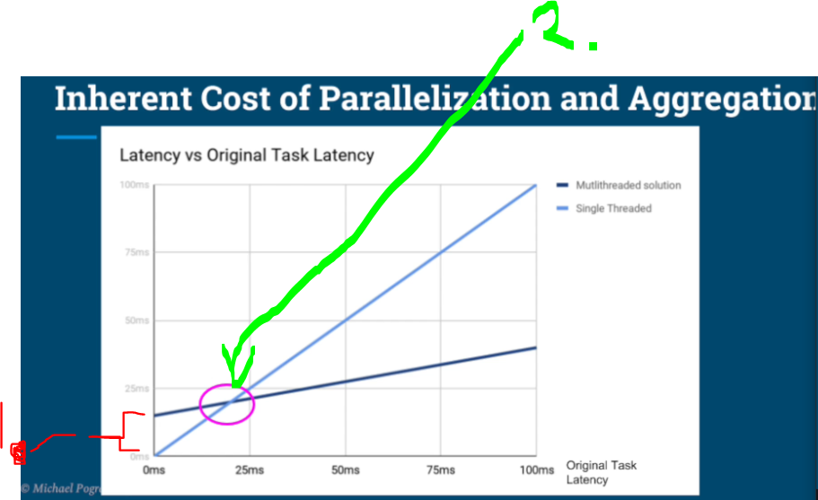
</div>

1. There is no point to make simple tasks in making the **job multithreaded** solution.
2. There comes the **golden axis**, when the is worth of braking the task into multiple smaller tasks. 

<div align="center">
    
</div>

1. **No**, we sadly cannot brake any job into **smaller tasks**! We can have three types of tasks:
    - *Parallelizable Tasks*.
    - *Unbreakable Tasks*.
    - *Partially Parallelizable, Partially Sequential*.

<div align="center">
    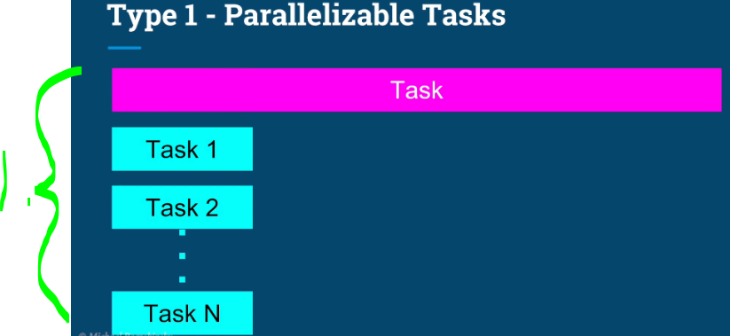
</div>

1. The tasks that are easily broken into smaller tasks.

<div align="center">
    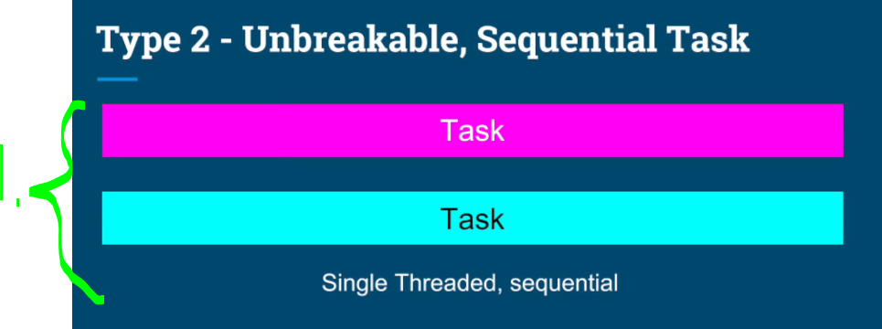
</div>

1. The **tasks** that are forced to run in their own **thread**.

<div align="center">
    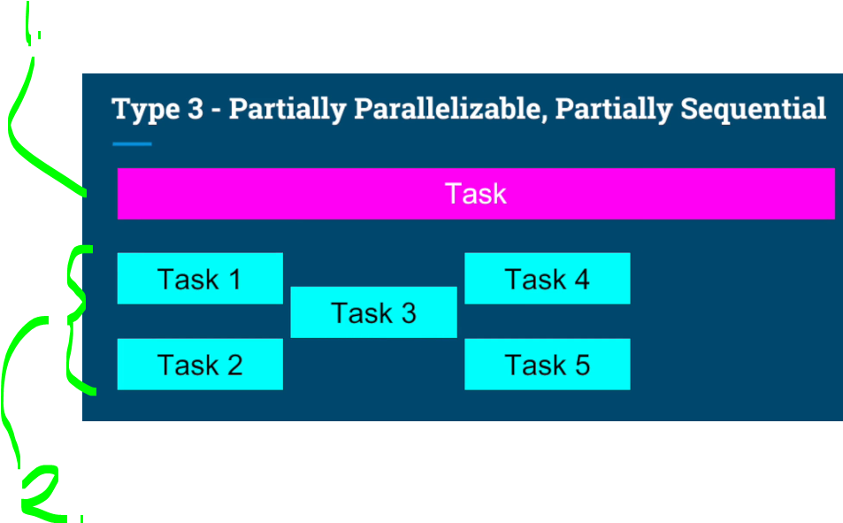
</div>

1. Task that **cannot** be braked down into own tasks.
2. Tasks can be **parallelized** in their own **jobs**.

<div align="center">
    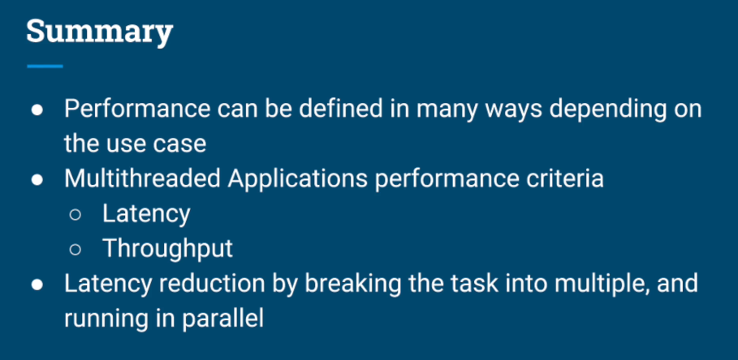
</div>

- Add these ones.

# Optimizing for Latency Part 2 - Image Processing.

<div align="center">
    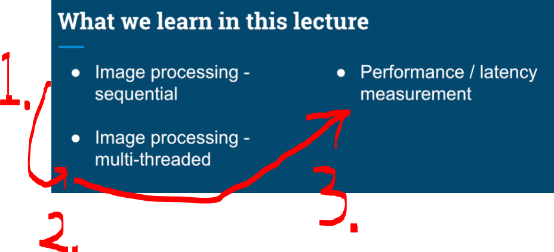
</div>

1. We will be following in this order:
    - `1.` First we will be writing the **image processing** version, which is **sequential**.
    - `2.` Then we will be **partition this task**
    - `3.` Lastly we will be measuring it performance!

<div align="center">
    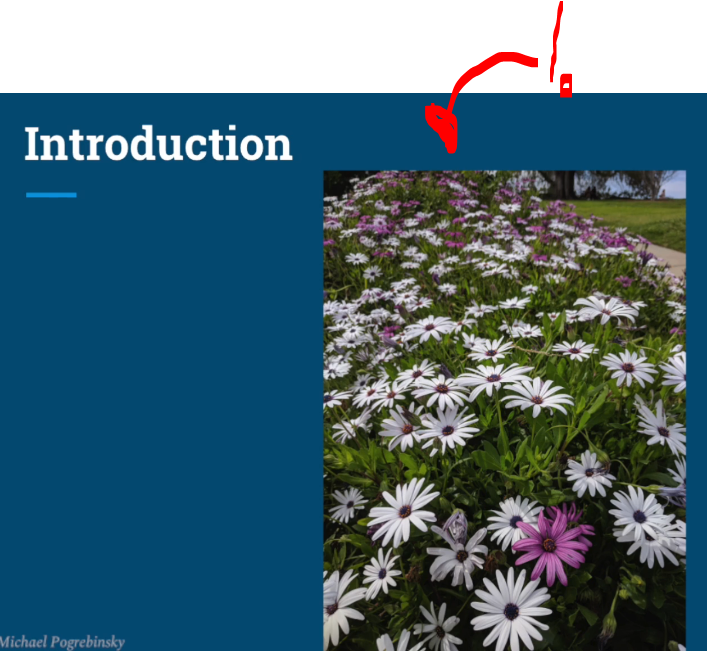
</div>

1. Picture took by Pro. There are **two colors** of the **flowers**!

<div align="center">
    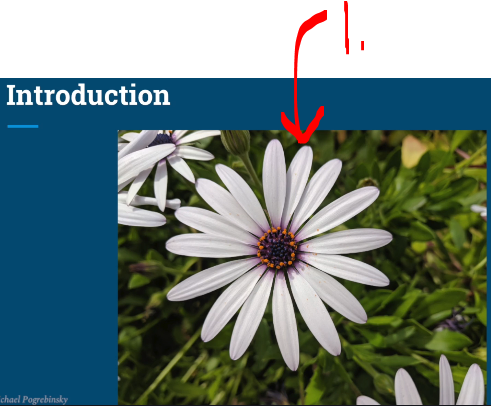
</div>

1. We will be trying to color this white flower, with the program to the pinkish color!


<div align="center">
    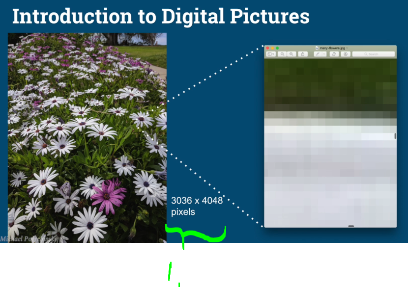
</div>

1. This picture is `3036` **x** `4048`. This is around **12 million pixels**.
2. In picture, there are **multiple color points**, which are called **pixels**.

<div align="center">
    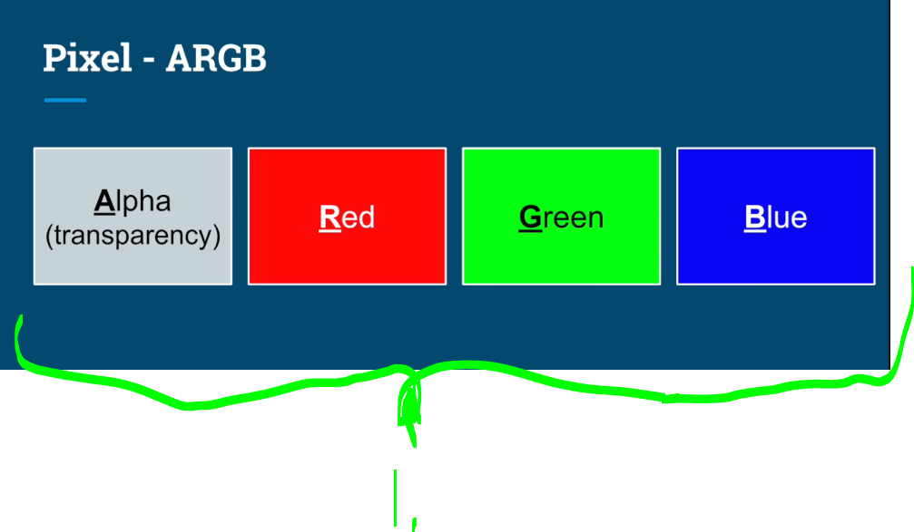
</div>

1. **ARGB** we can represent pretty much any color! Can achieve this by **combining the colors**!
    - Extra reading can have [RGBA color model](https://en.wikipedia.org/wiki/RGBA_color_model).

<div align="center">
    
</div>

1. We can get **pure colors** such as **red**, by increasing only one color value and keeping it other lowest as possible!
2. We can get **purple** by **combine** high level of **red** and **blue**.
3. Furthermore, we get different **shades of gray** if keep the colors **relatively the same**
    - This can be from white, to all the way to the black.
4. Lastly, if we look the white flower.
    - There are **many shades of the gray** in it!

<div align="center">
    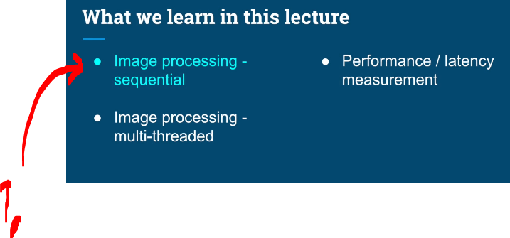
</div>

1. We will be writing the **processing** code first with the modular as possible!


- Reminder how to use the `&` the **AND** operation.
    - **Java** representation:
    ````Java
    int a = 12;   // 00001100
    int b = 10;   // 00001010

    int c = a & b; // After the opertiaon 00001000
    ````
    - **Binary** representation:
    ````yml
    00001100
    & 00001010
    ----------
    00001000  // = 8
    ````


````Java
    public static int getRed(int rgb) {
        return (rgb & 0x00FF0000) >> 16;
    }

    public static int getGreen(int rgb) {
        return (rgb & 0x0000FF00) >> 8;
    }

    public static int getBlue(int rgb) {
        return rgb & 0x000000FF;
    }
````


> [!TIP]
> A `raster` = the **raw pixel** grid of the image! Example in **Java** `image.getRaster()`. Example picture repressed in pixels, below:

⬛⬛⬛⬛⬜⬜⬛
⬜⬜⬜⬛⬜⬜⬛
⬜⬜⬜⬛⬜⬜⬛
⬛⬛⬛⬛⬛⬛⬛
⬛⬜⬜⬛⬜⬜⬜
⬛⬜⬜⬛⬜⬜⬜
⬛⬜⬜⬛⬛⬛⬛


# Additional Resource - Image Processing, Color Spaces, Extraction & Manipulation.

As I'm always committed to bringing you the most relevant and real-life examples, in the previous lecture we touched upon a few other very important topics beyond Multithreading like color spaces, bit-shifting and binary algebra. Since these topics are very frequently used in the industry (as well as in job interviews), this guide will provide a more in-detail explanation of those parts of the Image Processing Example.

#### Pixels and Color Space Background.

In digital imaging, a Pixel represents the smallest element of a picture displayed on the screen.

An image is nothing more than a 2-dimensional collection of Pixels.

The color of a pixel can be encoded in different ways.

A few frequently used groups of pixel color encoding are:

- [Y'UV](https://en.wikipedia.org/wiki/Y%E2%80%B2UV) - Luma (brightness), and 2 chroma (color) components

- [RGB]() - Red, Green, Blue

- [HSL and HSV]() - Hue, Saturation, Lightness/Brightness

- [CIE XYZ]()  - Device independent Red, Green and Blue

#### ARGB Memory Representation.

The **format used** in our Image Processing example is a version of the **RGB** family called **ARGB**, where A stands for *alpha* *(transparency)*

The representation of this color in memory is as follows:

<div align="center">
    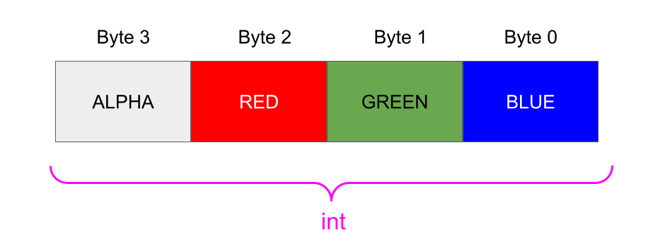
</div>

As we can see, each component is represented by **1 byte** (**8 bits**) so the value of each component is in the range of **0** (`0x` in **hexadecimal**) and **255** (`0xFF` in **hexadecimal**).

Since we have `4 bytes`, we can store the entire color of a pixel in a variable of type `int`.

#### Component Extraction Code Explanation.

In the Image Processing example we have the following methods that extract individual components of a pixel:

````Java
public static int getRed(int rgb) {
    return (rgb & 0x00FF0000) >> 16;
}
 
public static int getGreen(int rgb) {
    return (rgb & 0x0000FF00) >> 8;
}
 
public static int getBlue(int rgb) {
    return rgb & 0x000000FF;
}
````

Let's explain each method, in particular the math that happens to get each color component.

In order to get a particular component (red, green, or blue), we need to first get rid of all the other color components in the pixel, while keeping the desired component.

To achieve this we apply a bitmask.

A bitmask defines which bits we want to keep, and which bits we want to clear.

We apply a bitwise AND with 0x00 (0000 0000 in binary) to get rid of a component since X AND 0 = 0, for any X.

We apply a bitwise AND with 0xFF (1111 1111 in binary) to keep the value of a component since X AND 1 = X, for any X.


````Java 


````

# Optimizing for Throughput Part 1.

# Optimizing for Throughput Part 2 - HTTP Server + JMeter.

# Quiz 4: Performance Optimization.
