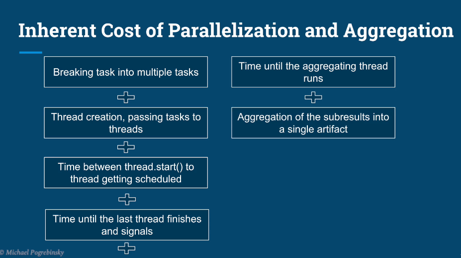

# Chapter 04 - Performance Optimization.

Performance Optimization.

# What I learned.

# Introduction to Performance & Optimizing for Latency - Part 1.

    

1. Defining **Performance** criteria.

    

1. **Metric of performance** in this particular case is the **Latency** in units of time!
    - Faster the transportation is the faster the **performance** is.

    

1. If the **Application** will provide **1000** frames per second and the **player** plays it as **20** per second `2.`. There are a lot of **waste frames**, this is not valid **metric** for the performance.
3. The right metric would be in this place, **precision** and **accuracy** of the **frame rate**!

    

1. The **performance metric** here is the **throughput**, better the recommended data, better it at performing! 

    

1. Performance in the Multithreaded applications.

    

1. **Latency**. The time to completion of **single** a **task**. Measured in time units.
    - If a ping shows `40` ms, that means:
        - `~20` ms to go.
        - `~20` ms to come back.
    - That `40` ms is **latency**, measured by **ping**.

2. **Throughput**. The amount of tasks completed in a given period. Measured in tasks per time unit.

    

1. Next will be checking **Latency**.

    

- If we have single **Task**, which we can finish it in *Time* = **T**.
    - We can break, that **Task** in to **multiple tasks**.

    

1. We can say that $\text{Latency} = \frac{T}{N}$
    - What is the level to which **gradual level** the tasks needs to be broken down, to be effect as possible?

    

1. We are trying to achieve a **theoretical reduction**, we need to answer following questions?
    1. **First** question is:
        - `N = ?`.
            - How many **subtasks**/**threads** should the original task be broken into?
                - What is the granularity level.
    2. **Second** question is:
        - Does **breaking** the original task and **aggregating results** come for free?
    3. **Third** question is:
        - Can we break any task into subtasks?

    

1. In **general**, the computer tries to assign the **one** task per **core** for optimal efficiently.
    - We are trying to reduce the **latency**, by having the **one** task per **core**.

$$
\text{Number of tasks running in parallel} = \text{Number of cores } (N)
$$

    

- Just adding **one** extra **thread**, can be counterproductive.
    - **Extra thread** will be **pushing** the threads out of the **Cores**, which in regards will be affecting:
        - *Context switches*.
        - *Extra memory consumptions*.
        - *Bad cache performance*.

    

1. The **rule** where, *CPU cores* = *number tasks*, only apply when all the **threads** are **runnable** and can run **without interruption**.
    - It means the threads are from **start** to **finish**, in runnable state!

$$
\text{In reality it will be never the case, but we can be close to that}
$$

2. This also **assumes** the **CPU**, is not having **big consuming** tasks on hand!

    

1. **Hyperthreading** brakes down the **one** physical core into two **virtual** cores. 

    

# Optimizing for Latency Part 2 - Image Processing.

# Additional Resource - Image Processing, Color Spaces, Extraction & Manipulation.

# Optimizing for Throughput Part 1.

# Optimizing for Throughput Part 2 - HTTP Server + JMeter.

# Quiz 4: Performance Optimization.
