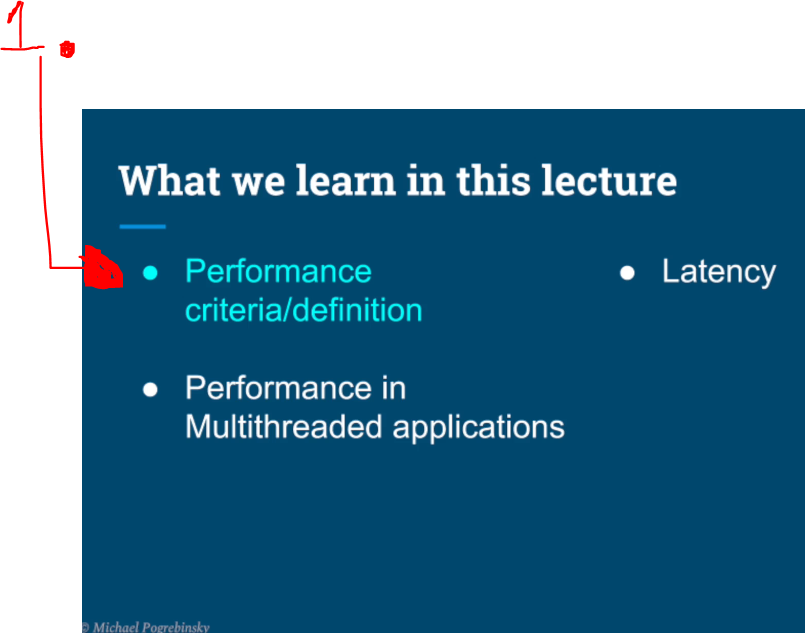
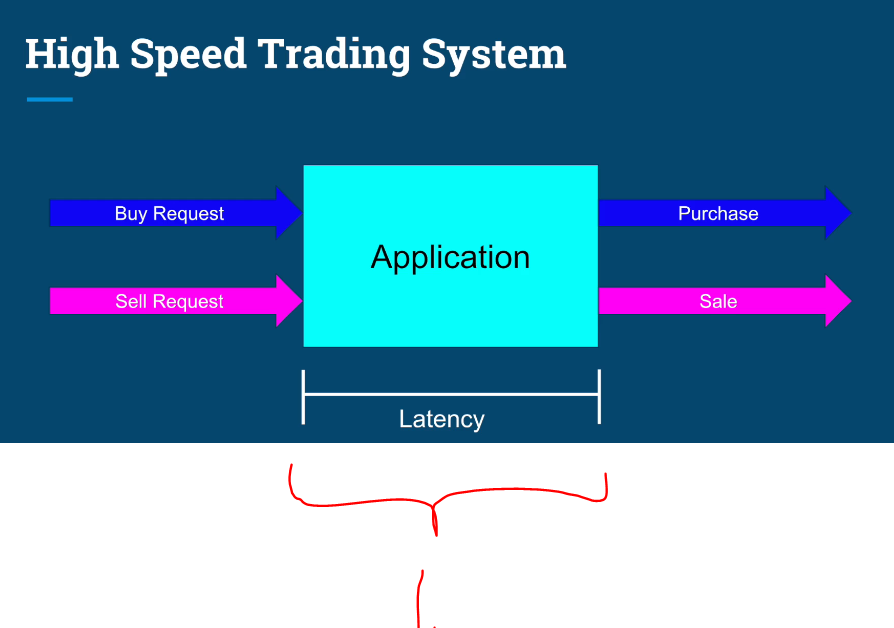
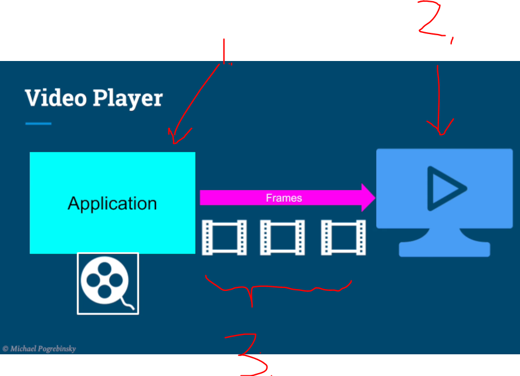
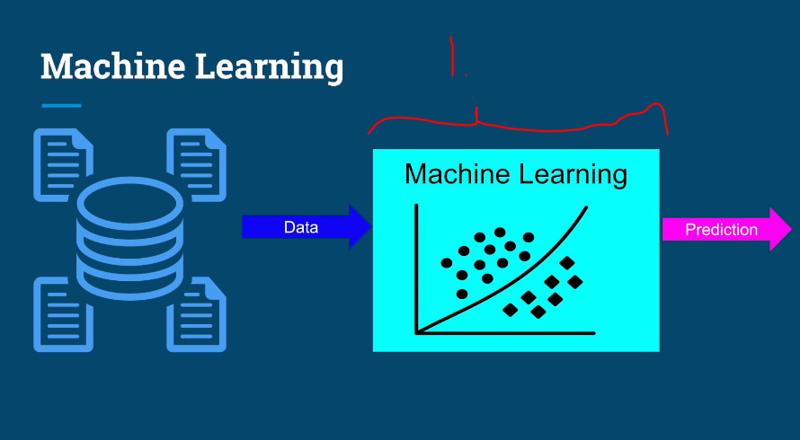
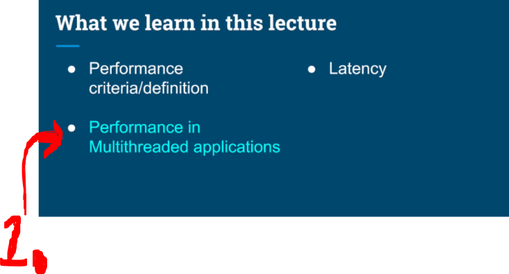
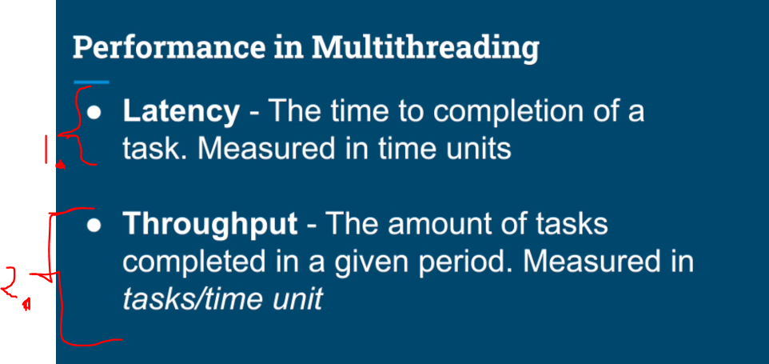
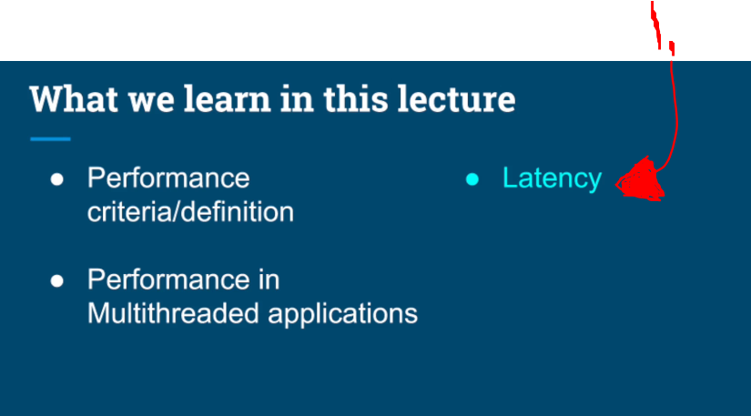
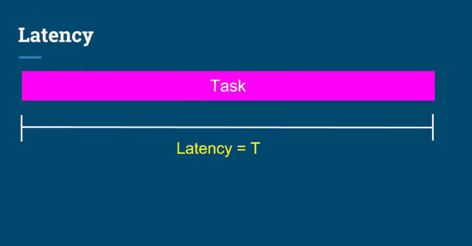
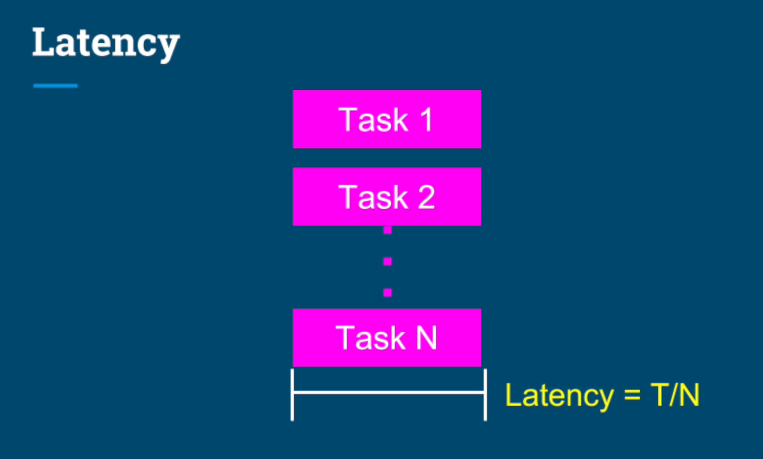

# Chapter 04 - Performance Optimization.

Performance Optimization.

# What I learned.

# Introduction to Performance & Optimizing for Latency - Part 1.

    

1. Defining **Performance** criteria.

    

1. **Metric of performance** in this particular case is the **Latency** in units of time!
    - Faster the transportation is the faster the **performance** is.

    

1. If the **Application** will provide **1000** frames per second and the **player** plays it as **20** per second `2.`. There are a lot of **waste frames**, this is not valid **metric** for the performance.
3. The right metric would be in this place, **precision** and **accuracy** of the **frame rate**!

    

1. The **performance metric** here is the **throughput**, better the recommended data, better it at performing! 

    

1. Performance in the Multithreaded applications.

    

1. **Latency**. The time to completion of **single** a **task**. Measured in time units.
    - If a ping shows `40` ms, that means:
        - `~20` ms to go.
        - `~20` ms to come back.
    - That `40` ms is **latency**, measured by **ping**.

2. **Throughput**. The amount of tasks completed in a given period. Measured in tasks per time unit.

    

1. Next will be checking **Latency**.

    

- If we have single **Task**, which we can finish it in *Time* = **T**.
    - We can break, that **Task** in to **multiple tasks**.

    

# Optimizing for Latency Part 2 - Image Processing.

# Additional Resource - Image Processing, Color Spaces, Extraction & Manipulation.

# Optimizing for Throughput Part 1.

# Optimizing for Throughput Part 2 - HTTP Server + JMeter.

# Quiz 4: Performance Optimization.
