# Chapter 05 - Data Sharing Between Threads.

Data Sharing Between Threads.

# What I learned.

# Stack & Heap Memory Regions.

<div align="center">
    
</div>

1. We start looking at the **Stack Frame**.

<div align="center">
    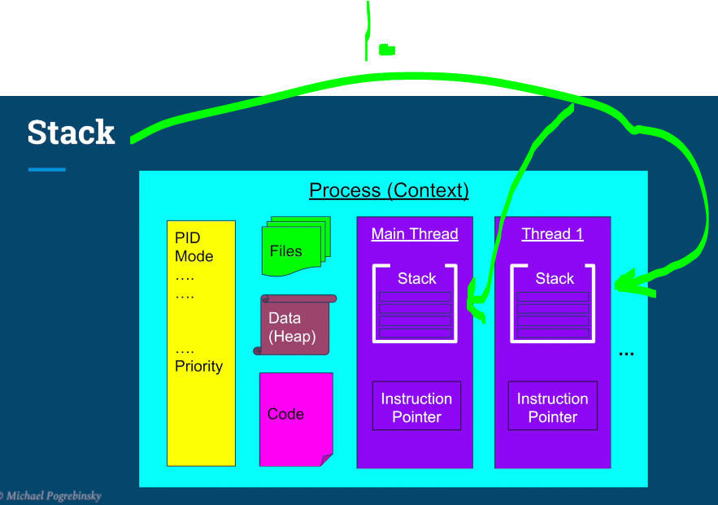
</div>

1. Remember the **stack**, what we were discussing before.

<div align="center">
    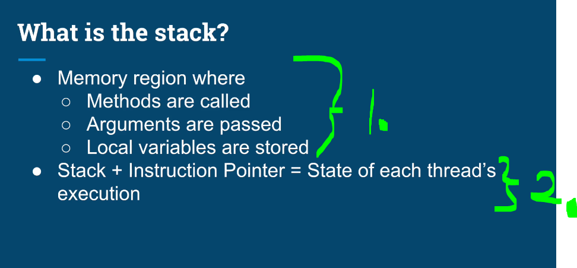
</div>

1. *Memory Region*:
    - Methods are called.
        - Every time a method/function is invoked, a **stack frame** is pushed onto the stack.
        - When the method returns, its stack frame is popped off.
    - When the argument is **passed into function**, It's passed into the **stack**.
    - All the **local variables** are stored in the **stack**.
2. Instruction Pointer (Program Counter) → the exact instruction currently bewing executed. 

<div align="center">
    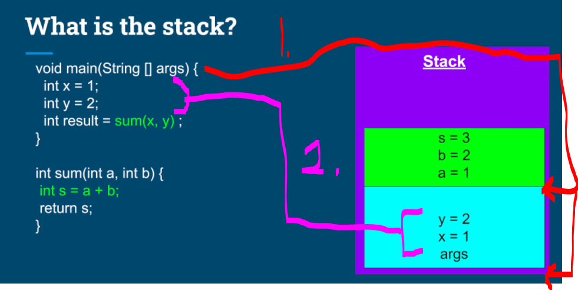
</div>

1. As soon as the tread jumps into **method**, the space is allocated in the **Stack**. This space is called **Stack Frame**.
2. Arguments are pushed on the stack, as soon as they appear. 

<div align="center">
    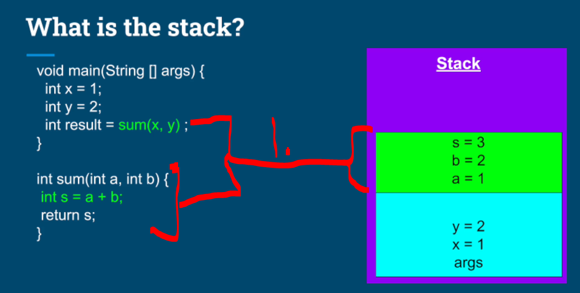
</div>

1. When current methods need to call another method.
    - New **Stack Frame** is allocated in the **Stack**.
        - The variables are pushed on the **new stack**! These variables are copies of `x`, `y` and `s` is evaluated on the **new stack**.

> [!IMPORTANT]
> Each method have access to its **own frames** and its **variables**.

<div align="center">
    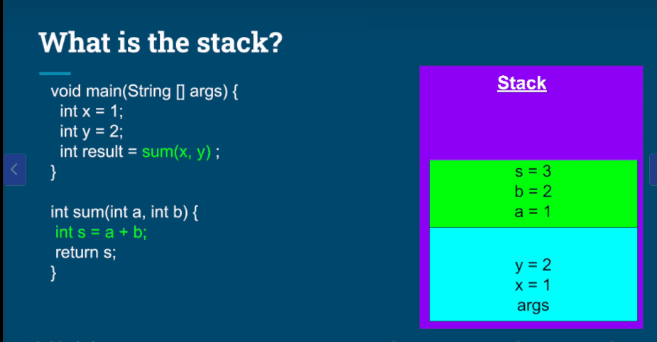
</div>

1. When the `sum(x,y)` is finished the `result` is stored in special register inside **CPU**.

2. The **Instruction Pointer** jumps back to the caller method and the `sum(a b)`'s **stack frame** gets **invalidated**! The `result` gets variable and its assigned the value, which was calculated, also this gets pushed into the **Stack Frame**.

3. When the `main` finished. Its **Stack Frame** gets invalidated.

<div align="center">
    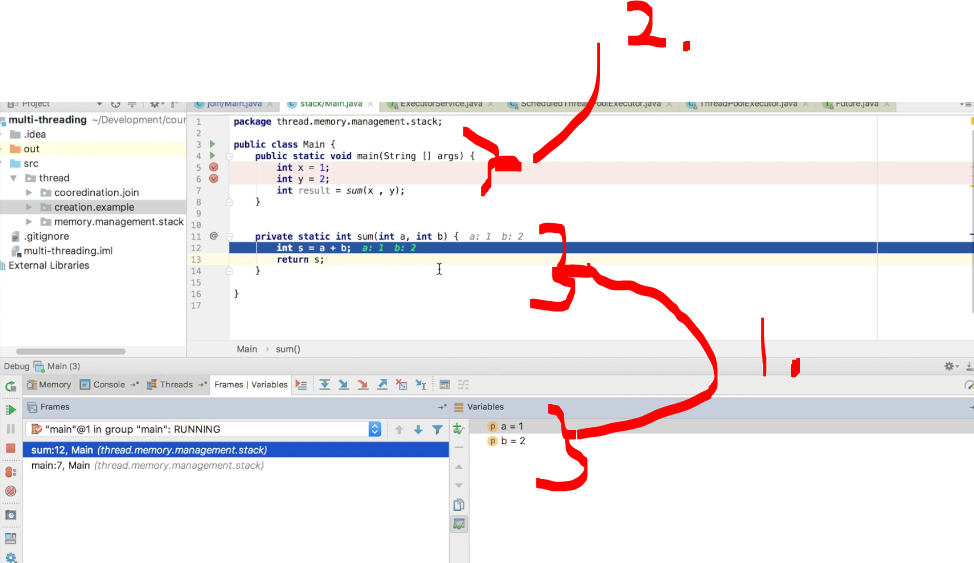
</div>

1. You can **see** that we have the `a` and `b` and not the variables in the `2.`, which are `x` and `y`, since they are in different **Stack Frame**.

<div align="center">
    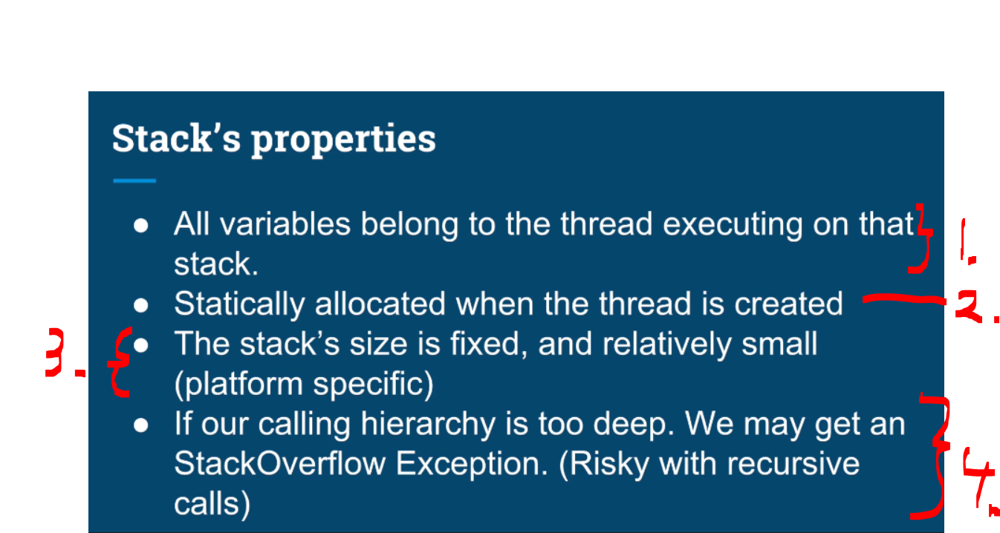
</div>

1. All variables belong to the thread executing on that stack.
    - All the variables belongs to **particular thread**
2. Statically allocated when the thread is created.
    - These are allocated **statically**, when the **thread** is created.
3. The stack’s size is **fixed**, and **relatively small** (platform specific).
    - This **cannot** be changed in **runtime**.
4. If our calling hierarchy is too deep, we may get a `StackOverflowException` (risky with **recursive calls**).

<div align="center">
    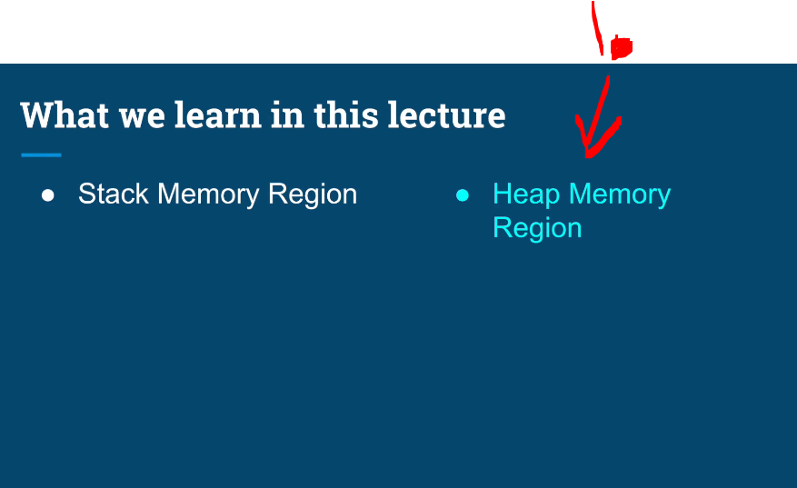
</div>

1. We will be checking **Heap Memory Region** next.
    - This is **second** memory region.

> [!TIP]
> We prefer **threads** over **processes** when we want to share data easily. The sharing can be done using **Heap** memory region.

<div align="center">
    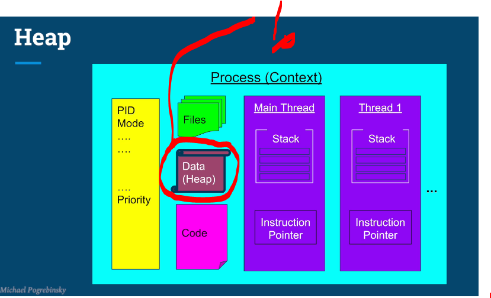
</div>

1. **Heap memory** region belongs to **process**. The **threads** share that access to the **Heap**.

<div align="center">
    
</div>

1. Anything that is created using with the `new` operator.
2. Any member of the class, even thought they are `primitive` types.
3. Any Static variables.

<div align="center">
    
</div>

1. **Heap** is managed and governed by the **Garbage Collector**. 
2. **Objects** stay on the **Heap** as long there **one** reference to them.
3. Members of the classes have the same lifecycle journey as their owner parent.
    4. **Static** variables will be not be touched in their lifestyle.

> [!IMPORTANT]
> **References** to the Objects are **not** the same as **Objects**.

<div align="center">
    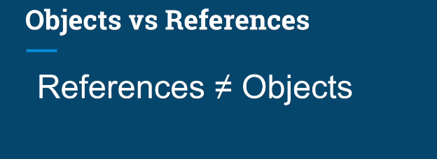
</div>

<div align="center">
    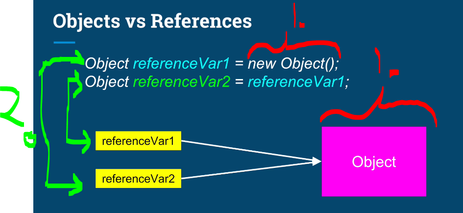
</div>

- Todo this one.

1. Single object
2. **Two** reference variables `referenceVar1` and `refrenceVar2`, which are pointing to the **Object**.

<div align="center">
    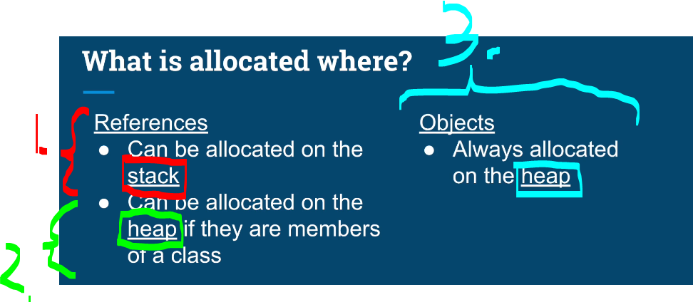
</div>

1. If, **Reference Variables** are on the method. They are on the located on the **stack**!

2. If, they are member of the **Object**, they are allocated in the **heap**, with their **parent Object**

3. **Objects** are always allocated on the **heap**!

<div align="center">
    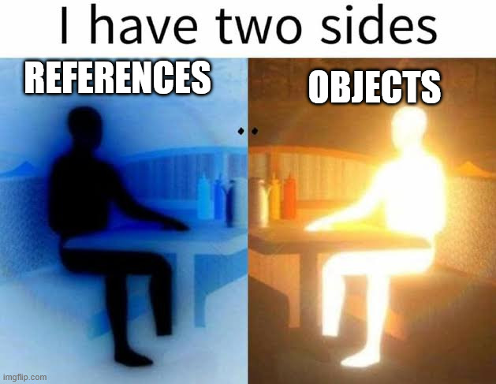
</div>

<div align="center">
    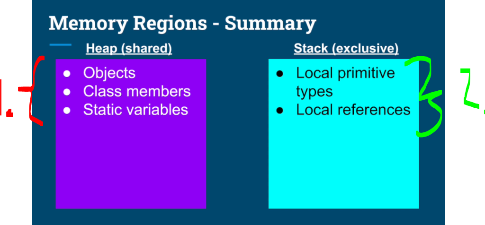
</div>

2. **Stack** includes following variables:
    - Local Primitive types: Example `int x`


- int add here the example codes

# Quiz 5: Stack & Heap Memory Regions.


<details>

<summary id="Thread progress
" open="true"> <b>Question 01.</b> </summary>

````Java

public class Example {
    private Map<Integer, String> idToNameMap;

    private static long numberOfInstances = 0;

    public Example() {
        this.idToNameMap = new HashMap<>();
        numberOfInstances++;
    }

    public List<String> getAllNames() {
        int count = idToNameMap.size();
        List<String> allNames = new ArrayList<>();

        allNames.addAll(idToNameMap.values());

        return allNames;
    }
}

````


- My answer:


<div align="center">
    
</div>


1. 

</details>


# Resource Sharing & Introduction to Critical Sections.
