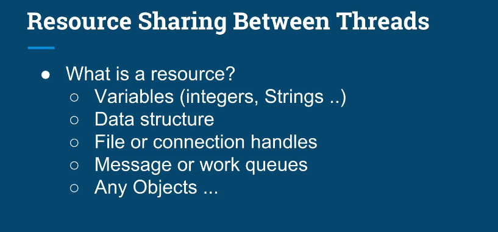
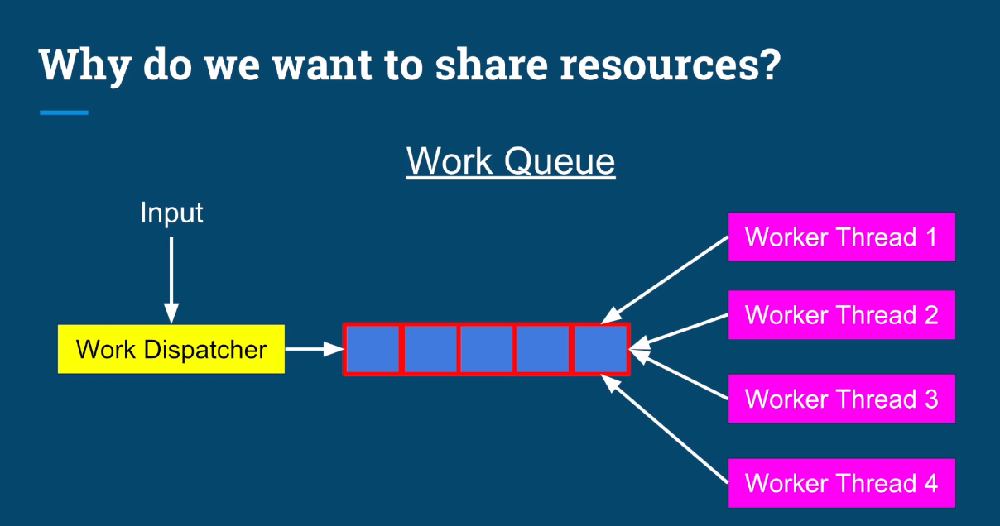
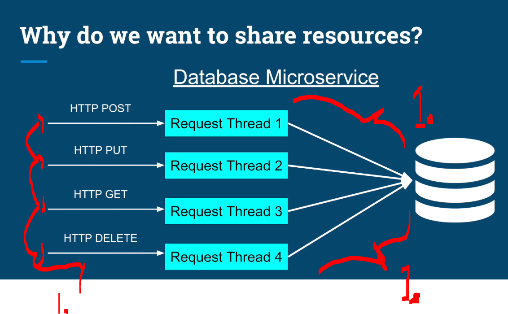
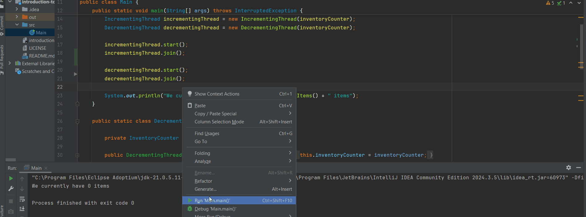
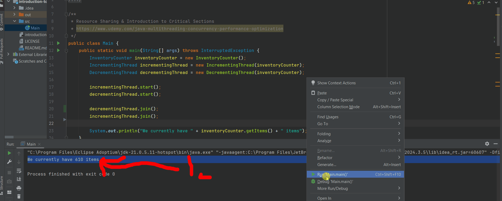
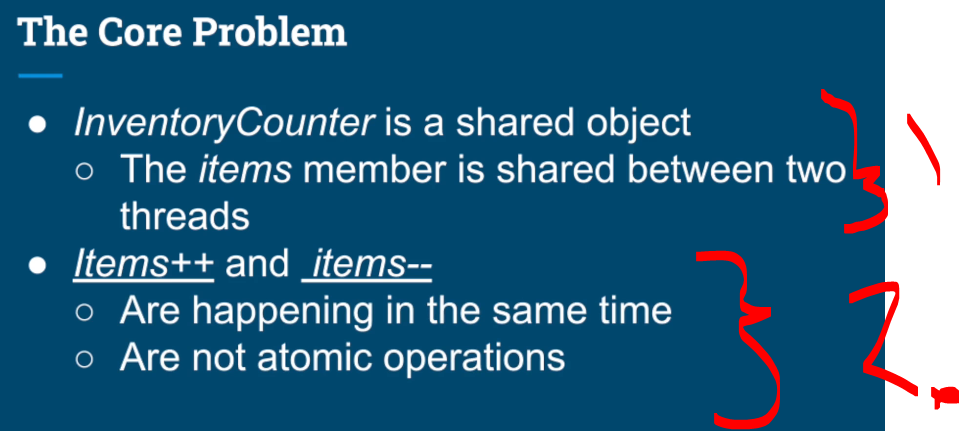
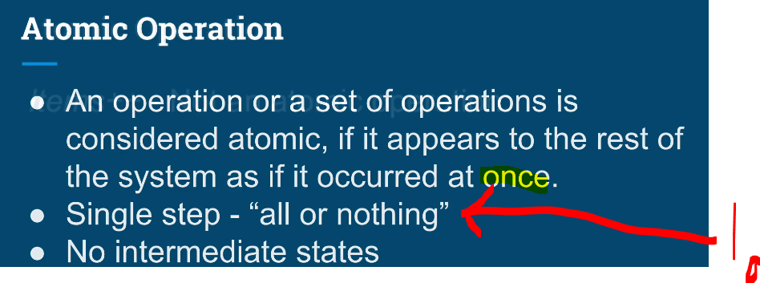
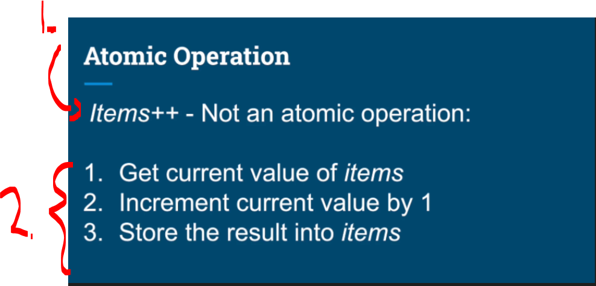
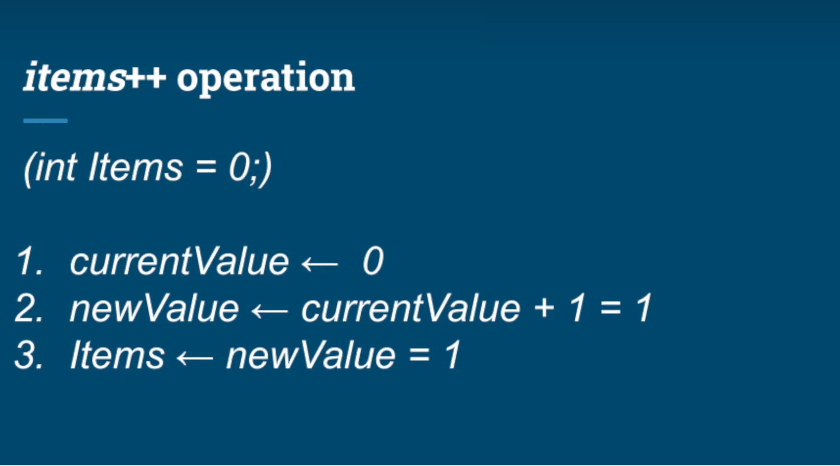

# Chapter 05 - Data Sharing Between Threads.

Data Sharing Between Threads.

# What I learned.

# Stack & Heap Memory Regions.

<div align="center">
    
</div>

1. We start looking at the **Stack Frame**.

<div align="center">
    
</div>

1. Remember the **Stack**, what we were discussing before.

<div align="center">
    
</div>

1. **Memory Region** where:
    - Methods are called.
        - Every time a method/function is invoked, a **stack frame** is pushed onto the stack.
        - When the method returns, its stack frame is popped off.
    - When the argument is **passed into function**, It's passed into the **stack**.
    - All the **local variables** are stored in the **stack**.
2. Instruction Pointer (Program Counter) → the exact instruction currently being executed. 

<div align="center">
    
</div>

1. As soon as the tread jumps into **method**, the space is allocated in the **Stack**. This space is called **Stack Frame**.
2. Arguments are pushed on the stack, as soon as they appear. 

<div align="center">
    
</div>

1. When current methods need to call another method.
    - New **Stack Frame** is allocated in the **Stack**.
        - The variables are pushed on the **new stack**! These variables are copies of `x`, `y` and `s` is evaluated on the **new stack**.

> [!IMPORTANT]
> Each method have access to its **own frames** and its **variables**.

<div align="center">
    
</div>

1. When the `sum(x,y)` is finished the `result` is stored in special register inside **CPU**.

2. The **Instruction Pointer** jumps back to the caller method and the `sum(a b)`'s **stack frame** gets **invalidated**! The `result` gets variable and its assigned the value, which was calculated, also this gets pushed into the **Stack Frame**.

3. When the `main` finished. Its **Stack Frame** gets invalidated.

<div align="center">
    
</div>

1. You can **see** that we have the `a` and `b` and not the variables in the `2.`, which are `x` and `y`, since they are in different **Stack Frame**.

<div align="center">
    
</div>

1. All variables belong to the thread executing on that stack.
    - All the variables belongs to **particular thread**
2. Statically allocated when the thread is created.
    - These are allocated **statically**, when the **thread** is created.
3. The stack’s size is **fixed**, and **relatively small** (platform specific).
    - This **cannot** be changed in **runtime**.
4. If our calling hierarchy is too deep, we may get a `StackOverflowException` (risky with **recursive calls**).

<div align="center">
    
</div>

1. We will be checking **Heap Memory Region** next.
    - This is **second** memory region.

> [!TIP]
> We prefer **threads** over **processes** when we want to share data easily. The sharing can be done using **Heap** memory region.

<div align="center">
    
</div>

1. **Heap memory** region belongs to **process**. The **threads** share that access to the **Heap**.

<div align="center">
    
</div>

1. Anything that is created using with the `new` operator.
2. Any member of the class, even thought they are `primitive` types.
3. Any Static variables.

<div align="center">
    
</div>

1. **Heap** is managed and governed by the **Garbage Collector**. 
2. **Objects** stay on the **Heap** as long there **one** reference to them.
3. Members of the classes have the same lifecycle journey as their owner parent.
    4. **Static** variables will be not be touched in their lifestyle.

> [!IMPORTANT]
> **References** to the Objects are **not** the same as **Objects**.

<div align="center">
    
</div>

<div align="center">
    
</div>

- Code below from the picture:

````Java
Object referenceVar1 = new Object();
Object referenceVar2 = referenceVar1;
````

1. Single Object!
2. **Two** reference variables `referenceVar1` and `refrenceVar2`, which are pointing to the **Object**!

<div align="center">
    
</div>

1. If there is **Reference Variables** that are on the method itself. They are on the located on the **stack**! Example below:
````Java
void foo() {
    Object ref = new Object(); // ref is on the stack.
}
````
2. If there are variables that are members of the **Object**, they are allocated in the **heap**, with their **parent Object**. Example below:
````Java
class A {
    Object ref; // this reference lives on the heap.
}
````
3. **Objects** are always allocated on the **heap**! Example below:
````Java
Object obj = new Object();
````

<div align="center">
    
</div>

<div align="center">
    
</div>

1. **Heap** includes following variables:
    - **Objects**. 
        - Example `new User("John", 25)`.
    - **Class members**.
        - Example below:
            ````Java
            class User {
                int id;          // HEAP: Part of the User object.
                String username; // HEAP: Reference to a String object.
            }
            ````
    - **Static variables**. 
        - Example `static int count;`.

2. **Stack** includes following variables:
    - **Local Primitive** types:
        -  Example `int x`, `boolean true` or `double sum`.
    - **Local references**.
        - Example below:
            ````Java
            public void processUser()
            {
            // The myUser is created on the STACK.
            User myUser = new User("Alex"); 
            }
            ```` 
# Quiz 5: Stack & Heap Memory Regions.

<details>

<summary id="Thread progress
" open="true"> <b>Question 01.</b> </summary>

````Yaml
Question 01:
Choose the correct statement regarding line 2.
````

````Java
public class Example {
    private Map<Integer, String> idToNameMap;

    private static long numberOfInstances = 0;

    public Example() {
        this.idToNameMap = new HashMap<>();
        numberOfInstances++;
    }

    public List<String> getAllNames() {
        int count = idToNameMap.size();
        List<String> allNames = new ArrayList<>();

        allNames.addAll(idToNameMap.values());

        return allNames;
    }
}
````

- My answer:

<div align="center">
    
</div>


1. It is stored in the **heap** since it's a **Class Member**. 

</details>

<details>

<summary id="Thread progress
" open="true"> <b>Question 02.</b> </summary>

````Yaml
Question 02:
Choose the correct statement regarding line 4.
````

````Java
public class Example {
    private Map<Integer, String> idToNameMap;

    private static long numberOfInstances = 0;

    public Example() {
        this.idToNameMap = new HashMap<>();
        numberOfInstances++;
    }

    public List<String> getAllNames() {
        int count = idToNameMap.size();
        List<String> allNames = new ArrayList<>();

        allNames.addAll(idToNameMap.values());

        return allNames;
    }
}
````

- My answer:

<div align="center">
    
</div>

1. **Static Variables**: Go to the Heap.

</details>


<details>

<summary id="Thread progress
" open="true"> <b>Question 03.</b> </summary>

````Yaml
Question 03:
Choose the correct statement regarding line 12.
````

````Java
public class Example {
    private Map<Integer, String> idToNameMap;

    private static long numberOfInstances = 0;

    public Example() {
        this.idToNameMap = new HashMap<>();
        numberOfInstances++;
    }

    public List<String> getAllNames() {
        int count = idToNameMap.size();
        List<String> allNames = new ArrayList<>();

        allNames.addAll(idToNameMap.values());

        return allNames;
    }
}
````
- My answer:

<div align="center">
    
</div>


1. The `count` variable is indeed a **local variable** allocated on the stack, which means each **thread** has its **own separate instance**. This ensures that if two threads are executing `getAllNames()` simultaneously, they will operate on their own versions of the count variable without any conflict.

</details>


<details>

<summary id="Thread progress
" open="true"> <b>Question 04.</b> </summary>

````Yaml
Question 04:
Choose the correct statement regarding line 13.
````

````Java
public class Example {
    private Map<Integer, String> idToNameMap;

    private static long numberOfInstances = 0;

    public Example() {
        this.idToNameMap = new HashMap<>();
        numberOfInstances++;
    }

    public List<String> getAllNames() {
        int count = idToNameMap.size();
        List<String> allNames = new ArrayList<>();

        allNames.addAll(idToNameMap.values());

        return allNames;
    }
}
````
- My answer:

<div align="center">
    
</div>

1. The **reference variable** is on the **stack**. The **Object** which was initialized with the `new` is on the **heap**.

</details>

# Resource Sharing & Introduction to Critical Sections.

<div align="center">
    
</div>

1. We will be starting from the **resource sharing, between threads**.

<div align="center">
    
</div>

1. Resource is that represents **data** or the **state**.
    - Variables (integers, Strings ..).
    - Data structure.
    - File or connection handles.
    - Message or work queues.
    - Any Objects ...

<div align="center">
    
</div>

1. The `UI Thread` is running in own **thread**.
2. The `Document Saver` is running in its own **thread**.
3. This **document** is the **shared resource**, both **threads** can access this without losing the progress, if the **thread** crashes!

<div align="center">
    
</div>

1. **Dispatcher Thread** gets work from **UI** or form **HTTP** messages, if it is a web server.
    - **Dispatcher Thread** is common architecture design in multithreading!
        - In this **architecture**, the **dispatcher thread** acts as a master thread or *"traffic cop"*. It prevents the main application from becoming unresponsive by offloading heavy work to a background.
    - The work is issued into the **Work Queue**, where the **Worker Threads** are taking task from!
        - The **Worker Threads** craps the tasks from the queue as soon as they have finished their previous task.
2. This **Worker Queue** is **shared data structure**, meaning it's shared in the **heap** for efficient **CPU utilization** and **low latency**.

<div align="center">
    
</div>

1. **Microservice example**, the connection to the database must be **shared resource** even thought the individual connections are on their own thread.

- Next experiment will be having **two threads** and **both** have simple counting solution, as follows: 

````
InventoryCounter inventoryCounter = new InventoryCounter();
        IncrementingThread incrementingThread = new IncrementingThread(inventoryCounter);
        DecrementingThread decrementingThread = new DecrementingThread(inventoryCounter);
````

- We will be experimenting with the **threads** with **sequence execution**.
    - Here the `IncrementingThread` will do the **increasing**.
    - Here the `DecrementingThread` will do the **reducing**.


<div align="center">
    
</div>

1. You can see that logs having `We currently have 0 items`.


<details>
<summary id="The factorial thread" open="true"> <b>Two different threads, with .join as working!</b> </summary>

````Java
/*
 * Copyright (c) 2019-2023. Michael Pogrebinsky - Top Developer Academy
 * https://topdeveloperacademy.com
 * All rights reserved
 */

/**
 * Resource Sharing & Introduction to Critical Sections
 * https://www.udemy.com/java-multithreading-concurrency-performance-optimization
 */
public class Main {
    public static void main(String[] args) throws InterruptedException {
        InventoryCounter inventoryCounter = new InventoryCounter();
        IncrementingThread incrementingThread = new IncrementingThread(inventoryCounter);
        DecrementingThread decrementingThread = new DecrementingThread(inventoryCounter);

        incrementingThread.start();
        incrementingThread.join();

        decrementingThread.start();
        decrementingThread.join();

        System.out.println("We currently have " + inventoryCounter.getItems() + " items");
    }

    public static class DecrementingThread extends Thread {

        private InventoryCounter inventoryCounter;

        public DecrementingThread(InventoryCounter inventoryCounter) {
            this.inventoryCounter = inventoryCounter;
        }

        @Override
        public void run() {
            for (int i = 0; i < 10000; i++) {
                inventoryCounter.decrement();
            }
        }
    }

    public static class IncrementingThread extends Thread {

        private InventoryCounter inventoryCounter;

        public IncrementingThread(InventoryCounter inventoryCounter) {
            this.inventoryCounter = inventoryCounter;
        }

        @Override
        public void run() {
            for (int i = 0; i < 10000; i++) {
                inventoryCounter.increment();
            }
        }
    }

    private static class InventoryCounter {
        private int items = 0;

        public void increment() {
            items++;
        }

        public void decrement() {
            items--;
        }

        public int getItems() {
            return items;
        }
    }
}
````
</details>

- Next we will be experimenting with the **threads** with **non sequence execution**, with following changes:

````Java 
        incrementingThread.start();
        decrementingThread.start();

        decrementingThread.join();
        incrementingThread.join();
````
<div align="center">
    
</div>

1. You can see that logs having `We currently have -83 items` or the `We currently have 610 items` these changing at every execution.

<details>
<summary id="The factorial thread" open="true"> <b>Two different threads, with .join not  working!</b> </summary>

````Java 
/*
 * Copyright (c) 2019-2023. Michael Pogrebinsky - Top Developer Academy
 * https://topdeveloperacademy.com
 * All rights reserved
 */

/**
 * Resource Sharing & Introduction to Critical Sections
 * https://www.udemy.com/java-multithreading-concurrency-performance-optimization
 */
public class Main {
    public static void main(String[] args) throws InterruptedException {
        InventoryCounter inventoryCounter = new InventoryCounter();
        IncrementingThread incrementingThread = new IncrementingThread(inventoryCounter);
        DecrementingThread decrementingThread = new DecrementingThread(inventoryCounter);

        incrementingThread.start();
        decrementingThread.start();

        decrementingThread.join();
        incrementingThread.join();

        System.out.println("We currently have " + inventoryCounter.getItems() + " items");
    }

    public static class DecrementingThread extends Thread {

        private InventoryCounter inventoryCounter;

        public DecrementingThread(InventoryCounter inventoryCounter) {
            this.inventoryCounter = inventoryCounter;
        }

        @Override
        public void run() {
            for (int i = 0; i < 10000; i++) {
                inventoryCounter.decrement();
            }
        }
    }

    public static class IncrementingThread extends Thread {

        private InventoryCounter inventoryCounter;

        public IncrementingThread(InventoryCounter inventoryCounter) {
            this.inventoryCounter = inventoryCounter;
        }

        @Override
        public void run() {
            for (int i = 0; i < 10000; i++) {
                inventoryCounter.increment();
            }
        }
    }

    private static class InventoryCounter {
        private int items = 0;

        public void increment() {
            items++;
        }

        public void decrement() {
            items--;
        }

        public int getItems() {
            return items;
        }
    }
}
````
</details

> [!CAUTION]
> We can see the inconsistency in the logs, this is du


<div align="center">
    
</div>

1. We can fix this inconsistency, with the **atomic operation**! Our next topic!

<div align="center">
    
</div>

1. `InventoryCounter` is **shared object**, since it used with the `new` operation is used, and this will be allocated in the **heap**! The code below:
    ````
    InventoryCounter inventoryCounter = new InventoryCounter();
    IncrementingThread incrementingThread = new IncrementingThread(inventoryCounter);
    DecrementingThread decrementingThread = new DecrementingThread(inventoryCounter);
    ````
2.  **IMPORTANT!** The **adding** and **reducing** the counter.
    -  These are happing in their **same time**!
    -  Is not **atomic** operation!

> [!TIP]
> *“Atomic”* means that these operations are performed **as a single**, **indivisible unit** 
> they either **complete entirely** or **not at all**, with no possibility of another thread
> seeing or modifying the variable in an intermediate state.

<div align="center">
    
</div>

1. Something similar like **transactions**!

<div align="center">
    
</div>

1. `items++` is not **atomic** operation at all! There are **three** operations:
    - `First`: Get current value of items.
    - `Second`: Increment current value by `1`.
    - `Third`: Store the result into items.
    
<div align="center">
    
</div>

1.
2. 
3.

