# Chapter 06 - The Concurrency Challenges & Solutions.

The Concurrency Challenges & Solutions.

# What I learned.

# Critical Section & Synchronization.

<div align="center">
    
</div>

1. We will be starting to explore the **Critical Section**.

- We need to address following **problem**:

<div align="center">
    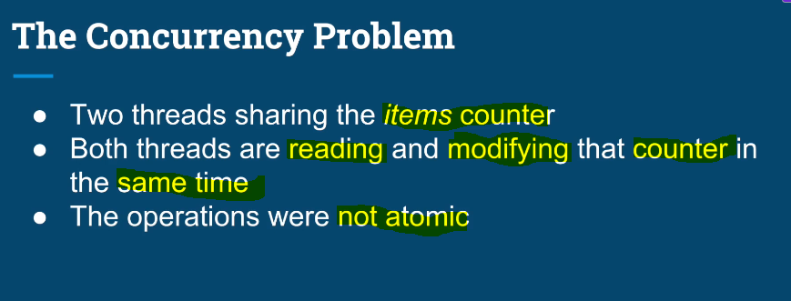
</div>

- We would need to execute **set** of operation, which would need to be executed as **single atomic operation**.
    - **Two** threads could be performing these set of codes **at the same time**. Example set of operations below:

````Java
void aggregateFunction() {
    operation1();
    operation2();
    operation3();
}
````

<div align="center">
    
</div>

1. We will be surrounding this **critical section** with the **tags** as following. This will prevent the concurrent execution of the code. 
2. `Thread A` can execute the operations, exit and enter to this **section**.
3. If `Thread B` tries to access this **critical section**, while `Thread A` is still on it, the `Thread B` will be **suspended** status until the first **thread** `Thread A` is finished with the **critical section**.

<p align="center">
    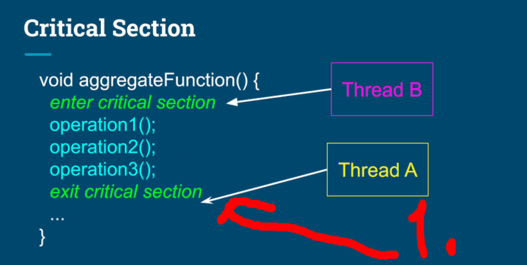
</p>

1. Once the `Thread A` finishes the **critical section**, the second **thread** `Thread B` can access the **critical section** and perform all the operations!

> [!TIP]
> **Remember** these concepts are the **same** regardless of the language. They might be in some different *flavor* or *API's*.

<div align="center">
    
</div>

1. **JVM** provides us with many ways to **protect** the **critical section** against multiple threads execution!

<div align="center">
    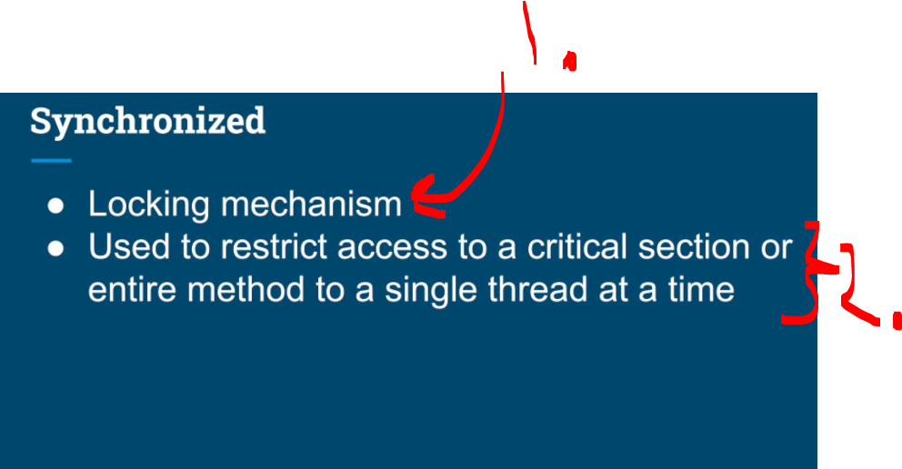
</div>

1. Simplest solution is to use `synchronized` **keyword**. This is **locking mechanism**! 
2. This is to prevent access to the **critical section** or to the **method** from the **multiple threads** at the time.
    - We have **two** ways to use this!
        - First the **Monitor** way!
        - Second the **Lock** way!

<div align="center">
    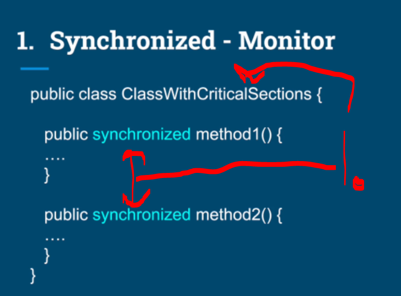
</div>

1. **First** the Monitor way!
    - `synchronized` ensures that only **one thread** at a time can execute any synchronized method of that particular object instance (`method1()`, `method2()`, etc.). Other threads must wait until the monitor (lock) is released.
    - Only *one* **synchronized method** can be run at a time:

    ````Java
    ClassWithCriticalSections obj = new ClassWithCriticalSections();

    Thread t1 = new Thread(() -> obj.method1()); // This works.
    Thread t2 = new Thread(() -> obj.method1()); // This wont works!
    
    t1.start(); // This works.
    t2.start(); // This wont work!
    ````
    - We could start `a.method1()` and `b.method1()` at the same time, since `synchronized` keyword **locks the object**, **not the class**! Example in below:
    ````Java
    ClassWithCriticalSections obj1 = new ClassWithCriticalSections();
    ClassWithCriticalSections obj2 = new ClassWithCriticalSections();

    Thread t1 = new Thread(() -> obj1.method1()); // This works.
    Thread t2 = new Thread(() -> obj2.method1()); // This works.
    t1.start(); // This works.
    t2.start(); // This works.
    ````
        
<div align="center">
    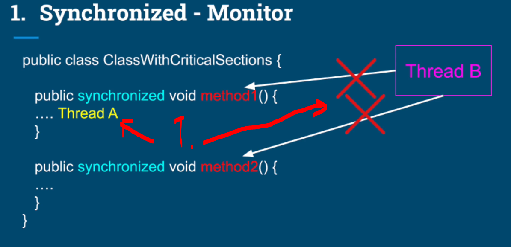
</div>

1. If the `Thread A` is executing either `method1()` or `method2()` the `Thread B` is prevented to execute at all other methods. The locking is applied to the **object itself**, rather than **individual methods**!
    - The term used here for this concept is **Monitor**.

<p align="center">
    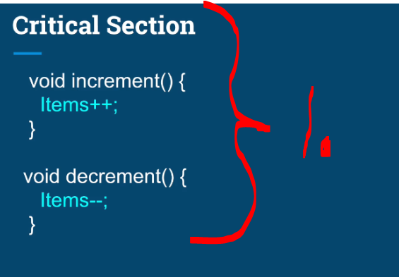
</p>

1. We will apply our `synchronized` for our old user case!

> [!IMPORTANT]
> **Rule of Thumb (very important)**
> One should be using `synchronize` where the **shared data is**, not **where it is used**!

- We will be using `synchronized` **keyword** on the shared object.
You can see it's now fixed.
    - We are getting consistent results!

<div align="center">
    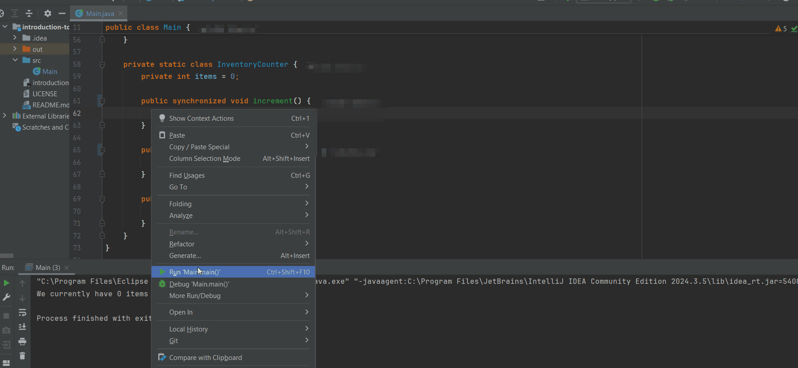
</div>

<details>
<summary id="The synchronized key word in locking monitor way!" open="true"> <b>Usage of synchronized key word in where data is shared! The Locking Monitor way!</b> </summary>

````Java 
/*
 * Copyright (c) 2019-2023. Michael Pogrebinsky - Top Developer Academy
 * https://topdeveloperacademy.com
 * All rights reserved
 */

/**
 * Resource Sharing & Introduction to Critical Sections
 * https://www.udemy.com/java-multithreading-concurrency-performance-optimization
 */
public class Main {
    public static void main(String[] args) throws InterruptedException {
        InventoryCounter inventoryCounter = new InventoryCounter();
        IncrementingThread incrementingThread = new IncrementingThread(inventoryCounter);
        DecrementingThread decrementingThread = new DecrementingThread(inventoryCounter);

        incrementingThread.start();
        decrementingThread.start();

        decrementingThread.join();
        incrementingThread.join();

        System.out.println("We currently have " + inventoryCounter.getItems() + " items");
    }

    public static class DecrementingThread extends Thread {

        private InventoryCounter inventoryCounter;

        public DecrementingThread(InventoryCounter inventoryCounter) {
            this.inventoryCounter = inventoryCounter;
        }

        @Override
        public void run() {
            for (int i = 0; i < 10000; i++) {
                inventoryCounter.decrement();
            }
        }
    }

    public static class IncrementingThread extends Thread {

        private InventoryCounter inventoryCounter;

        public IncrementingThread(InventoryCounter inventoryCounter) {
            this.inventoryCounter = inventoryCounter;
        }

        @Override
        public void run() {
            for (int i = 0; i < 10000; i++) {
                inventoryCounter.increment();
            }
        }
    }

    private static class InventoryCounter {
        private int items = 0;

        public synchronized void increment() {
            items++;
        }

        public synchronized void decrement() {
            items--;
        }

        public int getItems() {
            return items;
        }
    }
}
````
</details>

- Second is the **Lock** way!

<div align="center">
    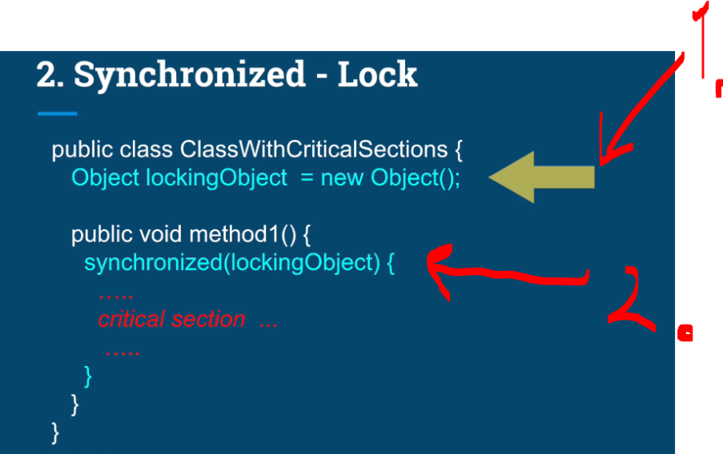
</div>

1. We can use **Lock Objects** to block (synchronize) **sections of code** and **not block whole method**, therefore we have better control over blocking! 
    - This can be **any** Object!
2. We lock **specified section**, from other threads to access it, as long the **Object locked**!

> [!TIP]
> **Separate lock objects** = **better concurrency control**!

<div align="center">
    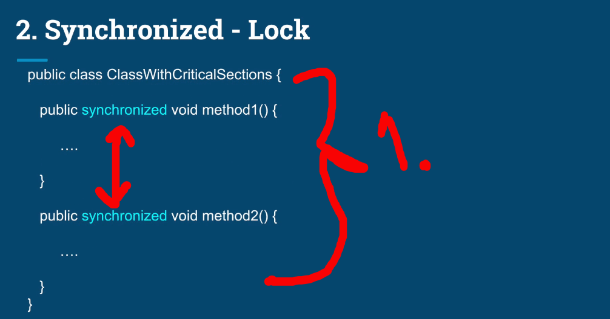
</div>

1. You can think as with the **Monitor** approach. This is equal to the approach in `2.`.
2. `synchronized(this)` in the methods, which will be blocking the methods calls of other threads.

<div align="center">
    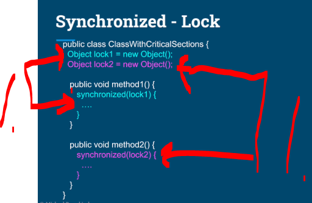
</div>

1. With this approach, we can have much more flexibility in our **blocking**.
    - We can have **multiple critical sections**, which are `synchronize`:d into **multiple different objects** in the same class!

<div align="center">
    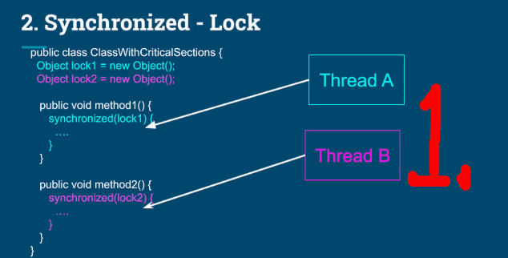
</div>

1. While `Thread A` will be accessing the `method1()`'s critical section. The `Thread B` will be accessing the `method2()`'s critical section.
2. Once the `Thread B` tries to the access the section where the `Thread A` is currently executing. The `Thread B` will get the access **blocked** and need to wait for the `Thread  A` to finish its **execution** of the **critical section**.

<div align="center">
    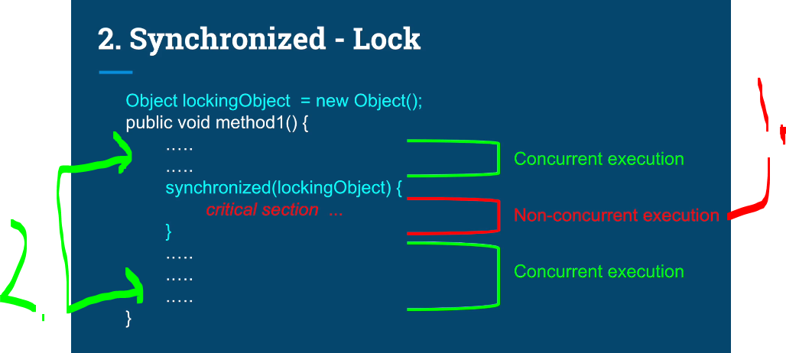
</div>

1. With this, we can separate the **blocked** code section to **bare minimum**. This example inside method.
2. We should always try to **reduce** the **critical section** to be `synchorinized` rather than `synchorinize` whole method.  
    - With this, we can execute more code **concurrently** and **less code** needs to be waited by the other threads.

- Below the example where we are **blocking**, for the **specified** code section! We just modify the previous example, main changes:
    - First we create the **Lock Object**:
    ````Java
    // The lock Object!
    Object lock = new Object();
    ````
    - `public  void decrement()`:
    ````Java
    public  void decrement() {
                synchronized (this.lock){
                    items--;
                }
            }
    ````
    - `public void increment()`:
    ````Java
    public void increment() {
            synchronized (this.lock){
                items++;
            }
        }
    ````
    - `public int getItems()`:
    ````Java
        public int getItems() {
            synchronized (this.lock){
                return items;
            }
        }
    ````

<div align="center">
    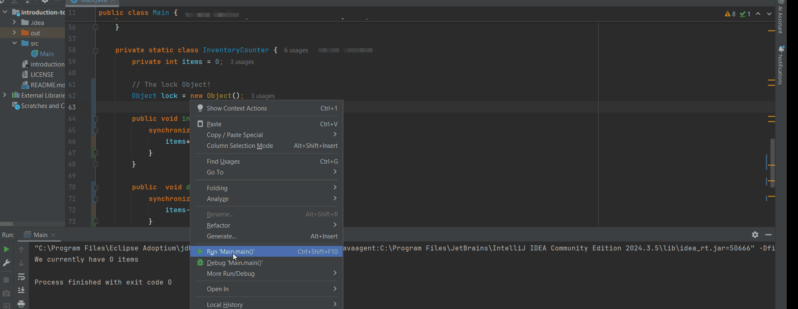
</div>

1. We can see that we are having **consistent** results with the **blocking separate codes**.
<details>
<summary id="The synchronized block" open="true"> <b>We are using the synchronized for blocking the some parts of critical section!</b> </summary>

````Java
/*
 * Copyright (c) 2019-2023. Michael Pogrebinsky - Top Developer Academy
 * https://topdeveloperacademy.com
 * All rights reserved
 */

/**
 * Resource Sharing & Introduction to Critical Sections
 * https://www.udemy.com/java-multithreading-concurrency-performance-optimization
 */
public class Main {
    public static void main(String[] args) throws InterruptedException {
        InventoryCounter inventoryCounter = new InventoryCounter();
        IncrementingThread incrementingThread = new IncrementingThread(inventoryCounter);
        DecrementingThread decrementingThread = new DecrementingThread(inventoryCounter);

        incrementingThread.start();
        decrementingThread.start();

        decrementingThread.join();
        incrementingThread.join();

        System.out.println("We currently have " + inventoryCounter.getItems() + " items");
    }

    public static class DecrementingThread extends Thread {

        private InventoryCounter inventoryCounter;

        public DecrementingThread(InventoryCounter inventoryCounter) {
            this.inventoryCounter = inventoryCounter;
        }

        @Override
        public void run() {
            for (int i = 0; i < 10000; i++) {
                inventoryCounter.decrement();
            }
        }
    }

    public static class IncrementingThread extends Thread {

        private InventoryCounter inventoryCounter;

        public IncrementingThread(InventoryCounter inventoryCounter) {
            this.inventoryCounter = inventoryCounter;
        }

        @Override
        public void run() {
            for (int i = 0; i < 10000; i++) {
                inventoryCounter.increment();
            }
        }
    }

    private static class InventoryCounter {
        private int items = 0;

        // The lock Object!
        Object lock = new Object();

        public void increment() {
            synchronized (this.lock){
                items++;
            }
        }

        public  void decrement() {
            synchronized (this.lock){
                items--;
            }
        }

        public int getItems() {
            synchronized (this.lock){
                return items;
            }
        }
    }
}
````
</details>

- Selvitä miksi tässä pitää käyttää synzhronized sanaa.

> [!TIP]
> *"Synchronized block is **Reentrant**
**A thread cannot prevent itself from entering a critical section**"*

<div align="center">
    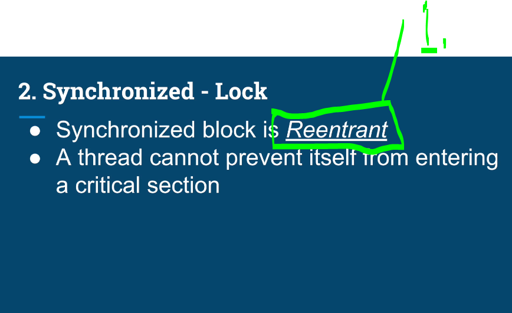
</div>

1. `Reentrant` in **Java context**: *Means that the same thread can enter a synchronized block or method it already holds the lock on*!

<div align="center">
    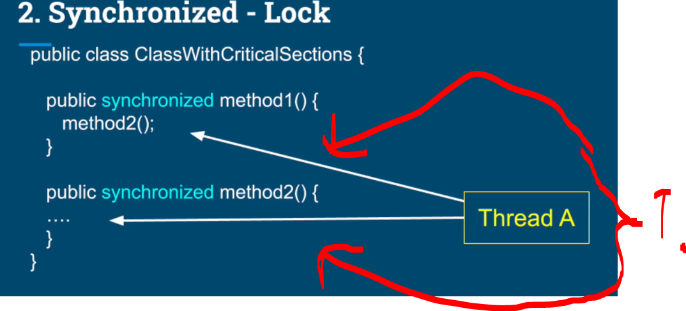
</div>

1. In other words, the `Thread A` is able to access, both `synchronized` methods, while still proceeding on the other `synchronized` method.
    - Thread **cannot prevent itself** to access another critical section!

<div align="center">
    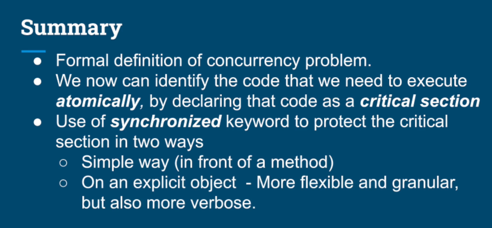
</div>

# Quiz 06: Critical Section & Synchronization.

<details>
<summary id="Thread progress
" open="true"> <b>Question 01.</b> </summary>

````yaml
Question 01:
Which statement is correct?
````

````Java
public class Main {
   public static void main(String [] args) {
        SharedClass sharedObject = new SharedClass();
 
        Thread thread1 = new Thread(() -> {
            while (true) {
                sharedObject.increment();
            }
        });
 
        Thread thread2 = new Thread(() -> {
            while (true) {
                sharedObject.increment();
            }
        });
 
        thread1.start();
        thread2.start();
    }
 
    static class SharedClass {
        private int counter = 0;
 
        public synchronized void increment() {
            this.counter++;
        }
    }
}
````

- My answer:

<div align="center">
    
</div>

1. The one **thread** can access **locked object** at the time. Since it was using the `synchronized` keyword in the method signature.

</details>

<details>

<summary id="Thread progress
" open="true"> <b>Question 02.</b> </summary>

````yaml
Question 02:
Which one is true?
````

````Java
public class Main {
    public static void main(String [] args) {
        SharedClass sharedObject = new SharedClass();
 
        Thread thread1 = new Thread(() -> {
            while (true) {
                sharedObject.increment();
            }
        });
 
        Thread thread2 = new Thread(() -> {
            while (true) {
                sharedObject.decrement();
            }
        });
 
        thread1.start();
        thread2.start();
    }
 
    static class SharedClass {
        private int counter = 0;
 
        public synchronized void increment() {
            this.counter++;
        }
 
        public synchronized void decrement() {
            this.counter--;
        }
    }
}
````

- My answer:

<div align="center">
    
</div>

1. Since the `sharedObject` is shared and the `synchronized` is behaving like the `synchronized(this)` for locking the object `SharedClass` for only **one thread** per time!
</details>

<details>

<summary id="Thread progress
" open="true"> <b>Question 03.</b> </summary>

````yaml
Question 03:
Which statement is correct?
````

````Java
public class Main {
    public static void main(String [] args) {
        SharedClass sharedObject1 = new SharedClass();
        SharedClass sharedObject2 = new SharedClass();
 
        Thread thread1 = new Thread(() -> {
            while (true) {
                sharedObject1.increment();
            }
        });
 
        Thread thread2 = new Thread(() -> {
            while (true) {
                sharedObject2.increment();
            }
        });
 
        thread1.start();
        thread2.start();
    }
 
    static class SharedClass {
        private int counter = 0;
 
        public synchronized void increment() {
            this.counter++;
        }
    }
}
````

- My answer:

<div align="center">
    
</div>

1. When `thread1` is executing `sharedObject1.increment();`, `thread2` can execute `sharedObject2.increment();`, since synchronization happens on the **object level**, and `thread1` and `thread2` are operating on two different, independent objects. That's right!

</details>

<details>

<summary id="Thread progress
" open="true"> <b>Question 04.</b> </summary>

````yaml
Question 04:
Which statement is the most correct?
````

````Java
public class Main {
    public static void main(String [] args) {
        SharedClass sharedObject = new SharedClass();
 
        Thread thread1 = new Thread(() -> {
            while (true) {
                sharedObject.incrementCounter1();
            }
        });
 
        Thread thread2 = new Thread(() -> {
            while (true) {
                sharedObject.incrementCounter2();
            }
        });
 
        thread1.start();
        thread2.start();
    }
 
    static class SharedClass {
        private int counter1 = 0;
        private int counter2 = 0;
 
        private Object lock1 = new Object();
        private Object lock2 = new Object();
 
        public void incrementCounter1() {
            synchronized (lock1) {
                this.counter1++;
            }
        }
 
        public void incrementCounter2() {
            synchronized (lock2) {
                this.counter2++;
            }
        }
    }
}
````

- My answer:

<div align="center">
    
</div>

1. When `thread1` is executing `sharedObject.incrementCounter1();`, `thread2` can execute `sharedObject.incrementCounter2();`. That is because the synchronized blocks inside those methods, synchronize on different lock objects.
</details>


# Atomic Operations, Volatile & Metrics Practical Example.

<div align="center">
    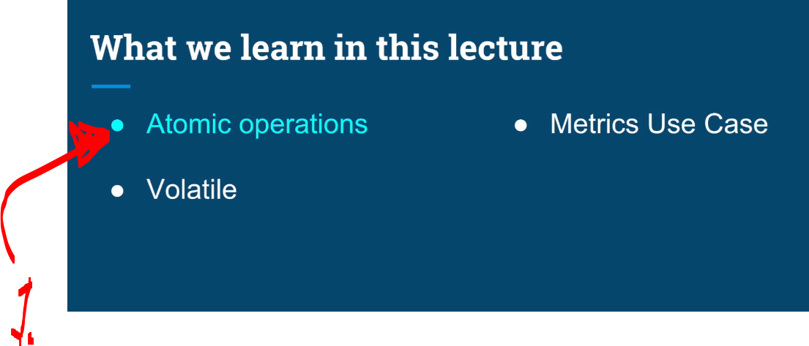
</div>

1. How do we know which operations are **atomic** are which are not?!

<div align="center">
    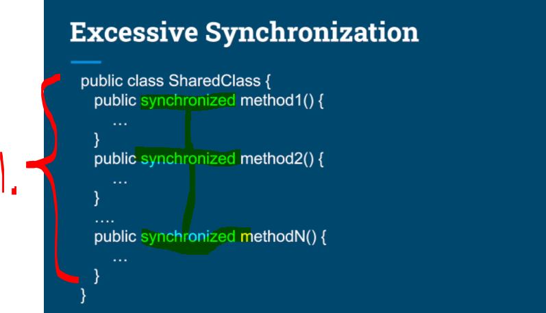
</div>

1. **First** we are exploring the extreme **defensive** approach!
    - In this one we will be making every method `synchronized`.

- Next we will be illustrating the **chart** of the **synchronization**.
    - In here we are creating **4 threads** in which we have added `synchronized` to each of them:
        - One **thread** in **yellow**.
        - Second **thread** one in **purple**.
        - Third **thread** one in **cyan**.
        - Fourth **thread** one in **green**.

<div align="center">
    
</div>

1. Currently, the **execution** chart looks like such!
    - This scenario we have **no parallel execution**
    - We are paying the cost of **context switching** and the **memory overhead**!

- All of this, for maintaining **multiple threads**! 

<div align="center">
    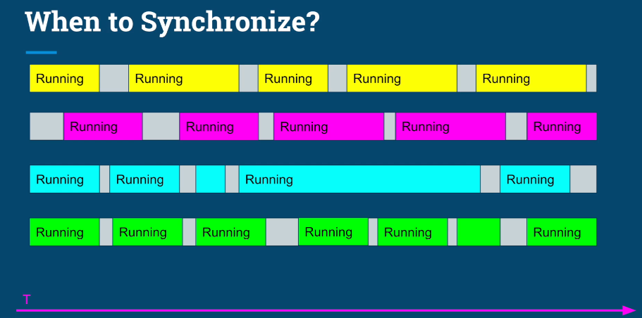
</div>

- We are **preferring** this overall picture!

- Todo Tsekkaa tämä

- We should actually use the `synchronization` as little as possible.

<div align="center">
    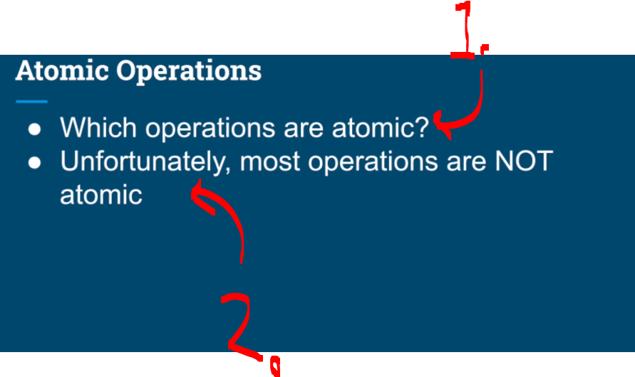
</div>

1. Let's identify, which operations are **atomic**!
2. Fact is, that the most of the operations are **NOT** atomic!

> [!TIP]
> 💡 Whenever **multiple threads modify a shared variable**, and the operation is **non-atomic**, you risk lost updates. 💡

- Example below of what can happen, when there is **non-atomic** variable!

````Java
int count = 0; Runnable task = () ->
    {
        for (int i = 0; i < 1000; i++)
        { 
            count++; // Not atomic!
        } 
    }; 
Thread t1 = new Thread(task);
Thread t2 = new Thread(task);
t1.start();
t2.start();
t1.join();
t2.join();
System.out.println(count); // Often less than 2000!
````

 - `count++` often gives less than *2000* in your example.

<div align="center">
    
</div>

<div align="center">
    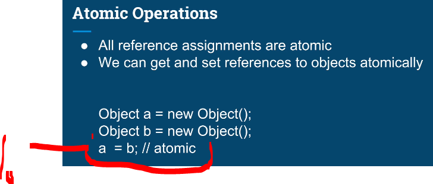
</div>

1. We can make **assignments** like `a = b` assignment in single operation safely! 

<div align="center">
    
</div>

<div align="center">
    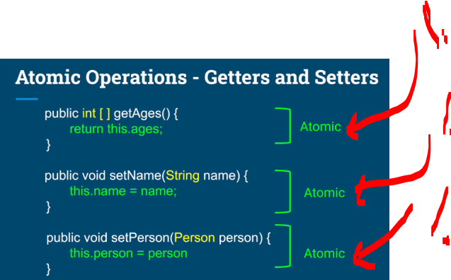
</div>

1. All **reads** and **writes** of reference variables are **atomic**!
    - So naturally getter and setter are also!

- Check these ones.

<div align="center">
    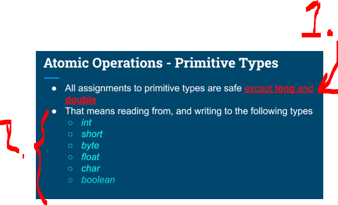
</div>

1. All **reads** and **writes** of **primitive variables** (except **long** and **double**) are **atomic**.

2. **reading** and **writing** from primitives are atomic, such as these. 

<div align="center">
    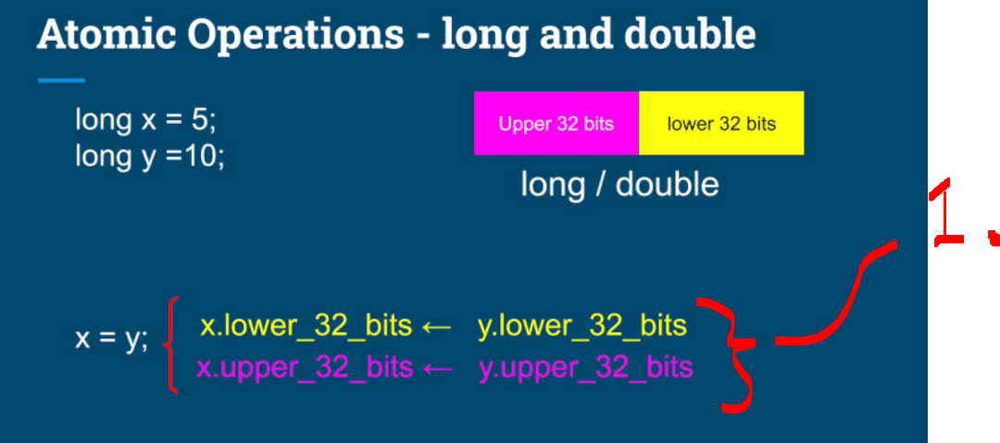
</div>

1. Since the **long** and **double** are `64` bits long, it's **not** guaranteed for **one operation** is **atomic**! This usually takes **two operations** since:
    - The one writes to the`lower` **32** bits and another writes to the `upper` **32** bits.

- Operation as [non-atomic](https://docs.oracle.com/javase/specs/jls/se7/html/jls-17.html#jls-17.7) documentation

<div align="center">
    
</div>

1. Next we will be checking the **Volatile** for the `double` and `long`!

<div align="center">
    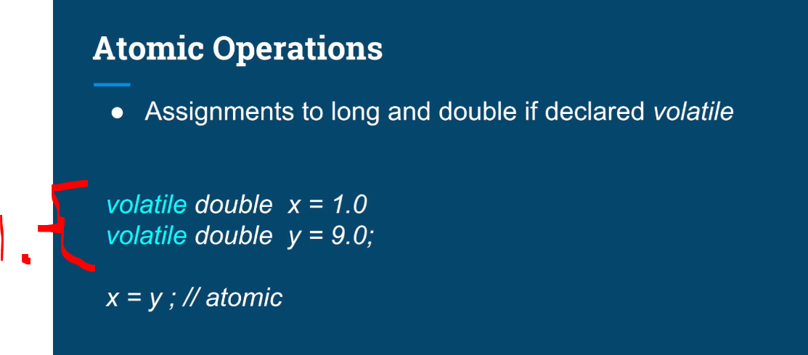
</div>

1. If we define with the `volatile` they will make these variables **atomic** and **thread safe**!

<div align="center">
    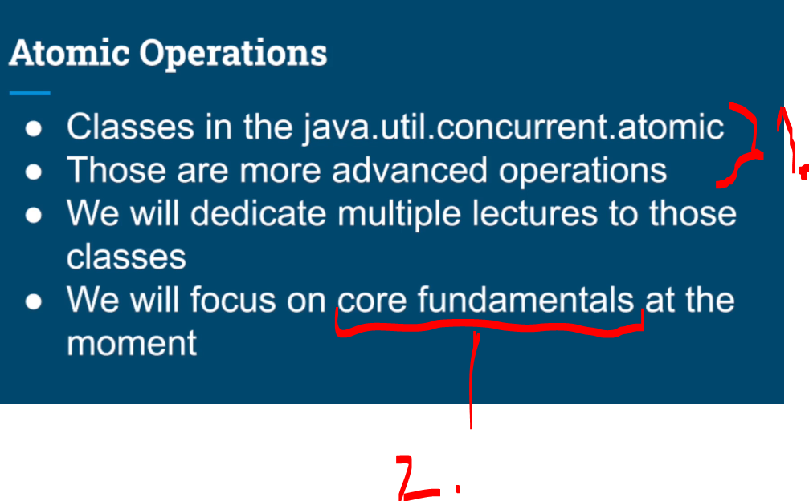
</div>

1. There are more classes that make the other **non-atomic** operations to **atomic**. 
    - We are currently touching the base understanding of **atomic operations**.

<div align="center">
    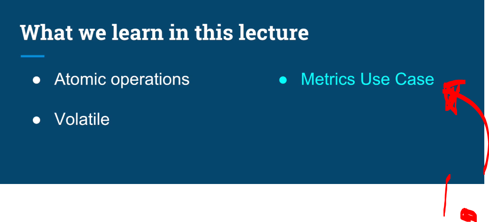
</div>

1. We will be checking the how to have **some metric units** for example the production. 

<div align="center">
    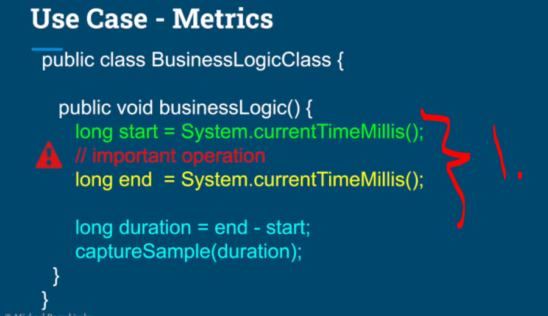
</div>

1. Furthermore, we can use ways to get *how long something took?*
    - For the **important operations**.

- ChatGbt check this.

- How we should make following:

````Java
    public static class Metrics {
        private long count = 0;
        private double average = 0.0;

        public void addSample(long sample) {
            double currentSum = average * count;
            count++;
            average = (currentSum + sample) / count;
        }

        public double getAverage()
        {
            return average;
        }
    }
````

- To following code, which is **thread safe**:

````Java
public static class Metrics {
        private long count = 0;
        private volatile double average = 0.0;

        public synchronized void addSample(long sample) {
            double currentSum = average * count;
            count++;
            average = (currentSum + sample) / count;
        }

        public double getAverage() {
            return average;
        }
    }
````

- The `addSample()` should be `synchronized`, since there are of shared variables!

- We are adding `volatile` to the `double average`. Since it should be up-to-date with other threads.

- Todo tee tämä loppuun.

# Quiz 7: Atomic Operations, Volatile & Metrics Practical Example.

# Coding Exercise 3: Min - Max Metrics.

# Min - Max Metrics - Solution.

# Race Conditions & Data Races.

<div align="center">
    
</div>

1. We will be checking the **Locking Strategies**.

# Quiz 8: Data Races.

# Locking Strategies & Deadlocks.

<div align="center">
    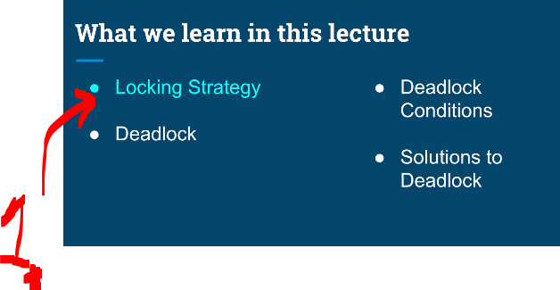
</div>

1. We will be checking **Locking Strategies** next!

<div align="center">
    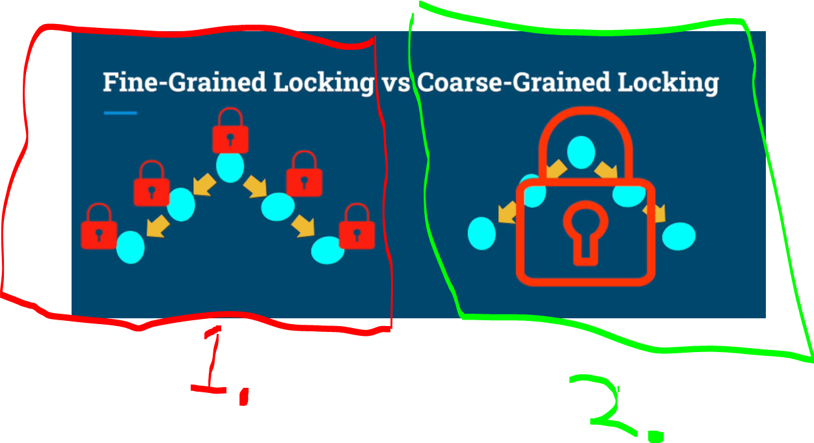
</div>

- In **multithreaded programming**, we need to make choice, which **locking strategy** we need to choose:
    - `1.` **Fine-Grained Locking**.
        - Should we have **multiple** locks per resource!
    - `2.` **Coarse-Grained Locking**.
        - Should we have **one** lock for one resource!

<div align="center">
    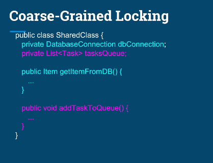
</div>


# Quiz 9: Locking Strategies & Deadlocks.
