# Chapter 06 - The Concurrency Challenges & Solutions.

The Concurrency Challenges & Solutions.

# What I learned.

# Critical Section & Synchronization.

<div align="center">
    
</div>

1. Add here 

<div align="center">
    
</div>

1. We will be starting to explore the **Critical Section**.

- We need to address following **problem**:

<div align="center">
    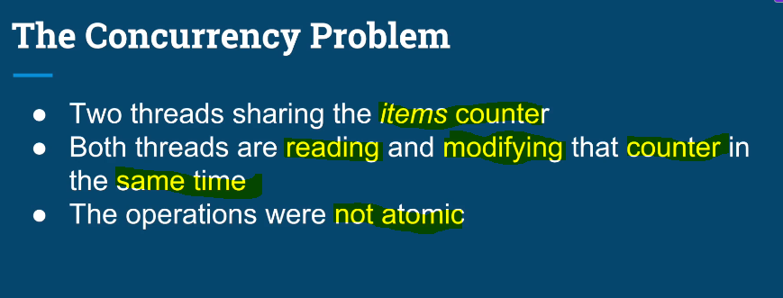
</div>

- We would need to execute **set** of operation, which would need to be executed as **single atomic operation**.
    - **Two** threads could be performing these set of codes **at the same time**. Example set of operations below:

````Java
void aggregateFunction() {
    operation1();
    operation2();
    operation3();
}
````

<div align="center">
    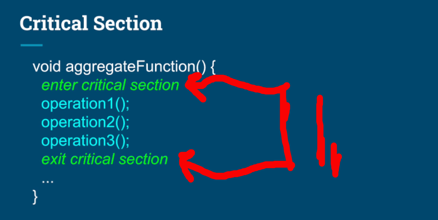
</div>

1. We will be surrounding this **critical section** with the **tags** as following. This will prevent the concurrent execution of the code. 
2. `Thread A` can execute the operations, exit and enter to this **section**.
3. If `Thread B` tries to access this **critical section**, while `Thread A` is still on it, the `Thread B` will be **suspended** status until the first **thread** `Thread A` is finished with the **critical section**.

<p align="center">
    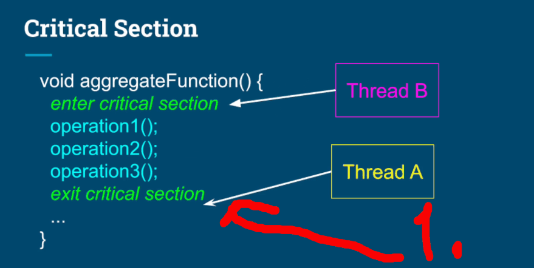
</p>

1. Once the `Thread A` finishes the **critical section**, the second **thread** `Thread B` can access the **critical section** and perform all the operations!

> [!TIP]
> 💡 **Remember** these concepts are the **same** regardless of the language. They might be in some different *flavor* or *API's*. 💡

<div align="center">
    
</div>

1. **JVM** provides us with many ways to **protect** the **critical section** against multiple threads execution!

<div align="center">
    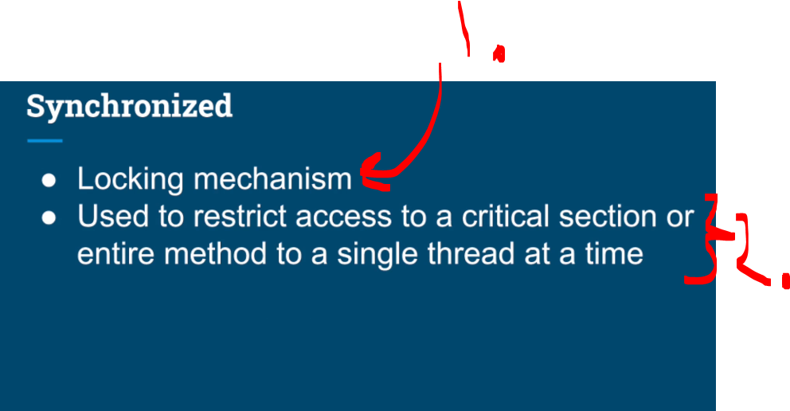
</div>

1. Simplest solution is to use `synchronized` **keyword**. This is **locking mechanism**! 
2. This is to prevent access to the **critical section** or to the **method** from the **multiple threads** at the time.
    - We have **two** ways to use this!
        - First the **Monitor** way!
        - Second the **Lock** way!

<div align="center">
    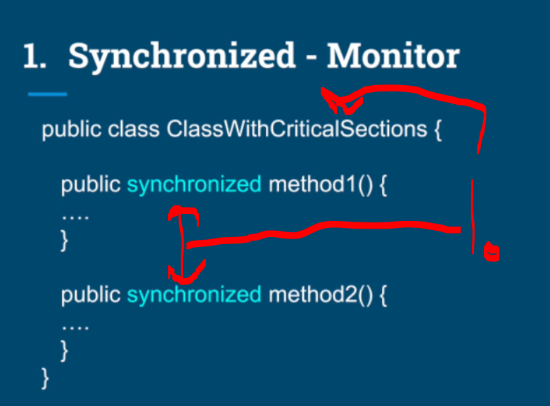
</div>

1. **First** the Monitor way!
    - `synchronized` ensures that only **one thread** at a time can execute any synchronized method of that particular object instance (`method1()`, `method2()`, etc.). Other threads must wait until the monitor (lock) is released.
    - Only *one* **synchronized method** can be run at a time:

    ````Java
    ClassWithCriticalSections obj = new ClassWithCriticalSections();

    Thread t1 = new Thread(() -> obj.method1()); // This works.
    Thread t2 = new Thread(() -> obj.method1()); // This wont works!
    
    t1.start(); // This works.
    t2.start(); // This wont work!
    ````
    - We could start `a.method1()` and `b.method1()` at the same time, since `synchronized` keyword **locks the object**, **not the class**! Example in below:
    ````Java
    ClassWithCriticalSections obj1 = new ClassWithCriticalSections();
    ClassWithCriticalSections obj2 = new ClassWithCriticalSections();

    Thread t1 = new Thread(() -> obj1.method1()); // This works.
    Thread t2 = new Thread(() -> obj2.method1()); // This works.
    t1.start(); // This works.
    t2.start(); // This works.
    ````
        
<div align="center">
    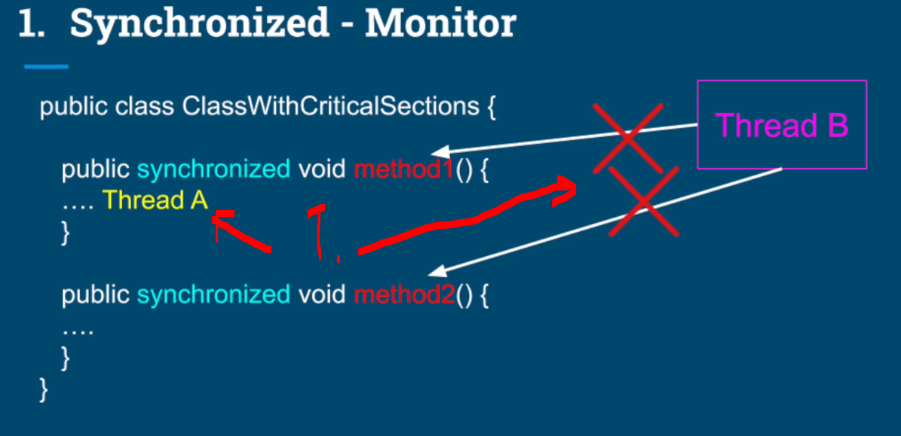
</div>

1. If the `Thread A` is executing either `method1()` or `method2()` the `Thread B` is prevented to execute at all other methods. The locking is applied to the **object itself**, rather than **individual methods**!
    - The term used here for this concept is **Monitor**.

<p align="center">
    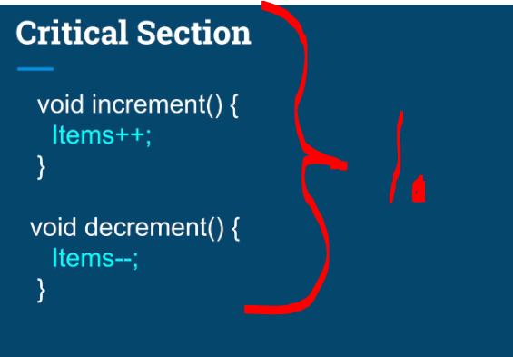
</p>

1. We will apply our `synchronized` for our old user case!

> [!IMPORTANT]
> **Rule of Thumb (very important)**
> One should be using `synchronize` where the **shared data is**, not **where it is used**!

- We will be using `synchronized` **keyword** on the shared object.
You can see it's now fixed.
    - We are getting consistent results!

<div align="center">
    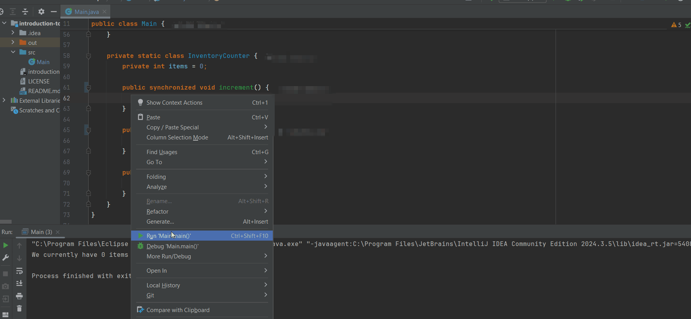
</div>

<details>
<summary id="The_Synchronized_Keyword_In_Locking_Monitor_Way!" open="true"> <b>Usage of synchronized key word in where data is shared! The Locking Monitor way!</b> </summary>

````Java 
/*
 * Copyright (c) 2019-2023. Michael Pogrebinsky - Top Developer Academy
 * https://topdeveloperacademy.com
 * All rights reserved
 */

/**
 * Resource Sharing & Introduction to Critical Sections
 * https://www.udemy.com/java-multithreading-concurrency-performance-optimization
 */
public class Main {
    public static void main(String[] args) throws InterruptedException {
        InventoryCounter inventoryCounter = new InventoryCounter();
        IncrementingThread incrementingThread = new IncrementingThread(inventoryCounter);
        DecrementingThread decrementingThread = new DecrementingThread(inventoryCounter);

        incrementingThread.start();
        decrementingThread.start();

        decrementingThread.join();
        incrementingThread.join();

        System.out.println("We currently have " + inventoryCounter.getItems() + " items");
    }

    public static class DecrementingThread extends Thread {

        private InventoryCounter inventoryCounter;

        public DecrementingThread(InventoryCounter inventoryCounter) {
            this.inventoryCounter = inventoryCounter;
        }

        @Override
        public void run() {
            for (int i = 0; i < 10000; i++) {
                inventoryCounter.decrement();
            }
        }
    }
    public static class IncrementingThread extends Thread {

        private InventoryCounter inventoryCounter;

        public IncrementingThread(InventoryCounter inventoryCounter) {
            this.inventoryCounter = inventoryCounter;
        }

        @Override
        public void run() {
            for (int i = 0; i < 10000; i++) {
                inventoryCounter.increment();
            }
        }
    }
    private static class InventoryCounter {
        private int items = 0;

        public synchronized void increment() {
            items++;
        }

        public synchronized void decrement() {
            items--;
        }

        public int getItems() {
            return items;
        }
    }
}
````
</details>

- Second is the **Lock** way!

<div align="center">
    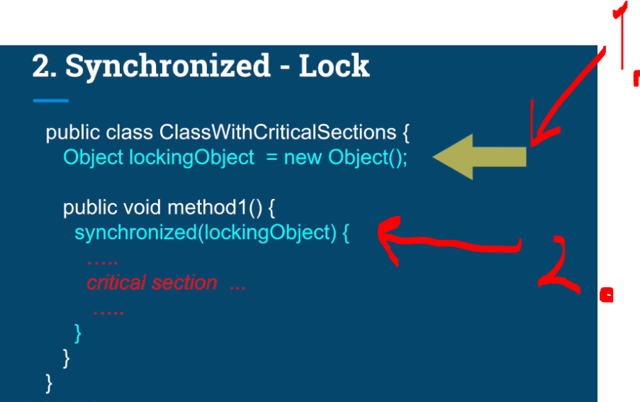
</div>

1. We can use **Lock Objects** to block (synchronize) **sections of code** and **not block whole method**, therefore we have better control over blocking! 
    - This can be **any** Object!
2. We lock **specified section**, from other threads to access it, as long the **Object locked**!

> [!TIP]
> 💡 **Separate lock objects** = **better concurrency control**! 💡

<div align="center">
    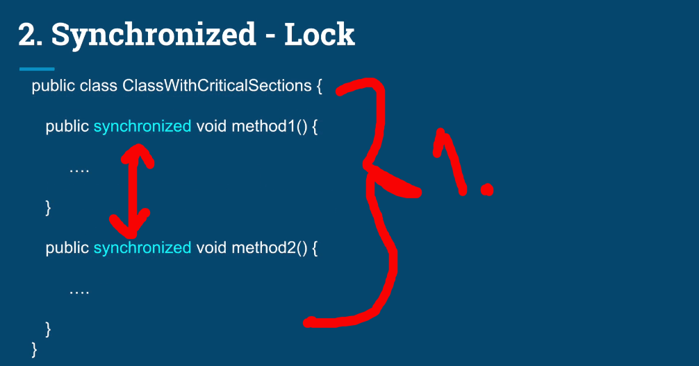
</div>

1. You can think as with the **Monitor** approach. This is equal to the approach in `2.`.
2. `synchronized(this)` in the methods, which will be blocking the methods calls of other threads.

<div align="center">
    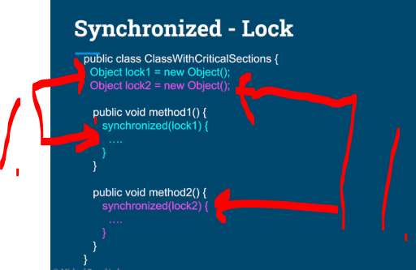
</div>

1. With this approach, we can have much more flexibility in our **blocking**.
    - We can have **multiple critical sections**, which are `synchronize`:d into **multiple different objects** in the same class!

<div align="center">
    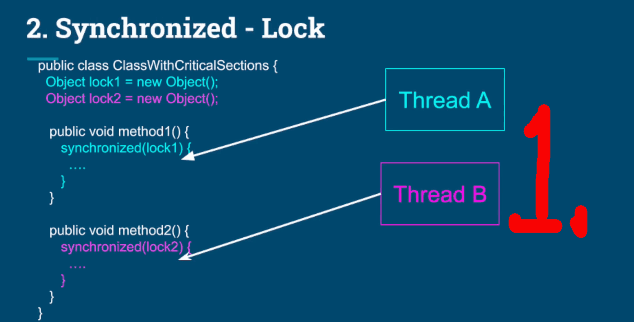
</div>

1. While `Thread A` will be accessing the `method1()`'s critical section. The `Thread B` will be accessing the `method2()`'s critical section.
2. Once the `Thread B` tries to the access the section where the `Thread A` is currently executing. The `Thread B` will get the access **blocked** and need to wait for the `Thread  A` to finish its **execution** of the **critical section**.

<div align="center">
    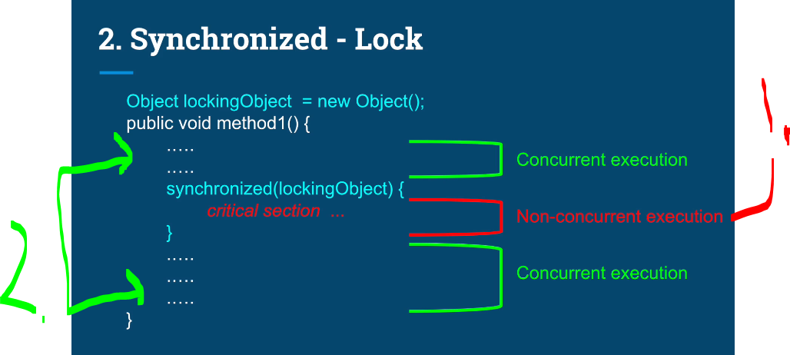
</div>

1. With this, we can separate the **blocked** code section to **bare minimum**. This example inside method.
2. We should always try to **reduce** the **critical section** to be `synchorinized` rather than `synchorinize` whole method.  
    - With this, we can execute more code **concurrently** and **less code** needs to be waited by the other threads.

- Below the example where we are **blocking**, for the **specified** code section! We just modify the previous example, main changes:
    - First we create the **Lock Object**:
    ````Java
    // The lock Object!
    Object lock = new Object();
    ````
    - `public  void decrement()`:
    ````Java
    public  void decrement() {
                synchronized (this.lock){
                    items--;
                }
            }
    ````
    - `public void increment()`:
    ````Java
    public void increment() {
            synchronized (this.lock){
                items++;
            }
        }
    ````
    - `public int getItems()`:
    ````Java
        public int getItems() {
            synchronized (this.lock){
                return items;
            }
        }
    ````

<div align="center">
    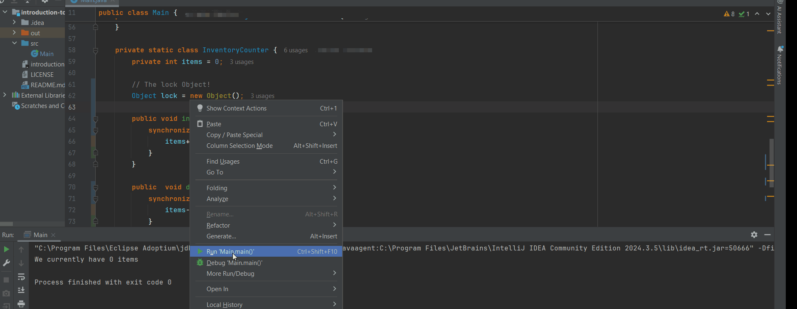
</div>

1. We can see that we are having **consistent** results with the **blocking separate codes**.
<details>
<summary id="The_Synchronized_Block" open="true"> <b>We are using the synchronized for blocking the some parts of critical section!</b> </summary>

````Java
/*
 * Copyright (c) 2019-2023. Michael Pogrebinsky - Top Developer Academy
 * https://topdeveloperacademy.com
 * All rights reserved
 */

/**
 * Resource Sharing & Introduction to Critical Sections
 * https://www.udemy.com/java-multithreading-concurrency-performance-optimization
 */
public class Main {
    public static void main(String[] args) throws InterruptedException {
        InventoryCounter inventoryCounter = new InventoryCounter();
        IncrementingThread incrementingThread = new IncrementingThread(inventoryCounter);
        DecrementingThread decrementingThread = new DecrementingThread(inventoryCounter);

        incrementingThread.start();
        decrementingThread.start();

        decrementingThread.join();
        incrementingThread.join();

        System.out.println("We currently have " + inventoryCounter.getItems() + " items");
    }

    public static class DecrementingThread extends Thread {

        private InventoryCounter inventoryCounter;

        public DecrementingThread(InventoryCounter inventoryCounter) {
            this.inventoryCounter = inventoryCounter;
        }

        @Override
        public void run() {
            for (int i = 0; i < 10000; i++) {
                inventoryCounter.decrement();
            }
        }
    }

    public static class IncrementingThread extends Thread {

        private InventoryCounter inventoryCounter;

        public IncrementingThread(InventoryCounter inventoryCounter) {
            this.inventoryCounter = inventoryCounter;
        }

        @Override
        public void run() {
            for (int i = 0; i < 10000; i++) {
                inventoryCounter.increment();
            }
        }
    }

    private static class InventoryCounter {
        private int items = 0;

        // The lock Object!
        Object lock = new Object();

        public void increment() {
            synchronized (this.lock){
                items++;
            }
        }

        public  void decrement() {
            synchronized (this.lock){
                items--;
            }
        }

        public int getItems() {
            synchronized (this.lock){
                return items;
            }
        }
    }
}
````
</details>

- Selvitä miksi tässä pitää käyttää synzhronized sanaa. Todo

> [!TIP]
> 💡 *"Synchronized block is **Reentrant**
**A thread cannot prevent itself from entering a critical section**"* 💡

<div align="center">
    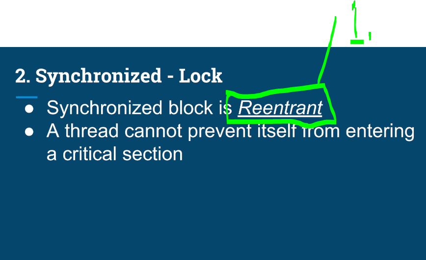
</div>

1. `Reentrant` in **Java context**: *Means that the same thread can enter a synchronized block or method it already holds the lock on*!

<div align="center">
    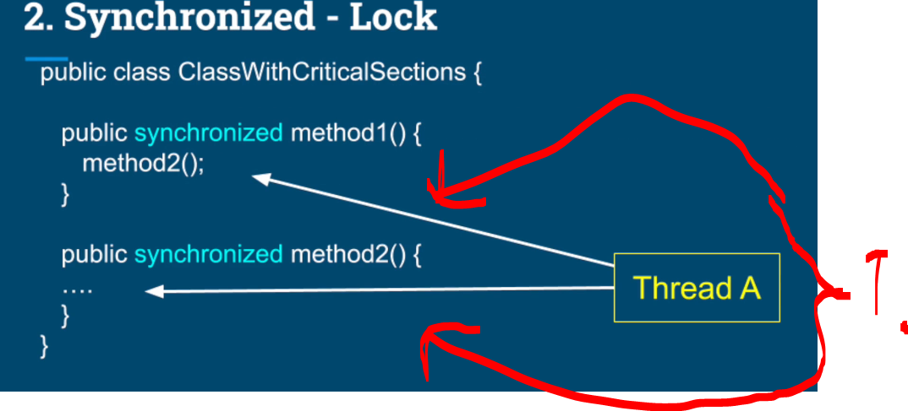
</div>

1. In other words, the `Thread A` is able to access, both `synchronized` methods, while still proceeding on the other `synchronized` method.
    - Thread **cannot prevent itself** to access another critical section!

<div align="center">
    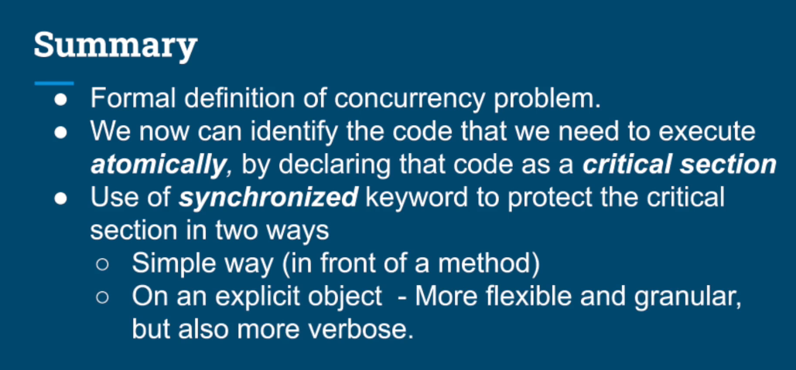
</div>

- Todo check this one is consistent

# Quiz 06: Critical Section & Synchronization.

<details>
<summary id="Thread progress
" open="true"> <b>Question 01.</b> </summary>

````yaml
Question 01:
Which statement is correct?
````

````Java
public class Main {
   public static void main(String [] args) {
        SharedClass sharedObject = new SharedClass();
 
        Thread thread1 = new Thread(() -> {
            while (true) {
                sharedObject.increment();
            }
        });
 
        Thread thread2 = new Thread(() -> {
            while (true) {
                sharedObject.increment();
            }
        });
 
        thread1.start();
        thread2.start();
    }
 
    static class SharedClass {
        private int counter = 0;
 
        public synchronized void increment() {
            this.counter++;
        }
    }
}
````

- My answer:

<div align="center">
    
</div>

1. The one **thread** can access **locked object** at the time. Since it was using the `synchronized` keyword in the method signature.

</details>

<details>

<summary id="Thread progress
" open="true"> <b>Question 02.</b> </summary>

````yaml
Question 02:
Which one is true?
````

````Java
public class Main {
    public static void main(String [] args) {
        SharedClass sharedObject = new SharedClass();
 
        Thread thread1 = new Thread(() -> {
            while (true) {
                sharedObject.increment();
            }
        });
 
        Thread thread2 = new Thread(() -> {
            while (true) {
                sharedObject.decrement();
            }
        });
 
        thread1.start();
        thread2.start();
    }
 
    static class SharedClass {
        private int counter = 0;
 
        public synchronized void increment() {
            this.counter++;
        }
 
        public synchronized void decrement() {
            this.counter--;
        }
    }
}
````

- My answer:

<div align="center">
    
</div>

1. Since the `sharedObject` is shared and the `synchronized` is behaving like the `synchronized(this)` for locking the object `SharedClass` for only **one thread** per time!
</details>

<details>

<summary id="Thread progress
" open="true"> <b>Question 03.</b> </summary>

````yaml
Question 03:
Which statement is correct?
````

````Java
public class Main {
    public static void main(String [] args) {
        SharedClass sharedObject1 = new SharedClass();
        SharedClass sharedObject2 = new SharedClass();
 
        Thread thread1 = new Thread(() -> {
            while (true) {
                sharedObject1.increment();
            }
        });
 
        Thread thread2 = new Thread(() -> {
            while (true) {
                sharedObject2.increment();
            }
        });
 
        thread1.start();
        thread2.start();
    }
 
    static class SharedClass {
        private int counter = 0;
 
        public synchronized void increment() {
            this.counter++;
        }
    }
}
````

- My answer:

<div align="center">
    
</div>

1. When `thread1` is executing `sharedObject1.increment();`, `thread2` can execute `sharedObject2.increment();`, since synchronization happens on the **object level**, and `thread1` and `thread2` are operating on two different, independent objects. That's right!

</details>

<details>

<summary id="Thread progress
" open="true"> <b>Question 04.</b> </summary>

````yaml
Question 04:
Which statement is the most correct?
````

````Java
public class Main {
    public static void main(String [] args) {
        SharedClass sharedObject = new SharedClass();
 
        Thread thread1 = new Thread(() -> {
            while (true) {
                sharedObject.incrementCounter1();
            }
        });
 
        Thread thread2 = new Thread(() -> {
            while (true) {
                sharedObject.incrementCounter2();
            }
        });
 
        thread1.start();
        thread2.start();
    }
 
    static class SharedClass {
        private int counter1 = 0;
        private int counter2 = 0;
 
        private Object lock1 = new Object();
        private Object lock2 = new Object();
 
        public void incrementCounter1() {
            synchronized (lock1) {
                this.counter1++;
            }
        }
 
        public void incrementCounter2() {
            synchronized (lock2) {
                this.counter2++;
            }
        }
    }
}
````

- My answer:

<div align="center">
    
</div>

1. When `thread1` is executing `sharedObject.incrementCounter1();`, `thread2` can execute `sharedObject.incrementCounter2();`. That is because the synchronized blocks inside those methods, synchronize on different lock objects.
</details>


# Atomic Operations, Volatile & Metrics Practical Example.

<div align="center">
    
</div>

1. We will be looking how we will have **atomic** operation!

<div align="center">
    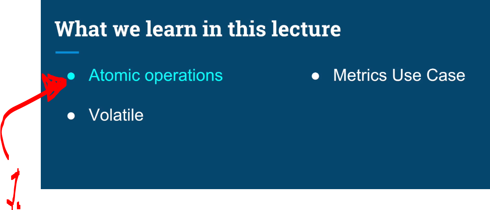
</div>

1. How do we know which operations are **atomic** are which are not?!

<div align="center">
    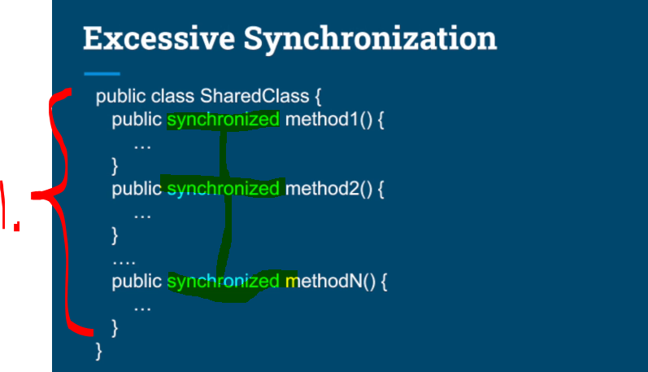
</div>

1. **First** we are exploring the extreme **defensive** approach!
    - In this one we will be making every method `synchronized`.

- Next we will be illustrating the **chart** of the **synchronization**.
    - In here we are creating **4 threads** in which we have added `synchronized` to each of them:
        - One **thread** in **yellow**.
        - Second **thread** one in **purple**.
        - Third **thread** one in **cyan**.
        - Fourth **thread** one in **green**.

<div align="center">
    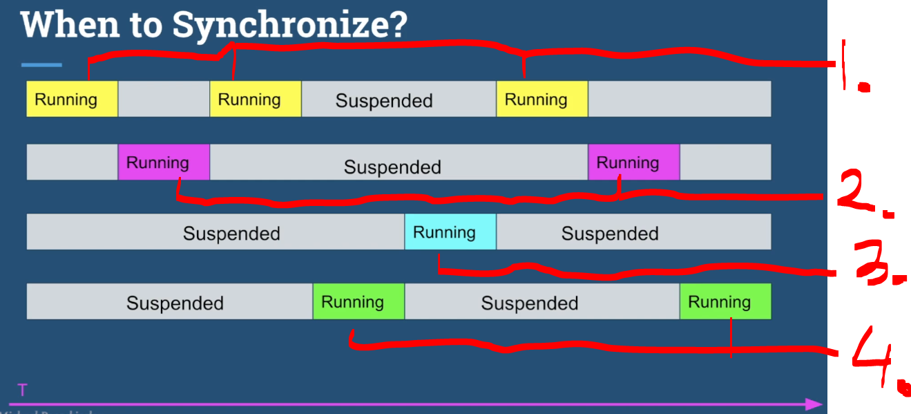
</div>

1. Currently, the **execution** chart looks like such!
    - This scenario we have **no parallel execution**
    - We are paying the cost of **context switching** and the **memory overhead**!

- All of this, for maintaining **multiple threads**, with the **context switches** and maintaining the shared memory!

<div align="center">
    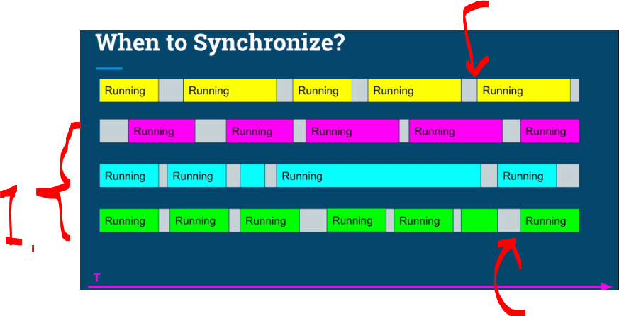
</div>

1. We are **preferring** this overall picture! Where there is much smaller amounts for the idle period for the **executing threads**

> [!NOTE]  
> We should actually use the `synchronization` as little as possible!

<div align="center">
    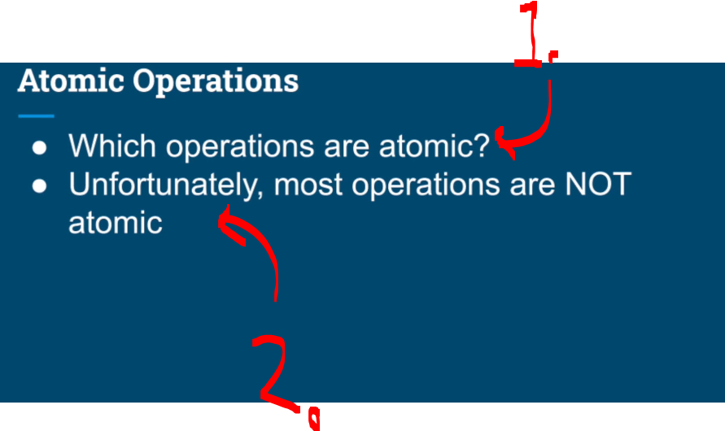
</div>

1. Let's identify, which operations are **atomic**!
2. Fact is, that the **most of the operations** are **NOT** atomic!

<div align="center">
    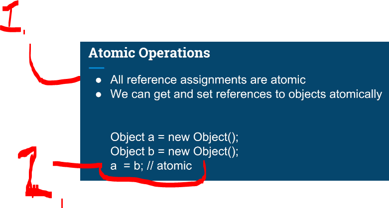
</div>

1. All reference assignment operations are **atomic**!
2. Example here:
    - We can make **assignments** like `a = b` assignment in single operation safely! 

<div align="center">
    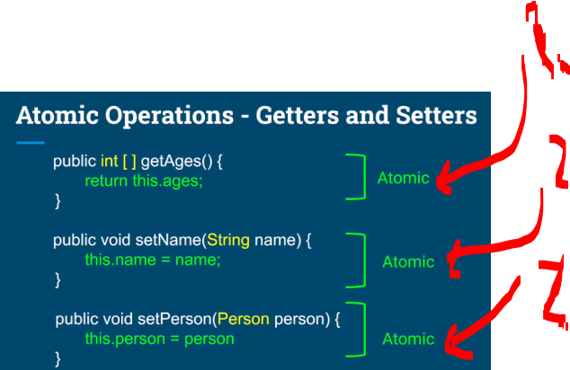
</div>

1. Notice the `int []` **object** or **reference** type!
2. All **reads** and **writes** of reference variables are **atomic**!
    - So naturally **getter** and **setter** are also!

> [!NOTE]  
> ✅ `int` → primitive
> ❌ `int []` → object/reference type

> [!WARNING]
> `long` and `double` are exception to the rules!

<div align="center">
    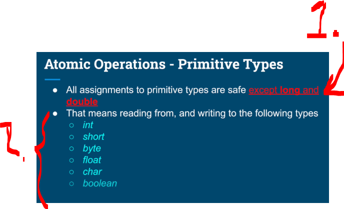
</div>

1. All **reads** and **writes** of **primitive variables**.
    - ❌ Except **long** and **double** are atomic. ❌ 

2. **Reading** and **writing** from primitives are atomic, such as these. 

<div align="center">
    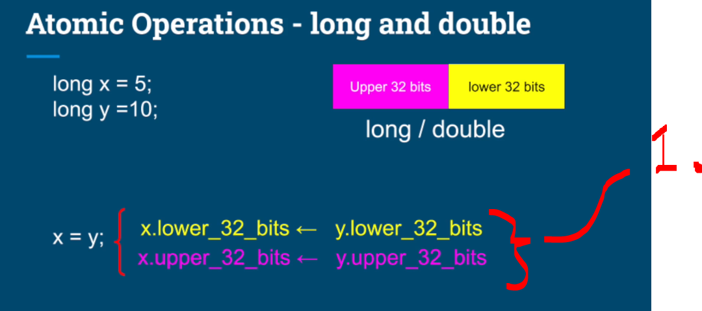
</div>

1. Since the **long** and **double** are `64` bits long, it's **not** guaranteed for **one operation** is **atomic**! This usually takes **two operations** since:
    - The one writes to the`lower` **32** bits and another writes to the `upper` **32** bits.

- One can check, operation as [non-atomic](https://docs.oracle.com/javase/specs/jls/se7/html/jls-17.html#jls-17.7) documentation

<div align="center">
    
</div>

1. Next we will be checking the **Volatile** keyword for the `double` and `long`!

<div align="center">
    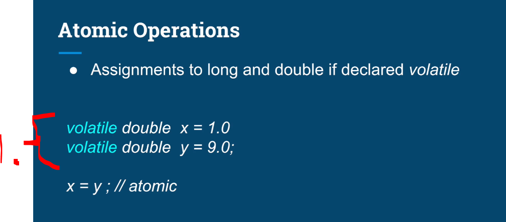
</div>

1. If we define with the `volatile` they will make these variables **atomic** and **thread safe**!

<div align="center">
    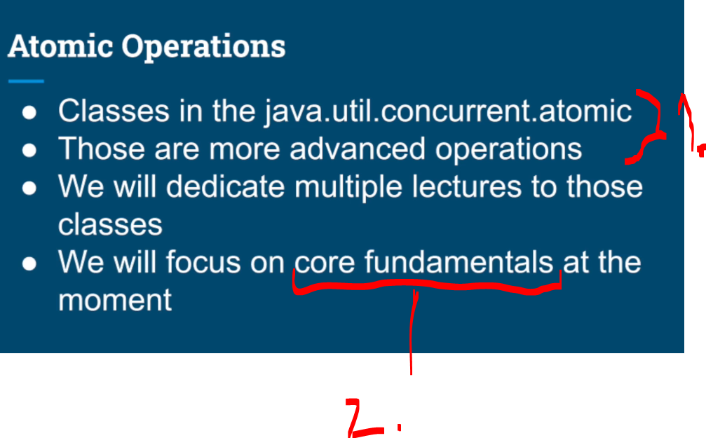
</div>

1. There are more classes that make the other **non-atomic** operations to **atomic**, all this from **Java** `java.util.concurrent.atomic`!
    - We are currently touching the base understanding of **atomic operations**.
2. We are focusing to the **core fundamentals**!

<div align="center">
    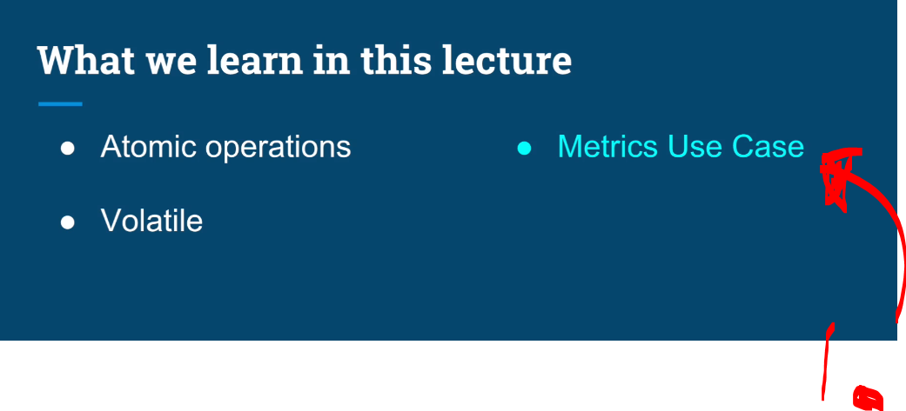
</div>

1. Furthermore, we will be checking the how to have **some metric units** for execution in the production. 

<div align="center">
    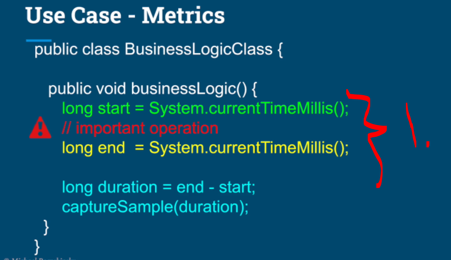
</div>

1. Moreover, we can use ways to get *how long something took?*
    - For the example **important operations**.

- Example looking following code:

````Java
    public static class Metrics {
        private long count = 0;
        private double average = 0.0;

        public void addSample(long sample) {
            double currentSum = average * count;
            count++;
            average = (currentSum + sample) / count;
        }

        public double getAverage()
        {
            return average;
        }
    }
````

- We are analyzing and making this code as **atomic** as possible!

<div align="center">
    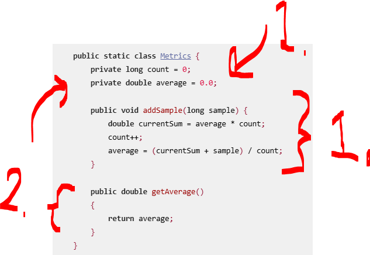
</div>

1. This whole is **non-atomic**, even thought the individual **operations** are **atomic**! Since this can be **accessed** by multiple **threads** in the same time!
    - These are performed to the shared variables `average` and `count`! We need to add there `synchronized` keyword!

2. The `average` is `double`, so it is **non-atomic**! This needs to have `volatile` keyword!

- To following code, which is **thread safe**:

````Java
public static class Metrics {
        private long count = 0;
        private volatile double average = 0.0;

        public synchronized void addSample(long sample) {
            double currentSum = average * count;
            count++;
            average = (currentSum + sample) / count;
        }

        public double getAverage() {
            return average;
        }
    }
````

 - We're performing and illustrating these changes, first we are going to make business logic pieces `MetricsPrinter.java`:

````Java
    public static class MetricsPrinter extends Thread {
        private Metrics metrics;

        public MetricsPrinter(Metrics metrics) {
            this.metrics = metrics;
        }

        @Override
        public void run() {
            while (true) {
                try {
                    Thread.sleep(1);
                } catch (InterruptedException e) {
                }

                double currentAverage = metrics.getAverage();
                System.out.println("Current Average is " + currentAverage);
            }
        }
    }
````

- The **Main** class for execution:

```Java
public static void main(String[] args) {
        Metrics metrics = new Metrics();

        BusinessLogic businessLogicThread1 = new BusinessLogic(metrics);
        BusinessLogic businessLogicThread2 = new BusinessLogic(metrics);

        MetricsPrinter metricsPrinter = new MetricsPrinter(metrics);

        businessLogicThread1.start();
        businessLogicThread2.start();
        metricsPrinter.start();
    }
```

- We are trying to achieve following behavior:

$$
\text{average} = \frac{1}{N} \sum_{i=1}^{N} (\text{end}_i - \text{start}_i)
$$

<div align="center">
    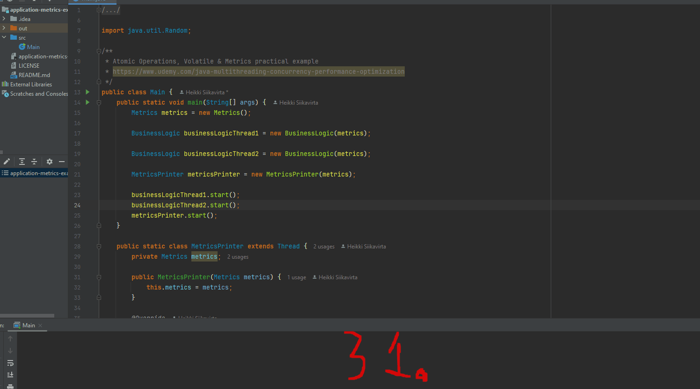
</div>

1. We can see the average around **5 seconds**.

> [!TIP]
> 💡 Whenever **multiple threads modify a shared variable**, and the operation is **non-atomic**, you risk lost updates. 💡

- Example below of what can happen, when there is **non-atomic** variable!

````Java
int count = 0; Runnable task = () ->
    {
        for (int i = 0; i < 1000; i++)
        { 
            count++; // Not atomic!
        } 
    }; 
Thread t1 = new Thread(task);
Thread t2 = new Thread(task);
t1.start();
t2.start();
t1.join();
t2.join();
System.out.println(count); // Often less than 2000!
````

 - `count++` often gives less than *2000* in your example.

<div align="center">
    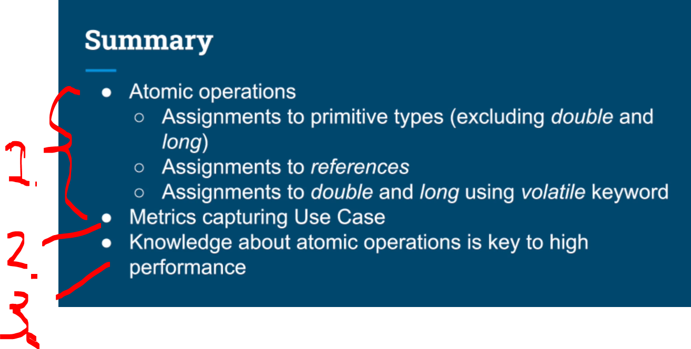
</div>

1. What operation we can use to have **atomic** property!
2. Real life example, when measuring time measurement!
3. Atomic operations when making performant operation!

<details>
<summary id="Atomic_Operation_Measuring
" open="true"> <b>Atomic operation measured code!</b> </summary>

````Java
/*
 * Copyright (c) 2019-2023. Michael Pogrebinsky - Top Developer Academy
 * https://topdeveloperacademy.com
 * All rights reserved
 */

import java.util.Random;

/**
 * Atomic Operations, Volatile & Metrics practical example
 * https://www.udemy.com/java-multithreading-concurrency-performance-optimization
 */
public class Main {
    public static void main(String[] args) {
        Metrics metrics = new Metrics();

        BusinessLogic businessLogicThread1 = new BusinessLogic(metrics);

        BusinessLogic businessLogicThread2 = new BusinessLogic(metrics);

        MetricsPrinter metricsPrinter = new MetricsPrinter(metrics);

        businessLogicThread1.start();
        businessLogicThread2.start();
        metricsPrinter.start();
    }

    public static class MetricsPrinter extends Thread {
        private Metrics metrics;

        public MetricsPrinter(Metrics metrics) {
            this.metrics = metrics;
        }

        @Override
        public void run() {
            while (true) {
                try {
                    Thread.sleep(1);
                } catch (InterruptedException e) {
                }

                double currentAverage = metrics.getAverage();

                System.out.println("Current Average is " + currentAverage);
            }
        }
    }

    public static class BusinessLogic extends Thread {
        private Metrics metrics;
        private Random random = new Random();

        public BusinessLogic(Metrics metrics) {
            this.metrics = metrics;
        }

        @Override
        public void run() {
            while (true) {
                long start = System.currentTimeMillis();

                try {
                    Thread.sleep(random.nextInt(10));
                } catch (InterruptedException e) {
                }
                long end = System.currentTimeMillis();
                metrics.addSample(end - start);
            }
        }
    }

//    public static class Metrics {
//        private long count = 0;
//        private double average = 0.0;
//
//        public void addSample(long sample) {
//            double currentSum = average * count;
//            count++;
//            average = (currentSum + sample) / count;
//        }
//
//        public double getAverage()
//        {
//            return average;
//        }
//    }
    // After thread safe modifications!
    public static class Metrics {
        private long count = 0;
        private volatile double average = 0.0;

        public synchronized void addSample(long sample) {
            double currentSum = average * count;
            count++;
            average = (currentSum + sample) / count;
        }

        public double getAverage() {
            return average;
        }
    }
}
````
</details>

# Quiz 07: Atomic Operations, Volatile & Metrics Practical Example.

- explonations for second

temp = counter;
temp = temp + 1;
counter = temp;


<details>

<summary id="Question_01" open="true"> <b>Question 01.</b> </summary>

````yaml
Question 01:
Why do we want to use multiple threads in an application?
````

- My answer:

<div align="center">
    
</div>

1. By using **multiple threads** allows an application to handle several tasks at once, enhancing responsiveness and potentially increasing performance through concurrent execution.

</details>

<details>

<summary id="Question_02" open="true"> <b>Question 02.</b> </summary>

````yaml
Question 02:
Which of the following operations are atomic and free of race conditions?
````

- My answer:

<div align="center">
    
</div>
1. The Code `2.` means as following, we can execute threads using the same code:

````Java
````
- The `add(...)` is being re-used!

</details>

# Coding Exercise 03: Min - Max Metrics.

<div align="center">
    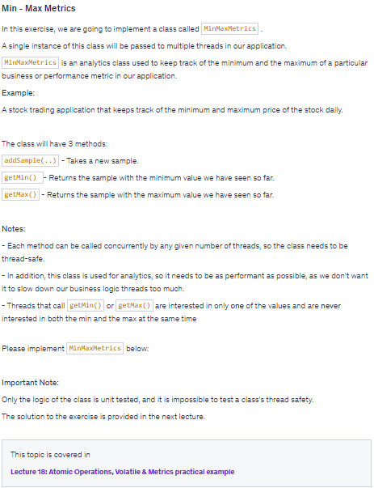
</div>

```Java
public class MinMaxMetrics {
    
    // Add all necessary member variables
    /**
     * Initializes all member variables
     */
    public MinMaxMetrics() {
        // Add code here
    }

    /**
     * Adds a new sample to our metrics.
     */
    public void addSample(long newSample) {
        // Add code here
    }

    /**
     * Returns the smallest sample we've seen so far.
     */
    public long getMin() {
        // Add code here
    }

    /**
     * Returns the biggest sample we've seen so far.
     */
    public long getMax() {
        // Add code here
    }
}
```

1. **Question 1:** Please implement `MinMaxMetrics` below:
	- **Answer:** Below.

```Java


```

# Min - Max Metrics - Solution.

```Java


```

# Race Conditions & Data Races.

<div align="center">
    
</div>

1. Race conditioning and data race!

<div align="center">
    
</div>

1. We will see what is **Race conditioning**!

<div align="center">
    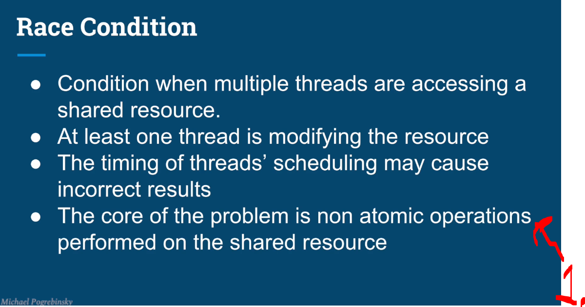
</div>

1. **Core problem**:
    - When multiple threads are performing **non-atomic** operation on **shared resource**!

- THE REST. Todo the rest

<div align="center">
    
</div>

1. **Date Race** is different that **Race condition**!

<div align="center">
    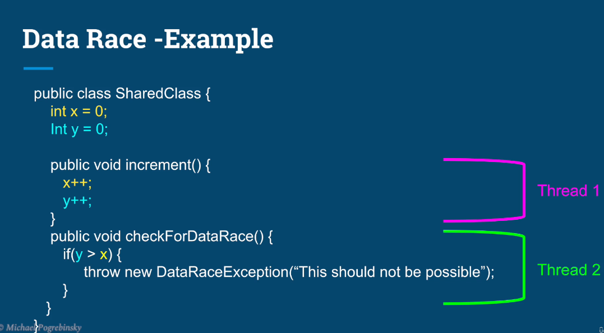
</div>

1. These are executed by different thread!

- Below is illustration of the data race:

<div align="center">
    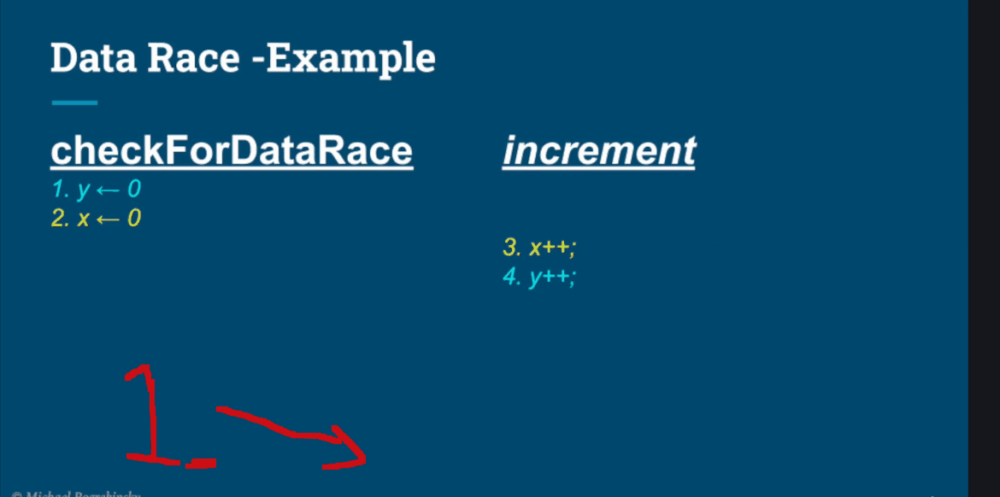
</div>


1. Logically analysis:
    - After any operation this should hold `x ≥ y is always true`

<div align="center">
    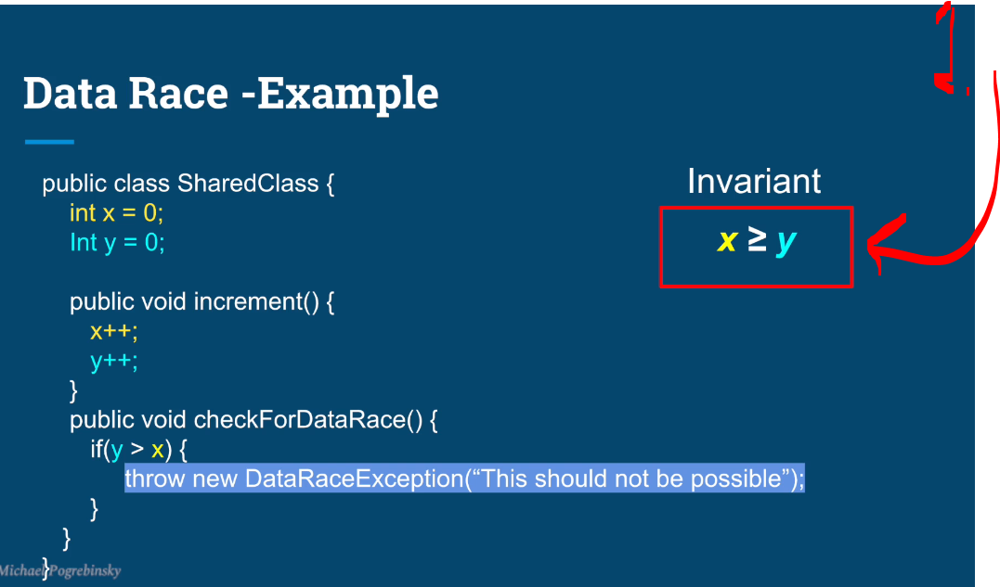
</div>

1. In variant holds!
    - An **invariant means** a rule or condition that **must always stay true** during the execution of a program (or system).
        - At any point in time, `x` should always be greater than or equal to `y` regardless of the scheduling order!

<div align="center">
    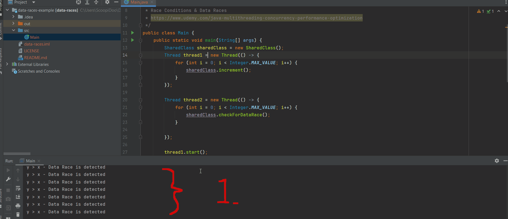
</div>

1. How it can be, if the **invariant** holds true, we are still seeing these logs:
    -  `y > x - Data Race is detected`!

- What happened if we just analyzed that **invariant** rule **will always apply**!?!?

<div align="center">
    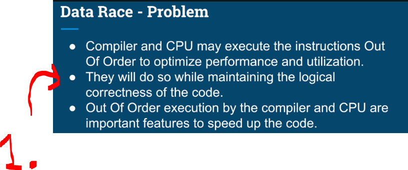
</div>

1. **Compiler** and **CPU** may execute the instructions out of order to optimize the flow!

2. Maintaining logicality can be:
    ````Java
    a = 5;
    b = 10;
    c = a + b;
    ````
    - To:
    ````Java
    c = 15;
    a = 5;
    b = 10;
    ````

- Also, there is many other **compiler**/**CPU** magic:

<div align="center">
    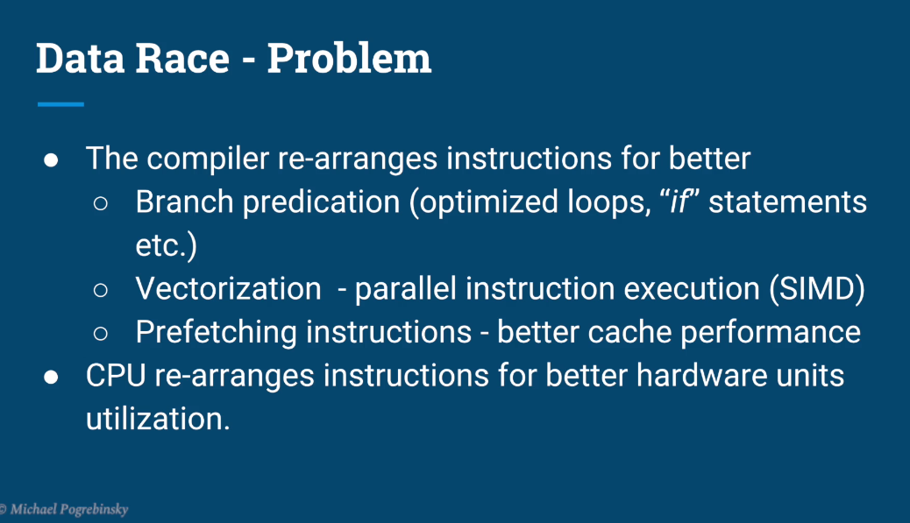
</div>

<div align="center">
    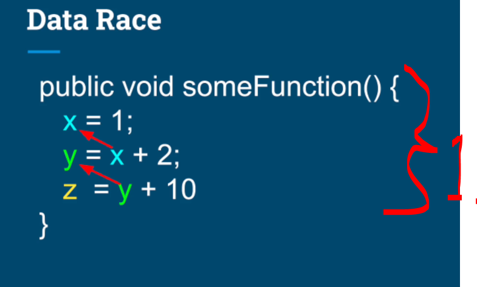
</div>

1. This function won't be **optimized**, since they are **logically** correct!

<div align="center">
    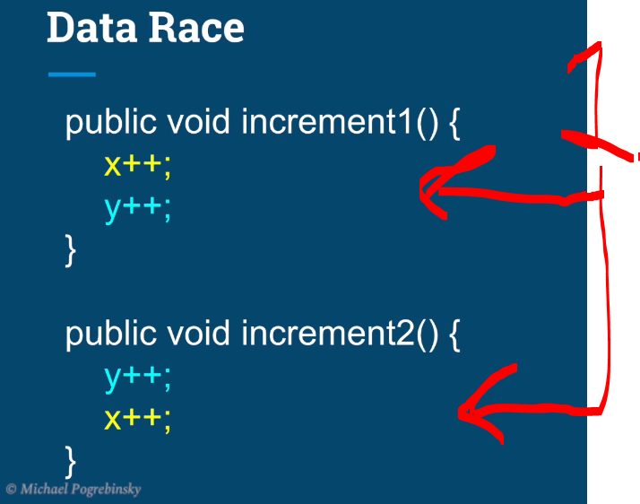
</div>

1. From **CPU** and **compilers** perspective these are **not connected**!
    - Now in **multithreaded** programming aspect, **CPU** is not aware if other one being executed!

<div align="center">
    
</div>

1. This can bring some weird behavior!

<div align="center">
    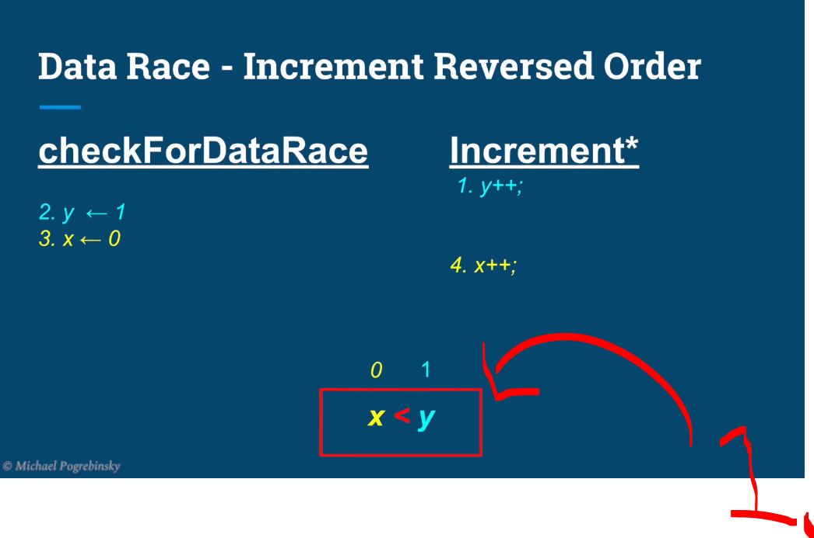
</div>

1. Now there can be `Increment` method addlings reversed!
    - It makes following can be true `x<y`.

<div align="center">
    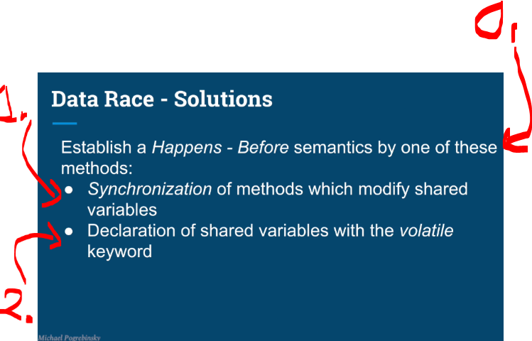
</div>

0. Java does not **happen before** semantics when executing things concurrently! Except couple solutions!
1.
2.

<details>
<summary id="Data_Race_Codes" open="true"> <b>Data Races code!</b> </summary>

````Java
/*
 * Copyright (c) 2019-2023. Michael Pogrebinsky - Top Developer Academy
 * https://topdeveloperacademy.com
 * All rights reserved
 */

/**
 * Race Conditions & Data Races
 * https://www.udemy.com/java-multithreading-concurrency-performance-optimization
 */
public class Main {
    public static void main(String[] args) {
        SharedClass sharedClass = new SharedClass();
        Thread thread1 = new Thread(() -> {
            for (int i = 0; i < Integer.MAX_VALUE; i++) {
                sharedClass.increment();
            }
        });

        Thread thread2 = new Thread(() -> {
            for (int i = 0; i < Integer.MAX_VALUE; i++) {
                sharedClass.checkForDataRace();
            }

        });

        thread1.start();
        thread2.start();
    }

    public static class SharedClass {
        private int x = 0;
        private int y = 0;

        public void increment() {
            x++;
            y++;
        }

        public void checkForDataRace() {
            if (y > x) {
                System.out.println("y > x - Data Race is detected");
            }
        }
    }
}
````
</details>

# Quiz 08: Data Races.

<details>

<summary id="Thread progress
 " open="true"> <b>Question 01.</b> </summary>

````yaml
Question 01:
Why do we want to use multiple threads in an application?
````

- My answer:

<div align="center">
    
</div>

1. By using **multiple threads** allows an application to handle several tasks at once, enhancing responsiveness and potentially increasing performance through concurrent execution.

</details>

<details>

<summary id="Thread progress
" open="true"> <b>Question 02.</b> </summary>

````yaml
Question 02:
Multiple threads in a single process share
````

- My answer:

<div align="center">
    
</div>

1. The Code `2.` means as following, we can execute threads using the same code:

````Java
thread1 -> add(1, 2)
thread2 -> add(5, 6)
````
- The `add(...)` is being re-used!

</details>

<details>

<summary id="Thread progress
" open="true"> <b>Question 03.</b> </summary>

````yaml
Question 03:
How does the Operating System decide what thread to schedule?
````

- My answer:

<div align="center">
    
</div>

1. The **O**perating **S**ystem decides which thread to run next using the scheduler, based on **scheduling algorithms** and **system state**.

</details>

# Locking Strategies & Deadlocks.

<div align="center">
    
</div>

1. We will be going with big locking **lock strategies**!

<div align="center">
    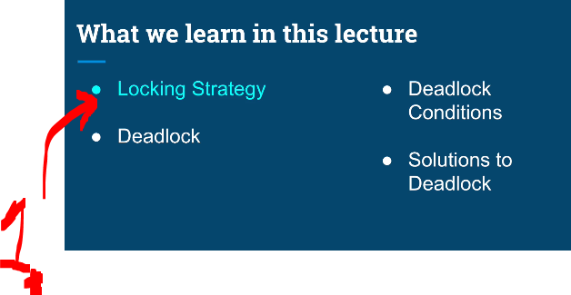
</div>

1. We will be checking **Locking Strategies** next!

<div align="center">
    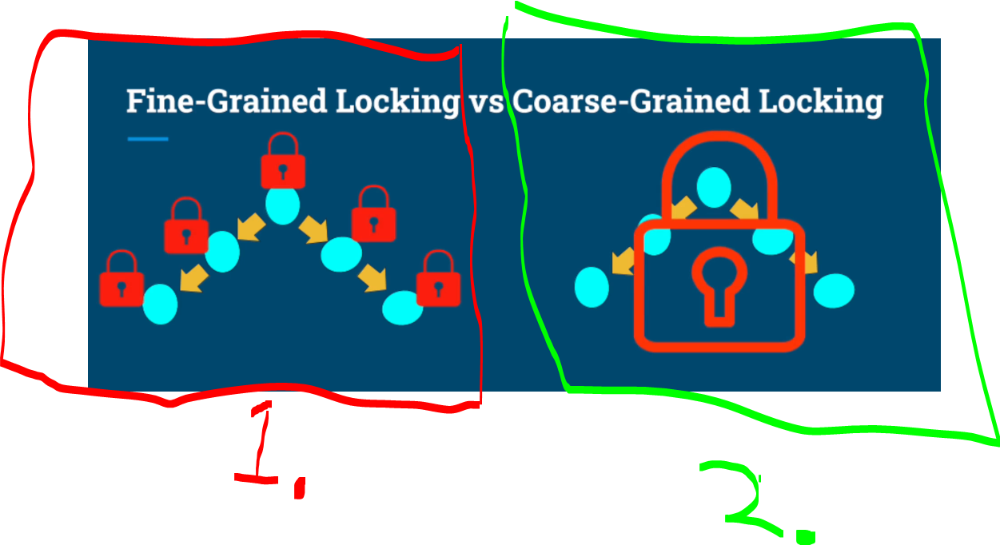
</div>

- In **multithreaded programming**, we need to make choice, which **locking strategy** we need to choose:
    - `1.` **Fine-Grained Locking**.
        - Should we have **multiple** locks per resource!
    - `2.` **Coarse-Grained Locking**.
        - Should we have **one** lock for one resource!

<div align="center">
    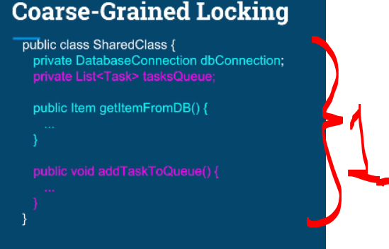
</div>

1. Example for inspecting our **locking strategy**!

<div align="center">
    
</div>

1. We have **two** resources to be locked. 

<div align="center">
    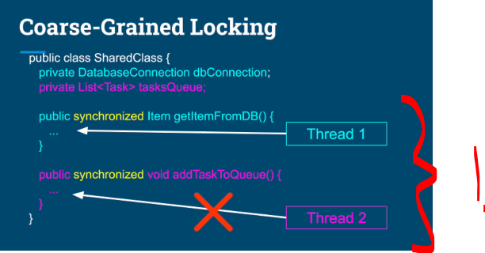
</div>

1. We could just add `synchronized` to method signatures to lock.
    -  In other hand, these are operations are not interfering with operations inherently!
        - There is **no right** or **wrong**, when deciding what strategy to use!

<div align="center">
    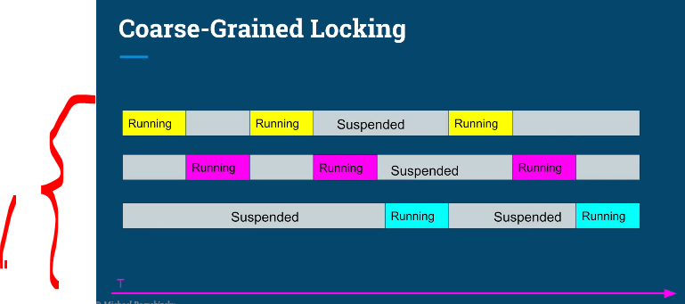
</div>

1. For this simple `synchronized` locking we pay prize when running individual threads.
    - If they are accessing these shared resources!

<div align="center">
    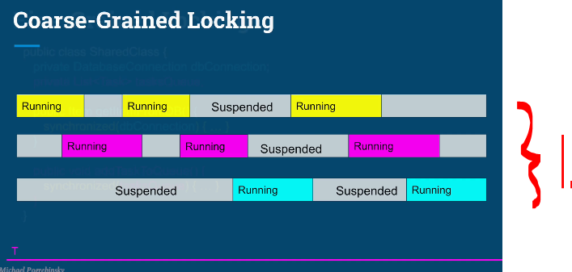
</div>

1. In reality, the these are doing something else, not fully blocked, but still this is **drawback**!

<div align="center">
    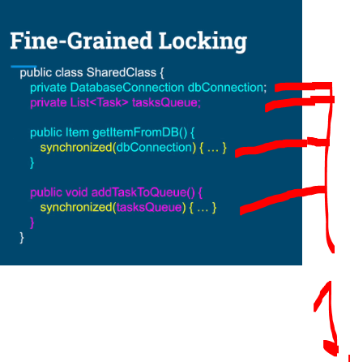
</div>

1. We are locking as **fine-grained**!

<div align="center">
    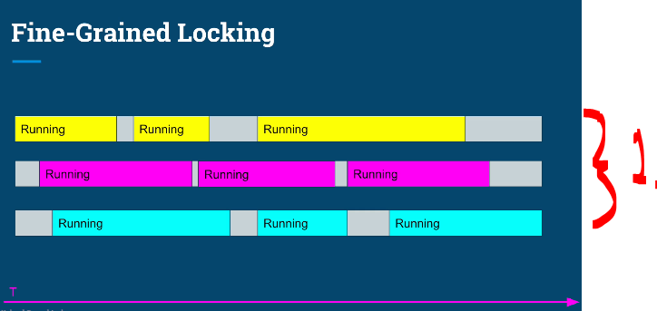
</div>

1. We get more out of cores execution, when using **fine-grained** solution!

<div align="center">
    
</div>

1. **Fine-grained** solution, there can be **deadlock**!
    - *"I will move, if you will move"* situation!

<div align="center">
    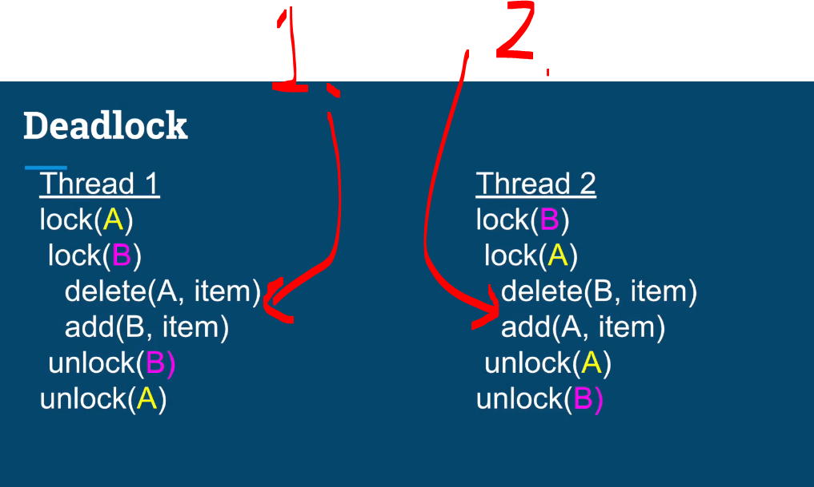
</div>

1. **Thread 1** want `delete(resorce A, item)` and add to it `add(resource B, item)`.
2. **Thread 2** want `delete(resorce B, item)` and `add(resource A, item)` 

<div align="center">
    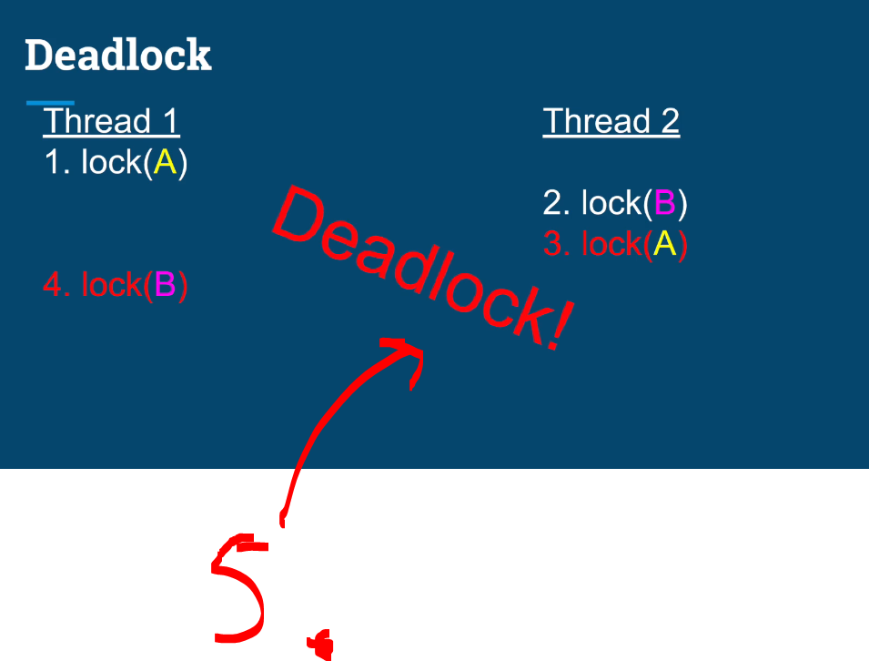
</div>

1. **Thread 1** `lock(A)`!
2. **Thread 2** `lock(B)`!
3. **Thread 2** `lock(A)`! These **locks clashing**!
4. **Thread 1** `lock(B)`! These **locks clashing**!
5. This is how we get the **Deadlock** occurring!

<div align="center">
    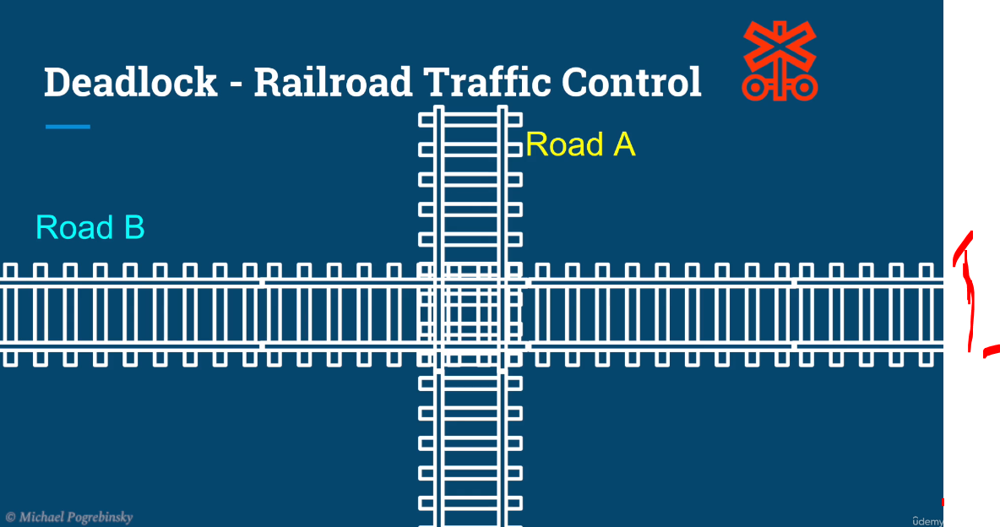
</div>

1. We will be make working **Railroad Traffic Control** system!

<div align="center">
    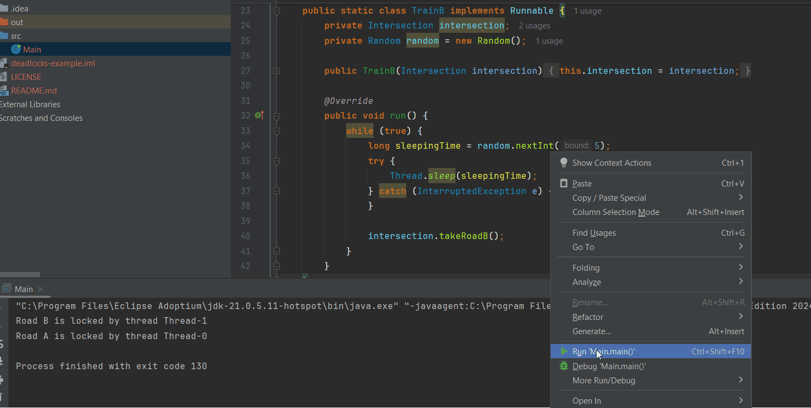
</div>

1. The **deadlock** example, the logs as below:
    ````Bash
    Road B is locked by thread Thread-1
    Road A is locked by thread Thread-0
    ````

<details>
<summary id="Deadlock_Railroad_Traffic_Control_Example" open="true"> <b>Deadlock Railroad Traffic Control Example!</b> </summary>

````Java
/*
 * Copyright (c) 2019-2023. Michael Pogrebinsky - Top Developer Academy
 * https://topdeveloperacademy.com
 * All rights reserved
 */

import java.util.Random;

/**
 * Locking Strategies & Deadlocks
 * https://www.udemy.com/java-multithreading-concurrency-performance-optimization
 */
public class Main {
    public static void main(String[] args) {
        Intersection intersection = new Intersection();
        Thread trainAThread = new Thread(new TrainA(intersection));
        Thread trainBThread = new Thread(new TrainB(intersection));

        trainAThread.start();
        trainBThread.start();
    }

    public static class TrainB implements Runnable {
        private Intersection intersection;
        private Random random = new Random();

        public TrainB(Intersection intersection) {
            this.intersection = intersection;
        }

        @Override
        public void run() {
            while (true) {
                long sleepingTime = random.nextInt(5);
                try {
                    Thread.sleep(sleepingTime);
                } catch (InterruptedException e) {
                }

                intersection.takeRoadB();
            }
        }
    }

    public static class TrainA implements Runnable {
        private Intersection intersection;
        private Random random = new Random();

        public TrainA(Intersection intersection) {
            this.intersection = intersection;
        }

        @Override
        public void run() {
            while (true) {
                long sleepingTime = random.nextInt(5);
                try {
                    Thread.sleep(sleepingTime);
                } catch (InterruptedException e) {
                }

                intersection.takeRoadA();
            }
        }
    }

    public static class Intersection {
        private Object roadA = new Object();
        private Object roadB = new Object();

        public void takeRoadA() {
            synchronized (roadA) {
                System.out.println("Road A is locked by thread " + Thread.currentThread().getName());
                synchronized (roadB) {
                    System.out.println("Train is passing through road A");
                    try {
                        Thread.sleep(1);
                    } catch (InterruptedException e) {
                    }
                }
            }
        }

        public void takeRoadB() {
            synchronized (roadB) {
                System.out.println("Road B is locked by thread " + Thread.currentThread().getName());

                synchronized (roadA) {
                    System.out.println("Train is passing through road B");

                    try {
                        Thread.sleep(1);
                    } catch (InterruptedException e) {
                    }
                }
            }
        }
    }
}
````
</details>

<div align="center">
    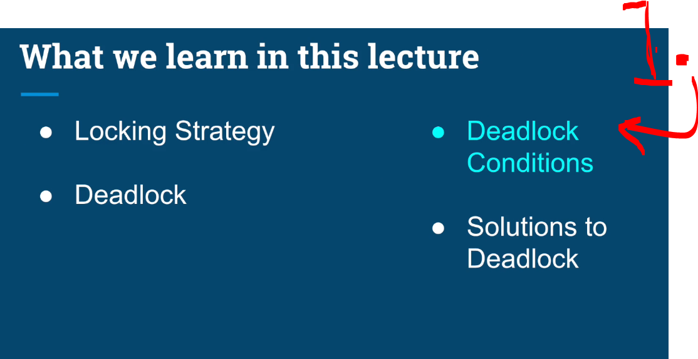
</div>

1. We will be going thought **deadlock conditions**!
    - We will be conditions, which will lead to deadlock!

<div align="center">
    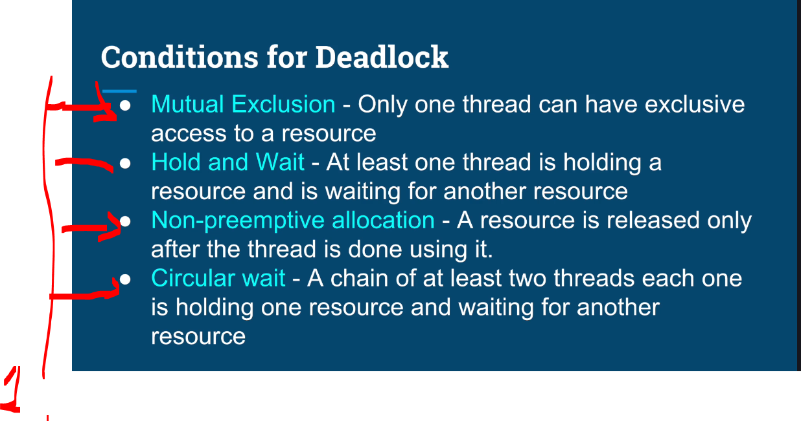
</div>

1. We will need these criteria to fulfill to satisfy **deadlock** situation!

<div align="center">
    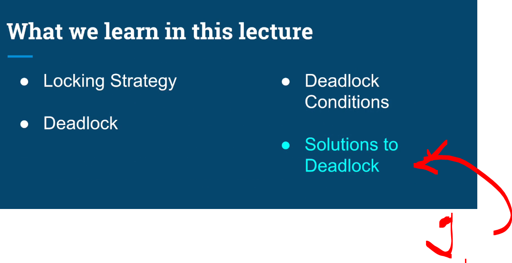
</div>

1. Best option is to avoid **one** condition of the deadlock! 

<div align="center">
    
</div>

1. One of the easiest is to **control** the **lock acquisition**! 

- In example A:

<div align="center">
    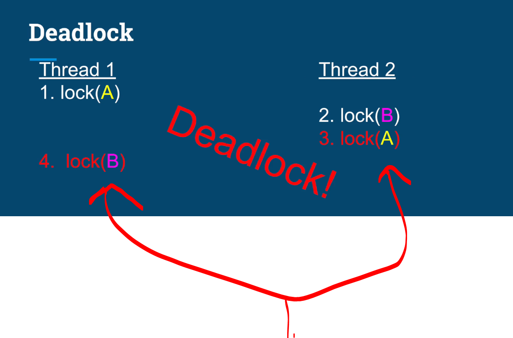
</div>

1. Remember the case where there were different ways to acquire the lock!

<div align="center">
    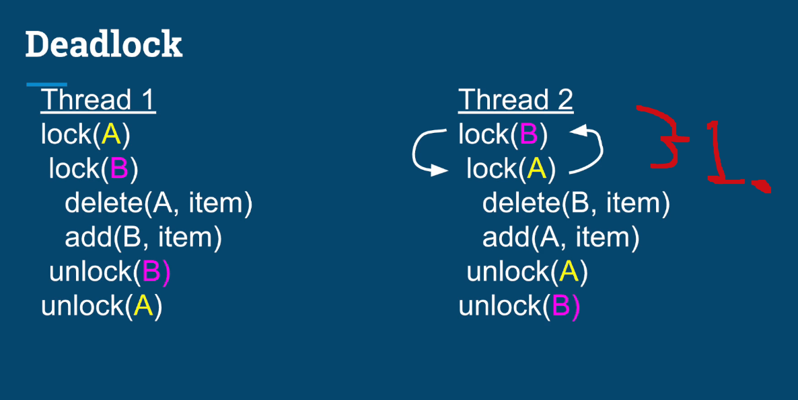
</div>

1. We are changing locking order to be the same. It will have **no circular dependencies**!

- Let's change lock the principle to be the same!

````Java

        public void takeRoadB() {
            synchronized (roadA) {
                System.out.println("Road A is locked by thread " + Thread.currentThread().getName());

                synchronized (roadB) {
                    System.out.println("Train is passing through road B");

                    try {
                        Thread.sleep(1);
                    } catch (InterruptedException e) {
                    }
                }
            }
        }
````

- As one can see the locking order is the same as in the `public void takeRoadA()`.

<div align="center">
    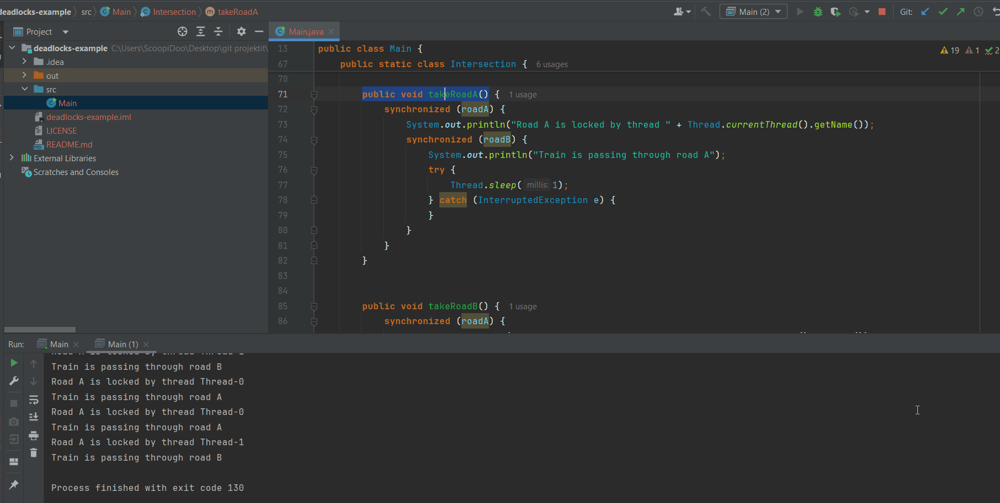
</div>

1. We can see the rail work is **not** getting into deadlock situation!

<div align="center">
    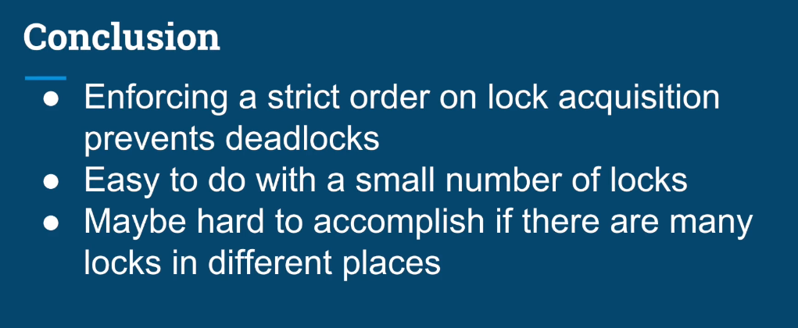
</div>

1. The **simplest** one and **recommended** is to **enforce strict order** for the **locks**!
2. For complex system cases, this can be hard to maintain. There are different strategies for this kind of scenario!

<div align="center">
    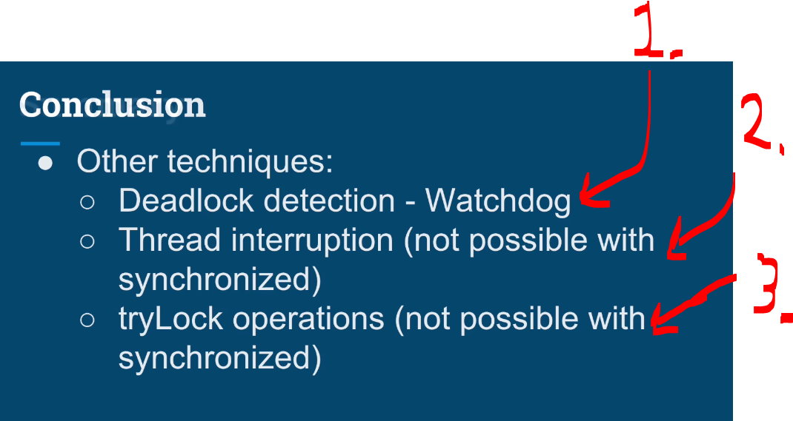
</div>

- **Watchdog** for **deadlock detection**!
    - `1.` If the watchdog is not notified after a certain number of executions, it can detect a potential deadlock.
    - `2.` Can be made if **thread is not reposing**, it will **try to interrupt** it!
    - `3.` `tryLock` This can be used to ask if the lock is present!

<div align="center">
    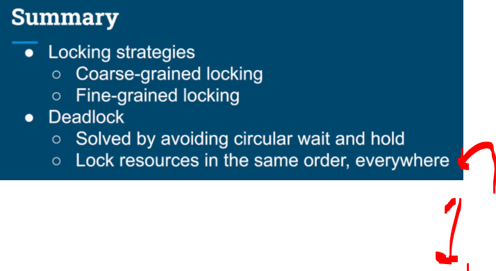
</div>

1. Every method must acquire them in the same order.

<details>
<summary id="Deadlock_Fixed_Railroad_Traffic_Control_Example" open="true"> <b>Deadlock Fixed In Railroad Traffic Control Example!</b> </summary>

````Java
/*
 * Copyright (c) 2019-2023. Michael Pogrebinsky - Top Developer Academy
 * https://topdeveloperacademy.com
 * All rights reserved
 */

import java.util.Random;

/**
 * Locking Strategies & Deadlocks
 * https://www.udemy.com/java-multithreading-concurrency-performance-optimization
 */
public class Main {
    public static void main(String[] args) {
        Intersection intersection = new Intersection();
        Thread trainAThread = new Thread(new TrainA(intersection));
        Thread trainBThread = new Thread(new TrainB(intersection));

        trainAThread.start();
        trainBThread.start();
    }

    public static class TrainB implements Runnable {
        private Intersection intersection;
        private Random random = new Random();

        public TrainB(Intersection intersection) {
            this.intersection = intersection;
        }

        @Override
        public void run() {
            while (true) {
                long sleepingTime = random.nextInt(5);
                try {
                    Thread.sleep(sleepingTime);
                } catch (InterruptedException e) {
                }

                intersection.takeRoadB();
            }
        }
    }

    public static class TrainA implements Runnable {
        private Intersection intersection;
        private Random random = new Random();

        public TrainA(Intersection intersection) {
            this.intersection = intersection;
        }

        @Override
        public void run() {
            while (true) {
                long sleepingTime = random.nextInt(5);
                try {
                    Thread.sleep(sleepingTime);
                } catch (InterruptedException e) {
                }

                intersection.takeRoadA();
            }
        }
    }

    public static class Intersection {
        private Object roadA = new Object();
        private Object roadB = new Object();

        public void takeRoadA() {
            synchronized (roadA) {
                System.out.println("Road A is locked by thread " + Thread.currentThread().getName());
                synchronized (roadB) {
                    System.out.println("Train is passing through road A");
                    try {
                        Thread.sleep(1);
                    } catch (InterruptedException e) {
                    }
                }
            }
        }

        public void takeRoadB() {
            synchronized (roadA) {
                System.out.println("Road A is locked by thread " + Thread.currentThread().getName());

                synchronized (roadB) {
                    System.out.println("Train is passing through road B");

                    try {
                        Thread.sleep(1);
                    } catch (InterruptedException e) {
                    }
                }
            }
        }
//  Dead lock example below:
//        public void takeRoadB() {
//            synchronized (roadB) {
//                System.out.println("Road B is locked by thread " + Thread.currentThread().getName());
//
//                synchronized (roadA) {
//                    System.out.println("Train is passing through road B");
//
//                    try {
//                        Thread.sleep(1);
//                    } catch (InterruptedException e) {
//                    }
//                }
//            }
//        }
    }
}
````
</details>

# Quiz 09: Locking Strategies & Deadlocks.

<details>

<summary id="Quiz_01" open="true"> <b>Question 01.</b> </summary>

````yaml
Question 01:
Is there a potential deadlock in this class?
````

- My answer:

<div align="center">
    
</div>

1. **Deadlock** may happen, since the locking order is not the same in other places! Like in `addSample()` and `reset()`.

</details>

<details>

<summary id="Quiz_02" open="true"> <b>Question 02.</b> </summary>

````yaml
Question 02:
What is the downside of this synchronization/locking design?
````

- My answer:

<div align="center">
    
</div>

1. Performance takes a hit due to coarse-grained locking.

</details>

<details>

<summary id="Quiz_03" open="true"> <b>Question 03.</b> </summary>

````yaml
Question 03:
Are there any potential problems with this approach?
````

- My answer:

<div align="center">
    
</div>

1. Without `synchronized` or `volatile`, there is **no happens-before relationship**.

</details>
