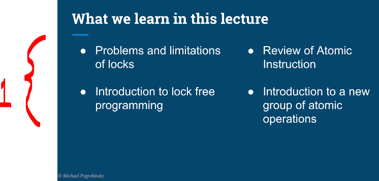
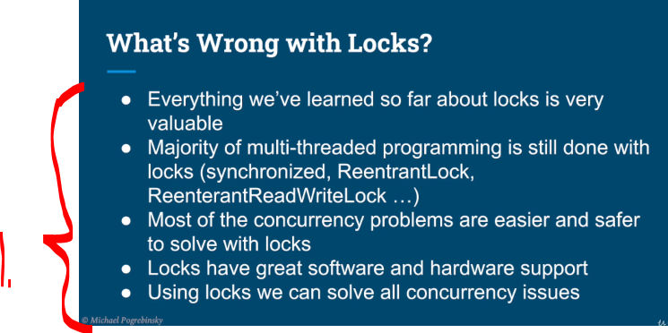

# Chapter 08 - Inter-Thread Communication.

Inter-Thread Communication.

# What I learned.

# Semaphore – Scalable Producer Consumer Implementation.

    

1. We will new synchronization tool **semphore**!

    

1. We will study lock free algorithms data structures!

    

1. Lock been long time around and they are great!

# Quiz 12: Semaphores – Barrier.

# Condition Variables – All Purpose, Inter-Thread Communication.

# Objects as Condition Variables – wait(), notify(), and notifyAll().

# Quiz 13: Condition Variables.

# Coding Exercise 05: Simple CountDownLatch.

# Simple CountDownLatch – Solution.
