# Chapter 03: Getting Started with Java Threads (Platform Threads). 

Getting Started with Java Threads (Platform Threads).

# What I learned.

# What is a Platform Thread, Why do we need them?

<div align="center">
    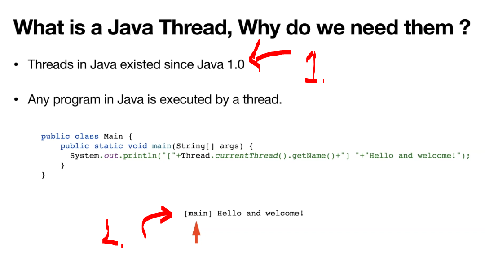
</div>

1. Threads have been existed since **Java 1.0**.
2. This will be executed from the *Main* **Thread**!

<div align="center">
    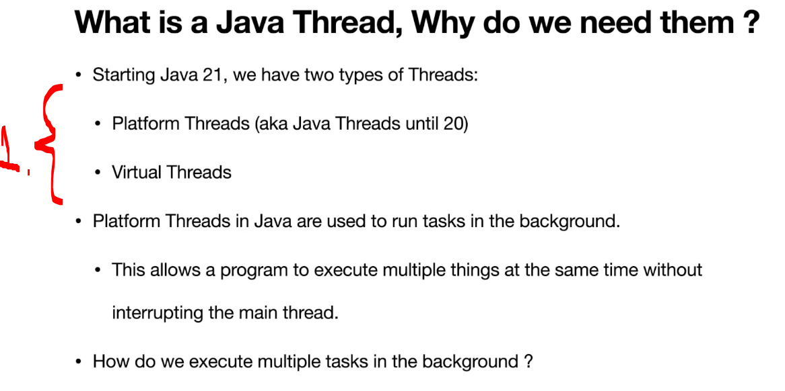
</div>

1. There are two **main threads**:
    - Platform Threads.
    - Virtual Threads.

<div align="center">
    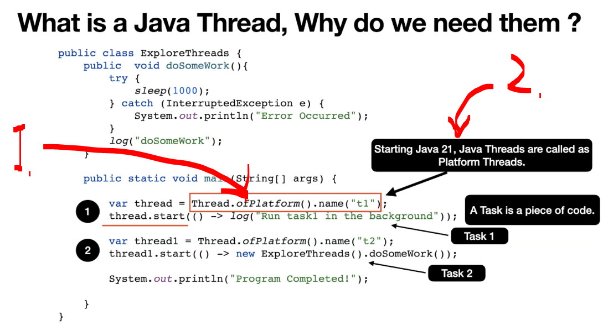
</div>

1. There are multiple ways to create the **Threads**:
    - There is a handy way to start `Thread.ofPlatform()`.
2. From Java 21 the Java Threads are called **Platform Threads**!

<div align="center">
    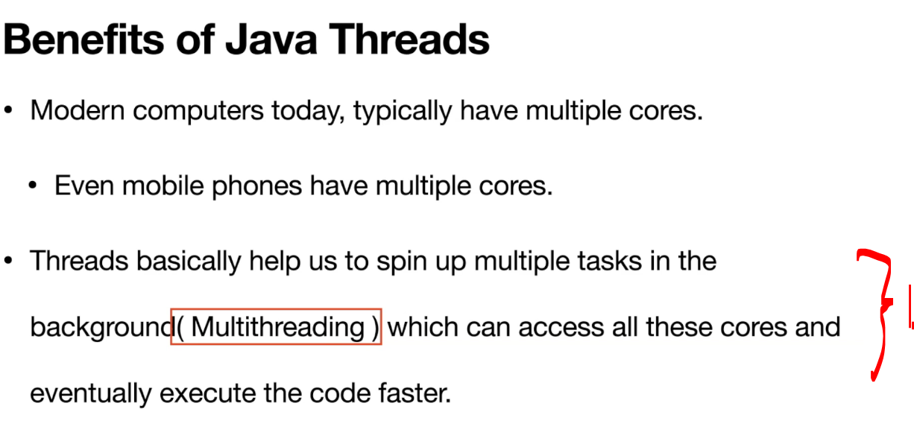
</div>

1. This helps to use cores with **Threads**! 

# Java Installation.

- We need **Java 21**, at least!

# Base Project Setup in IntelliJ.

- Sets the base of the project!

# Lets Create Platform Threads.

- Some basic illustration of the **Platform Threads**!

````Java
package com.modernjava.threads;

import com.modernjava.util.CommonUtil;
import static com.modernjava.util.LoggerUtil.log;

public class ExploreThreads {
    public static void doSomeWork() {
        log("started doSomeWork");
        CommonUtil.sleep(1000);
        log("finished doSomeWork");

    }

    public static void main(String[] args) {
        // Gives uss instance of the platform Thread!
        var thread1 = Thread.ofPlatform().name("T1");
        var thread2 = Thread.ofPlatform().name("T2");

        thread1.start(() -> {
            log("Run task 1 in the background!");
        });

        thread2.start(() -> {
            ExploreThreads.doSomeWork();
        });

        log("Program Completed!");
    }
}
````

- Lest illustrate the **Threads**!

<div align="center">
    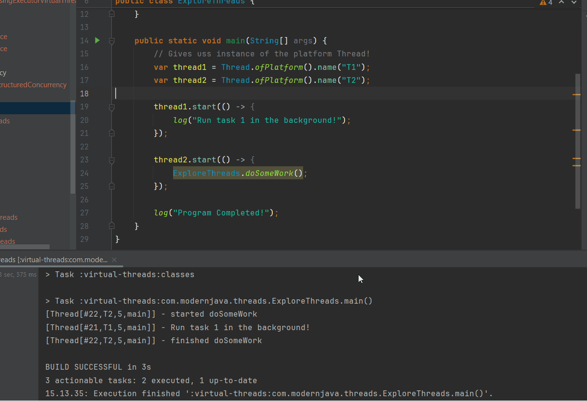
</div>

1. We can see the order is not fixed!

- If we want to have the **result** out of the Thread's.
    - We can use `.join()`, as in below:

````Java
package com.modernjava.threads;


import static com.modernjava.util.CommonUtil.sleep;
import static com.modernjava.util.LoggerUtil.log;

public class HelloWorldThreads {
    private static String result="";

    private static void hello(){
        sleep(500);
        result = result.concat("Hello");
    }
    private static void world(){
        sleep(600);
        result = result.concat("World");
    }

    public static void main(String[] args) throws InterruptedException {

        // We would like to get the output as "HelloWorld"
        var thread1 = Thread.ofPlatform().name("T1").start(HelloWorldThreads::hello);
        var thread2 = Thread.ofPlatform().name("T2").start(HelloWorldThreads::world);

        // Join, makes Thread finish before coming to main Thread!
        thread1.join();
        thread2.join();

        log("Result is: " + result);
    }
}
````

- The `HelloWorldThreads`.

````Java
package com.modernjava.threads;

import static com.modernjava.util.CommonUtil.sleep;
import static com.modernjava.util.LoggerUtil.log;

public class HelloWorldThreads {
    private static String result="";

    private static void hello(){
        sleep(500);
        result = result.concat("Hello");
    }
    private static void world(){
        sleep(600);
        result = result.concat("World");
    }
    public static void main(String[] args) throws InterruptedException {

        // We would like to get the output as "HelloWorld"
        var thread1 = Thread.ofPlatform().name("T1").start(HelloWorldThreads::hello);
        var thread2 = Thread.ofPlatform().name("T2").start(HelloWorldThreads::world);

        // Join, makes Thread finish before coming to main Thread!
        thread1.join();
        thread2.join();

        log("Result is: " + result);
    }
}
````

- We can see the returned result is being returned!

<div align="center">
    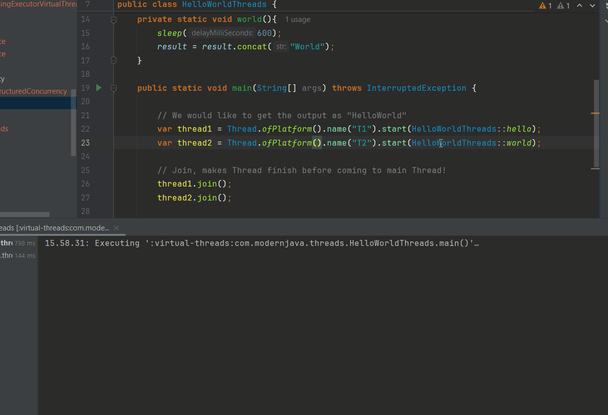
</div>

1. We can see the result is `.join()` out of thread!

# Thread Internals - How it works behind the scenes?

<div align="center">
    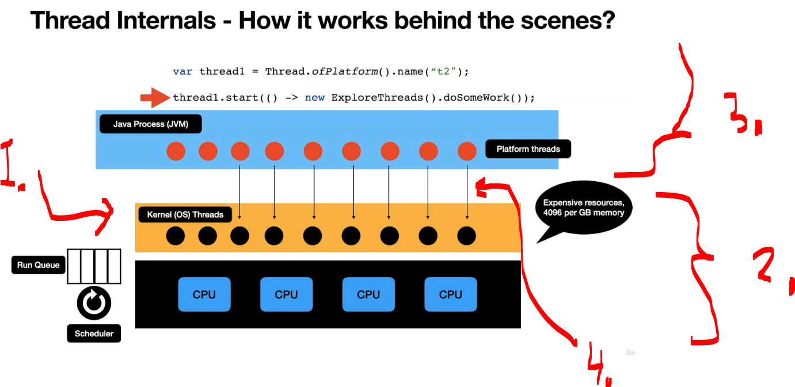
</div>

1. There are is **Kerner Threads**!
     - These are expensive!
2. This is usually taken **care by the OS**, so as developers would not need to take care of these!
3. **Java application** runs in top of this layer!
4. Once the task is created in JVM, the time to execute gets scheduler in to the **OS** threads!
    - Once the task is finished!
        - The **Platform Thread** get eliminated!

# Thread Scalability and Blocking nature of Java Threads - Drawbacks.

- **First problem** with threads, is the maximum treads! 
    -  Example class of the `MaxThreads`! This is illustrated below:
 
````Java
package com.modernjava.threads;


import com.modernjava.util.CommonUtil;

import java.util.concurrent.atomic.AtomicInteger;
import java.util.stream.IntStream;

import static com.modernjava.util.LoggerUtil.log;

public class MaxThreads {

    static AtomicInteger atomicInteger = new AtomicInteger();

    public static void doSomeWork(int index) {
        log("started doSomeWork : " + index);
        //Any task that's started by a thread is blocked until it completes.
        //It could be any IO call such as HTTP or File IO call.

        CommonUtil.sleep(5000);
        log("finished doSomeWork : " + index);
    }

    public static void main(String[] args) {

        int MAX_THREADS = 1000;

        IntStream.rangeClosed(1, MAX_THREADS)
                .forEach(i -> {
                    Thread.ofPlatform().start(() -> MaxThreads.doSomeWork(i));
                });
        log("Program Completed!");
    }
}
````

<div align="center">
    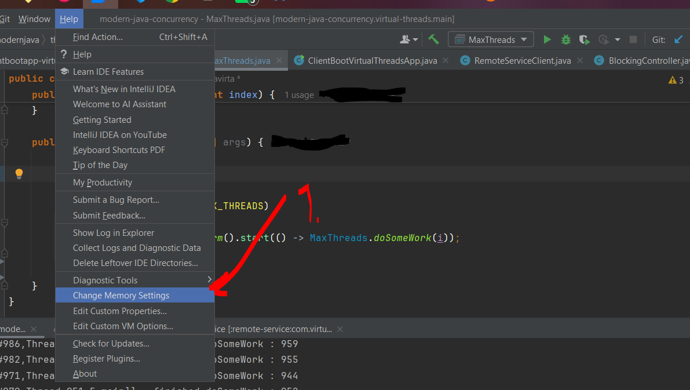
</div>

1. To check and make modifications for the JVM program! 

- Example of using `MAX_THREADS`!

````Java
    public static void main(String[] args) {

        int MAX_THREADS = 1000;

        IntStream.rangeClosed(1, MAX_THREADS)
                .forEach(i -> {
                    Thread.ofPlatform().start(() -> MaxThreads.doSomeWork(i));
                });

        log("Program Completed!");
    }
````

- We can see that there is **HUGE** amount of threads!

<div align="center">
    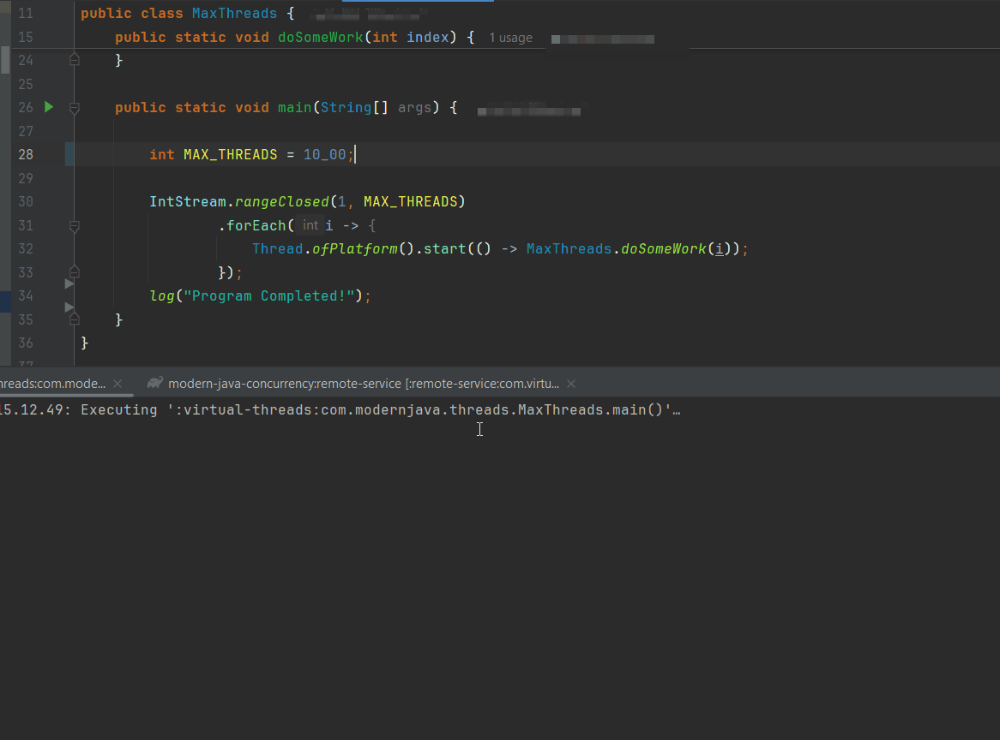
</div>

- We can see that, every request is making blocking class!

<div align="center">
    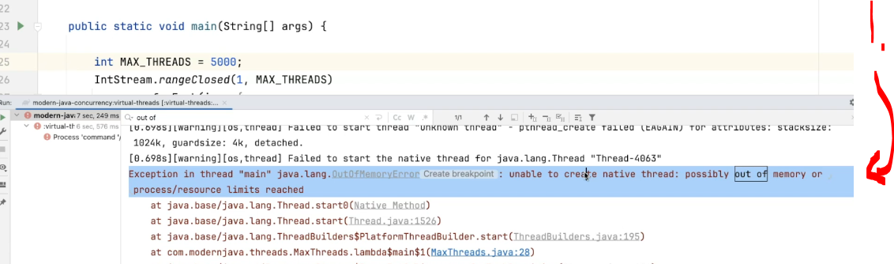
</div>

1. When there is too much **threads** for the JVM to handle, it will throw exception!
    - Thread is expensive resource!

<div align="center">
    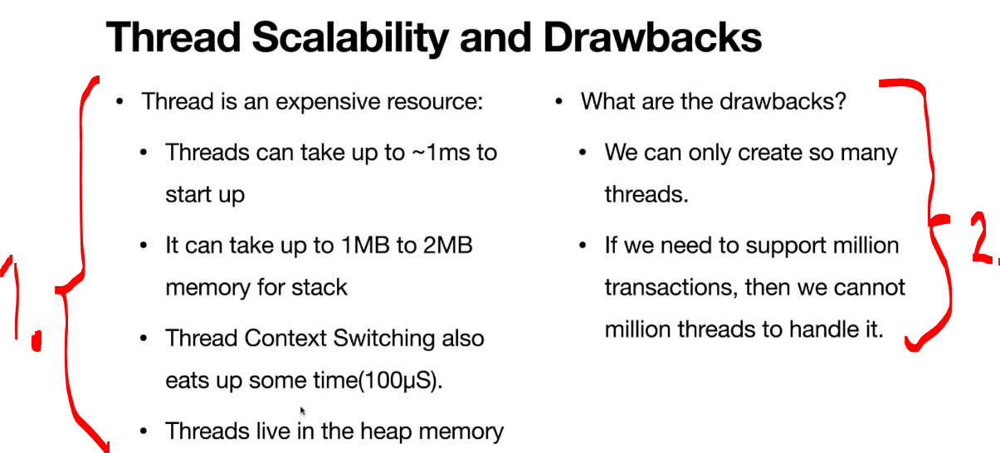
</div>

1. Thread is an expensive resource:
    - Threads can take up to `~1 ms` to start up.
    - It can take up to `1 MB` to `2 MB` of memory for the thread stack.
    - Thread context switching also consumes time (`~100 µs`).
    - Threads live in the heap memory.
2. What are the drawbacks?
    - We can only create a limited number of threads.
    - If we need to support millions of transactions, we cannot create millions of threads to handle them.

<div align="center">
    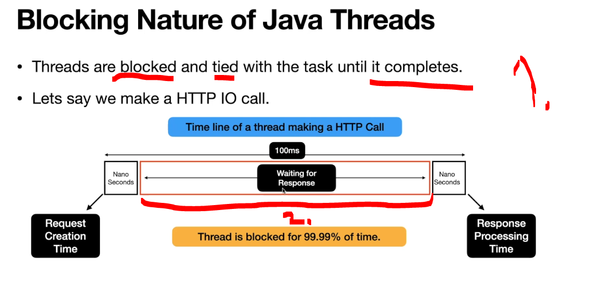
</div>

1. By nature **Java Threads** is **blocked** and **tied** until its completes!
2. **99.99%** is time is blocked, while waiting!

- Next explore that, is the **thread** that was executed, blocked and that the **thread** that ended.  

- **Second problem** with threads, is the blocking nature of the threads! 
 
<div align="center">
    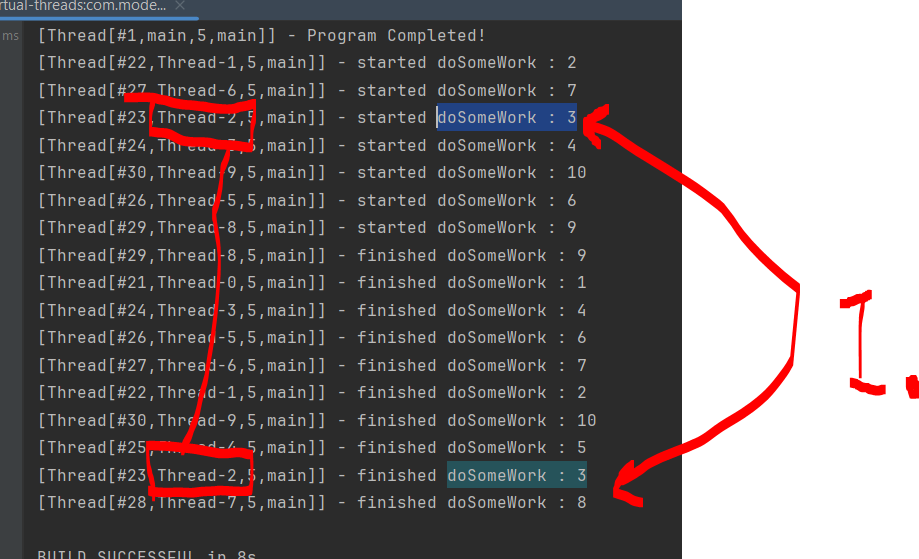
</div>

1. Thread that makes a call **is being blocked**, while its making call!
    - Any task that's started by a **thread is blocked** until it completes.
        - It could be any **IO call** such as **HTTP** or **File IO call**.

- This is why there are **Virtual Threads**!

<details>
<summary id="Code_For_MaxThreads" open="true"> <b>Code for the MaxThreads!</b> </summary>
 
 #### MaxThreads.java

````Java
package com.modernjava.threads;


import com.modernjava.util.CommonUtil;

import java.util.concurrent.atomic.AtomicInteger;
import java.util.stream.IntStream;

import static com.modernjava.util.LoggerUtil.log;

public class MaxThreads {

    static AtomicInteger atomicInteger = new AtomicInteger();

    public static void doSomeWork(int index) {
        log("started doSomeWork : " + index);
        //Any task that's started by a thread is blocked until it completes.
        //It could be any IO call such as HTTP or File IO call.

        CommonUtil.sleep(5000);
        log("finished doSomeWork : " + index);


    }

    public static void main(String[] args) {

        int MAX_THREADS = 10_000;

        IntStream.rangeClosed(1, MAX_THREADS)
                .forEach(i -> {
                    Thread.ofPlatform().start(() -> MaxThreads.doSomeWork(i));
                });
        log("Program Completed!");
    }
}
````
</details>

# Effects of Threads in a Backend WebApplication.

<div align="center">
    
</div>

1. **Thread** is getting assigned from the **thread pool**! 
    - Thread `T1`, will be responsible for managing the **threads' lifecycle**!
2. When it returns, it will be making the database call!
3. Response is **retuned to client**, the connection is released and **retuned to the thread pool**!


- Let's figure the if external service gets blocked! 

<div align="center">
    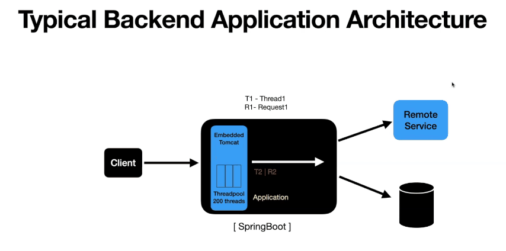
</div>

1. We are making the call to **remove service** and this is not **responding very well**!
    - Threads get **blocked**!
        - The **thread pool** gets exhausted with the requests!
            - There is no available threads from thread pool!

- Details about the thread:

<div align="center">
    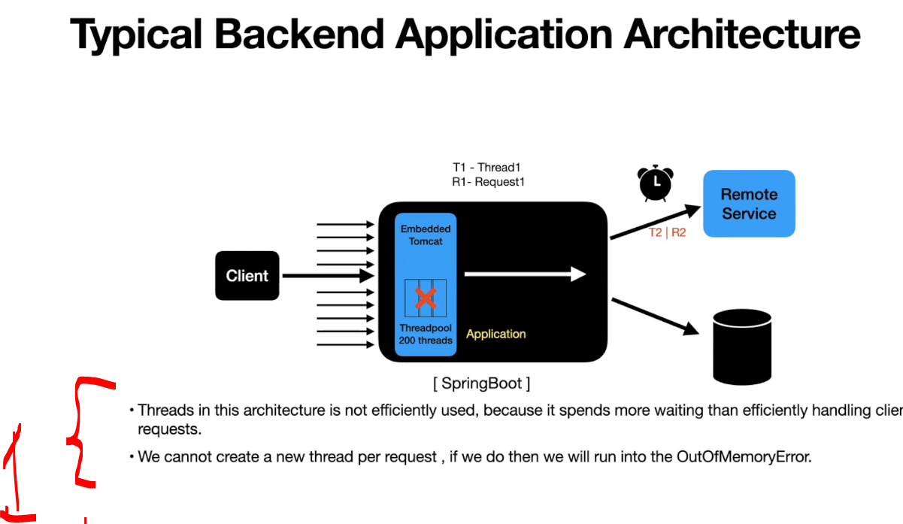
</div>

1. Thread is expensive request!

- There is reactive programming:

<div align="center">
    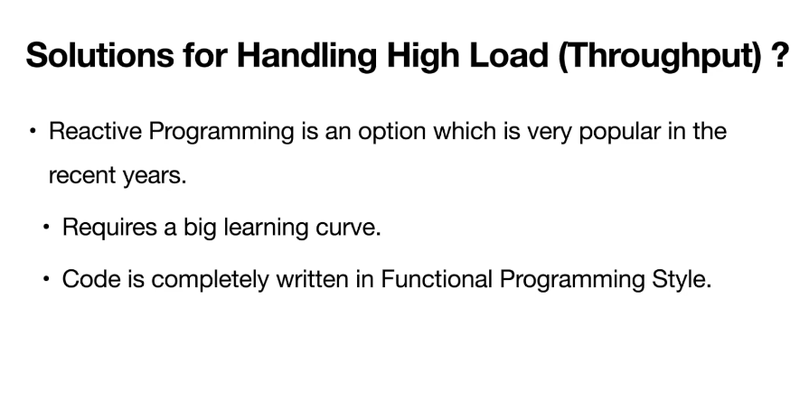
</div>

- There is option to use **virtual threads**:

<div align="center">
    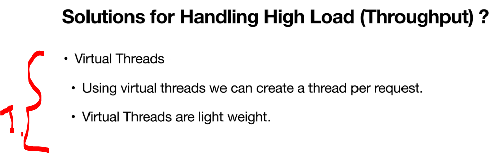
</div>

1. For this there are virtual threads!

