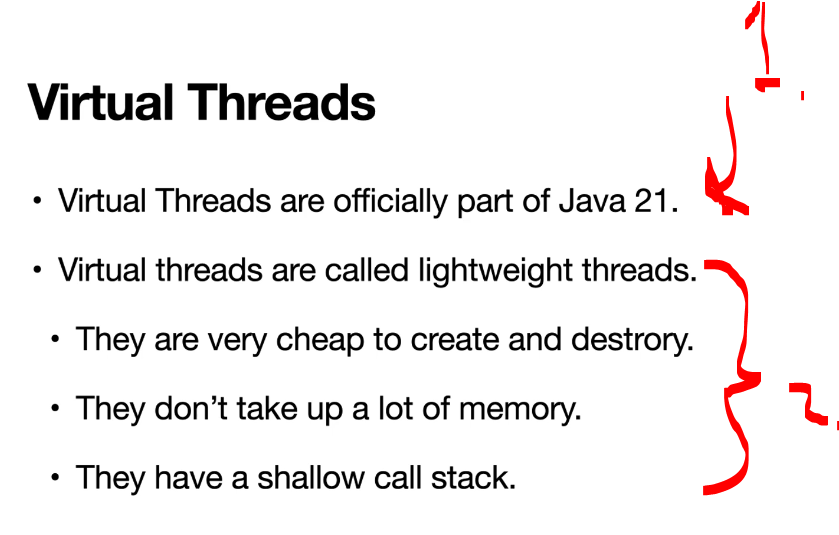
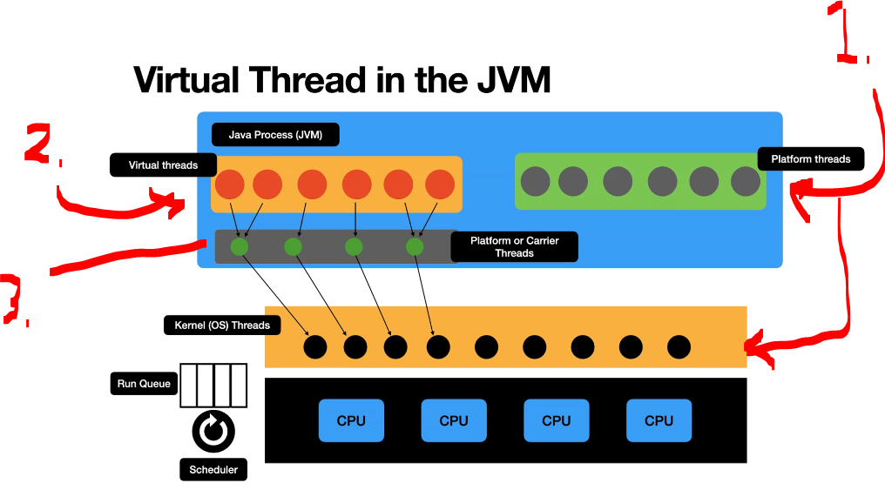
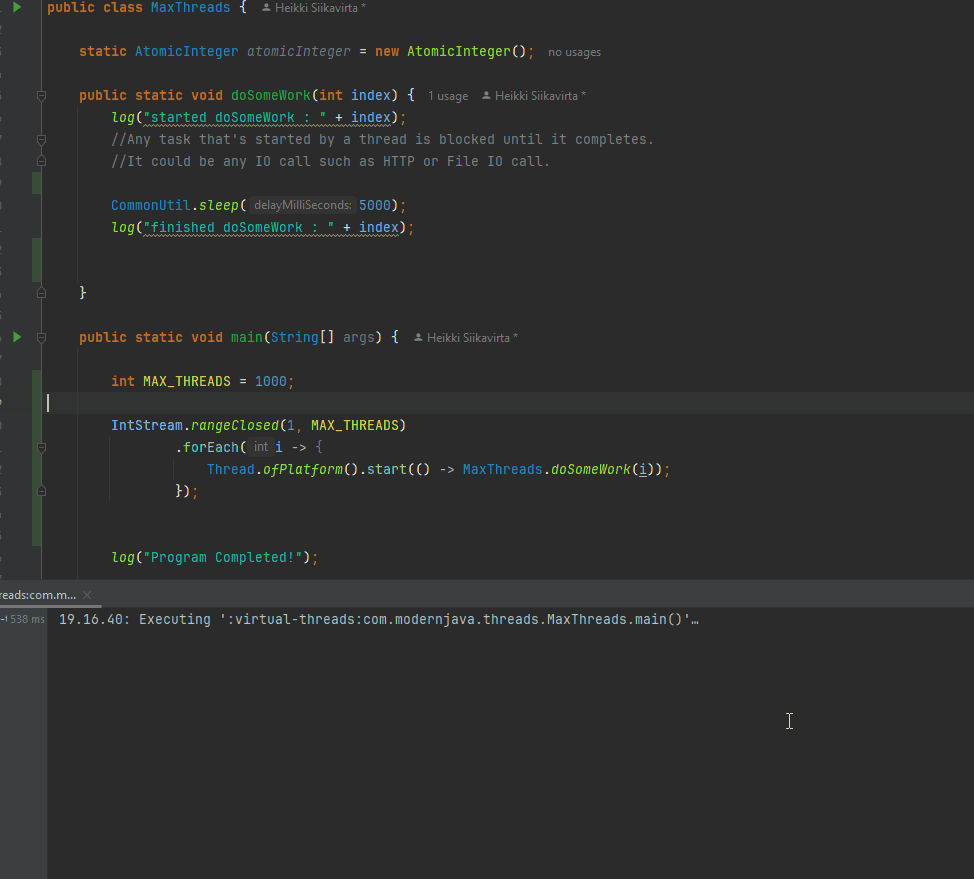
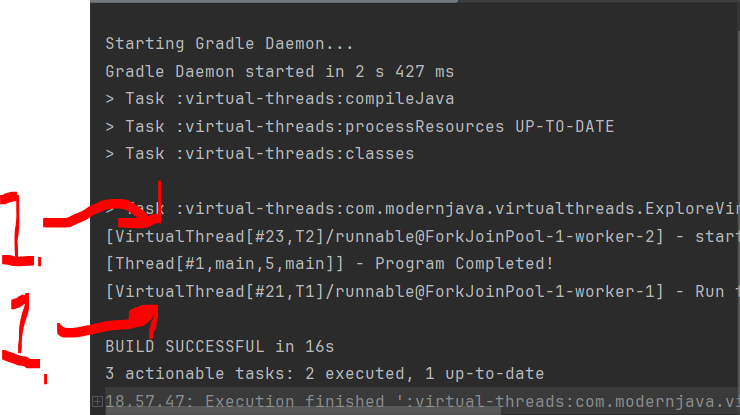

# Chapter 04 - Getting Started with Virtual Threads.

Getting Started with Virtual Threads.

# What I learned.

# Introduction to Virtual Threads.

<div align="center">
    
</div>

1. From Java 21!
2. These qualities of the **Virtual Threads**
    - They are cheap!

<div align="center">
    
</div>

1. The **Platform Thread** is **1-to-1** to the **Kernel Threads**!
2. **Virtual Threads** are not connected to the **Kernel Thread**!
    - Multiple **Virtual Threads** can be mapped to the **one Carrier Thread**! 
3. **Virtual Threads** are executed, by the **Carrier Threads**!
    - These have **1-to-1** to the **Kernel Thread**!

- We are exploring the **Virtual Threads**:

````Java
package com.modernjava.virtualthreads;

import com.modernjava.threads.ExploreThreads;
import com.modernjava.threads.HelloWorldThreads;
import com.modernjava.util.CommonUtil;

import static com.modernjava.util.LoggerUtil.log;

public class ExploreVirtualThreads {

    public static void doSomeWork() {
        log("started doSomeWork");
        CommonUtil.sleep(1000);
        log("finished doSomeWork");
    }

    public static void main(String[] args) {

        var thread1 = Thread.ofVirtual().name("T1");
        var thread2 = Thread.ofVirtual().name("T2");

        thread1.start(() -> {
            log("Run task 1 in the background!");
        });

        thread2.start(() -> {
            ExploreVirtualThreads.doSomeWork();
        });

        log("Program Completed!");
    }
}
````

- We can see the **Virtual Threads** in action!

<div align="center">
    
</div>

- We can see the name of the **Virtual Threads**:

<div align="center">
    
</div>

1. Notice the `VirtualThread` name, not the `Thread`!

<details>
<summary id="Code_Virtaul_Threads" open="true"> <b>Code for the Virtual Threads!</b> </summary>
 
 #### ExploreVirtualThreads.java

````Java
package com.modernjava.virtualthreads;

import com.modernjava.threads.ExploreThreads;
import com.modernjava.threads.HelloWorldThreads;
import com.modernjava.util.CommonUtil;

import static com.modernjava.util.LoggerUtil.log;

public class ExploreVirtualThreads {

    public static void doSomeWork() {
        log("started doSomeWork");
        CommonUtil.sleep(1000);
        log("finished doSomeWork");
    }

    public static void main(String[] args) {

        var thread1 = Thread.ofVirtual().name("T1");
        var thread2 = Thread.ofVirtual().name("T2");

        thread1.start(() -> {
            log("Run task 1 in the background!");
        });

        thread2.start(() -> {
            ExploreVirtualThreads.doSomeWork();
        });

        log("Program Completed!");
    }
}
````

#### ExploreVirtualThreads.java

````Java
package com.modernjava.virtualthreads;

import com.modernjava.threads.ExploreThreads;
import com.modernjava.threads.HelloWorldThreads;
import com.modernjava.util.CommonUtil;

import static com.modernjava.util.LoggerUtil.log;

public class ExploreVirtualThreads {

    public static void doSomeWork() {
        log("started doSomeWork");
        CommonUtil.sleep(1000);
        log("finished doSomeWork");
    }

    public static void main(String[] args) {

        var thread1 = Thread.ofVirtual().name("T1");
        var thread2 = Thread.ofVirtual().name("T2");

        thread1.start(() -> {
            log("Run task 1 in the background!");
        });

        thread2.start(() -> {
            ExploreVirtualThreads.doSomeWork();
        });

        log("Program Completed!");
    }
}
````

</details>

# Virtual Threads Scalability - Lets Launch 1 million threads.

# How VirtualThreads works under the hood? - Mounting / Unmounting Virtual Threads.

# Mounting and Unmounting threads in Action.

# Virtual Threads - `yield()` and `run()` using Continuation API.

# Pinned Virtual Threads.

# Important Facts about VirtualThreads.

# Quiz 01: Platform Threads and Virtual Threads.

<details>
<summary id="Question_01" open="true"> <b>Question 01.</b> </summary>
````yaml
Question 01:
The question comes here!

- My answer:

<div align="center">
    
</div>

1. Add here the answer!

</details>
-->