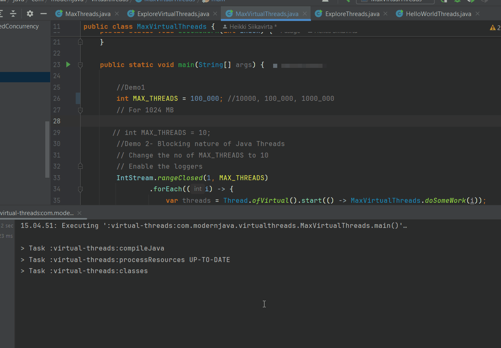
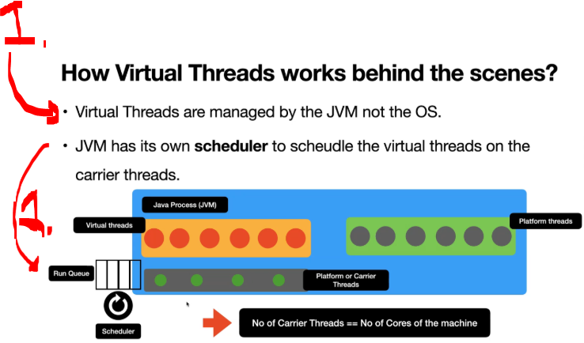
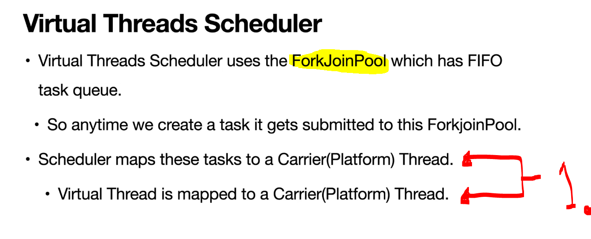
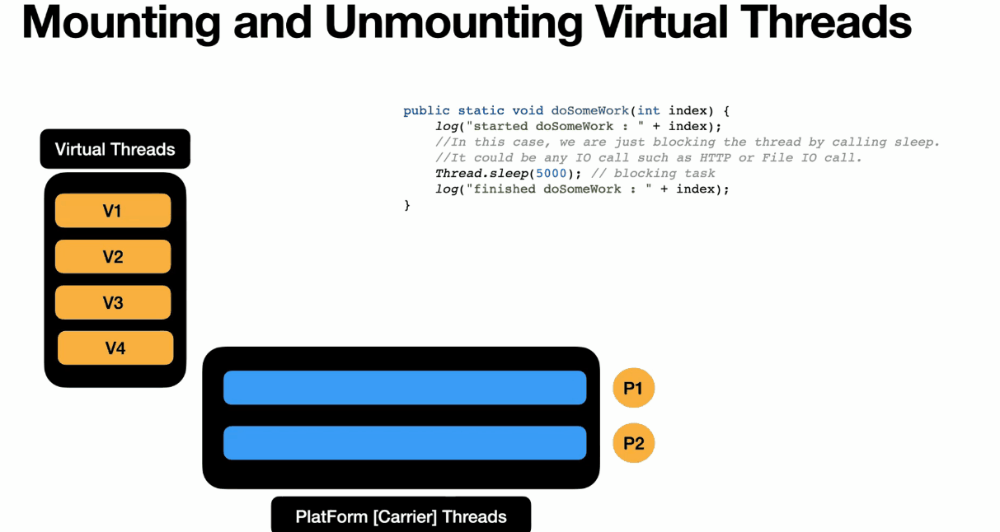
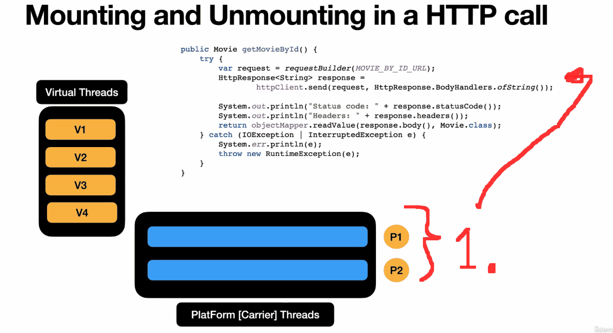
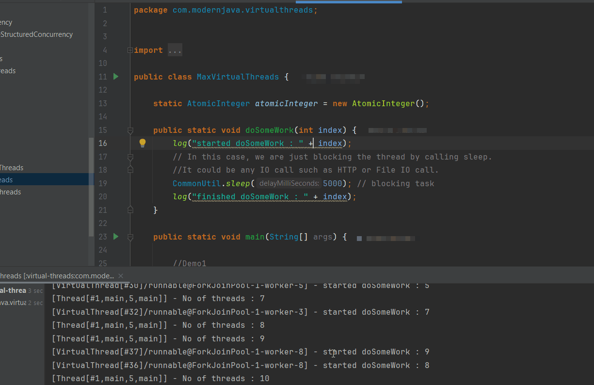
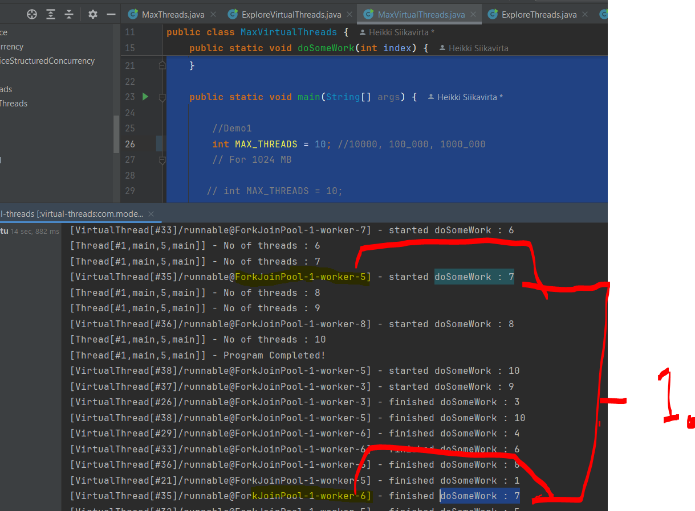

# Chapter 04 - Getting Started with Virtual Threads.

Getting Started with Virtual Threads.

# What I learned.

# Introduction to Virtual Threads.

<div align="center">
    
</div>

1. From Java 21!
2. These qualities of the **Virtual Threads**
    - They are cheap!

<div align="center">
    
</div>

1. The **Platform Thread** is **1-to-1** to the **Kernel Threads**!
2. **Virtual Threads** are not connected to the **Kernel Thread**!
    - Multiple **Virtual Threads** can be mapped to the **one Carrier Thread**! 
3. **Virtual Threads** are executed, by the **Carrier Threads**!
    - These have **1-to-1** to the **Kernel Thread**!

- We are exploring the **Virtual Threads**:

````Java
package com.modernjava.virtualthreads;

import com.modernjava.threads.ExploreThreads;
import com.modernjava.threads.HelloWorldThreads;
import com.modernjava.util.CommonUtil;

import static com.modernjava.util.LoggerUtil.log;

public class ExploreVirtualThreads {

    public static void doSomeWork() {
        log("started doSomeWork");
        CommonUtil.sleep(1000);
        log("finished doSomeWork");
    }

    public static void main(String[] args) {

        var thread1 = Thread.ofVirtual().name("T1");
        var thread2 = Thread.ofVirtual().name("T2");

        thread1.start(() -> {
            log("Run task 1 in the background!");
        });

        thread2.start(() -> {
            ExploreVirtualThreads.doSomeWork();
        });

        log("Program Completed!");
    }
}
````

- We can see the **Virtual Threads** in action!

<div align="center">
    
</div>

- We can see the name of the **Virtual Threads**:

<div align="center">
    
</div>

1. Notice the `VirtualThread` name, not the `Thread`!

<details>
<summary id="Code_Virtaul_Threads" open="true"> <b>Code for the Virtual Threads!</b> </summary>
 
 #### ExploreVirtualThreads.java

````Java
package com.modernjava.virtualthreads;

import com.modernjava.threads.ExploreThreads;
import com.modernjava.threads.HelloWorldThreads;
import com.modernjava.util.CommonUtil;

import static com.modernjava.util.LoggerUtil.log;

public class ExploreVirtualThreads {

    public static void doSomeWork() {
        log("started doSomeWork");
        CommonUtil.sleep(1000);
        log("finished doSomeWork");
    }

    public static void main(String[] args) {

        var thread1 = Thread.ofVirtual().name("T1");
        var thread2 = Thread.ofVirtual().name("T2");

        thread1.start(() -> {
            log("Run task 1 in the background!");
        });

        thread2.start(() -> {
            ExploreVirtualThreads.doSomeWork();
        });

        log("Program Completed!");
    }
}
````

#### ExploreVirtualThreads.java

````Java
package com.modernjava.virtualthreads;

import com.modernjava.threads.ExploreThreads;
import com.modernjava.threads.HelloWorldThreads;
import com.modernjava.util.CommonUtil;

import static com.modernjava.util.LoggerUtil.log;

public class ExploreVirtualThreads {

    public static void doSomeWork() {
        log("started doSomeWork");
        CommonUtil.sleep(1000);
        log("finished doSomeWork");
    }

    public static void main(String[] args) {

        var thread1 = Thread.ofVirtual().name("T1");
        var thread2 = Thread.ofVirtual().name("T2");

        thread1.start(() -> {
            log("Run task 1 in the background!");
        });

        thread2.start(() -> {
            ExploreVirtualThreads.doSomeWork();
        });

        log("Program Completed!");
    }
}
````

</details>

# Virtual Threads Scalability - Lets Launch 1 million threads.

- Virtual Threads are more scalable than the platform threads!
    - We will be launching 1 million of threads!

#### MaxVirtualThreads.java

````Java
package com.modernjava.virtualthreads;


import com.modernjava.util.CommonUtil;

import java.util.concurrent.atomic.AtomicInteger;
import java.util.stream.IntStream;

import static com.modernjava.util.LoggerUtil.log;

public class MaxVirtualThreads {

    static AtomicInteger atomicInteger = new AtomicInteger();

    public static void doSomeWork(int index) {
        log("started doSomeWork : " + index);
        // In this case, we are just blocking the thread by calling sleep.
        //It could be any IO call such as HTTP or File IO call.
        CommonUtil.sleep(5000); // blocking task
        log("finished doSomeWork : " + index);
    }

    public static void main(String[] args) {

        //Demo1
        int MAX_THREADS = 100_000; //10000, 100_000, 1000_000
        // For 1024 MB

       // int MAX_THREADS = 10;
        //Demo 2- Blocking nature of Java Threads
        // Change the no of MAX_THREADS to 10
        // Enable the loggers
        IntStream.rangeClosed(1, MAX_THREADS)
                .forEach((i) -> {
                    var threads = Thread.ofVirtual().start(() -> MaxVirtualThreads.doSomeWork(i));
                    atomicInteger.incrementAndGet();
                    log("No of threads : " + atomicInteger.get());
                });
        log("Program Completed!");
        CommonUtil.sleep(10000);
    }
}
````

- Virtual Threads good for.
    - High-concurrency web servers.
    - I/O-bound applications.

<div align="center">
    
</div>

# How VirtualThreads works under the hood? - Mounting / Unmounting Virtual Threads.

<div align="center">
    
</div>

1. JVM has own **scheduler** to schedule the **Virtual Threads** to the **Carrier Threads**!

<div align="center">
    
</div>

1. **Virtual Thread A** is mapped into **Carrier Thread 1**!

<div align="center">
    
</div>

1. We will be having **4** different **Virtual Threads**!
2. **Virtual Threads** will be mapped into **Carrier Threads** for execution!
    - This is called **mounting**!
3. When the `.sleep(...)` is executed the **Virtual Thread** will get placed back form the **Carrier Thread**!
    - This is called **unmounting**!

<div align="center">
    
</div>

1. When we **make call** with the **HTTP Client**, the **Virtual Thread** is getting placed into **Carrier Thread**!
2. When code executed, then **Virtual Thread** are allocated back out of **Carrier Threads**! 
3. As soon as the **SOCKET (IO)** is receiving the bytes! The **Virtual Threads** are mounted back to the **Carrier Threads**!

# Mounting and Unmounting threads in Action.

- We will be exploring the **Unmounting** and **Mounting** of the thread! 

````Java
package com.modernjava.virtualthreads;


import com.modernjava.util.CommonUtil;

import java.util.concurrent.atomic.AtomicInteger;
import java.util.stream.IntStream;

import static com.modernjava.util.LoggerUtil.log;

public class MaxVirtualThreads {

    static AtomicInteger atomicInteger = new AtomicInteger();

    public static void doSomeWork(int index) {
        log("started doSomeWork : " + index);
        // In this case, we are just blocking the thread by calling sleep.
        //It could be any IO call such as HTTP or File IO call.
        CommonUtil.sleep(5000); // blocking task
        log("finished doSomeWork : " + index);
    }

    public static void main(String[] args) {

        //Demo1
        int MAX_THREADS = 10; //10000, 100_000, 1000_000
        // For 1024 MB

       // int MAX_THREADS = 10;
        //Demo 2- Blocking nature of Java Threads
        // Change the no of MAX_THREADS to 10
        // Enable the loggers
        IntStream.rangeClosed(1, MAX_THREADS)
                .forEach((i) -> {
                    var threads = Thread.ofVirtual().start(() -> MaxVirtualThreads.doSomeWork(i));
                    atomicInteger.incrementAndGet();
                    log("No of threads : " + atomicInteger.get());
                });
        log("Program Completed!");
        CommonUtil.sleep(10000);
    }
}
````

- We are calling the **Virtual Thread**, we can see the naming strategy:

<div align="center">
    
</div>

- We can see that, the threads are having different name: 

<div align="center">
    
</div>

1. We can see that the `doSomeWork : 7`
    - We can see that both **mounting** and **unmounting** have been done by the different **worker thread**, or the **carrier thread**! 
    - `[VirtualThread[#35]/runnable@ForkJoinPool-1-worker-6] - finished doSomeWork : 7`
    - `[VirtualThread[#35]/runnable@ForkJoinPool-1-worker-5] - started doSomeWork : 7`.


# Virtual Threads - `yield()` and `run()` using Continuation API.

# Pinned Virtual Threads.

# Important Facts about VirtualThreads.

# Quiz 01: Platform Threads and Virtual Threads.

<details>
<summary id="Question_01" open="true"> <b>Question 01.</b> </summary>
````Yaml
Question 01:
The question comes here!

- My answer:

<div align="center">
    
</div>

1. Add here the answer!

</details>